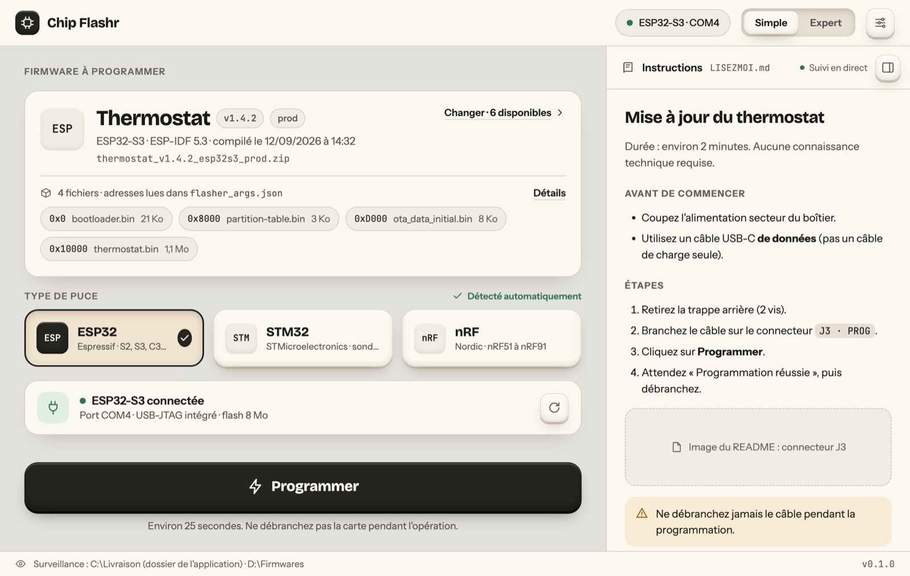
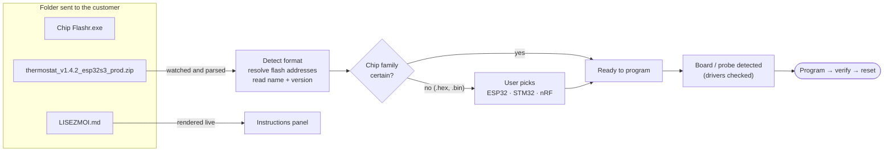
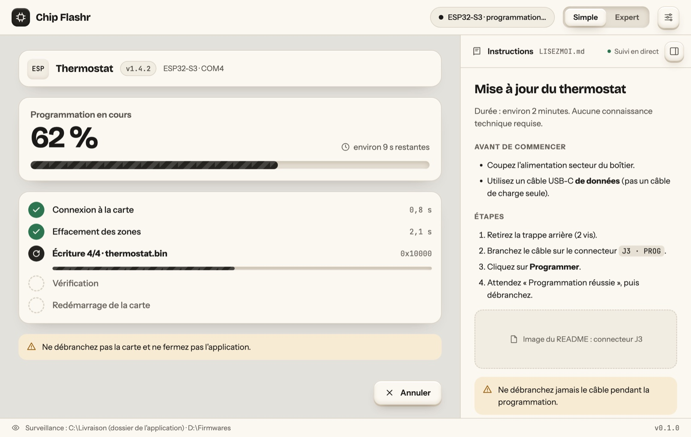
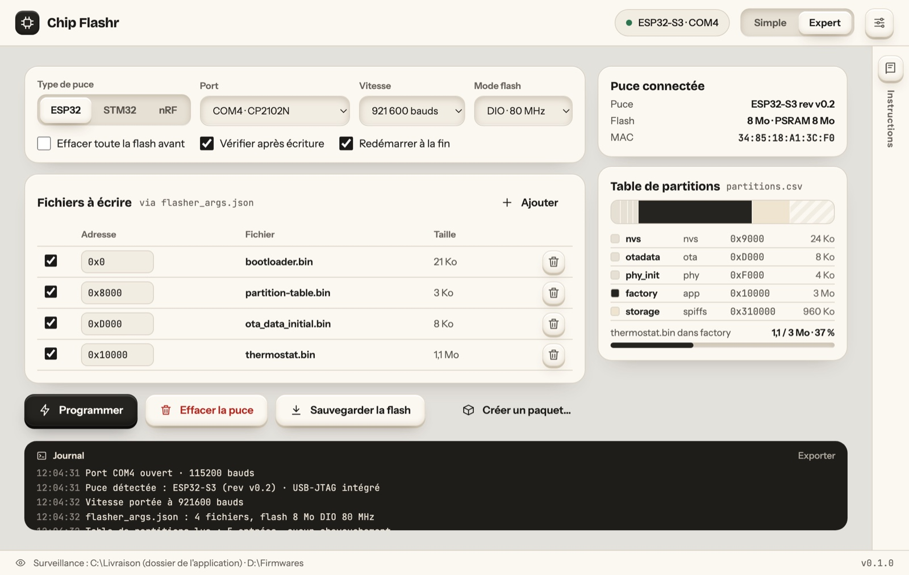
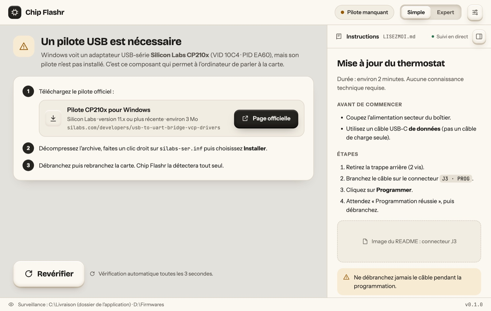
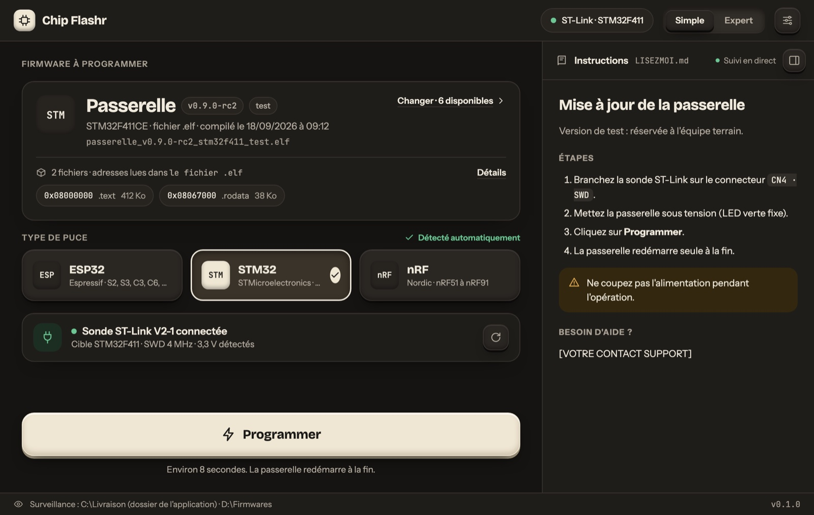

<div align="center">

# Chip Flashr

**One small app to flash ESP32, STM32 and Nordic nRF microcontrollers.**
Drop the firmware next to the executable, plug the board in, press **Program**.

[](LICENSE)




<sub>Design mockup: the interface ships in French and English.</sub>

</div>

---

## Why

Flashing a microcontroller should not require STM32CubeProgrammer, esptool command lines, nRF Connect and a page of instructions. That's even more true when the person doing it is **a customer** updating a device in the field.

Chip Flashr is a **single, lightweight, brand-neutral executable** that:

- **finds the firmware on its own.** It watches its own folder (and any folder you add) for `.zip`, `.bin`, `.hex` and `.elf` files;
- **understands standard build outputs.** ESP-IDF builds (`flasher_args.json`, partition tables), Arduino and PlatformIO exports, Intel HEX, ELF: no custom format required;
- **shows the customer's instructions** from a `README.md` / `LISEZMOI.md` placed next to it, rendered live inside the window;
- **guides non-technical users** through missing USB drivers or tools, with the official link and the recommended version;
- **stays out of the way.** It's a few-megabyte Rust + Tauri binary, open source ([Apache-2.0](#license)), with Windows releases [signed for free](#code-signing) so antivirus software doesn't get in the way.

## How it works



## Two ways to use it

| | **Simple mode** (customers, technicians) | **Expert mode** (developers) |
|---|---|---|
| Firmware | Picked up automatically from the watched folders | Any file, any address, several files at once |
| Chip family | Auto-detected, or one big three-way choice | Explicit selector |
| Actions | One **Program** button | Program, erase, back up flash, read chip info |
| Extras | Instructions panel, plain-language errors | Partition table map, live log, **Create a package** |

<table>
  <tr>
    <td width="50%"></td>
    <td width="50%"></td>
  </tr>
  <tr>
    <td align="center"><sub>Programming, step by step</sub></td>
    <td align="center"><sub>Expert mode: addresses, partitions, log</sub></td>
  </tr>
  <tr>
    <td width="50%"></td>
    <td width="50%"></td>
  </tr>
  <tr>
    <td align="center"><sub>Missing driver: what, why, where to get it</sub></td>
    <td align="center"><sub>Dark theme, STM32 through an ST-Link</sub></td>
  </tr>
</table>

➡️ All 15 screens: [docs/ux-design.md](docs/ux-design.md)

## Sending a firmware to a customer

```text
Delivery_thermostat_v1.4.2/
├── Chip Flashr.exe                         ← the only program
├── thermostat_v1.4.2_esp32s3_prod.zip      ← your ESP-IDF build, zipped as is
└── LISEZMOI.md                             ← optional instructions, shown in the app
```

1. Zip your build output (for ESP-IDF, the `build/` folder or just the `.bin` files + `flasher_args.json`).
2. Name it `project_version_chip[_variant].zip` so the app can display it nicely (optional: the version is also read from the binary).
3. Put it next to `Chip Flashr.exe`, add a `LISEZMOI.md` if you want, zip the folder, send it.

The customer unzips, double-clicks, plugs the board in and presses **Programmer**. The app can also build this folder for you (Expert mode → *Create a package*).

Details: [docs/user-guide.md](docs/user-guide.md) · [docs/firmware-packages.md](docs/firmware-packages.md)

## Supported chips (planned)

| Family | How | Hardware you need | Extra software |
|---|---|---|---|
| **ESP32** (ESP32, S2, S3, C2, C3, C6, H2) | [`espflash`](https://github.com/esp-rs/espflash) (built in) | USB cable (USB-serial bridge or native USB-JTAG) | Only a USB-serial driver on some Windows machines, and the app tells you which |
| **STM32** | [`probe-rs`](https://probe.rs) (built in), USB DFU | ST-Link / J-Link / CMSIS-DAP probe, **or** just USB in DFU mode | None |
| **Nordic nRF** (nRF51 → nRF91) | `probe-rs` through the on-board J-Link of a Nordic DK, `nrfutil` as a fallback | A Nordic DK (to program its own chip or an external board) or a J-Link | SEGGER J-Link software; nRF Util only for recover / APPROTECT |

More: [docs/chip-support.md](docs/chip-support.md)

## Documentation

| Document | What's inside |
|---|---|
| [User guide](docs/user-guide.md) | Using the app, sending a package to a customer, writing instructions |
| [Firmware packages](docs/firmware-packages.md) | Accepted formats, address resolution, naming convention, validation |
| [Chip support](docs/chip-support.md) | Families, probes, USB IDs, drivers and external tools |
| [Architecture](docs/architecture.md) | Crates, backends, data flow, state machine, error model |
| [UX & design](docs/ux-design.md) | Principles, screen map, all mockups, visual language |
| [Distribution](docs/distribution.md) | Single executable, configuration, code signing, releases |
| [Roadmap](docs/roadmap.md) | Milestones from design to v1.0 |
| [Decisions](docs/decisions/README.md) | Architecture Decision Records (why Rust + Tauri, why probe-rs…) |

## Project status

🎨 **Design phase.** The 15 screens of the first version are designed and validated, and development starts with the Rust/Tauri foundations. Nothing is downloadable yet. See the [roadmap](docs/roadmap.md).

## Built on

[Tauri 2](https://tauri.app) · [espflash](https://github.com/esp-rs/espflash) · [esp-idf-part](https://github.com/esp-rs/esp-idf-part) · [probe-rs](https://probe.rs) · [serialport-rs](https://github.com/serialport/serialport-rs) · [notify](https://github.com/notify-rs/notify)

These projects do the hard work. Chip Flashr puts a friendly face on them.

## License

Chip Flashr is released under the **[Apache License 2.0](LICENSE)**, a permissive open-source licence.

| ✅ You may | 📋 As long as you | 🚫 You may not |
|---|---|---|
| Use it for free, **including commercially**: in your company, on your production line, for your customers | Keep the licence text and copyright notices with the software (the app embeds them in *Settings → About*) | Use the project's name or contributors' names to endorse your product without permission |
| **Send the executable to your customers** with your firmware | Clearly mark files you changed if you distribute a modified version | Hold the authors liable: the software is provided **"as is", without warranty** |
| Modify it, fork it, rebrand your own build, integrate it into your tools | Keep a copy of the licence with any redistributed source or binaries | |
| Keep your changes private, or publish them under the licence of your choice (for your changes) | | |

The licence also includes an explicit **patent grant** from contributors. **Your firmware, your packages and your instructions remain entirely yours**: the licence only covers Chip Flashr itself.

<sub>This summary is for convenience only and isn't legal advice; the [LICENSE](LICENSE) file is what applies.</sub>

## Code signing

So that Windows doesn't greet your customers with "unknown publisher" warnings, official Windows releases will be **code-signed through the [SignPath Foundation](https://signpath.org)**. SignPath Foundation provides **free code-signing certificates to open-source projects**. The project registers with them, and releases must be built by this public repository's CI (GitHub Actions) so every signed binary can be traced back to its source.

- **Status:** registration planned for the first release (v0.1, milestone M4). Until then there are no official binaries.
- **Once active:** *Free code signing provided by [SignPath.io](https://signpath.io), certificate by [SignPath Foundation](https://signpath.org).* A code-signing policy (who can trigger releases, what gets signed) will be published alongside.
- **macOS** signing/notarization requires a paid Apple Developer account (decision pending). **Linux** releases ship with SHA-256 checksums.

Only binaries downloaded from this repository's [Releases](https://github.com/loutrx/chip-flashr/releases) page are official. Details: [docs/distribution.md](docs/distribution.md#code-signing)

## Contributions

Bug reports and feedback are welcome through issues. The project is maintained by a small team and doesn't actively seek pull requests: it's open source mainly so that anyone can use it for free and so that its releases can be signed.
