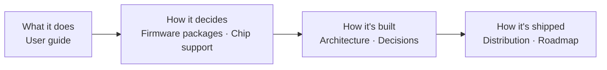

# Chip Flashr documentation

Forward-looking documentation: it describes how Chip Flashr **is designed to work**. Pages are marked *planned* until the corresponding milestone ships.

| Page | Read it if you want to… |
|---|---|
| [User guide](user-guide.md) | use the app, send a firmware to a customer, write instructions |
| [Firmware packages](firmware-packages.md) | know which files are accepted and how flash addresses are resolved |
| [Chip support](chip-support.md) | check families, probes, USB IDs, drivers and external tools |
| [Architecture](architecture.md) | understand crates, backends, data flow, states and errors |
| [Distribution](distribution.md) | know how it's packaged, configured, signed and released |
| [Roadmap](roadmap.md) | see what comes when |
| [Decisions](decisions/README.md) | know *why* (Rust + Tauri, probe-rs, single exe…) |
| [UX & design](ux-design.md) | see the principles, the screen map and the mockups |
