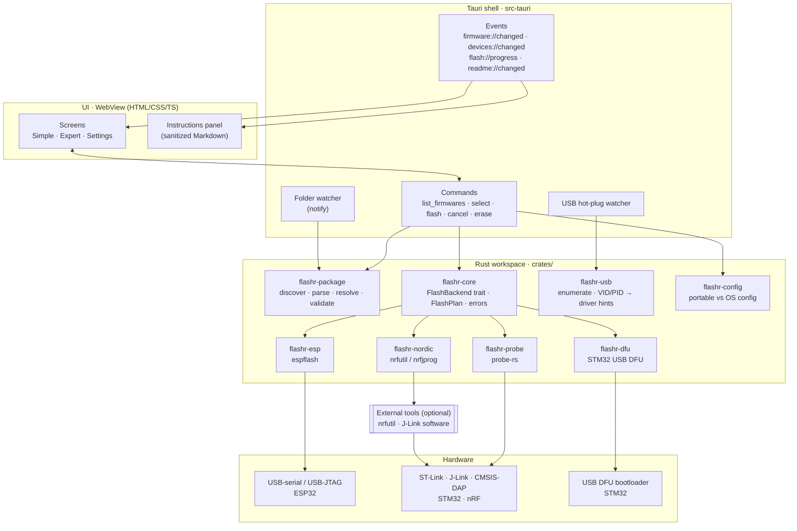
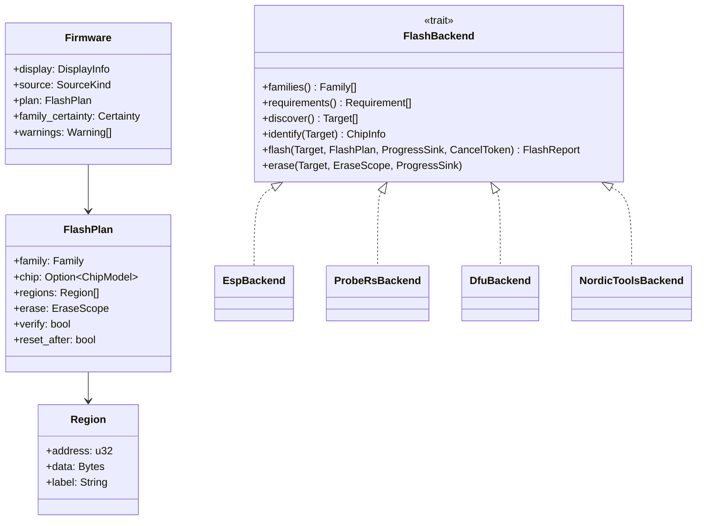
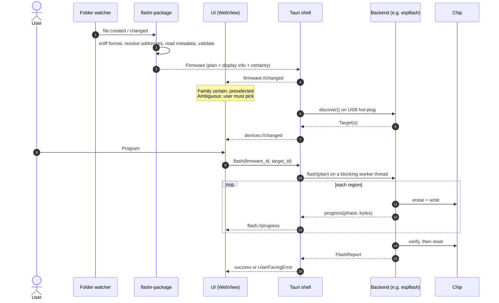
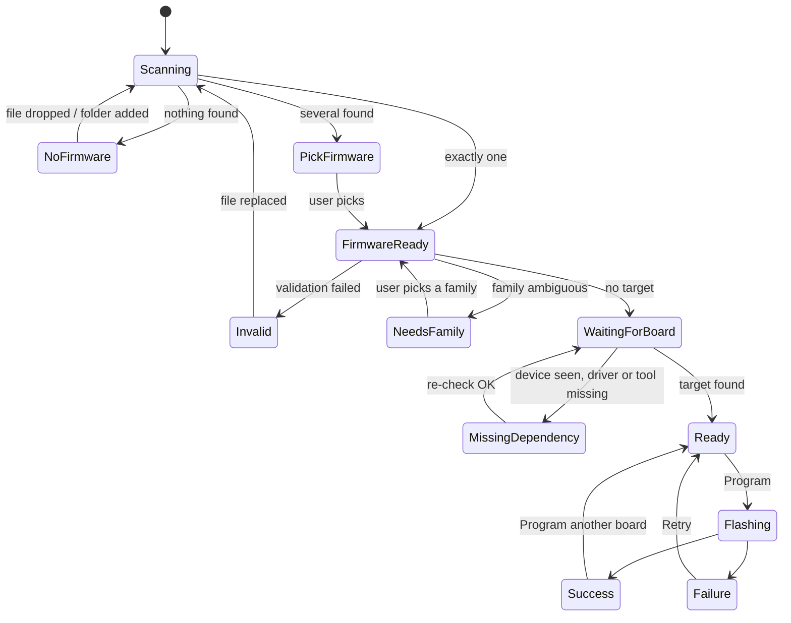
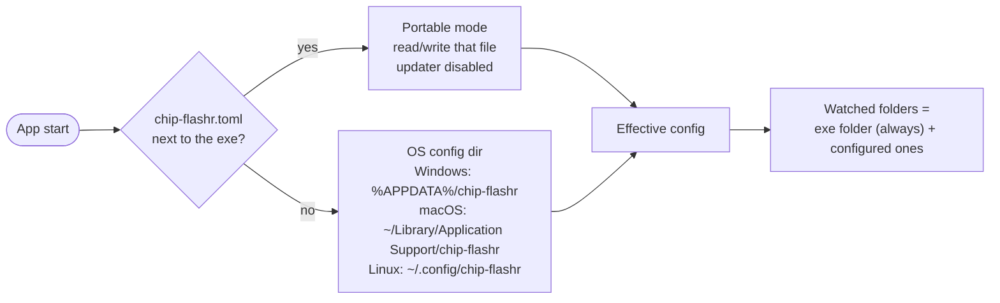

# Architecture

> Status: **planned**. This describes the target design for v0.1 → v1.0. It will be updated as the code lands.

Chip Flashr is a Rust workspace with a thin [Tauri 2](https://tauri.app) desktop shell on top. All the hardware work happens in Rust, in-process, through existing crates. The web UI only renders state and sends intents.

## Big picture



**Rule of thumb:** the UI never talks to hardware and never parses files. It receives ready-to-display view models (`FirmwareCard`, `BoardStatus`, `FlashProgress`, `UserFacingError`) and sends intents.

## Workspace layout

```text
chip-flashr/
├── Cargo.toml                 # workspace
├── crates/
│   ├── flashr-core/           # domain types, FlashBackend trait, FlashPlan, progress, errors
│   ├── flashr-package/        # firmware discovery & resolution (zip, flasher_args.json,
│   │                          #   partition tables, Arduino/PlatformIO, HEX, ELF, naming)
│   ├── flashr-usb/            # USB enumeration, VID/PID database, driver guidance
│   ├── flashr-config/         # config file, portable mode, watched folders
│   ├── flashr-esp/            # ESP32 backend (espflash as a library)
│   ├── flashr-probe/          # STM32 + nRF backend (probe-rs as a library)
│   ├── flashr-dfu/            # STM32 ROM bootloader over USB DFU (M5)
│   └── flashr-nordic/         # nrfutil / nrfjprog wrapper for recover & edge cases (M6)
├── app/
│   ├── src-tauri/             # Tauri commands, events, watchers, packaging
│   └── ui/                    # frontend (framework chosen in M1)
└── docs/
```

Crates are split so that `flashr-package` and `flashr-core` can be unit-tested without hardware, and so that a future **CLI / headless** mode (post-1.0) can reuse everything except the UI.

## The backend contract

Every chip family implements the same trait. The app only knows about `FlashBackend`.

```rust
/// One implementation per transport family (espflash, probe-rs, DFU, Nordic tools).
pub trait FlashBackend: Send + Sync {
    /// Which chip families this backend can program.
    fn families(&self) -> &'static [Family];

    /// External tools or drivers this backend needs, with install guidance.
    fn requirements(&self) -> Vec<Requirement>;

    /// Boards / probes currently reachable (serial ports, probes, DFU devices).
    fn discover(&self) -> Result<Vec<Target>, FlashError>;

    /// Connect and read chip identity (model, revision, flash size, MAC, protection).
    fn identify(&self, target: &Target) -> Result<ChipInfo, FlashError>;

    /// Execute a resolved plan: erase → write each region → verify → reset.
    fn flash(
        &self,
        target: &Target,
        plan: &FlashPlan,
        progress: &dyn ProgressSink,
        cancel: &CancelToken,
    ) -> Result<FlashReport, FlashError>;

    fn erase(&self, target: &Target, scope: EraseScope, progress: &dyn ProgressSink)
        -> Result<(), FlashError>;
}
```



A `FlashPlan` is **backend-agnostic**: a list of `(address, bytes)` regions plus options. `flashr-package` produces it from whatever file the user dropped; the backend only executes it. The same plan is shown in Expert mode (file table) and in Simple mode (the compact file chips).

## From a file on disk to a flashed chip



Flashing is blocking I/O. Each job runs on a dedicated worker (`spawn_blocking`), reports through a `ProgressSink` bridged to Tauri events, and can be cancelled between blocks with a `CancelToken`.

## Application states

What the Simple-mode screen shows is a direct function of this state machine. Each state has a mockup in [ux-design.md](ux-design.md).



## Configuration



See [ADR 0004](decisions/0004-single-executable-and-config.md).

## Errors are for humans

Every failure is mapped to a `UserFacingError` before it reaches the UI:

```rust
pub struct UserFacingError {
    pub title: String,               // "La programmation a échoué"
    pub explanation: String,         // plain words, no jargon
    pub likely_causes: Vec<Cause>,   // ranked, each with a concrete action
    pub actions: Vec<Action>,        // Retry · Open driver page · Export report…
    pub technical: String,           // raw error, shown only under "Technical details"
}
```

- **Never** show a raw stack trace or crate error as the main message.
- Every error screen offers **Export report** (log + chip info + plan, no personal data) that a customer can forward to their supplier.
- Destructive actions (full erase, Nordic recover, STM32 read-protection regression) always require explicit confirmation.

## Security notes

- The instructions panel renders **sanitized Markdown only**: no raw HTML, no scripts, no remote images. Local images next to the file are allowed. See [ADR 0006](decisions/0006-instructions-panel.md).
- Zip archives are read with path-traversal checks (`../` entries rejected) and size limits.
- External tools (nrfutil) are launched with an argument list, never through a shell. Their path is either found on `PATH` or picked explicitly by the user.
- Tauri capabilities are restricted to the app's own commands. The UI has no general filesystem or shell access.

## Related decisions

- [0001 · Rust + Tauri 2](decisions/0001-rust-and-tauri.md)
- [0002 · Read standard build outputs](decisions/0002-read-standard-build-outputs.md)
- [0003 · probe-rs first for STM32 and Nordic](decisions/0003-probe-rs-first.md)
- [0004 · Single executable, OS config + portable mode](decisions/0004-single-executable-and-config.md)
- [0005 · Always-visible chip family selector](decisions/0005-chip-family-selector.md)
- [0006 · Instructions panel from a README next to the exe](decisions/0006-instructions-panel.md)
