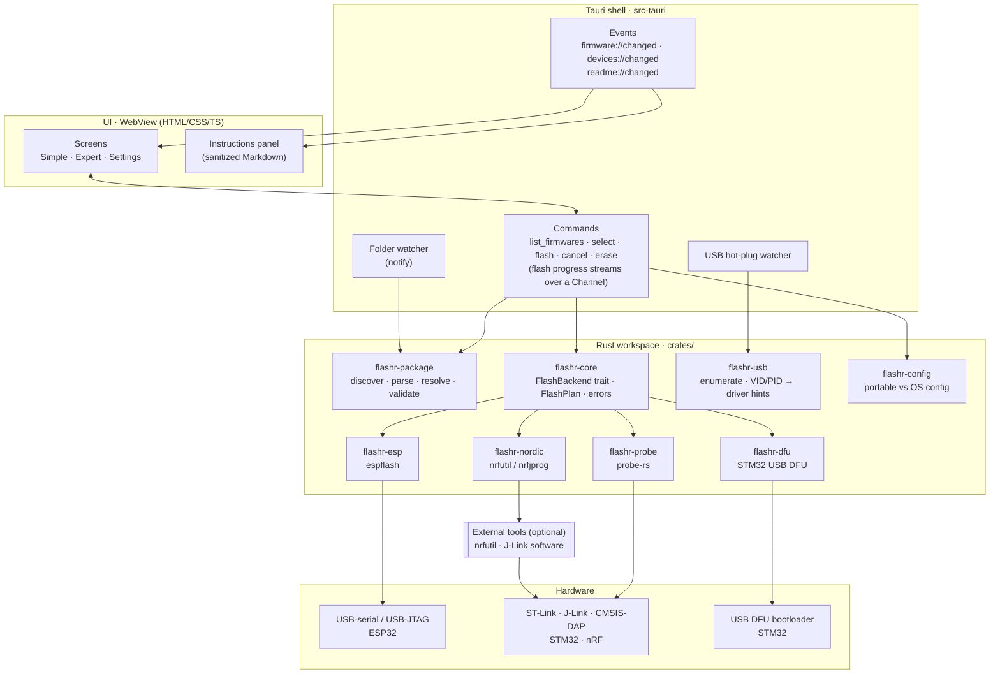
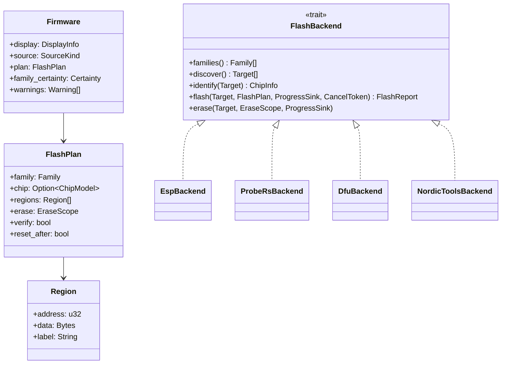
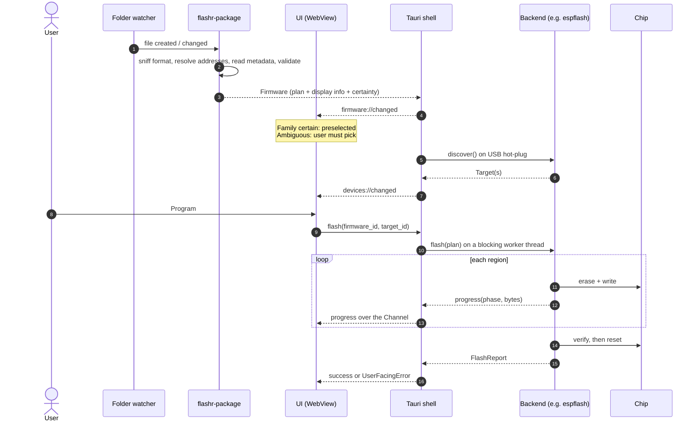
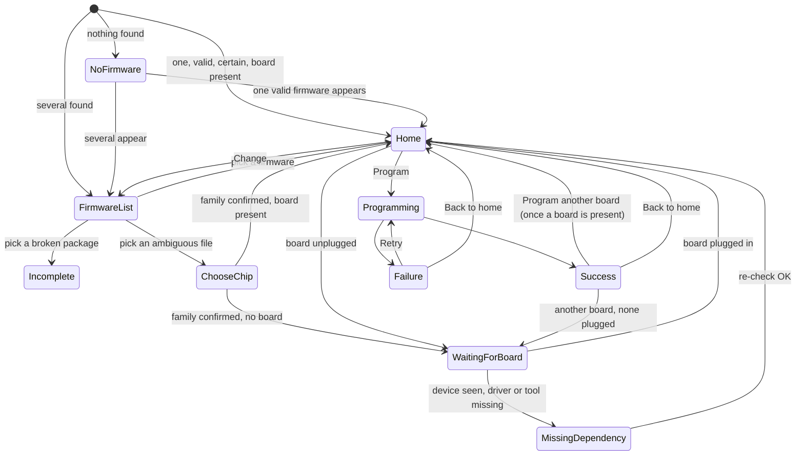
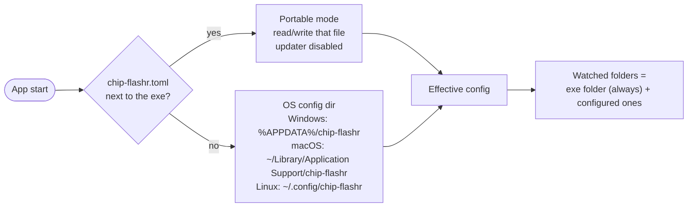

# Architecture

> Status: **planned**. This describes the target design for v0.1 → v1.0. It will be updated as the code lands.

Chip Flashr is a Rust workspace with a thin [Tauri 2](https://tauri.app) desktop shell on top. All the hardware work happens in Rust, in-process, through existing crates. The web UI only renders state and sends intents.

## Big picture


```mermaid
flowchart TB
    subgraph ui["UI · WebView (HTML/CSS/TS)"]
        screens["Screens<br/>Simple · Expert · Settings"]
        md["Instructions panel<br/>(sanitized Markdown)"]
    end

    subgraph shell["Tauri shell · src-tauri"]
        cmds["Commands<br/>list_firmwares · select · flash · cancel · erase<br/>(flash progress streams over a Channel)"]
        events["Events<br/>firmware://changed · devices://changed<br/>readme://changed"]
        watch["Folder watcher<br/>(notify)"]
        usbw["USB hot-plug watcher"]
    end

    subgraph core["Rust workspace · crates/"]
        pkg["flashr-package<br/>discover · parse · resolve · validate"]
        fcore["flashr-core<br/>FlashBackend trait · FlashPlan · errors"]
        usb["flashr-usb<br/>enumerate · VID/PID → driver hints"]
        cfg["flashr-config<br/>portable vs OS config"]
        esp["flashr-esp<br/>espflash"]
        probe["flashr-probe<br/>probe-rs"]
        dfu["flashr-dfu<br/>STM32 USB DFU"]
        nordic["flashr-nordic<br/>nrfutil / nrfjprog"]
    end

    subgraph hw["Hardware"]
        serial["USB-serial / USB-JTAG<br/>ESP32"]
        probes["ST-Link · J-Link · CMSIS-DAP<br/>STM32 · nRF"]
        dfuhw["USB DFU bootloader<br/>STM32"]
    end

    ext[["External tools (optional)<br/>nrfutil · J-Link software"]]

    screens <--> cmds
    events --> screens
    events --> md
    cmds --> pkg
    cmds --> fcore
    cmds --> cfg
    watch --> pkg
    usbw --> usb
    fcore --> esp
    fcore --> probe
    fcore --> dfu
    fcore --> nordic
    esp --> serial
    probe --> probes
    dfu --> dfuhw
    nordic --> ext
    ext --> probes
```

**Rule of thumb:** the UI never talks to hardware and never parses files. It receives ready-to-display view models (`FirmwareCard`, `BoardStatus`, `FlashProgress`, `UserFacingError`) and sends intents.

## Workspace layout

```text
chip-flashr/
├── Cargo.toml                 # workspace
├── crates/
│   ├── flashr-core/           # domain types, FlashBackend trait, FlashPlan, progress, errors
│   ├── flashr-package/        # firmware discovery & resolution (zip, flasher_args.json,
│   │                          #   partition tables, Arduino/PlatformIO, HEX, ELF, naming)
│   ├── flashr-usb/            # USB enumeration, VID/PID database, driver guidance
│   ├── flashr-config/         # config file, portable mode, watched folders
│   ├── flashr-esp/            # ESP32 backend (espflash as a library)
│   ├── flashr-probe/          # STM32 + nRF backend (probe-rs as a library)
│   ├── flashr-dfu/            # STM32 ROM bootloader over USB DFU (M5)
│   └── flashr-nordic/         # nrfutil / nrfjprog wrapper for recover & edge cases (M6)
├── app/                       # Svelte 5 + Vite + TypeScript frontend (package.json, src/)
│   └── src-tauri/             # Tauri shell: commands, jobs, state, packaging
└── docs/
```

Crates are split so that `flashr-package` and `flashr-core` can be unit-tested without hardware, and so that a future **CLI / headless** mode (post-1.0) can reuse everything except the UI.

## The backend contract

Every chip family implements the same trait. The app only knows about `FlashBackend`.

```rust
/// One implementation per transport family (espflash, probe-rs, DFU, Nordic tools).
pub trait FlashBackend: Send + Sync {
    /// Which chip families this backend can program.
    fn families(&self) -> &'static [Family];

    /// Boards / probes currently reachable (serial ports, probes, DFU devices).
    fn discover(&self) -> Result<Vec<Target>, FlashError>;

    /// Connect and read chip identity (model, revision, flash size, MAC, protection).
    fn identify(&self, target: &Target) -> Result<ChipInfo, FlashError>;

    /// Execute a resolved plan: write each region (its sectors only) → verify → reset.
    /// Never a full erase: NVS and other unlisted regions survive an update.
    fn flash(
        &self,
        target: &Target,
        plan: &FlashPlan,
        progress: &dyn ProgressSink,
        cancel: &CancelToken,
    ) -> Result<FlashReport, FlashError>;

    fn erase(&self, target: &Target, scope: EraseScope, progress: &dyn ProgressSink)
        -> Result<(), FlashError>;
}
```

A `requirements()` method (external tools or drivers a backend needs, with install guidance) joins the trait with the first real backend.


```mermaid
classDiagram
    class FlashBackend {
        <<trait>>
        +families() Family[]
        +discover() Target[]
        +identify(Target) ChipInfo
        +flash(Target, FlashPlan, ProgressSink, CancelToken) FlashReport
        +erase(Target, EraseScope, ProgressSink)
    }
    class FlashPlan {
        +family: Family
        +chip: Option~ChipModel~
        +regions: Region[]
        +erase: EraseScope
        +verify: bool
        +reset_after: bool
    }
    class Region {
        +address: u32
        +data: Bytes
        +label: String
    }
    class Firmware {
        +display: DisplayInfo
        +source: SourceKind
        +plan: FlashPlan
        +family_certainty: Certainty
        +warnings: Warning[]
    }
    FlashBackend <|.. EspBackend
    FlashBackend <|.. ProbeRsBackend
    FlashBackend <|.. DfuBackend
    FlashBackend <|.. NordicToolsBackend
    Firmware --> FlashPlan
    FlashPlan --> Region
```

A `FlashPlan` is **backend-agnostic**: a list of `(address, bytes)` regions plus options. `flashr-package` produces it from whatever file the user dropped; the backend only executes it. The same plan is shown in Expert mode (file table) and in Simple mode (the compact file chips).

The app shell talks to the UI through seven commands and one event: `app_info`, `snapshot` (initial state) and the `snapshot-changed` event, `flash(firmwareId, targetId, family)` with progress on a channel, `cancel_flash`, `recheck`, `add_folder` and `open_file`. Errors cross as `UserFacingError` with the phase and percent at which a job stopped.

## From a file on disk to a flashed chip


```mermaid
sequenceDiagram
    autonumber
    actor U as User
    participant W as Folder watcher
    participant P as flashr-package
    participant UI as UI (WebView)
    participant S as Tauri shell
    participant B as Backend (e.g. espflash)
    participant C as Chip

    W->>P: file created / changed
    P->>P: sniff format, resolve addresses, read metadata, validate
    P-->>S: Firmware (plan + display info + certainty)
    S-->>UI: firmware://changed
    Note over UI: Family certain: preselected<br/>Ambiguous: user must pick
    S->>B: discover() on USB hot-plug
    B-->>S: Target(s)
    S-->>UI: devices://changed
    U->>UI: Program
    UI->>S: flash(firmware_id, target_id)
    S->>B: flash(plan) on a blocking worker thread
    loop each region
        B->>C: erase + write
        B-->>S: progress(phase, bytes)
        S-->>UI: progress over the Channel
    end
    B->>C: verify, then reset
    B-->>S: FlashReport
    S-->>UI: success or UserFacingError
```

Flashing is blocking I/O. Each job runs on a dedicated worker (`spawn_blocking`), reports through a `ProgressSink` that forwards each event over a Tauri `Channel` passed to the command, and can be cancelled between blocks with a `CancelToken`.

## Application states

The Simple-mode screen is **derived, never stored** ([plan 3 spec](superpowers/specs/2026-10-01-simple-mode-screens-design.md#choosing-the-screen)). The Rust side reports facts in a `Snapshot` (watched folders, firmware summaries, targets, device issues) and emits `snapshot-changed` whenever they change. The UI keeps the user's choices (picked firmware, confirmed family, list open) and the flash job. `screenOf(snapshot, choices, job)` returns the first rule that applies:

| # | Condition | Screen |
|---|---|---|
| 1 | job flashing / succeeded / failed | 05 Programming / 06 Success / 07 Failure |
| 2 | no firmware | 10 No firmware |
| 3 | list opened with "Changer", or several firmwares and none picked | 02 Firmware list |
| 4 | the current firmware has a check in error | 11 Incomplete package |
| 5 | family not certain and not confirmed | 03 Choose the chip |
| 6 | a driver or tool problem for that family | 08 Missing driver / 09 External tool |
| 7 | no board of that family | 04 Waiting for the board |
| 8 | otherwise | 01 Home: package ready |


```mermaid
stateDiagram-v2
    [*] --> NoFirmware: nothing found
    [*] --> FirmwareList: several found
    [*] --> Home: one, valid, certain, board present
    NoFirmware --> Home: one valid firmware appears
    NoFirmware --> FirmwareList: several appear
    FirmwareList --> Incomplete: pick a broken package
    FirmwareList --> ChooseChip: pick an ambiguous file
    FirmwareList --> Home: pick a firmware
    ChooseChip --> WaitingForBoard: family confirmed, no board
    ChooseChip --> Home: family confirmed, board present
    Home --> WaitingForBoard: board unplugged
    WaitingForBoard --> MissingDependency: device seen, driver or tool missing
    MissingDependency --> Home: re-check OK
    WaitingForBoard --> Home: board plugged in
    Home --> Programming: Program
    Programming --> Success
    Programming --> Failure
    Failure --> Programming: Retry
    Failure --> Home: Back to home
    Success --> Home: Program another board (once a board is present)
    Success --> WaitingForBoard: another board, none plugged
    Success --> Home: Back to home
    Home --> FirmwareList: Change
```

Until real packages (plan 4) and real boards (plan 6) exist, the facts come from simulated scenarios: JSON files in `crates/flashr-core/scenarios/`, read by the Rust mock and by the browser preview alike.

## Configuration


```mermaid
flowchart LR
    start(["App start"]) --> portable{"chip-flashr.toml<br/>next to the exe?"}
    portable -- yes --> p["Portable mode<br/>read/write that file<br/>updater disabled"]
    portable -- no --> os["OS config dir<br/>Windows: %APPDATA%/chip-flashr<br/>macOS: ~/Library/Application Support/chip-flashr<br/>Linux: ~/.config/chip-flashr"]
    p --> merged["Effective config"]
    os --> merged
    merged --> watch["Watched folders =<br/>exe folder (always) + configured ones"]
```

See [ADR 0004](decisions/0004-single-executable-and-config.md).

## Errors are for humans

Every failure crosses to the UI as a `UserFacingError`: a stable **code** plus the raw technical detail. The UI owns the wording (title, explanation, likely causes, actions) per code and per language, so Rust never ships user-facing sentences:

```rust
pub struct UserFacingError {
    pub code: ErrorCode,     // cancelled · target-not-found · invalid-plan · family-mismatch · device-error · already-running
    pub technical: String,   // raw error, shown only under "Technical details"
}
```

- **Never** show a raw stack trace or crate error as the main message.
- Every error screen offers **Export report** (log + chip info + plan, no personal data) that a customer can forward to their supplier.
- Destructive actions (full erase, Nordic recover, STM32 read-protection regression) always require explicit confirmation.

## Security notes

- The instructions panel renders **sanitized Markdown only**: no raw HTML, no scripts, no remote images. Local images next to the file are allowed. See [ADR 0006](decisions/0006-instructions-panel.md).
- Zip archives are read with path-traversal checks (`../` entries rejected) and size limits.
- External tools (nrfutil) are launched with an argument list, never through a shell. Their path is either found on `PATH` or picked explicitly by the user.
- Tauri capabilities are restricted to the app's own commands. The UI has no general filesystem or shell access.

## Related decisions

- [0001 · Rust + Tauri 2](decisions/0001-rust-and-tauri.md)
- [0002 · Read standard build outputs](decisions/0002-read-standard-build-outputs.md)
- [0003 · probe-rs first for STM32 and Nordic](decisions/0003-probe-rs-first.md)
- [0004 · Single executable, OS config + portable mode](decisions/0004-single-executable-and-config.md)
- [0005 · Always-visible chip family selector](decisions/0005-chip-family-selector.md)
- [0006 · Instructions panel from a README next to the exe](decisions/0006-instructions-panel.md)
