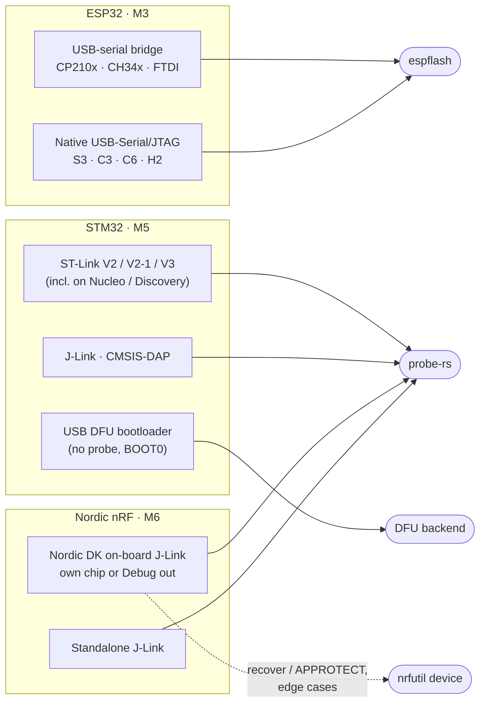

# Chip support

> Status: **planned**. Order of delivery: **ESP32 → STM32 → Nordic nRF** (see [roadmap](roadmap.md)).

## At a glance

## ESP32 (first)

| | |
|---|---|
| **Backend** | [`espflash`](https://github.com/esp-rs/espflash), used as a library (no CLI, no Python) |
| **Chips** | ESP32, ESP32-S2, ESP32-S3, ESP32-C2, ESP32-C3, ESP32-C6, ESP32-H2, following espflash's support list |
| **Connection** | USB-serial bridge on the board, or the chip's native USB-Serial/JTAG |
| **Auto-detected** | Chip model & revision, flash size, MAC, crystal |
| **Operations** | Multi-file write at offsets or merged image, erase (full / regions), verify, hard reset, read flash (backup) |
| **Pain points handled** | Board not entering download mode (illustrated BOOT + RESET guide), automatic baud-rate fallback, missing USB-serial driver on Windows |

## STM32 (second)

| | |
|---|---|
| **Backend** | [`probe-rs`](https://probe.rs) as a library; USB DFU backend for probe-less boards |
| **Probes** | ST-Link V2 / V2-1 / V3 (including the ones built into Nucleo & Discovery boards), J-Link, CMSIS-DAP |
| **Without a probe** | System bootloader in **USB DFU** mode (BOOT0 high + reset). UART bootloader considered later |
| **Operations** | Write `.bin` / `.hex` / `.elf`, mass erase, verify, reset, connect-under-reset for stubborn chips |
| **Protection** | Read-out protection (RDP) is detected and explained. Lowering it erases the chip and is never done without explicit confirmation |

## Nordic nRF (third)

| | |
|---|---|
| **Primary path** | `probe-rs` driving the **on-board J-Link of a Nordic DK**: program the DK's own chip, or an external board wired to the DK's *Debug out* connector. No extra install beyond the J-Link driver |
| **Fallback** | Nordic's **nRF Util** (`nrfutil device`) for recover / APPROTECT, the nRF53 network core, and chips probe-rs doesn't handle well yet |
| **About nrfjprog** | Nordic has deprecated `nrfjprog` (nRF Command Line Tools) in favour of nRF Util. Chip Flashr detects and can use both, but recommends nRF Util |
| **Chips** | nRF51, nRF52, nRF53, nRF54, nRF91 series (per probe-rs / nRF Util support) |
| **Operations** | Write `.hex` (including multi-core images), erase, recover (with confirmation), reset |

## USB devices the app recognises

Used to tell the user *what* is plugged in and *which driver* is missing. Matching is by USB vendor/product ID (VID:PID); the list will grow over time.

| Device | VID:PID | Family | Windows driver |
|---|---|---|---|
| Silicon Labs CP210x | `10C4:EA60` | ESP32 boards | Often automatic; otherwise [Silicon Labs VCP driver](https://www.silabs.com/developers/usb-to-uart-bridge-vcp-drivers) |
| WCH CH340 | `1A86:7523` | ESP32 boards | Often automatic; otherwise WCH CH341SER driver |
| WCH CH343 / CH9102 | `1A86:55D3` / `1A86:55D4` | ESP32 boards | WCH CH343SER driver |
| FTDI FT232R / FT2232 | `0403:6001` / `0403:6010` | ESP32 boards, probes | Often automatic; otherwise FTDI VCP driver |
| Espressif USB-Serial/JTAG | `303A:1001` | ESP32-S3 / C3 / C6 / H2 | Built into Windows 10+ |
| ST-Link V2 / V2-1 / V3 | `0483:3748` / `0483:374B` / `0483:374E`… | STM32 | ST-Link driver (STSW-LINK009) |
| STM32 DFU bootloader | `0483:DF11` | STM32 | WinUSB (guided) |
| SEGGER J-Link | `1366:*` | STM32, nRF (DKs) | SEGGER J-Link Software |
| CMSIS-DAP | various | STM32, nRF | Built in (HID / WinUSB) |

For every missing piece, the app shows **what it is, why it's needed, the official link and the recommended version**, plus a *Re-check* button. It never bundles or silently installs drivers.

## Linux permissions

On Linux, serial ports need the user to be in the `dialout` (or `uucp`) group, and probes need udev rules. The app detects `Permission denied`, explains it, and ships the rules file with the one command to install it.

## Later (post-1.0 ideas)

RP2040 / RP2350 (UF2 and probe-rs), other probe-rs targets (SAMD, RA, GD32…), AVR. Adding a family means adding a backend or a probe-rs target, with no change to the UI (see [architecture](architecture.md#the-backend-contract)).
