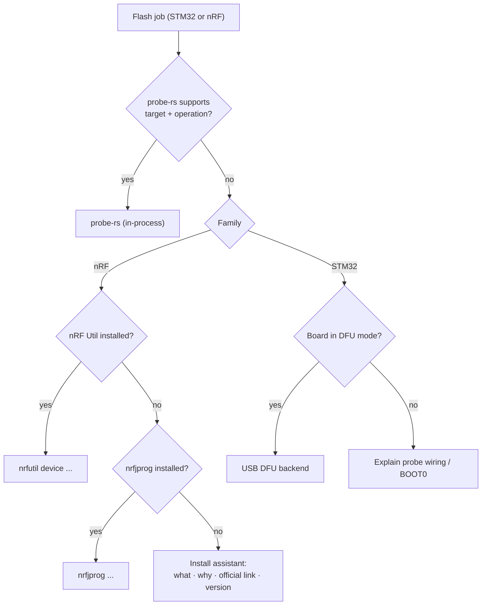

# 0003 · probe-rs first for STM32 and Nordic, vendor tools as fallback

- Status: Accepted
- Date: 2026-09-24

## Context

The initial idea for Nordic chips was to drive **nrfjprog**, which works with Nordic development kits (DK) acting as programmers. Since then:

- Nordic has **deprecated nrfjprog** (nRF Command Line Tools) in favour of **nRF Util** (`nrfutil device`).
- **probe-rs** can drive the **SEGGER J-Link built into Nordic DKs**, as well as ST-Links and CMSIS-DAP probes, as an in-process Rust library.
- Asking a non-technical user to install vendor tool suites is the biggest source of friction.

## Decision

- **STM32 and Nordic** go through **probe-rs** by default (`flashr-probe`).
- **Nordic vendor tools** (`flashr-nordic`) are a fallback for what probe-rs doesn't cover well: recover of APPROTECT-locked chips, nRF53 network core, very new chips. **nRF Util** is preferred; nrfjprog is detected and used only if it's what's installed.
- STM32 boards without a probe are served by a **USB DFU** backend (`flashr-dfu`).

## Consequences

- ✅ Programming a Nordic DK or an external board through a DK needs only the J-Link driver, with no Nordic tool suite for the common case.
- ✅ One code path (probe-rs) for two families.
- ⚠️ Recover/APPROTECT and some chips still need nRF Util: the install assistant must be excellent (link, version, "Re-check").
- ⚠️ Must track probe-rs target support for nRF54 and future chips.
