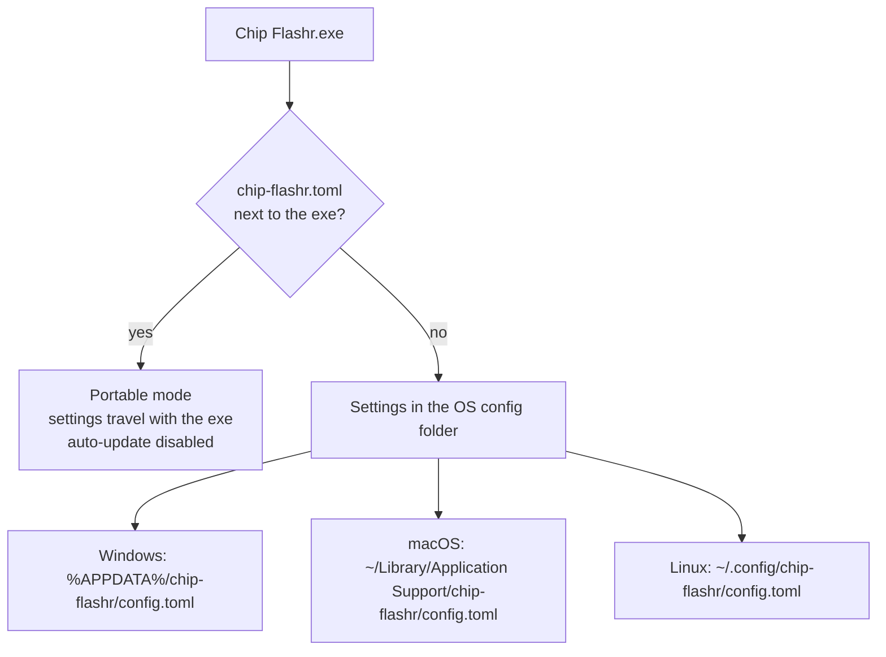
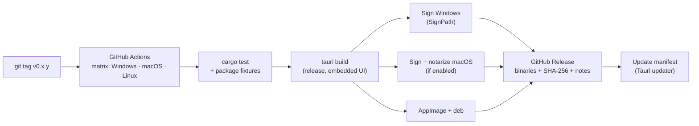

# Distribution

> Status: **planned** (milestone M4 for the first signed release).

## One executable

| Platform | What you get | Notes |
|---|---|---|
| **Windows** | `Chip Flashr.exe`, a single portable file (plus an optional installer) | Uses the WebView2 runtime, present on Windows 11 and up-to-date Windows 10 |
| **macOS** | `Chip Flashr.app` (appears as one item) in a `.dmg` | Universal build (Apple Silicon + Intel) |
| **Linux** | `.AppImage` (single file) and `.deb` | Needs serial/probe permissions, see [chip support](chip-support.md#linux-permissions) |

The UI is embedded in the binary. There's no side folder of DLLs or assets, and no Python or Java runtime. Drivers and vendor tools (J-Link, nRF Util) are **never bundled**: the app detects them and guides the user to the official download.

Size target: **< 15 MB**, start-up **< 1 s**.

## Configuration



A single executable can't keep its settings inside itself, so by default they live in the standard per-user config folder. The user never sees it, and it survives updates. **Portable mode** is for deliveries: put a `chip-flashr.toml` next to the exe (Settings → *Export for a customer…* writes one), and it takes precedence.

Illustrative content (the schema will be finalised in M1/M2):

```toml
# chip-flashr.toml (portable settings shipped next to the executable)
language = "fr"            # "fr" | "en" | "system"
theme = "system"           # "light" | "dark" | "system"
start_mode = "simple"      # "auto" | "simple" | "expert"
check_updates = false

[watch]
folders = ["firmwares"]    # relative to the exe, or absolute
recursive_depth = 2

[instructions]
show_panel = true
```

## Code signing

Unsigned executables trigger SmartScreen and antivirus warnings, the opposite of "simple for a customer". Signing is part of the release pipeline from v0.1.

| Platform | Plan | Cost |
|---|---|---|
| **Windows** | [SignPath Foundation](https://signpath.org), which offers free code signing for open-source projects. Requires a public repo, an OSI licence (Apache-2.0 ✓) and builds from GitHub Actions | Free |
| **macOS** | Developer ID signing + notarization needs an Apple Developer Program membership | ~99 USD/year, **decision pending** |
| **Linux** | AppImage/deb checksums published; optional GPG signature | Free |

Until macOS is decided, macOS builds may ship unsigned with clear "right-click → Open" instructions.

## Release pipeline



- Builds are reproducible from a tag, which SignPath requires.
- The **Tauri updater** checks the GitHub Release manifest. It's off in portable mode and can be turned off in Settings: a customer's delivery folder should never change by itself.
- Every release publishes SHA-256 checksums.
