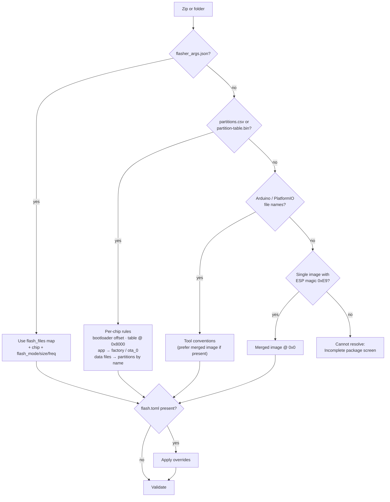
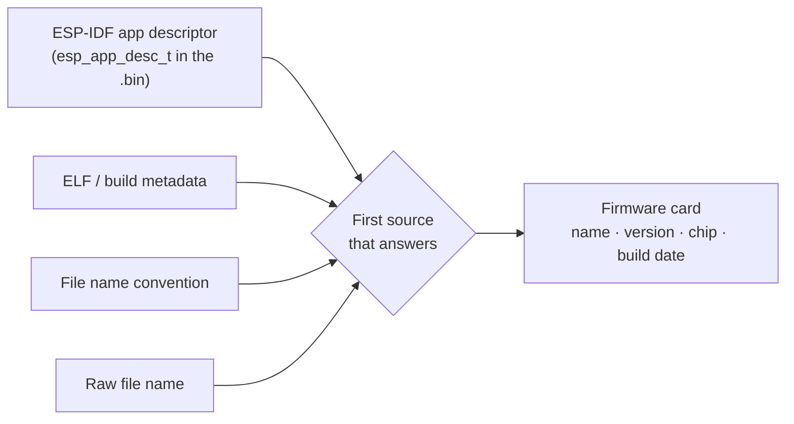

# Firmware packages

How Chip Flashr finds firmware files, figures out **what to write where**, and decides what to show the user.

> Status: **design**. Implemented in milestone M2. See [ADR 0002](decisions/0002-read-standard-build-outputs.md) for the reasoning.

## Where the app looks

- **The folder containing the executable.** Always watched and can't be removed.
- **Extra folders** added in Settings (local, USB drive, network share), optionally with sub-folders (2 levels).
- Anything **dragged onto the window** or opened with *Open a file…*.

Folders are watched live (`notify`). A new zip dropped next to the exe shows up within a second, with no restart needed.

## Accepted inputs

| Input | Typical producer | Addresses come from | Family known? |
|---|---|---|---|
| `.zip` with `flasher_args.json` | ESP-IDF `idf.py build` | `flasher_args.json` | ✅ ESP32 + exact chip |
| `.zip` with `.bin` + partition table | ESP-IDF, custom scripts | Partition table + per-chip rules | ✅ ESP32 |
| `.zip` / files `*.ino.bin`, `*.ino.bootloader.bin`, `*.ino.partitions.bin`, `*.ino.merged.bin` | Arduino IDE *Export compiled binary* | Arduino conventions | ✅ ESP32 |
| `.zip` / files `firmware.bin`, `bootloader.bin`, `partitions.bin` | PlatformIO (`.pio/build/<env>/`) | PlatformIO conventions | ✅ ESP32 |
| Single merged `.bin` | `esptool merge_bin`, Arduino `*.merged.bin` | Written at `0x0` | ✅ ESP32 (image header) |
| `.elf` | Any toolchain | Loadable segments | ✅ usually (architecture + addresses) |
| `.hex` (Intel HEX) | STM32CubeIDE, nRF Connect SDK, Keil… | Embedded in the file | ⚠️ often ambiguous |
| Raw `.bin` (non-ESP) | Anything | User-provided base address (Expert) | ❌ user must pick |
| `.uf2`, `.dfu` | RP2040 / DFU tools | Embedded | later |

A zip can also carry an **optional** `flash.toml` to override or complete what was detected. It's never required.

## Resolving an ESP32 package



### 1 · `flasher_args.json`: the authoritative source

Generated by every ESP-IDF build in `build/`. It lists every binary with its offset, the target chip and the flash settings. Abridged example:

```json
{
  "flash_settings": { "flash_mode": "dio", "flash_size": "8MB", "flash_freq": "80m" },
  "flash_files": {
    "0x0": "bootloader/bootloader.bin",
    "0x8000": "partition_table/partition-table.bin",
    "0xd000": "ota_data_initial.bin",
    "0x10000": "thermostat.bin"
  },
  "extra_esptool_args": { "chip": "esp32s3", "before": "default_reset", "after": "hard_reset" }
}
```

Paths are relative to the JSON file. Chip Flashr looks them up inside the zip with the same relative layout, then falls back to a flat lookup by file name. That way both "zip the whole `build/` folder" and "zip only the `.bin` files" work.

### 2 · Partition table + per-chip rules

When there's no `flasher_args.json`, the partition table (`partitions.csv` or the binary `partition-table.bin`, parsed with [`esp-idf-part`](https://github.com/esp-rs/esp-idf-part)) tells where the app and data partitions live. What it **doesn't** tell is where the bootloader and the table itself go:

| Chip | Bootloader offset |
|---|---|
| ESP32, ESP32-S2 | `0x1000` |
| ESP32-S3, ESP32-C2, ESP32-C3, ESP32-C6, ESP32-H2 | `0x0` |
| Newer chips | Taken from `flasher_args.json` or espflash's chip database, never guessed |

- Partition table: `0x8000` (ESP-IDF default; a different `CONFIG_PARTITION_TABLE_OFFSET` requires `flasher_args.json` or `flash.toml`).
- Application `.bin` → the `factory` partition, or `ota_0` if there's no factory.
- Data images are matched to partitions **by name**: `spiffs.bin` / `storage.bin` → partition `storage`/`spiffs`, `ota_data_initial.bin` → `otadata`, `nvs.bin` → `nvs`…

```text
# Name,   Type, SubType, Offset,  Size
nvs,      data, nvs,     0x9000,  0x6000
otadata,  data, ota,     0xd000,  0x2000
phy_init, data, phy,     0xf000,  0x1000
factory,  app,  factory, 0x10000, 3M
storage,  data, spiffs,  ,        960K
```

### 3 · Arduino IDE & PlatformIO

- **Arduino IDE** (*Sketch → Export compiled binary*) writes `sketch.ino.bin`, `sketch.ino.bootloader.bin`, `sketch.ino.partitions.bin` and, with recent ESP32 cores, `sketch.ino.merged.bin`. **The merged image is preferred**: the split files don't include `boot_app0.bin` (OTA data, at `0xE000`), which the split layout needs.
- **PlatformIO** writes `firmware.bin`, `bootloader.bin`, `partitions.bin` in `.pio/build/<env>/`.

These conventions will be validated against real exports (fixtures) in M2 before being relied on.

## Name & version shown to the user



1. **Embedded metadata first.** An ESP-IDF application image carries an `esp_app_desc_t` (magic `0xABCD5432`, right after the image and first segment headers) with the **project name, version, IDF version, build date and time**. Nothing to configure, it's always right.
2. **File name convention** as a fallback and complement (e.g. for the variant, or for STM32/nRF files):

```text
<project>_<version>_<chip>[_<variant>].<ext>

thermostat_v1.4.2_esp32s3_prod.zip
capteur-porte_2.0.1_nrf52840.hex
passerelle_v0.9.0-rc2_stm32f411_test.elf
```

| Field | Rule |
|---|---|
| `project` | Letters, digits, `-`. No `_` (it's the separator). |
| `version` | SemVer, optional leading `v`, pre-release allowed (`-rc2`, `-beta`). |
| `chip` | Lower-case chip id: `esp32`, `esp32s3`, `esp32c3`, `stm32f411`, `nrf52840`… |
| `variant` | Optional free word: `prod`, `test`, `debug`, customer code… |

3. If nothing matches, the raw file name is shown and the card says *"no version information found"*.

## Guessing the chip family

The family selector is always visible ([ADR 0005](decisions/0005-chip-family-selector.md)). It's **preselected** when detection is certain and **highlighted with a suggestion** when it's only a guess.

| Signal | Suggests | Certainty |
|---|---|---|
| `flasher_args.json`, ESP image magic `0xE9`, app descriptor | ESP32 (+ exact chip) | Certain |
| ELF `e_machine` = Xtensa | ESP32 / S2 / S3 | Certain |
| ELF RISC-V + ESP-IDF sections | ESP32-C / H series | Certain |
| Load address `0x0800_0000` (HEX / ELF, ARM) | STM32 | Suggestion |
| ARM image at `0x0000_0000`, or records in the UICR at `0x1000_1000` | nRF | Suggestion |
| Chip id in the file name (`_stm32f411_`, `_nrf52840_`) | That family | Strong suggestion |
| Connected probe identifies the target (IDCODE, FICR) | That family | Confirms a suggestion before flashing |

When the connected hardware contradicts the selected family (e.g. an STM32 probe answers but nRF is selected), the app says so before writing anything.

## Validation

Before the **Program** button becomes available, every plan is checked:

- every referenced file exists and is readable (inside the zip too);
- regions don't overlap and fit in the target's flash (when known);
- an app image fits in its partition;
- the chip declared by the package matches the connected chip (ESP32-S3 package on an ESP32-C3 → blocked with an explanation);
- zip entries don't escape the archive (`../`), and sizes are sane.

Failures produce the **Incomplete package** screen, with one line per check (✓ / ✗ / ⚠) and the concrete missing piece (`partition-table.bin expected at 0x8000`).


## Creating a package from the app

Expert mode → **Create a package** takes a build folder, pre-fills name and version from the binary, previews the file name, and can produce a ready-to-send delivery folder:

```text
Delivery_thermostat_v1.4.2/
├── Chip Flashr.exe
├── LISEZMOI.md
└── thermostat_v1.4.2_esp32s3_prod.zip
    ├── flasher_args.json
    ├── bootloader/bootloader.bin
    ├── partition_table/partition-table.bin
    ├── ota_data_initial.bin
    └── thermostat.bin
```


