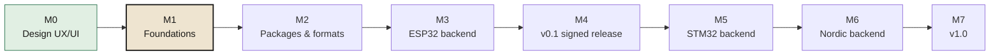

# Roadmap

Milestones, in order. Each one ends with something that runs.

| # | Milestone | Done when | Status |
|---|---|---|---|
| **M0** | **Design UX/UI**: 15 screens, visual language, UX decisions | Mockups validated | ✅ First pass done. Second pass later (user tests, onboarding, multi-board, English copy) |
| **M1** | **Foundations**: Rust workspace, `FlashBackend` trait, Tauri shell, UI built from the mockups, CI on 3 OSes | App builds and runs on Windows, macOS and Linux in CI with a mock backend simulating a flash | ⏭️ Next |
| **M2** | **Packages & formats**: discovery, watched folders, zip, `flasher_args.json`, partition tables, Arduino/PlatformIO, HEX/ELF, naming, validation, instructions panel | Real ESP-IDF, Arduino and PlatformIO outputs are recognised and resolved (with the mock backend) | |
| **M3** | **ESP32 backend**: `espflash` integration, detection, download-mode help, Windows driver guidance | ESP32, S3 and C3 flashed in Simple and Expert mode on Windows and macOS | |
| **M4** | **v0.1 signed release**: SignPath signing, portable exe, AppImage, release pipeline, user docs | A non-technical person flashes an ESP32 package on a clean Windows machine without a blocking warning | |
| **M5** | **STM32 backend**: `probe-rs` (ST-Link, J-Link, CMSIS-DAP), USB DFU, RDP detection | F0/F4/G0/L4 flashed via ST-Link, plus one board via DFU | |
| **M6** | **Nordic backend**: `probe-rs` via DK J-Link, nRF Util fallback, install assistant | nRF52840 DK and an external board via DK flashed, locked chip recovered | |
| **M7** | **v1.0**: field tests, error help centre, report export, FR/EN, hardware regression bench, size/start-up targets | < 15 MB, < 1 s start-up, no known blocker for non-technical users | |

**After 1.0 (ideas, not commitments):** headless CLI for production lines, flashing several boards in parallel, RP2040/RP2350, more probe-rs targets.

Detailed milestone contents are tracked in the project's Linear workspace. This page is the public summary.
