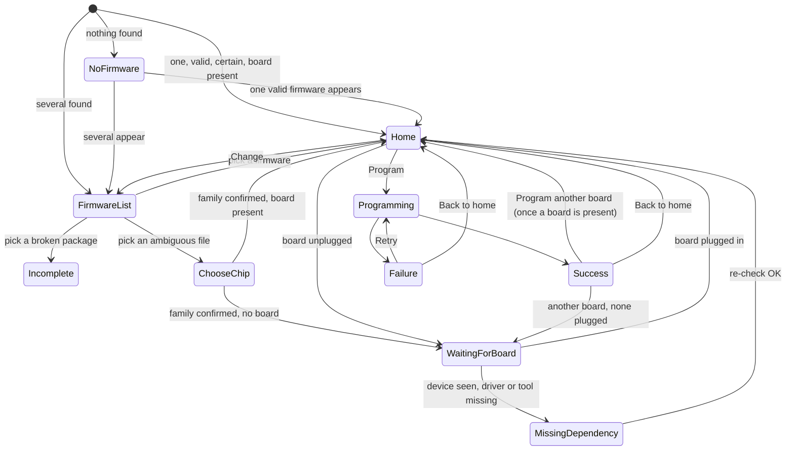
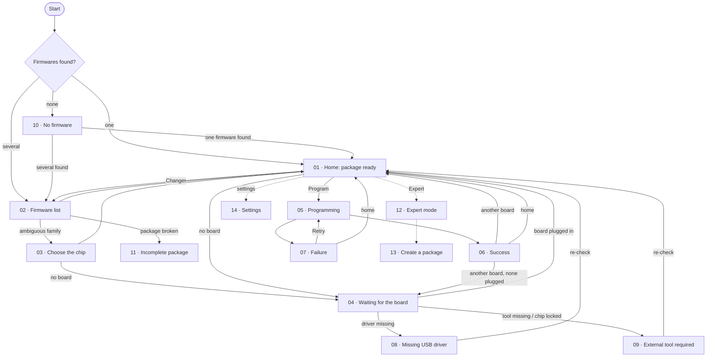

# Plan 3a · Simple Mode: Foundation and Nominal Path Implementation Plan

> **For agentic workers:** REQUIRED SUB-SKILL: Use superpowers:subagent-driven-development (recommended) or superpowers:executing-plans to implement this plan task-by-task. Steps use checkbox (`- [ ]`) syntax for tracking.

**Goal:** The app shows Simple-mode screens 01, 02, 03, 05, 06 and 07 of the mockups. The screen is derived from what the Rust side reports (a snapshot of firmwares, boards and problems), the user's choices and the flash job. The facts come from eight simulated scenarios shared by the Rust mock and the browser preview. Screens 04, 08, 09, 10 and 11 are reachable and show a provisional screen until plan 3b.

**Architecture:** `flashr-core` gains a `Snapshot` model, scenario files (`crates/flashr-core/scenarios/*.json`) and a `SimulatedWorld` that walks through a scenario's stages on triggers. The Tauri shell exposes `snapshot`, `flash`, `recheck`, `add_folder`, `open_file` and emits `snapshot-changed`. The UI keeps `Choices` and the flash job, and a pure `screenOf(snapshot, choices, job)` picks the screen. The browser preview runs a TypeScript port of `SimulatedWorld` on the same JSON files.

**Tech Stack:** Rust 2024 (serde, thiserror) · Tauri 2.11 (`Emitter`, channels) · Svelte 5 (runes) · TypeScript 6 · Vite 8 · Vitest 5 + jsdom + @testing-library/svelte. No new runtime dependency.

**Spec:** [docs/superpowers/specs/2026-10-01-simple-mode-screens-design.md](../specs/2026-10-01-simple-mode-screens-design.md) (snapshot, IPC, scenarios, `screenOf`, job, report, screens, decisions D1–D10). Background: [plan 2](2026-09-27-plan-2-design-system.md) and its spec, [architecture.md](../../architecture.md#application-states), [ux-design.md](../../ux-design.md), the "Chip Flashr — Écrans" design artifact (pages `Main`, `Firmwares`, `ChoixPuce`, `Flash`, `Succes`, `Echec`), the mockups in `docs/assets/screens/`.

## Global Constraints

- Everything from plans 1 and 2 still holds: Rust edition 2024, `rust-version = "1.88"`, `cargo fmt` and `cargo clippy --workspace --all-targets -- -D warnings` clean; `@tauri-apps/api` and `@tauri-apps/cli` on `~2.11`, `typescript` on `^6`; `pnpm check` (`svelte-check --fail-on-warnings`) clean.
- Colours, shadows and radii only through the `--cf-*` tokens of `app/src/styles/tokens.css`. A value the artifact uses that has no token stays literal in its component, with the artifact as its source, as in plan 2.
- Every visible string comes from `app/src/lib/i18n/fr.ts` and `en.ts`, which keep exactly the same keys (the plan-2 parity test). French copy is the artifact's, with `’` (U+2019) for apostrophes as in `fr.ts`.
- Rust sends no user-facing sentence. Check results, issues and errors travel as codes and parameters; download titles, URLs, chip ids, file names and labels are data.
- Scenario JSON files are **canonical**: every field present, `null` for an absent optional value, so the TypeScript preview reads them without normalising. A Rust test enforces it.
- No user folder path in the report (spec "The report").
- Accessibility as in plan 2: real buttons, `aria-pressed` on toggles, `aria-label` on icon-only buttons, the 2 px focus ring, no animation under `prefers-reduced-motion`.
- Version control with **GitButler** (`but`), conventional commits, implementation branch **`feat/simple-mode-foundation`**. Never `git add` / `git commit`. One commit per task, with only that task's files.
- Deferred on purpose (spec "Out of scope"): screens 04, 08, 09, 10, 11 (plan 3b), real packages, pickers, Markdown and report files (plan 4), Expert mode (plan 5), real boards (plan 6).

## Review Focus

1. **A fact that changes under the user's feet**: a board unplugged on 01 or 03, the picked firmware disappearing from the snapshot, a scenario stage changing while the list is open. The screen follows, nothing freezes. (Task 6 table, Task 15 scenario tests.)
2. **"Programmer une autre carte" never flashes a board it hasn't seen arrive**, and the session counter counts each success once. (Task 6, Task 15.)
3. **Rust and preview agree**: the same scenario gives the same snapshots in both, because both read the same canonical files. (Task 2 canonical test, Task 5 preview tests.)
4. **Late or duplicate events**: progress after cancel or failure, a second Programmer press, a delay timer firing after the stage already moved. (Tasks 3, 4, 7, 15.)
5. **English shows no French**, including text built from snapshot data (chip names, folder kinds, check codes, causes). (Task 8 parity, Task 15.)

---

## Task order

Run the tasks in this order: 1, 2, 3, 4, 5, 6, 7, 8, **8b**, 9, 10, 11, 12, 13, 14, 15, 16. Task 8b (the report) needs Task 8's keys and formatters, and Task 8 imports `StepKind` from Task 7, so the report sits between them. Task 5 imports the scenario JSON files that Task 2 writes, so Task 5 starts after Task 2; Tasks 3–4 (Rust) may overlap with 5–7 (TypeScript), they touch disjoint files. After Task 4 and until Task 5 lands, `pnpm tauri dev` reports an IPC error because the UI still calls the removed `list_targets` / `flash_demo` (the browser preview keeps working). Once Task 9 is in, Task 11 can run in parallel with Task 10; Task 12 runs after Task 10, because `StepList` imports `StatusBubble`.

---

## File Structure

```text
crates/flashr-core/
├── Cargo.toml                         # + serde_json as a normal dependency (Task 2: scenarios are parsed at runtime)
├── scenarios/                         # canonical JSON, one file per scenario (Task 2)
│   ├── default.json, single.json, no-firmware.json, ambiguous-hex.json,
│   └── waiting-board.json, driver-missing.json, nordic-locked.json, incomplete.json
└── src/
    ├── lib.rs                         # + mod snapshot, scenario, world; re-exports (Tasks 1–3)
    ├── snapshot.rs                    # Snapshot and every type inside it (Task 1)
    ├── target.rs                      # Target gains chip/port/link/flash_size, Link; FlashReport gains log (Task 1)
    ├── error.rs                       # UserFacingError gains phase/percent (Task 1)
    ├── progress.rs                    # Phase gains Deserialize (Task 1)
    ├── scenario.rs                    # Scenario, Stage, Transition, Trigger, loading, fallback (Task 2)
    ├── world.rs                       # SimulatedWorld, plan_for (Task 3)
    └── mock.rs                        # MockBackend writes log lines; demo_plan removed (Task 3)

app/src-tauri/
├── capabilities/default.json          # unchanged (core:default already allows events)
└── src/
    ├── lib.rs                         # commands registered, AppInfo gains scenario fields, setup starts timers (Task 4)
    ├── state.rs                       # AppState: mock + world + warning + jobs (Task 4)
    ├── world.rs                       # emit_snapshot, schedule_delay (Task 4)
    ├── commands.rs                    # snapshot, flash, cancel_flash, recheck, add_folder, open_file (Task 4)
    └── jobs.rs                        # run_flash_job attaches phase/percent to failures (Task 4)

app/
├── vite.config.ts                     # server.fs.allow the repo root, for the scenario JSON (Task 5)
└── src/
    ├── App.svelte, App.test.ts        # rewritten: snapshot, choices, screenOf, screens (Task 15)
    ├── lib/types.ts                   # mirrors every Rust type (Task 5)
    ├── lib/ipc.ts, ipc.test.ts        # Backend: snapshot/onSnapshot/flash/recheck/addFolder/openFile (Task 5)
    ├── lib/preview/
    │   ├── scenarios.ts               # imports the 8 JSON files, resolveScenario (Task 5)
    │   ├── simulatedWorld.ts (+ .test.ts)   # TS port of SimulatedWorld (Task 5)
    │   └── previewBackend.ts (+ .test.ts)   # rewritten on the simulated world (Task 5)
    ├── lib/app/
    │   ├── screen.ts (+ .test.ts)     # Choices, screenOf and the current-firmware helpers (Task 6)
    │   ├── firmware.ts (+ .test.ts)   # display helpers: title, tile mark, family counts, filters (Task 6)
    │   ├── fixtures.ts                # test fixtures: firmware(), target(), snapshot() (Task 5)
    │   └── report.ts (+ .test.ts)     # buildReport (Task 8b, after Task 8)
    ├── lib/flashState.ts (+ .test.ts) # job with steps, remaining time, estimate (Task 7)
    ├── lib/i18n/fr.ts, en.ts, format.ts, i18n.test.ts   # new keys and formatters (Task 8)
    ├── lib/targets.ts (+ .test.ts)    # boardName kept, pillText and linkText added (Task 8)
    ├── lib/components/                # Tag, Callout, Pill, StatusDot, tones, FamilySelector adjusted (Task 9)
    │   ├── FirmwareCard, ImageChip, FirmwareStrip, BoardCard, StatusBubble, StatTile, CauseList, LinkButton (Task 10)
    │   ├── FirmwareRow, FolderGroupHeader, FilterChips, SearchField (Task 11)
    │   └── StepList (Task 12)         # each with tests in components.test.ts / firmware.test.ts / list.test.ts / steps.test.ts
    ├── lib/shell/InstructionsPanel.svelte, StatusBar.svelte   # empty state; folder note (Task 9)
    ├── lib/screens/
    │   ├── HomeScreen, FirmwareListScreen, ChooseChipScreen (Task 13)
    │   ├── ProgrammingScreen, SuccessScreen, FailureScreen (Task 14)
    │   ├── ProvisionalScreen.svelte   # stand-in for 04, 08, 09, 10, 11 (Task 10)
    │   └── screens.test.ts            # (Tasks 13, 14)
    └── lib/demo/DemoFlow.svelte       # deleted (Task 15)
```

## Shared contracts

Every task implements or consumes these names exactly. When a task needs something that is not here, it adds it inside its own files and does not rename anything below.

### Rust: `flashr-core`

All new types derive `Debug, Clone, PartialEq, Eq, Serialize, Deserialize`. Structs use `#[serde(rename_all = "camelCase")]`. **No `skip_serializing_if`**: `Option` serializes as `null`. No `#[serde(default)]` either: scenario files are canonical, so a missing field is an error.

```rust
// snapshot.rs
pub struct Snapshot {
    pub folders: Vec<WatchedFolder>,
    pub firmwares: Vec<FirmwareSummary>,
    pub targets: Vec<Target>,
    pub issues: Vec<DeviceIssue>,
}
pub struct WatchedFolder { pub path: String, pub kind: FolderKind }

#[serde(rename_all = "kebab-case")] pub enum FolderKind { App, Watched }
#[serde(rename_all = "kebab-case")]
pub enum SourceKind { EspIdfBuild, Arduino, PlatformIo, Elf, Hex, Bin, FileName }
// wire: "esp-idf-build" "arduino" "platform-io" "elf" "hex" "bin" "file-name"

pub struct ImageEntry { pub address: u32, pub name: String, pub size: u64 }

#[serde(tag = "kind", rename_all = "kebab-case", rename_all_fields = "camelCase")]
pub enum FamilyGuess {
    Certain { family: Family },
    Suggested { family: Family, reason: GuessReason },
    Unknown,
}
#[serde(tag = "kind", rename_all = "kebab-case", rename_all_fields = "camelCase")]
pub enum GuessReason { StartAddress { address: u32 }, FileName }

#[serde(rename_all = "kebab-case")] pub enum CheckStatus { Ok, Warning, Error }
#[serde(rename_all = "kebab-case")]
pub enum CheckCode { ManifestRead, FilePresent, FileMissing, NonstandardName }
pub struct Check { pub status: CheckStatus, pub code: CheckCode, pub params: BTreeMap<String, String> }
// params per code (all values are strings):
//   manifest-read     { manifest, chip, count }      e.g. { "manifest": "flasher_args.json", "chip": "esp32s3", "count": "4" }
//   file-present      { file, address, size }        e.g. { "file": "bootloader.bin", "address": "0x0", "size": "21504" }
//   file-missing      { file, address, dir }         e.g. { "file": "partition-table.bin", "address": "0x8000", "dir": "partition_table/" }
//   nonstandard-name  {}

pub struct Readme { pub file_name: String }

pub struct FirmwareSummary {
    pub id: String,
    pub path: String,
    pub file_name: String,
    pub folder: usize,
    pub source: SourceKind,
    pub name: Option<String>,
    pub version: Option<String>,
    pub variant: Option<String>,
    pub chip: Option<String>,          // lower-case chip id: "esp32s3", "stm32f411", "nrf52840"
    pub family: FamilyGuess,
    pub toolchain: Option<String>,
    pub built_at: Option<String>,      // "2026-09-12T14:32:00", local time, no zone
    pub size_bytes: u64,
    pub address_ranges: u32,
    pub images: Vec<ImageEntry>,
    pub manifest: Option<String>,
    pub checks: Vec<Check>,
    pub readme: Option<Readme>,
}

#[serde(rename_all = "kebab-case")] pub enum LockKind { Approtect }
pub struct ToolStatus { pub name: String, pub installed: bool }
pub struct Download {
    pub title: String, pub publisher: String, pub version_hint: String,
    pub size_hint: Option<String>, pub url: String,
}
#[serde(tag = "kind", rename_all = "kebab-case", rename_all_fields = "camelCase")]
pub enum DeviceIssue {
    MissingDriver { family: Family, vendor: String, name: String, vid: u16, pid: u16,
                    download: Download, inf: Option<String> },
    MissingTool { family: Family, target_label: String, locked: Option<LockKind>,
                  tools: Vec<ToolStatus>, download: Download, install_command: Option<String> },
}
impl FirmwareSummary { pub fn is_invalid(&self) -> bool }            // any check with status Error
impl DeviceIssue { pub fn family(&self) -> Family }

// target.rs (existing structs, extended; Target now also derives Deserialize)
#[serde(tag = "kind", rename_all = "kebab-case", rename_all_fields = "camelCase")]
pub enum Link { UsbJtag, UsbSerial { bridge: String }, Probe { name: String } }
pub struct Target {
    pub id: String, pub family: Family, pub label: String,   // label = chip display name, "ESP32-S3"
    pub chip: Option<String>, pub port: String, pub link: Link, pub flash_size: Option<u32>,
}
pub struct FlashReport { pub bytes_written: u64, pub duration_ms: u64, pub verified: bool, pub log: Vec<String> }

// error.rs
pub struct UserFacingError {
    pub code: ErrorCode, pub technical: String,
    pub phase: Option<Phase>, pub percent: Option<u8>,
}
impl UserFacingError {
    pub fn new(code: ErrorCode, technical: impl Into<String>) -> Self;        // phase and percent None
    pub fn at(self, phase: Phase, percent: u8) -> Self;                        // sets both
}
// progress.rs: Phase also derives Deserialize (same tag = "kind", camelCase fields).

// scenario.rs
pub struct Scenario { pub name: String, pub stages: Vec<Stage> }
pub struct Stage { pub snapshot: Snapshot, pub next: Vec<Transition> }
pub struct Transition { pub on: Trigger, pub to: usize }
pub enum Trigger {                       // wire: "recheck" | "add-folder" | "open-file" | { "afterMs": 4000 }
    #[serde(rename = "recheck")] Recheck,
    #[serde(rename = "add-folder")] AddFolder,
    #[serde(rename = "open-file")] OpenFile,
    #[serde(rename = "afterMs")] AfterMs(u64),
}
pub const SCENARIO_NAMES: [&str; 8] = ["default", "single", "no-firmware", "ambiguous-hex",
                                       "waiting-board", "driver-missing", "nordic-locked", "incomplete"];
pub const DEFAULT_SCENARIO: &str = "default";
pub fn scenario_source(name: &str) -> Option<&'static str>;               // include_str! table
pub fn load_scenario(name: &str) -> Option<Scenario>;                     // parses; panics only in tests
/// Unknown or absent name → default; the warning names the unknown value.
pub fn resolve_scenario(requested: Option<&str>) -> (Scenario, Option<String>);
#[derive(Debug, thiserror::Error)] pub enum ScenarioError { … }          // used by Scenario::validate
impl Scenario { pub fn validate(&self) -> Result<(), ScenarioError> }      // ≥1 stage, every `to` in range

// world.rs
pub struct SimulatedWorld { /* scenario, stage, generation */ }
impl SimulatedWorld {
    pub fn new(scenario: Scenario) -> Self;
    pub fn scenario_name(&self) -> &str;
    pub fn snapshot(&self) -> &Snapshot;
    pub fn generation(&self) -> u64;                       // +1 on every stage change
    /// Follows the first transition whose `on` equals `trigger` (never AfterMs). Returns true if the stage changed.
    pub fn trigger(&mut self, trigger: &Trigger) -> bool;
    /// The current stage's first AfterMs transition, as milliseconds.
    pub fn pending_delay(&self) -> Option<u64>;
    /// Follows that AfterMs transition, only if `generation` is still current. Returns true if the stage changed.
    pub fn elapse(&mut self, generation: u64) -> bool;
    pub fn firmware(&self, id: &str) -> Option<&FirmwareSummary>;
    pub fn target(&self, id: &str) -> Option<&Target>;
}
/// One region per image, filled with 0xFF, `chip` copied from the firmware.
pub fn plan_for(firmware: &FirmwareSummary, family: Family) -> FlashPlan;
```

`lib.rs` re-exports every public name above. `demo_plan` is removed. `MockBackend` keeps its fields (`chunk_delay`, `fail_at_percent`) and `MockBackend::target(family)` (now with `port: "mock"`, `link: Link::UsbJtag`, `chip: None`, `flash_size: Some(8 MiB)`); its `flash` fills `FlashReport::log` with one line per phase (`connect {target.label}`, `write {address:#x} {label} {len} B`, `verify ok`, `reset`) and its simulated failure becomes `FlashError::Device(format!("write block {n}/{m} @ {addr:#010x}\nerror: simulated disconnect"))`.

### Rust: Tauri shell

```rust
// lib.rs
pub struct AppInfo { pub name: &'static str, pub version: &'static str,
                     pub scenario: Option<String>, pub scenario_warning: Option<String> }   // camelCase on the wire
// state.rs
pub struct AppState {
    pub mock: Arc<MockBackend>,
    pub world: Arc<Mutex<SimulatedWorld>>,
    pub scenario_warning: Option<String>,
    pub jobs: Arc<JobSlot>,
}
impl AppState { pub fn from_env() -> Self }   // CHIP_FLASHR_SCENARIO, CHIP_FLASHR_MOCK_FAIL_AT
pub fn mock_from_env(fail_at: Option<&str>) -> MockBackend;   // unchanged
// world.rs
pub const SNAPSHOT_EVENT: &str = "snapshot-changed";
pub fn emit_snapshot(app: &AppHandle, world: &Mutex<SimulatedWorld>);
/// If the current stage has an AfterMs transition, sleep on a thread, then elapse(generation) and emit; repeats for the next stage.
pub fn schedule_delay(app: AppHandle, world: Arc<Mutex<SimulatedWorld>>);
// commands.rs (all #[tauri::command])
pub fn snapshot(state) -> Snapshot;
pub async fn flash(app: AppHandle, state, firmware_id: String, target_id: String,
                   family: Option<Family>, on_progress: Channel<ProgressEvent>) -> Result<FlashReport, UserFacingError>;
pub fn cancel_flash(state) -> bool;
pub fn recheck(app: AppHandle, state);  pub fn add_folder(app: AppHandle, state);  pub fn open_file(app: AppHandle, state);
// jobs.rs: run_flash_job keeps its signature; on Err it returns the error `.at(last phase, last percent)` when a progress event was seen.
```

`flash` errors: unknown firmware → `invalid-plan` (`technical: "unknown firmware `{id}`"`); unknown target → `target-not-found`; no family (guess not certain and `family` is `None`) → `invalid-plan`; target family ≠ plan family → `family-mismatch` (from the mock).

### TypeScript: types and backend

`app/src/lib/types.ts` mirrors the Rust wire format one to one (camelCase fields, kebab-case tags, `null` for `None`):

```ts
export type Family = 'esp32' | 'stm32' | 'nrf';
export type FolderKind = 'app' | 'watched';
export interface WatchedFolder { path: string; kind: FolderKind }
export type SourceKind = 'esp-idf-build' | 'arduino' | 'platform-io' | 'elf' | 'hex' | 'bin' | 'file-name';
export interface ImageEntry { address: number; name: string; size: number }
export type GuessReason = { kind: 'start-address'; address: number } | { kind: 'file-name' };
export type FamilyGuess =
  | { kind: 'certain'; family: Family }
  | { kind: 'suggested'; family: Family; reason: GuessReason }
  | { kind: 'unknown' };
export type CheckStatus = 'ok' | 'warning' | 'error';
export type CheckCode = 'manifest-read' | 'file-present' | 'file-missing' | 'nonstandard-name';
export interface Check { status: CheckStatus; code: CheckCode; params: Record<string, string> }
export interface Readme { fileName: string }
export interface FirmwareSummary {
  id: string; path: string; fileName: string; folder: number; source: SourceKind;
  name: string | null; version: string | null; variant: string | null; chip: string | null;
  family: FamilyGuess; toolchain: string | null; builtAt: string | null;
  sizeBytes: number; addressRanges: number; images: ImageEntry[]; manifest: string | null;
  checks: Check[]; readme: Readme | null;
}
export type Link = { kind: 'usb-jtag' } | { kind: 'usb-serial'; bridge: string } | { kind: 'probe'; name: string };
export interface Target {
  id: string; family: Family; label: string; chip: string | null; port: string; link: Link; flashSize: number | null;
}
export type LockKind = 'approtect';
export interface ToolStatus { name: string; installed: boolean }
export interface Download { title: string; publisher: string; versionHint: string; sizeHint: string | null; url: string }
export type DeviceIssue =
  | { kind: 'missing-driver'; family: Family; vendor: string; name: string; vid: number; pid: number;
      download: Download; inf: string | null }
  | { kind: 'missing-tool'; family: Family; targetLabel: string; locked: LockKind | null;
      tools: ToolStatus[]; download: Download; installCommand: string | null };
export interface Snapshot { folders: WatchedFolder[]; firmwares: FirmwareSummary[]; targets: Target[]; issues: DeviceIssue[] }
export type Trigger = 'recheck' | 'add-folder' | 'open-file' | { afterMs: number };
export interface Transition { on: Trigger; to: number }
export interface Stage { snapshot: Snapshot; next: Transition[] }
export interface Scenario { name: string; stages: Stage[] }
// existing, extended:
export type Phase = /* unchanged */;
export interface ProgressEvent { phase: Phase; bytesDone: number; bytesTotal: number }
export interface FlashReport { bytesWritten: number; durationMs: number; verified: boolean; log: string[] }
export type ErrorCode = /* unchanged six codes */;
export interface UserFacingError { code: ErrorCode; technical: string; phase: Phase | null; percent: number | null }
export interface AppInfo { name: string; version: string; scenario: string | null; scenarioWarning: string | null }
export interface FlashRequest { firmwareId: string; targetId: string; family: Family | null }
```

`app/src/lib/ipc.ts`:

```ts
export interface Backend {
  appInfo(): Promise<AppInfo>;
  snapshot(): Promise<Snapshot>;
  /** Called with every later snapshot. Returns an unsubscribe function. */
  onSnapshot(listener: (snapshot: Snapshot) => void): () => void;
  /** Rejects with a UserFacingError. */
  flash(request: FlashRequest, onProgress: (event: ProgressEvent) => void): Promise<FlashReport>;
  cancelFlash(): Promise<boolean>;
  recheck(): Promise<void>;
  addFolder(): Promise<void>;
  openFile(): Promise<void>;
}
export const tauriBackend: Backend;    // invoke('snapshot'|'flash'|…), listen('snapshot-changed')
export function pickBackend(): Backend; // unchanged rule
```

`app/src/lib/preview/`:

```ts
// scenarios.ts
export const SCENARIOS: Record<string, Scenario>;          // the 8 JSON files, keyed by name
export const DEFAULT_SCENARIO = 'default';
export function resolveScenario(requested: string | null): { scenario: Scenario; warning: string | null };
// simulatedWorld.ts — same semantics as the Rust SimulatedWorld
export interface SimulatedWorld {
  scenarioName(): string; snapshot(): Snapshot; generation(): number;
  trigger(trigger: 'recheck' | 'add-folder' | 'open-file'): boolean;
  pendingDelay(): number | null; elapse(generation: number): boolean;
}
export function createSimulatedWorld(scenario: Scenario): SimulatedWorld;
// previewBackend.ts
export interface PreviewOptions { chunkDelayMs: number; failAtPercent: number | null; scenario: string | null }
export const PREVIEW_DEFAULTS: PreviewOptions;             // { chunkDelayMs: 15, failAtPercent: null, scenario: null }
export function previewOptionsFromSearch(search: string): PreviewOptions;   // ?failAt= and ?scenario=
export function createPreviewBackend(options: PreviewOptions): Backend;     // timers drive AfterMs stages
```

### TypeScript: app logic

```ts
// lib/app/screen.ts
export type ProvisionalId = 'waiting-board' | 'missing-driver' | 'external-tool' | 'no-firmware' | 'incomplete';
export type ScreenId = 'loading' | 'home' | 'firmware-list' | 'choose-chip' | 'programming' | 'success' | 'failure' | ProvisionalId;
export interface Choices {
  firmwareId: string | null; families: Record<string, Family>; browsing: boolean; boardsThisSession: number;
}
export const INITIAL_CHOICES: Choices;   // { firmwareId: null, families: {}, browsing: false, boardsThisSession: 0 }
export function currentFirmware(snapshot: Snapshot, choices: Choices): FirmwareSummary | null;
export function familyOf(firmware: FirmwareSummary, choices: Choices): Family | null;   // certain, else confirmed
export function isInvalid(firmware: FirmwareSummary): boolean;
export function currentTarget(snapshot: Snapshot, family: Family | null): Target | null;   // first of that family
export function currentIssue(snapshot: Snapshot, family: Family | null): DeviceIssue | null;
export function screenOf(snapshot: Snapshot | null, choices: Choices, job: FlashState): ScreenId;   // null → 'loading'

// lib/app/firmware.ts
export function firmwareTitle(firmware: FirmwareSummary): string;          // name ?? fileName
export function tileMark(family: Family | null, firmware?: FirmwareSummary): string;   // 'ESP' 'STM' 'nRF' 'HEX' '?'
export type FirmwareFilter = 'all' | Family | 'unidentified';
export function filterFirmwares(list: FirmwareSummary[], filter: FirmwareFilter, query: string): FirmwareSummary[];
export function filterCounts(list: FirmwareSummary[]): Record<FirmwareFilter, number>;

// lib/flashState.ts (replaces the plan-2 shape; same file)
export type StepKind = 'connecting' | 'erasing' | 'writing' | 'verifying' | 'resetting';
export type StepStatus = 'pending' | 'active' | 'done';
export interface Step { kind: StepKind; image: ImageEntry | null; index: number | null; count: number | null;
                        status: StepStatus; startedAt: number | null; durationMs: number | null }
export type FlashState =
  | { status: 'idle' }
  | { status: 'flashing'; request: FlashRequest; images: ImageEntry[]; steps: Step[]; percent: number;
      phase: Phase | null; bytesDone: number; bytesTotal: number; writeStartedAt: number | null;
      remainingMs: number | null }
  | { status: 'success'; request: FlashRequest; images: ImageEntry[]; steps: Step[]; report: FlashReport }
  | { status: 'failure'; request: FlashRequest; images: ImageEntry[]; steps: Step[]; error: UserFacingError };
export type FlashAction =
  | { type: 'start'; request: FlashRequest; images: ImageEntry[]; at: number }
  | { type: 'progress'; event: ProgressEvent; at: number }
  | { type: 'success'; report: FlashReport; at: number }
  | { type: 'failure'; error: UserFacingError; at: number }
  | { type: 'reset' };
export const THROUGHPUT_BYTES_PER_S = 150 * 1024;
export function percentOf(event: ProgressEvent): number;                    // kept from plan 2
export function initialSteps(images: ImageEntry[]): Step[];                 // connecting, erasing, one writing per image, verifying, resetting
export function estimateMs(totalBytes: number): number;                     // at THROUGHPUT, rounded up to 5 s, at least 5 s
export function imageProgress(state: FlashState): { index: number; percent: number } | null;
export function flashReducer(state: FlashState, action: FlashAction): FlashState;
export function toUserFacingError(error: unknown): UserFacingError;        // kept; fills phase/percent with null when absent

// lib/app/report.ts (Task 8b, run after Task 8)
export interface ReportInput {
  info: AppInfo; firmware: FirmwareSummary; folder: WatchedFolder | null; target: Target | null;
  job: Extract<FlashState, { status: 'success' | 'failure' }>; now: Date;
}
export function buildReport(input: ReportInput, m: Messages, locale: Locale): string;
```

### TypeScript: i18n and formatters

`format.ts` gains pure formatters (Task 8), used everywhere instead of ad-hoc formatting:

```ts
export function chipName(chip: string): string;                  // "esp32s3"→"ESP32-S3", "esp32c3"→"ESP32-C3", "esp32"→"ESP32", "stm32f411"→"STM32F411", "nrf52840"→"nRF52840"
export function formatAddress(address: number): string;          // "0x0", "0x8000", "0xD000", "0x10000" (upper-case digits, lower-case 0x)
export function formatSize(bytes: number, locale: Locale, m: Messages): string;   // < 1 MiB: whole KiB "21 Ko"; else one decimal MiB "1,1 Mo"
export function formatDuration(ms: number, locale: Locale): string;                 // < 10 s: one decimal "0,8 s"; else whole "23 s"
export function formatDate(iso: string, locale: Locale): string;                    // "12/09/2026" / "09/12/2026"
export function formatTime(iso: string, locale: Locale): string;                    // "14:32" / "2:32 PM"
export function stepLabel(step: Step, m: Messages): string;                         // steps.* text of one step (Step from ../flashState)
// kept: formatPercent; phaseLabel, formatSeconds, formatKib stay until Task 15 deletes them with the demo flow
```

New and changed dictionary keys (names and parameters fixed here; Task 8 writes the copy, French from the artifact, English translated):

```ts
board: {
  simulated(chip: string): string;                 // kept
  connected(name: string): string;                 // kept
  connection(port: string, link: string, flash: string | null): string;   // "Port COM4 · USB-JTAG intégré · flash 8 Mo"
  link: { usbJtag: string; usbSerial(bridge: string): string; probe(name: string): string };
  flash(size: string): string;                     // "flash 8 Mo"
  waitingFamily: string; waitingFamilyNote: string;
  refresh: string;                                 // "Rechercher à nouveau les cartes"
}                                                  // demoNote removed
pill: { board(chip: string, port: string): string; busy(chip: string): string; error(chip: string): string;
        missingDriver: string; locked(chip: string): string }      // "Aucune carte" stays topbar.noBoard
firmware: {
  label: string; change: string; changeCount(count: number): string;
  noVersion: string; noVersionInfo: string; ranges(count: number): string;
  builtAt(date: string, time: string): string; manifest(count: number): string; details: string;
  source: Record<SourceKind, string>;
}
families: { …kept; detected: string; toChoose: string; suggested: string;
            reason: { startAddress(address: string, family: string): string; fileName(family: string): string } }
home: { program: string; estimate(duration: string): string; chooseFirst: string }
list: { title: string; summary(count: number, folders: number): string; search: string; searchLabel: string;
        all: string; unidentified: string; needsFamily: string; folderApp: string; folderWatched: string;
        addFolder: string; openFile: string; empty: string; filtersLabel: string }
progress: { …kept; remaining(duration: string): string; stepsLabel: string; fileBarLabel(name: string): string }
steps: { connecting: string; erasing: string; writing(index: number, count: number, name: string): string;
         verifying: string; resetting: string; done: string; active: string; pending: string }
success: { title: string; body(firmware: string, chip: string, port: string): string; verification: string;
           verified: string; notVerified: string; duration: string; sessionBoards: string;
           again: string; report: string; home: string; copied: string }   // size removed
failure: { details: string; retry: string; export: string; copied: string; home: string; causesTitle: string;
           at(step: string, percent: string): string; stepNoun: Record<StepKind, string> }
errors: Record<ErrorCode, { title: string; explanation(at: string | null): string; causes: { title: string; detail: string }[] }>
report: { heading: string; app(version: string): string; date(date: string, time: string): string;
          simulated(scenario: string): string; firmware(name: string, version: string | null): string;
          file(fileName: string, folder: string): string; image(address: string, name: string, size: string): string;
          target(label: string, port: string): string; noTarget: string; step(label: string, duration: string): string;
          success: string; failure(title: string): string; technical: string }
provisional: { title: Record<ProvisionalId, string>; body: string; recheck: string }
instructions: { …kept; empty: { title: string; body: string } }
status: { watching(paths: string): string; appFolder: string; simulated(scenario: string): string;
          unknownScenario(name: string): string }     // status.demo removed
units: { kib: string; mib: string }
```

`demo` is removed. `lib/targets.ts` keeps `boardName` and adds `pillText(screen: ScreenId, target: Target | null, issue: DeviceIssue | null, m: Messages): { tone: Tone; text: string | null; breathe: boolean }`, following the spec's pill table, and `linkText(link: Link, m: Messages): string` (the `board.link.*` text, used by `BoardCard` and the report) (Task 8).

### Svelte components (props)

```ts
// adjusted (Task 9)
StatusDot  { tone: Tone; size?: number; breathe?: boolean }               // Tone gains 'busy' (ink)
Pill       { tone: Tone; breathe?: boolean; children }                    // 'busy' supported
Tag        { mono?: boolean; tone?: 'neutral' | 'warn'; children }
Callout    { tone?: 'warning' | 'info'; icon?: IconName; children }      // icon overrides the tone's icon
FamilySelector { value: Family | null; disabled?: boolean; ambiguous?: boolean; suggested?: Family | null;
                 onchange: (family: Family) => void }
InstructionsPanel { open: boolean; empty: boolean; ontoggle: () => void }
StatusBar  { note: string; warning?: string | null; version: string | null }
// new (Tasks 10–12)
FirmwareCard   { firmware: FirmwareSummary; family: Family | null; variant: 'full' | 'minimal';
                 available: number; onchange: () => void; ondetails?: () => void }
ImageChip      { image: ImageEntry }
FirmwareStrip  { firmware: FirmwareSummary; family: Family | null; detail: string; onchange?: () => void }
BoardCard      { state: 'connected' | 'waiting'; target: Target | null; onrefresh?: () => void }
StatusBubble   { status: 'ok' | 'error' | 'warning' | 'active' | 'pending'; label: string; size?: 26 | 28 }
StatTile       { label: string; value: string }
CauseList      { title: string; causes: readonly { title: string; detail: string }[] }
ProvisionalScreen { screen: ProvisionalId; onchange?: () => void; onrecheck?: () => void;
                    onaddfolder?: () => void; onopenfile?: () => void }
FirmwareRow    { firmware: FirmwareSummary; selected: boolean; onselect: () => void }
FolderGroupHeader { folder: WatchedFolder }
FilterChips    { options: readonly { value: string; label: string; count: number }[]; value: string;
                 label: string; onchange: (value: string) => void }
SearchField    { value: string; label: string; placeholder: string; oninput: (value: string) => void }
StepList       { steps: readonly Step[]; current: { index: number; percent: number } | null }
// screens (Tasks 13–14), all in lib/screens/
HomeScreen          { snapshot: Snapshot; firmware: FirmwareSummary; family: Family; target: Target;
                      onprogram: () => void; onchange: () => void; ondetails: () => void; onrefresh: () => void }
FirmwareListScreen  { snapshot: Snapshot; selectedId: string | null; onselect: (id: string) => void;
                      onaddfolder: () => void; onopenfile: () => void }
ChooseChipScreen    { snapshot: Snapshot; firmware: FirmwareSummary; onfamily: (family: Family) => void; onchange: () => void }
ProgrammingScreen   { firmware: FirmwareSummary; target: Target | null; job: Extract<FlashState, { status: 'flashing' }>; oncancel: () => void }
SuccessScreen       { firmware: FirmwareSummary; target: Target | null; job: Extract<FlashState, { status: 'success' }>;
                      boardsThisSession: number; onagain: () => void; onreport: () => Promise<void>; onhome: () => void }
FailureScreen       { firmware: FirmwareSummary; job: Extract<FlashState, { status: 'failure' }>;
                      onretry: () => void; onexport: () => Promise<void>; onhome: () => void }
```

---

### Task 1: Snapshot model and extended core types

**Files:**
- Create: `crates/flashr-core/src/snapshot.rs`
- Modify: `crates/flashr-core/src/lib.rs` (replace), `crates/flashr-core/src/target.rs`, `crates/flashr-core/src/error.rs`, `crates/flashr-core/src/progress.rs`, `crates/flashr-core/src/mock.rs`

**Interfaces:**
- Consumes: plan-1 `Family`, `Phase`, `FlashError`, `MockBackend`.
- Produces:
  - `snapshot.rs`: `Snapshot`, `WatchedFolder`, `FolderKind`, `SourceKind`, `ImageEntry`, `FamilyGuess`, `GuessReason`, `CheckStatus`, `CheckCode`, `Check`, `Readme`, `FirmwareSummary` (+ `is_invalid()`), `LockKind`, `ToolStatus`, `Download`, `DeviceIssue` (+ `family()`), all `Serialize + Deserialize`, exactly as in the shared contracts.
  - `target.rs`: `Link`; `Target` gains `chip`, `port`, `link`, `flash_size` and derives `Deserialize`; `FlashReport` gains `log`.
  - `error.rs`: `UserFacingError` gains `phase: Option<Phase>`, `percent: Option<u8>` and `at(phase, percent)`.
  - `progress.rs`: `Phase` derives `Deserialize`.
  - Wire format (what the TypeScript `types.ts` mirrors): camelCase fields, kebab-case tags under `"kind"`, `null` for `None`. Examples are in the tests below and are binding for Task 5.

Every struct carries `deny_unknown_fields`, and the tagged enums too: a scenario file with a typo fails to load instead of being silently ignored. Serde still reads a *missing* `Option` field as `None`; that is why Task 2 proves the files canonical by re-serializing them rather than by relying on deserialization errors.

- [ ] **Step 1: Write the failing tests**

Create `crates/flashr-core/src/snapshot.rs` with only its test module for now:

```rust
#[cfg(test)]
mod tests {
    use super::*;
    use crate::Link;
    use serde_json::json;

    fn params(pairs: &[(&str, &str)]) -> BTreeMap<String, String> {
        pairs
            .iter()
            .map(|(k, v)| (k.to_string(), v.to_string()))
            .collect()
    }

    fn check(status: CheckStatus, code: CheckCode) -> Check {
        Check {
            status,
            code,
            params: BTreeMap::new(),
        }
    }

    fn hex_firmware() -> FirmwareSummary {
        FirmwareSummary {
            id: "firmware-hex".into(),
            path: "D:\\Firmwares\\firmware.hex".into(),
            file_name: "firmware.hex".into(),
            folder: 1,
            source: SourceKind::Hex,
            name: None,
            version: None,
            variant: None,
            chip: None,
            family: FamilyGuess::Suggested {
                family: Family::Stm32,
                reason: GuessReason::StartAddress {
                    address: 0x0800_0000,
                },
            },
            toolchain: None,
            built_at: Some("2026-09-21T16:48:00".into()),
            size_bytes: 126_976,
            address_ranges: 1,
            images: vec![ImageEntry {
                address: 0x0800_0000,
                name: "firmware.hex".into(),
                size: 126_976,
            }],
            manifest: None,
            checks: vec![Check {
                status: CheckStatus::Ok,
                code: CheckCode::FilePresent,
                params: params(&[
                    ("file", "firmware.hex"),
                    ("address", "0x8000000"),
                    ("size", "126976"),
                ]),
            }],
            readme: Some(Readme {
                file_name: "LISEZMOI.md".into(),
            }),
        }
    }

    fn cp210x() -> DeviceIssue {
        DeviceIssue::MissingDriver {
            family: Family::Esp32,
            vendor: "Silicon Labs".into(),
            name: "CP210x".into(),
            vid: 0x10C4,
            pid: 0xEA60,
            download: Download {
                title: "CP210x Universal Windows Driver".into(),
                publisher: "Silicon Labs".into(),
                version_hint: "11.x".into(),
                size_hint: None,
                url: "https://www.silabs.com/developers/usb-to-uart-bridge-vcp-drivers".into(),
            },
            inf: Some("silabs-ser.inf".into()),
        }
    }

    fn nordic_lock() -> DeviceIssue {
        DeviceIssue::MissingTool {
            family: Family::Nrf,
            target_label: "nRF52840".into(),
            locked: Some(LockKind::Approtect),
            tools: vec![ToolStatus {
                name: "nRF Util · device".into(),
                installed: false,
            }],
            download: Download {
                title: "nRF Util".into(),
                publisher: "Nordic Semiconductor".into(),
                version_hint: "7.x".into(),
                size_hint: None,
                url: "https://www.nordicsemi.com/Products/Development-tools/nRF-Util".into(),
            },
            install_command: None,
        }
    }

    #[test]
    fn firmware_summary_wire_format() {
        assert_eq!(
            serde_json::to_value(hex_firmware()).unwrap(),
            json!({
                "id": "firmware-hex",
                "path": "D:\\Firmwares\\firmware.hex",
                "fileName": "firmware.hex",
                "folder": 1,
                "source": "hex",
                "name": null,
                "version": null,
                "variant": null,
                "chip": null,
                "family": {
                    "kind": "suggested",
                    "family": "stm32",
                    "reason": { "kind": "start-address", "address": 134217728 }
                },
                "toolchain": null,
                "builtAt": "2026-09-21T16:48:00",
                "sizeBytes": 126976,
                "addressRanges": 1,
                "images": [{ "address": 134217728, "name": "firmware.hex", "size": 126976 }],
                "manifest": null,
                "checks": [{
                    "status": "ok",
                    "code": "file-present",
                    "params": { "address": "0x8000000", "file": "firmware.hex", "size": "126976" }
                }],
                "readme": { "fileName": "LISEZMOI.md" }
            })
        );
    }

    #[test]
    fn family_guess_and_reason_wire_format() {
        let cases = [
            (
                FamilyGuess::Certain {
                    family: Family::Esp32,
                },
                json!({ "kind": "certain", "family": "esp32" }),
            ),
            (
                FamilyGuess::Suggested {
                    family: Family::Nrf,
                    reason: GuessReason::FileName,
                },
                json!({ "kind": "suggested", "family": "nrf", "reason": { "kind": "file-name" } }),
            ),
            (FamilyGuess::Unknown, json!({ "kind": "unknown" })),
        ];
        for (guess, wire) in cases {
            assert_eq!(serde_json::to_value(&guess).unwrap(), wire);
            assert_eq!(serde_json::from_value::<FamilyGuess>(wire).unwrap(), guess);
        }
    }

    #[test]
    fn unit_enums_use_kebab_case() {
        let sources = [
            (SourceKind::EspIdfBuild, "esp-idf-build"),
            (SourceKind::Arduino, "arduino"),
            (SourceKind::PlatformIo, "platform-io"),
            (SourceKind::Elf, "elf"),
            (SourceKind::Hex, "hex"),
            (SourceKind::Bin, "bin"),
            (SourceKind::FileName, "file-name"),
        ];
        for (source, wire) in sources {
            assert_eq!(serde_json::to_value(source).unwrap(), json!(wire));
        }
        let codes = [
            (CheckCode::ManifestRead, "manifest-read"),
            (CheckCode::FilePresent, "file-present"),
            (CheckCode::FileMissing, "file-missing"),
            (CheckCode::NonstandardName, "nonstandard-name"),
        ];
        for (code, wire) in codes {
            assert_eq!(serde_json::to_value(code).unwrap(), json!(wire));
        }
        assert_eq!(
            serde_json::to_value([CheckStatus::Ok, CheckStatus::Warning, CheckStatus::Error])
                .unwrap(),
            json!(["ok", "warning", "error"])
        );
        assert_eq!(
            serde_json::to_value([FolderKind::App, FolderKind::Watched]).unwrap(),
            json!(["app", "watched"])
        );
        assert_eq!(
            serde_json::to_value(LockKind::Approtect).unwrap(),
            json!("approtect")
        );
    }

    #[test]
    fn device_issue_wire_format() {
        assert_eq!(
            serde_json::to_value(cp210x()).unwrap(),
            json!({
                "kind": "missing-driver",
                "family": "esp32",
                "vendor": "Silicon Labs",
                "name": "CP210x",
                "vid": 4292,
                "pid": 60000,
                "download": {
                    "title": "CP210x Universal Windows Driver",
                    "publisher": "Silicon Labs",
                    "versionHint": "11.x",
                    "sizeHint": null,
                    "url": "https://www.silabs.com/developers/usb-to-uart-bridge-vcp-drivers"
                },
                "inf": "silabs-ser.inf"
            })
        );
        assert_eq!(
            serde_json::to_value(nordic_lock()).unwrap(),
            json!({
                "kind": "missing-tool",
                "family": "nrf",
                "targetLabel": "nRF52840",
                "locked": "approtect",
                "tools": [{ "name": "nRF Util · device", "installed": false }],
                "download": {
                    "title": "nRF Util",
                    "publisher": "Nordic Semiconductor",
                    "versionHint": "7.x",
                    "sizeHint": null,
                    "url": "https://www.nordicsemi.com/Products/Development-tools/nRF-Util"
                },
                "installCommand": null
            })
        );
    }

    #[test]
    fn snapshot_round_trips_through_json() {
        let snapshot = Snapshot {
            folders: vec![WatchedFolder {
                path: "D:\\Firmwares".into(),
                kind: FolderKind::Watched,
            }],
            firmwares: vec![hex_firmware()],
            targets: vec![Target {
                id: "mock:stm32f411:ST-Link".into(),
                family: Family::Stm32,
                label: "STM32F411".into(),
                chip: Some("stm32f411".into()),
                port: "ST-Link".into(),
                link: Link::Probe {
                    name: "ST-Link V3".into(),
                },
                flash_size: Some(524_288),
            }],
            issues: vec![cp210x(), nordic_lock()],
        };
        let wire = serde_json::to_value(&snapshot).unwrap();
        assert_eq!(
            wire["folders"],
            json!([{ "path": "D:\\Firmwares", "kind": "watched" }])
        );
        assert_eq!(serde_json::from_value::<Snapshot>(wire).unwrap(), snapshot);
    }

    #[test]
    fn a_missing_field_is_an_error() {
        let mut wire = serde_json::to_value(hex_firmware()).unwrap();
        wire.as_object_mut().unwrap().remove("sizeBytes");
        let err = serde_json::from_value::<FirmwareSummary>(wire).unwrap_err();
        assert!(
            err.to_string().contains("missing field `sizeBytes`"),
            "{err}"
        );
    }

    #[test]
    fn an_unknown_field_is_rejected() {
        let mut wire = serde_json::to_value(hex_firmware()).unwrap();
        wire["colour"] = json!("red");
        let err = serde_json::from_value::<FirmwareSummary>(wire).unwrap_err();
        assert!(err.to_string().contains("unknown field `colour`"), "{err}");

        let mut issue = serde_json::to_value(cp210x()).unwrap();
        issue["serial"] = json!("0001");
        assert!(serde_json::from_value::<DeviceIssue>(issue).is_err());
    }

    #[test]
    fn invalid_only_when_a_check_failed() {
        let mut firmware = hex_firmware();
        assert!(!firmware.is_invalid());
        firmware.checks = vec![
            check(CheckStatus::Ok, CheckCode::ManifestRead),
            check(CheckStatus::Warning, CheckCode::NonstandardName),
        ];
        assert!(!firmware.is_invalid());
        firmware
            .checks
            .push(check(CheckStatus::Error, CheckCode::FileMissing));
        assert!(firmware.is_invalid());
    }

    #[test]
    fn an_issue_knows_its_family() {
        assert_eq!(cp210x().family(), Family::Esp32);
        assert_eq!(nordic_lock().family(), Family::Nrf);
    }
}
```

In `crates/flashr-core/src/lib.rs`, add the module line after `pub mod progress;`:

```rust
pub mod snapshot;
```

In `crates/flashr-core/src/target.rs`, replace the whole `#[cfg(test)] mod tests { … }` block with:

```rust
#[cfg(test)]
mod tests {
    use super::*;
    use serde_json::json;

    fn esp32s3() -> Target {
        Target {
            id: "mock:esp32s3:COM4".into(),
            family: Family::Esp32,
            label: "ESP32-S3".into(),
            chip: Some("esp32s3".into()),
            port: "COM4".into(),
            link: Link::UsbJtag,
            flash_size: Some(8 * 1024 * 1024),
        }
    }

    #[test]
    fn target_serializes_in_camel_case() {
        assert_eq!(
            serde_json::to_value(esp32s3()).unwrap(),
            json!({
                "id": "mock:esp32s3:COM4",
                "family": "esp32",
                "label": "ESP32-S3",
                "chip": "esp32s3",
                "port": "COM4",
                "link": { "kind": "usb-jtag" },
                "flashSize": 8388608
            })
        );
    }

    #[test]
    fn absent_chip_and_flash_size_are_null() {
        let target = Target {
            chip: None,
            flash_size: None,
            ..esp32s3()
        };
        let wire = serde_json::to_value(&target).unwrap();
        assert_eq!(wire["chip"], json!(null));
        assert_eq!(wire["flashSize"], json!(null));
    }

    #[test]
    fn link_wire_format() {
        let cases = [
            (Link::UsbJtag, json!({ "kind": "usb-jtag" })),
            (
                Link::UsbSerial {
                    bridge: "CP2102N".into(),
                },
                json!({ "kind": "usb-serial", "bridge": "CP2102N" }),
            ),
            (
                Link::Probe {
                    name: "ST-Link V3".into(),
                },
                json!({ "kind": "probe", "name": "ST-Link V3" }),
            ),
        ];
        for (link, wire) in cases {
            assert_eq!(serde_json::to_value(&link).unwrap(), wire);
            assert_eq!(serde_json::from_value::<Link>(wire).unwrap(), link);
        }
    }

    #[test]
    fn target_round_trips() {
        let wire = serde_json::to_value(esp32s3()).unwrap();
        assert_eq!(serde_json::from_value::<Target>(wire).unwrap(), esp32s3());
    }

    #[test]
    fn report_serializes_in_camel_case() {
        let r = FlashReport {
            bytes_written: 4,
            duration_ms: 5,
            verified: true,
            log: vec!["connect ESP32-S3".into()],
        };
        assert_eq!(
            serde_json::to_value(&r).unwrap(),
            json!({
                "bytesWritten": 4,
                "durationMs": 5,
                "verified": true,
                "log": ["connect ESP32-S3"]
            })
        );
    }
}
```

In `crates/flashr-core/src/error.rs`, replace the whole `#[cfg(test)] mod tests { … }` block with:

```rust
#[cfg(test)]
mod tests {
    use super::*;

    #[test]
    fn every_flash_error_maps_to_a_code() {
        let cases = [
            (FlashError::Cancelled, ErrorCode::Cancelled),
            (
                FlashError::TargetNotFound("x".into()),
                ErrorCode::TargetNotFound,
            ),
            (
                FlashError::InvalidPlan(PlanError::Empty),
                ErrorCode::InvalidPlan,
            ),
            (
                FlashError::FamilyMismatch {
                    plan: Family::Esp32,
                    target: Family::Nrf,
                },
                ErrorCode::FamilyMismatch,
            ),
            (FlashError::Device("timeout".into()), ErrorCode::DeviceError),
        ];
        for (err, code) in cases {
            let ui = UserFacingError::from(&err);
            assert_eq!(ui.code, code);
            assert_eq!(ui.technical, err.to_string());
            assert_eq!((ui.phase, ui.percent), (None, None));
        }
    }

    #[test]
    fn serializes_code_as_kebab_case() {
        let e = UserFacingError::new(ErrorCode::AlreadyRunning, "busy");
        assert_eq!(
            serde_json::to_value(&e).unwrap(),
            serde_json::json!({
                "code": "already-running",
                "technical": "busy",
                "phase": null,
                "percent": null
            })
        );
    }

    #[test]
    fn at_records_where_the_job_stopped() {
        let e = UserFacingError::new(ErrorCode::DeviceError, "lost").at(
            Phase::Writing {
                index: 3,
                count: 4,
                label: "thermostat.bin".into(),
                address: 0x1_0000,
            },
            41,
        );
        assert_eq!(e.percent, Some(41));
        assert_eq!(
            serde_json::to_value(&e).unwrap(),
            serde_json::json!({
                "code": "device-error",
                "technical": "lost",
                "phase": {
                    "kind": "writing",
                    "index": 3,
                    "count": 4,
                    "label": "thermostat.bin",
                    "address": 65536
                },
                "percent": 41
            })
        );
    }
}
```

In `crates/flashr-core/src/progress.rs`, insert this test right before `fn recording_sink_keeps_events_in_order`'s `#[test]` line:

```rust
    #[test]
    fn phase_round_trips_through_json() {
        let phases = [
            Phase::Connecting,
            Phase::Erasing,
            Phase::Writing {
                index: 0,
                count: 1,
                label: "firmware.hex".into(),
                address: 0x0800_0000,
            },
            Phase::Verifying,
            Phase::Resetting,
        ];
        for phase in phases {
            let wire = serde_json::to_value(&phase).unwrap();
            assert_eq!(serde_json::from_value::<Phase>(wire).unwrap(), phase);
        }
        assert_eq!(
            serde_json::from_value::<Phase>(serde_json::json!({ "kind": "verifying" })).unwrap(),
            Phase::Verifying
        );
    }

```

- [ ] **Step 2: Run the tests to verify they fail**

Run: `cargo test -p flashr-core`
Expected: FAIL to compile, among others: `cannot find type `FirmwareSummary` in this scope`, `failed to resolve: use of undeclared type `FamilyGuess``, `unresolved import `crate::Link``, `struct `Target` has no field named `chip``, `no method named `at` found for struct `UserFacingError``, `the trait bound `Phase: Deserialize<'_>` is not satisfied`.

- [ ] **Step 3: Write the types**

In `crates/flashr-core/src/snapshot.rs`, insert above `#[cfg(test)]`:

```rust
use std::collections::BTreeMap;

use serde::{Deserialize, Serialize};

use crate::{Family, Target};

/// What the backend knows right now: firmwares found, boards plugged in, problems seen.
/// The UI derives its screen from it and never computes these facts itself.
#[derive(Debug, Clone, PartialEq, Eq, Serialize, Deserialize)]
#[serde(rename_all = "camelCase", deny_unknown_fields)]
pub struct Snapshot {
    pub folders: Vec<WatchedFolder>,
    pub firmwares: Vec<FirmwareSummary>,
    pub targets: Vec<Target>,
    pub issues: Vec<DeviceIssue>,
}

#[derive(Debug, Clone, PartialEq, Eq, Serialize, Deserialize)]
#[serde(rename_all = "camelCase", deny_unknown_fields)]
pub struct WatchedFolder {
    pub path: String,
    pub kind: FolderKind,
}

#[derive(Debug, Clone, Copy, PartialEq, Eq, Serialize, Deserialize)]
#[serde(rename_all = "kebab-case")]
pub enum FolderKind {
    /// The folder next to the application.
    App,
    Watched,
}

/// Where the firmware's name, version and chip were read from.
#[derive(Debug, Clone, Copy, PartialEq, Eq, Serialize, Deserialize)]
#[serde(rename_all = "kebab-case")]
pub enum SourceKind {
    EspIdfBuild,
    Arduino,
    PlatformIo,
    Elf,
    Hex,
    Bin,
    FileName,
}

/// One file of the firmware and the flash address it goes to.
#[derive(Debug, Clone, PartialEq, Eq, Serialize, Deserialize)]
#[serde(rename_all = "camelCase", deny_unknown_fields)]
pub struct ImageEntry {
    pub address: u32,
    pub name: String,
    pub size: u64,
}

#[derive(Debug, Clone, PartialEq, Eq, Serialize, Deserialize)]
#[serde(
    tag = "kind",
    rename_all = "kebab-case",
    rename_all_fields = "camelCase",
    deny_unknown_fields
)]
pub enum FamilyGuess {
    Certain { family: Family },
    Suggested { family: Family, reason: GuessReason },
    Unknown,
}

#[derive(Debug, Clone, PartialEq, Eq, Serialize, Deserialize)]
#[serde(
    tag = "kind",
    rename_all = "kebab-case",
    rename_all_fields = "camelCase",
    deny_unknown_fields
)]
pub enum GuessReason {
    StartAddress { address: u32 },
    FileName,
}

#[derive(Debug, Clone, Copy, PartialEq, Eq, Serialize, Deserialize)]
#[serde(rename_all = "kebab-case")]
pub enum CheckStatus {
    Ok,
    Warning,
    Error,
}

#[derive(Debug, Clone, Copy, PartialEq, Eq, Serialize, Deserialize)]
#[serde(rename_all = "kebab-case")]
pub enum CheckCode {
    ManifestRead,
    FilePresent,
    FileMissing,
    NonstandardName,
}

/// One validation result. The UI words it from `code` and `params` (string values only).
#[derive(Debug, Clone, PartialEq, Eq, Serialize, Deserialize)]
#[serde(rename_all = "camelCase", deny_unknown_fields)]
pub struct Check {
    pub status: CheckStatus,
    pub code: CheckCode,
    pub params: BTreeMap<String, String>,
}

/// A README exists for this firmware; its content arrives with plan 4.
#[derive(Debug, Clone, PartialEq, Eq, Serialize, Deserialize)]
#[serde(rename_all = "camelCase", deny_unknown_fields)]
pub struct Readme {
    pub file_name: String,
}

#[derive(Debug, Clone, PartialEq, Eq, Serialize, Deserialize)]
#[serde(rename_all = "camelCase", deny_unknown_fields)]
pub struct FirmwareSummary {
    pub id: String,
    pub path: String,
    pub file_name: String,
    /// Index into `Snapshot::folders`.
    pub folder: usize,
    pub source: SourceKind,
    pub name: Option<String>,
    pub version: Option<String>,
    pub variant: Option<String>,
    /// Lower-case chip id ("esp32s3"); the UI formats it.
    pub chip: Option<String>,
    pub family: FamilyGuess,
    pub toolchain: Option<String>,
    /// Local time without zone, "2026-09-12T14:32:00".
    pub built_at: Option<String>,
    pub size_bytes: u64,
    pub address_ranges: u32,
    pub images: Vec<ImageEntry>,
    pub manifest: Option<String>,
    pub checks: Vec<Check>,
    pub readme: Option<Readme>,
}

#[derive(Debug, Clone, Copy, PartialEq, Eq, Serialize, Deserialize)]
#[serde(rename_all = "kebab-case")]
pub enum LockKind {
    /// Nordic access-port protection: the chip refuses reads and writes until erased.
    Approtect,
}

#[derive(Debug, Clone, PartialEq, Eq, Serialize, Deserialize)]
#[serde(rename_all = "camelCase", deny_unknown_fields)]
pub struct ToolStatus {
    pub name: String,
    pub installed: bool,
}

/// Where to get a missing driver or tool. Titles and URLs are data; the UI words the rest.
#[derive(Debug, Clone, PartialEq, Eq, Serialize, Deserialize)]
#[serde(rename_all = "camelCase", deny_unknown_fields)]
pub struct Download {
    pub title: String,
    pub publisher: String,
    pub version_hint: String,
    pub size_hint: Option<String>,
    pub url: String,
}

#[derive(Debug, Clone, PartialEq, Eq, Serialize, Deserialize)]
#[serde(
    tag = "kind",
    rename_all = "kebab-case",
    rename_all_fields = "camelCase",
    deny_unknown_fields
)]
pub enum DeviceIssue {
    MissingDriver {
        family: Family,
        vendor: String,
        name: String,
        vid: u16,
        pid: u16,
        download: Download,
        inf: Option<String>,
    },
    MissingTool {
        family: Family,
        target_label: String,
        locked: Option<LockKind>,
        tools: Vec<ToolStatus>,
        download: Download,
        install_command: Option<String>,
    },
}

impl FirmwareSummary {
    /// A firmware with any failed check cannot be programmed. Derived, never stored.
    pub fn is_invalid(&self) -> bool {
        self.checks.iter().any(|c| c.status == CheckStatus::Error)
    }
}

impl DeviceIssue {
    pub fn family(&self) -> Family {
        match self {
            DeviceIssue::MissingDriver { family, .. } | DeviceIssue::MissingTool { family, .. } => {
                *family
            }
        }
    }
}
```

In `crates/flashr-core/src/target.rs`, replace everything above `#[cfg(test)]` with:

```rust
use serde::{Deserialize, Serialize};

use crate::Family;

/// How the computer reaches the chip.
#[derive(Debug, Clone, PartialEq, Eq, Serialize, Deserialize)]
#[serde(
    tag = "kind",
    rename_all = "kebab-case",
    rename_all_fields = "camelCase",
    deny_unknown_fields
)]
pub enum Link {
    /// The chip's own USB port (ESP32-S3, -C3, -C6).
    UsbJtag,
    /// A USB-to-serial bridge on the board ("CP2102N", "CH340").
    UsbSerial { bridge: String },
    /// A debug probe ("ST-Link V3", "nRF52840 DK").
    Probe { name: String },
}

/// Something we can program: a serial port, a probe, a DFU device.
#[derive(Debug, Clone, PartialEq, Eq, Serialize, Deserialize)]
#[serde(rename_all = "camelCase", deny_unknown_fields)]
pub struct Target {
    /// Stable id within one app session ("mock:esp32s3:COM4", later "serial:COM4").
    pub id: String,
    pub family: Family,
    /// Chip display name shown in the top bar pill ("ESP32-S3").
    pub label: String,
    /// Lower-case chip id when the board told us ("esp32s3").
    pub chip: Option<String>,
    pub port: String,
    pub link: Link,
    pub flash_size: Option<u32>,
}

#[derive(Debug, Clone, PartialEq, Eq, Serialize)]
#[serde(rename_all = "camelCase")]
pub struct ChipInfo {
    pub model: String,
    pub flash_size: Option<u32>,
    /// Extra key/value lines for Expert mode (MAC, revision…).
    pub details: Vec<(String, String)>,
}

#[derive(Debug, Clone, PartialEq, Eq, Serialize)]
#[serde(rename_all = "camelCase")]
pub struct FlashReport {
    pub bytes_written: u64,
    pub duration_ms: u64,
    pub verified: bool,
    /// Technical lines for the report and the "Détails techniques" console.
    pub log: Vec<String>,
}
```

In `crates/flashr-core/src/error.rs`, replace everything above `#[cfg(test)]` with:

```rust
use serde::Serialize;
use thiserror::Error;

use crate::{Family, Phase, PlanError};

#[derive(Debug, Error)]
pub enum FlashError {
    #[error("cancelled by the user")]
    Cancelled,
    #[error("target `{0}` not found")]
    TargetNotFound(String),
    #[error("invalid plan: {0}")]
    InvalidPlan(#[from] PlanError),
    #[error("plan is for {plan:?} but the target is {target:?}")]
    FamilyMismatch { plan: Family, target: Family },
    #[error("device error: {0}")]
    Device(String),
}

/// Stable identifiers the UI turns into localized messages.
#[derive(Debug, Clone, Copy, PartialEq, Eq, Serialize)]
#[serde(rename_all = "kebab-case")]
pub enum ErrorCode {
    Cancelled,
    TargetNotFound,
    InvalidPlan,
    FamilyMismatch,
    DeviceError,
    AlreadyRunning,
}

/// What the UI receives when something goes wrong: a code to localize, plus the raw
/// detail shown only under "Détails techniques".
#[derive(Debug, Clone, PartialEq, Eq, Serialize)]
#[serde(rename_all = "camelCase")]
pub struct UserFacingError {
    pub code: ErrorCode,
    pub technical: String,
    /// Where the job stood when it failed ("à 41 %" on the failure screen).
    pub phase: Option<Phase>,
    pub percent: Option<u8>,
}

impl UserFacingError {
    pub fn new(code: ErrorCode, technical: impl Into<String>) -> Self {
        Self {
            code,
            technical: technical.into(),
            phase: None,
            percent: None,
        }
    }

    pub fn at(self, phase: Phase, percent: u8) -> Self {
        Self {
            phase: Some(phase),
            percent: Some(percent),
            ..self
        }
    }
}

impl From<&FlashError> for UserFacingError {
    fn from(err: &FlashError) -> Self {
        let code = match err {
            FlashError::Cancelled => ErrorCode::Cancelled,
            FlashError::TargetNotFound(_) => ErrorCode::TargetNotFound,
            FlashError::InvalidPlan(_) => ErrorCode::InvalidPlan,
            FlashError::FamilyMismatch { .. } => ErrorCode::FamilyMismatch,
            FlashError::Device(_) => ErrorCode::DeviceError,
        };
        Self::new(code, err.to_string())
    }
}
```

In `crates/flashr-core/src/progress.rs`, replace `use serde::Serialize;` with `use serde::{Deserialize, Serialize};`, and the derive line right under `/// Where a flash job currently is.` with:

```rust
#[derive(Debug, Clone, PartialEq, Eq, Serialize, Deserialize)]
```

In `crates/flashr-core/src/mock.rs`, the simulated boards get the new fields and the report an empty log (Task 3 fills it). Replace the `use crate::{ … };` block with:

```rust
use crate::{
    CancelToken, ChipInfo, EraseScope, Family, FlashBackend, FlashError, FlashPlan, FlashReport,
    Link, Phase, ProgressEvent, ProgressSink, Region, Target,
};
```

replace the `Target { … }` literal at the end of `MockBackend::target` with:

```rust
        Target {
            id: id.into(),
            family,
            label: label.into(),
            chip: None,
            port: "mock".into(),
            link: Link::UsbJtag,
            flash_size: Some(8 * 1024 * 1024),
        }
```

and the `Ok(FlashReport { … })` at the end of `flash` with:

```rust
        Ok(FlashReport {
            bytes_written: done,
            duration_ms: started.elapsed().as_millis() as u64,
            verified: plan.verify,
            log: Vec::new(),
        })
```

`crates/flashr-core/src/lib.rs` (replace):

```rust
//! Domain types shared by every Chip Flashr backend and the app shell.

pub mod backend;
pub mod error;
pub mod family;
pub mod mock;
pub mod plan;
pub mod progress;
pub mod snapshot;
pub mod target;

pub use backend::FlashBackend;
pub use error::{ErrorCode, FlashError, UserFacingError};
pub use family::Family;
pub use mock::{MockBackend, demo_plan};
pub use plan::{EraseScope, FlashPlan, PlanError, Region};
pub use progress::{CancelToken, Phase, ProgressEvent, ProgressSink, RecordingSink};
pub use snapshot::{
    Check, CheckCode, CheckStatus, DeviceIssue, Download, FamilyGuess, FirmwareSummary, FolderKind,
    GuessReason, ImageEntry, LockKind, Readme, Snapshot, SourceKind, ToolStatus, WatchedFolder,
};
pub use target::{ChipInfo, FlashReport, Link, Target};
```

`app/src-tauri` needs no change: it builds `Target` and `FlashReport` only through the mock, and `UserFacingError` only through `new` and `From`.

- [ ] **Step 4: Run the tests to verify they pass**

Run: `cargo test --workspace`
Expected: PASS. `flashr-core`: `test result: ok. 42 passed` (28 from plan 1 + 9 snapshot + 3 target + 1 error + 1 progress); `chip-flashr`: `test result: ok. 10 passed`.

- [ ] **Step 5: Format and lint**

Run: `cargo fmt --check && cargo clippy --workspace --all-targets -- -D warnings`
Expected: no diff from `cargo fmt --check`, clippy ends with `Finished` and no warning. If `cargo fmt --check` prints a diff, run `cargo fmt` and check again.

- [ ] **Step 6: Commit**

Run `but diff` and pick the ids of this task's files only: `snapshot.rs`, `lib.rs`, `target.rs`, `error.rs`, `progress.rs`, `mock.rs` under `crates/flashr-core/src/`. Other agents may have changes in the workspace; leave them out.

```bash
but diff
but commit -b feat/simple-mode-foundation -m "feat(core): add the snapshot model and extend targets, reports and errors

Snapshot carries watched folders, firmware summaries, targets and device
issues, camelCase on the wire with kebab-case tags and null for absent
values. Target gains chip, port, link and flash size; FlashReport a log;
UserFacingError the phase and percent where the job stopped." <id> <id> <id> <id> <id> <id>
```

---

### Task 2: Scenarios

**Files:**
- Create: `crates/flashr-core/src/scenario.rs`, `crates/flashr-core/scenarios/default.json`, `single.json`, `no-firmware.json`, `ambiguous-hex.json`, `waiting-board.json`, `driver-missing.json`, `nordic-locked.json`, `incomplete.json`
- Modify: `crates/flashr-core/Cargo.toml` (replace), `crates/flashr-core/src/lib.rs` (replace)

**Interfaces:**
- Consumes: Task 1 `Snapshot` and everything in it.
- Produces:
  - `Scenario`, `Stage`, `Transition`, `Trigger`, `ScenarioError`, `SCENARIO_NAMES`, `DEFAULT_SCENARIO`, `scenario_source(name)`, `load_scenario(name)`, `resolve_scenario(requested)`, `Scenario::validate()`.
  - `resolve_scenario` returns the **raw unknown name** as its warning (`Some("nope")`), never a sentence: the UI words it with `status.unknownScenario(name)`. An empty or blank name counts as absent (no warning).
  - The eight canonical JSON files, imported as-is by the TypeScript preview (Task 5). The ids below are fixed; UI tests refer to them.

| Scenario | Stage → firmware ids · target ids | Next |
|---|---|---|
| `default` | 0 → `thermostat-1.4.2-prod`, `thermostat-1.3.0-prod`, `capteur-porte-2.0.1`, `passerelle-0.9.0-rc2`, `sonde-air-1.0.0`, `firmware-hex` · `mock:esp32s3:COM4` | none |
| `single` | 0 → `thermostat-1.4.2-prod` · `mock:esp32s3:COM4` | none |
| `no-firmware` | 0 → none · none; 1 → `thermostat-1.4.2-prod` · `mock:esp32s3:COM4` | 0: `add-folder` → 1, `open-file` → 1 |
| `ambiguous-hex` | 0 → `firmware-hex` · none; 1 → `firmware-hex` · `mock:stm32f411:ST-Link` | 0: `{ "afterMs": 8000 }` → 1 |
| `waiting-board` | 0 → `thermostat-1.4.2-prod` · none; 1 → same · `mock:esp32s3:COM4` | 0: `{ "afterMs": 4000 }` → 1 |
| `driver-missing` | 0 → `thermostat-1.4.2-prod` · none, issue `missing-driver`; 1 → same · `mock:esp32s3:COM4`, no issue | 0: `recheck` → 1 |
| `nordic-locked` | 0 → `capteur-porte-2.0.1` · none, issue `missing-tool`; 1 → same · `mock:nrf52840:J-Link`, no issue | 0: `recheck` → 1 |
| `incomplete` | 0 → `thermostat-1.5.0-beta` (a `file-missing` error check) · `mock:esp32s3:COM4` | none |

Every stage has the same two folders: `C:\Livraison` (`app`, index 0) and `D:\Firmwares` (`watched`, index 1).

Data rules the files follow, which the tests enforce:

- `version` has no leading `v` (`"1.4.2"`, `"0.9.0-rc2"`), as an ESP-IDF app descriptor gives it; the UI adds the `v`. File names keep theirs (`thermostat_v1.4.2_esp32s3_prod.zip`), following the naming convention of `docs/firmware-packages.md`.
- `sizeBytes` is the sum of the image sizes and `addressRanges` the number of images. Thermostat v1.4.2 is 1 186 202 bytes, which gives "Environ 10 secondes" at 150 KB/s, as the spec's acceptance expects.
- A single-file firmware (hex, elf, merged bin) has one image named like the file itself.
- Check params are strings; addresses use the `formatAddress` spelling (`"0x0"`, `"0x8000"`, `"0xD000"`, `"0x10000"`). Only ESP-IDF builds carry checks; the single-file firmwares have `checks: []`.
- `ambiguous-hex` waits **8 s** for the ST-Link instead of the spec's 2 s. The timer starts with the app, not when the family is picked: 8 s leaves time to read 03, pick STM32 and see 04 before the board arrives and 01 shows. Someone slower to pick goes from 03 straight to 01, which is also a valid path.
- The CP210x download title is the vendor's product name, `"CP210x Universal Windows Driver"`, not the mockup's French "Pilote CP210x pour Windows": data must read the same in both languages (Review Focus 5). `sizeHint` is `null` for both downloads, because a size written as text ("3 Mo" / "3 MB") would be a translated string; plan 3b decides whether it needs one.

- [ ] **Step 1: Make `serde_json` a normal dependency**

Scenarios are parsed at runtime now, not only in tests. `crates/flashr-core/Cargo.toml` (replace):

```toml
[package]
name = "flashr-core"
description = "Domain types and backend contract shared by Chip Flashr"
version.workspace = true
edition.workspace = true
license.workspace = true
rust-version.workspace = true

[dependencies]
serde.workspace = true
serde_json.workspace = true
thiserror.workspace = true
```

- [ ] **Step 2: Write the failing tests**

Create `crates/flashr-core/src/scenario.rs` with only its test module for now:

```rust
#[cfg(test)]
mod tests {
    use super::*;
    use crate::{FamilyGuess, Snapshot};
    use serde_json::{Value, json};

    fn all() -> Vec<Scenario> {
        SCENARIO_NAMES
            .iter()
            .map(|name| load_scenario(name).unwrap())
            .collect()
    }

    fn ids(snapshot: &Snapshot) -> (Vec<&str>, Vec<&str>) {
        (
            snapshot.firmwares.iter().map(|f| f.id.as_str()).collect(),
            snapshot.targets.iter().map(|t| t.id.as_str()).collect(),
        )
    }

    #[test]
    fn every_name_loads_and_carries_its_own_name() {
        for name in SCENARIO_NAMES {
            assert_eq!(load_scenario(name).unwrap().name, name);
        }
        assert!(SCENARIO_NAMES.contains(&DEFAULT_SCENARIO));
    }

    #[test]
    fn an_unknown_name_has_no_source() {
        assert_eq!(scenario_source("nope"), None);
        assert_eq!(load_scenario("nope"), None);
    }

    #[test]
    fn bundled_files_are_canonical() {
        // Re-serializing gives back the file: every field present, `null` spelled out, nothing extra.
        for name in SCENARIO_NAMES {
            let source = scenario_source(name).unwrap();
            let parsed: Scenario = serde_json::from_str(source).unwrap();
            let file: Value = serde_json::from_str(source).unwrap();
            assert_eq!(serde_json::to_value(&parsed).unwrap(), file, "{name}");
        }
    }

    #[test]
    fn every_bundled_scenario_validates() {
        for scenario in all() {
            assert_eq!(scenario.validate(), Ok(()), "{}", scenario.name);
        }
    }

    #[test]
    fn every_firmware_has_disjoint_images_that_add_up() {
        for scenario in all() {
            for stage in &scenario.stages {
                for f in &stage.snapshot.firmwares {
                    let at = format!("{} / {}", scenario.name, f.id);
                    assert!(!f.images.is_empty(), "{at}");
                    assert!(f.images.iter().all(|i| i.size > 0), "{at}");
                    let mut images: Vec<_> = f.images.iter().collect();
                    images.sort_by_key(|i| i.address);
                    for pair in images.windows(2) {
                        let end = u64::from(pair[0].address) + pair[0].size;
                        assert!(end <= u64::from(pair[1].address), "{at}: overlap");
                    }
                    let total: u64 = f.images.iter().map(|i| i.size).sum();
                    assert_eq!(f.size_bytes, total, "{at}");
                    assert_eq!(f.address_ranges as usize, f.images.len(), "{at}");
                }
            }
        }
    }

    /// Firmware ids, then target ids, of one stage.
    type StageIds = (&'static [&'static str], &'static [&'static str]);

    #[test]
    fn scenarios_hold_the_expected_firmwares_and_boards() {
        let expected: [(&str, &[StageIds]); 8] = [
            (
                "default",
                &[(
                    &[
                        "thermostat-1.4.2-prod",
                        "thermostat-1.3.0-prod",
                        "capteur-porte-2.0.1",
                        "passerelle-0.9.0-rc2",
                        "sonde-air-1.0.0",
                        "firmware-hex",
                    ],
                    &["mock:esp32s3:COM4"],
                )],
            ),
            (
                "single",
                &[(&["thermostat-1.4.2-prod"], &["mock:esp32s3:COM4"])],
            ),
            (
                "no-firmware",
                &[
                    (&[], &[]),
                    (&["thermostat-1.4.2-prod"], &["mock:esp32s3:COM4"]),
                ],
            ),
            (
                "ambiguous-hex",
                &[
                    (&["firmware-hex"], &[]),
                    (&["firmware-hex"], &["mock:stm32f411:ST-Link"]),
                ],
            ),
            (
                "waiting-board",
                &[
                    (&["thermostat-1.4.2-prod"], &[]),
                    (&["thermostat-1.4.2-prod"], &["mock:esp32s3:COM4"]),
                ],
            ),
            (
                "driver-missing",
                &[
                    (&["thermostat-1.4.2-prod"], &[]),
                    (&["thermostat-1.4.2-prod"], &["mock:esp32s3:COM4"]),
                ],
            ),
            (
                "nordic-locked",
                &[
                    (&["capteur-porte-2.0.1"], &[]),
                    (&["capteur-porte-2.0.1"], &["mock:nrf52840:J-Link"]),
                ],
            ),
            (
                "incomplete",
                &[(&["thermostat-1.5.0-beta"], &["mock:esp32s3:COM4"])],
            ),
        ];
        for (name, stages) in expected {
            let scenario = load_scenario(name).unwrap();
            let actual: Vec<_> = scenario.stages.iter().map(|s| ids(&s.snapshot)).collect();
            let wanted: Vec<_> = stages
                .iter()
                .map(|(f, t)| (f.to_vec(), t.to_vec()))
                .collect();
            assert_eq!(actual, wanted, "{name}");
        }
    }

    #[test]
    fn problem_scenarios_start_with_their_problem() {
        let issue_kinds = |name: &str| {
            let scenario = load_scenario(name).unwrap();
            scenario
                .stages
                .iter()
                .map(|s| serde_json::to_value(&s.snapshot.issues).unwrap())
                .map(|v| {
                    v.as_array()
                        .unwrap()
                        .iter()
                        .map(|i| i["kind"].clone())
                        .collect()
                })
                .collect::<Vec<Vec<Value>>>()
        };
        assert_eq!(
            issue_kinds("driver-missing"),
            [vec![json!("missing-driver")], vec![]]
        );
        assert_eq!(
            issue_kinds("nordic-locked"),
            [vec![json!("missing-tool")], vec![]]
        );
        let incomplete = load_scenario("incomplete").unwrap();
        assert!(incomplete.stages[0].snapshot.firmwares[0].is_invalid());
        let hex = load_scenario("ambiguous-hex").unwrap();
        assert!(matches!(
            hex.stages[0].snapshot.firmwares[0].family,
            FamilyGuess::Suggested { .. }
        ));
    }

    #[test]
    fn trigger_wire_format() {
        let cases = [
            (Trigger::Recheck, json!("recheck")),
            (Trigger::AddFolder, json!("add-folder")),
            (Trigger::OpenFile, json!("open-file")),
            (Trigger::AfterMs(4000), json!({ "afterMs": 4000 })),
        ];
        for (trigger, wire) in cases {
            assert_eq!(serde_json::to_value(&trigger).unwrap(), wire);
            assert_eq!(serde_json::from_value::<Trigger>(wire).unwrap(), trigger);
        }
    }

    #[test]
    fn an_unknown_field_is_rejected() {
        let mut file: Value = serde_json::from_str(scenario_source("single").unwrap()).unwrap();
        file["stages"][0]["snapshot"]["firmwares"][0]["colour"] = json!("red");
        let err = serde_json::from_value::<Scenario>(file).unwrap_err();
        assert!(err.to_string().contains("unknown field `colour`"), "{err}");
    }

    #[test]
    fn unknown_or_absent_names_fall_back_to_default() {
        let (scenario, warning) = resolve_scenario(Some("nope"));
        assert_eq!(
            (scenario.name.as_str(), warning.as_deref()),
            ("default", Some("nope"))
        );
        let (scenario, warning) = resolve_scenario(Some(" incomplete "));
        assert_eq!((scenario.name.as_str(), warning), ("incomplete", None));
        let (scenario, warning) = resolve_scenario(None);
        assert_eq!((scenario.name.as_str(), warning), ("default", None));
        let (scenario, warning) = resolve_scenario(Some(""));
        assert_eq!((scenario.name.as_str(), warning), ("default", None));
    }

    #[test]
    fn validate_rejects_dangling_references() {
        let mut scenario = load_scenario("waiting-board").unwrap();
        scenario.stages[0].next[0].to = 7;
        assert_eq!(
            scenario.validate(),
            Err(ScenarioError::UnknownStage {
                name: "waiting-board".into(),
                stage: 0,
                to: 7
            })
        );

        let mut scenario = load_scenario("single").unwrap();
        scenario.stages[0].snapshot.firmwares[0].folder = 2;
        assert_eq!(
            scenario.validate(),
            Err(ScenarioError::UnknownFolder {
                name: "single".into(),
                firmware: "thermostat-1.4.2-prod".into(),
                folder: 2
            })
        );

        scenario.stages.clear();
        assert_eq!(
            scenario.validate(),
            Err(ScenarioError::NoStage {
                name: "single".into()
            })
        );
    }
}
```

In `crates/flashr-core/src/lib.rs`, add the module line after `pub mod progress;`:

```rust
pub mod scenario;
```

- [ ] **Step 3: Run the tests to verify they fail**

Run: `cargo test -p flashr-core scenario`
Expected: FAIL to compile, among others: `cannot find type `Scenario` in this scope`, `cannot find value `SCENARIO_NAMES` in this scope`, `cannot find function `load_scenario` in this scope`, `cannot find function `resolve_scenario` in this scope`, `failed to resolve: use of undeclared type `Trigger``.

- [ ] **Step 4: Write the scenario files**

Each file is canonical: every field present, `null` spelled out. Write them exactly as below (the canonical test compares the parsed value, so whitespace is free, but keep this layout so diffs stay readable).

`crates/flashr-core/scenarios/default.json`:

```json
{
  "name": "default",
  "stages": [
    {
      "snapshot": {
        "folders": [{"path": "C:\\Livraison", "kind": "app"}, {"path": "D:\\Firmwares", "kind": "watched"}],
        "firmwares": [
          {
            "id": "thermostat-1.4.2-prod",
            "path": "C:\\Livraison\\thermostat_v1.4.2_esp32s3_prod.zip",
            "fileName": "thermostat_v1.4.2_esp32s3_prod.zip",
            "folder": 0,
            "source": "esp-idf-build",
            "name": "Thermostat",
            "version": "1.4.2",
            "variant": "prod",
            "chip": "esp32s3",
            "family": {"kind": "certain", "family": "esp32"},
            "toolchain": "ESP-IDF 5.3",
            "builtAt": "2026-09-12T14:32:00",
            "sizeBytes": 1186202,
            "addressRanges": 4,
            "images": [
              {"address": 0, "name": "bootloader.bin", "size": 21504},
              {"address": 32768, "name": "partition-table.bin", "size": 3072},
              {"address": 53248, "name": "ota_data_initial.bin", "size": 8192},
              {"address": 65536, "name": "thermostat.bin", "size": 1153434}
            ],
            "manifest": "flasher_args.json",
            "checks": [
              {"status": "ok", "code": "manifest-read", "params": {"chip": "esp32s3", "count": "4", "manifest": "flasher_args.json"}},
              {"status": "ok", "code": "file-present", "params": {"address": "0x0", "file": "bootloader.bin", "size": "21504"}},
              {"status": "ok", "code": "file-present", "params": {"address": "0x8000", "file": "partition-table.bin", "size": "3072"}},
              {"status": "ok", "code": "file-present", "params": {"address": "0xD000", "file": "ota_data_initial.bin", "size": "8192"}},
              {"status": "ok", "code": "file-present", "params": {"address": "0x10000", "file": "thermostat.bin", "size": "1153434"}}
            ],
            "readme": {"fileName": "LISEZMOI.md"}
          },
          {
            "id": "thermostat-1.3.0-prod",
            "path": "C:\\Livraison\\thermostat_v1.3.0_esp32s3_prod.zip",
            "fileName": "thermostat_v1.3.0_esp32s3_prod.zip",
            "folder": 0,
            "source": "esp-idf-build",
            "name": "Thermostat",
            "version": "1.3.0",
            "variant": "prod",
            "chip": "esp32s3",
            "family": {"kind": "certain", "family": "esp32"},
            "toolchain": "ESP-IDF 5.3",
            "builtAt": "2026-07-02T10:15:00",
            "sizeBytes": 1138688,
            "addressRanges": 4,
            "images": [
              {"address": 0, "name": "bootloader.bin", "size": 21504},
              {"address": 32768, "name": "partition-table.bin", "size": 3072},
              {"address": 53248, "name": "ota_data_initial.bin", "size": 8192},
              {"address": 65536, "name": "thermostat.bin", "size": 1105920}
            ],
            "manifest": "flasher_args.json",
            "checks": [
              {"status": "ok", "code": "manifest-read", "params": {"chip": "esp32s3", "count": "4", "manifest": "flasher_args.json"}},
              {"status": "ok", "code": "file-present", "params": {"address": "0x0", "file": "bootloader.bin", "size": "21504"}},
              {"status": "ok", "code": "file-present", "params": {"address": "0x8000", "file": "partition-table.bin", "size": "3072"}},
              {"status": "ok", "code": "file-present", "params": {"address": "0xD000", "file": "ota_data_initial.bin", "size": "8192"}},
              {"status": "ok", "code": "file-present", "params": {"address": "0x10000", "file": "thermostat.bin", "size": "1105920"}}
            ],
            "readme": {"fileName": "LISEZMOI.md"}
          },
          {
            "id": "capteur-porte-2.0.1",
            "path": "C:\\Livraison\\capteur-porte_2.0.1_nrf52840.hex",
            "fileName": "capteur-porte_2.0.1_nrf52840.hex",
            "folder": 0,
            "source": "file-name",
            "name": "capteur-porte",
            "version": "2.0.1",
            "variant": null,
            "chip": "nrf52840",
            "family": {"kind": "certain", "family": "nrf"},
            "toolchain": null,
            "builtAt": "2026-08-20T11:05:00",
            "sizeBytes": 307200,
            "addressRanges": 1,
            "images": [{"address": 0, "name": "capteur-porte_2.0.1_nrf52840.hex", "size": 307200}],
            "manifest": null,
            "checks": [],
            "readme": null
          },
          {
            "id": "passerelle-0.9.0-rc2",
            "path": "D:\\Firmwares\\passerelle_v0.9.0-rc2_stm32f411.elf",
            "fileName": "passerelle_v0.9.0-rc2_stm32f411.elf",
            "folder": 1,
            "source": "elf",
            "name": "Passerelle",
            "version": "0.9.0-rc2",
            "variant": null,
            "chip": "stm32f411",
            "family": {"kind": "certain", "family": "stm32"},
            "toolchain": null,
            "builtAt": "2026-09-18T17:20:00",
            "sizeBytes": 460800,
            "addressRanges": 1,
            "images": [{"address": 134217728, "name": "passerelle_v0.9.0-rc2_stm32f411.elf", "size": 460800}],
            "manifest": null,
            "checks": [],
            "readme": null
          },
          {
            "id": "sonde-air-1.0.0",
            "path": "D:\\Firmwares\\sonde_air.ino.merged.bin",
            "fileName": "sonde_air.ino.merged.bin",
            "folder": 1,
            "source": "arduino",
            "name": "sonde_air",
            "version": "1.0.0",
            "variant": null,
            "chip": "esp32c3",
            "family": {"kind": "certain", "family": "esp32"},
            "toolchain": null,
            "builtAt": "2026-09-05T09:40:00",
            "sizeBytes": 1048576,
            "addressRanges": 1,
            "images": [{"address": 0, "name": "sonde_air.ino.merged.bin", "size": 1048576}],
            "manifest": null,
            "checks": [],
            "readme": null
          },
          {
            "id": "firmware-hex",
            "path": "D:\\Firmwares\\firmware.hex",
            "fileName": "firmware.hex",
            "folder": 1,
            "source": "hex",
            "name": null,
            "version": null,
            "variant": null,
            "chip": null,
            "family": {"kind": "suggested", "family": "stm32", "reason": {"kind": "start-address", "address": 134217728}},
            "toolchain": null,
            "builtAt": "2026-09-21T16:48:00",
            "sizeBytes": 126976,
            "addressRanges": 1,
            "images": [{"address": 134217728, "name": "firmware.hex", "size": 126976}],
            "manifest": null,
            "checks": [],
            "readme": null
          }
        ],
        "targets": [
          {
            "id": "mock:esp32s3:COM4",
            "family": "esp32",
            "label": "ESP32-S3",
            "chip": "esp32s3",
            "port": "COM4",
            "link": {"kind": "usb-jtag"},
            "flashSize": 8388608
          }
        ],
        "issues": []
      },
      "next": []
    }
  ]
}
```

`crates/flashr-core/scenarios/single.json`:

```json
{
  "name": "single",
  "stages": [
    {
      "snapshot": {
        "folders": [{"path": "C:\\Livraison", "kind": "app"}, {"path": "D:\\Firmwares", "kind": "watched"}],
        "firmwares": [
          {
            "id": "thermostat-1.4.2-prod",
            "path": "C:\\Livraison\\thermostat_v1.4.2_esp32s3_prod.zip",
            "fileName": "thermostat_v1.4.2_esp32s3_prod.zip",
            "folder": 0,
            "source": "esp-idf-build",
            "name": "Thermostat",
            "version": "1.4.2",
            "variant": "prod",
            "chip": "esp32s3",
            "family": {"kind": "certain", "family": "esp32"},
            "toolchain": "ESP-IDF 5.3",
            "builtAt": "2026-09-12T14:32:00",
            "sizeBytes": 1186202,
            "addressRanges": 4,
            "images": [
              {"address": 0, "name": "bootloader.bin", "size": 21504},
              {"address": 32768, "name": "partition-table.bin", "size": 3072},
              {"address": 53248, "name": "ota_data_initial.bin", "size": 8192},
              {"address": 65536, "name": "thermostat.bin", "size": 1153434}
            ],
            "manifest": "flasher_args.json",
            "checks": [
              {"status": "ok", "code": "manifest-read", "params": {"chip": "esp32s3", "count": "4", "manifest": "flasher_args.json"}},
              {"status": "ok", "code": "file-present", "params": {"address": "0x0", "file": "bootloader.bin", "size": "21504"}},
              {"status": "ok", "code": "file-present", "params": {"address": "0x8000", "file": "partition-table.bin", "size": "3072"}},
              {"status": "ok", "code": "file-present", "params": {"address": "0xD000", "file": "ota_data_initial.bin", "size": "8192"}},
              {"status": "ok", "code": "file-present", "params": {"address": "0x10000", "file": "thermostat.bin", "size": "1153434"}}
            ],
            "readme": {"fileName": "LISEZMOI.md"}
          }
        ],
        "targets": [
          {
            "id": "mock:esp32s3:COM4",
            "family": "esp32",
            "label": "ESP32-S3",
            "chip": "esp32s3",
            "port": "COM4",
            "link": {"kind": "usb-jtag"},
            "flashSize": 8388608
          }
        ],
        "issues": []
      },
      "next": []
    }
  ]
}
```

`crates/flashr-core/scenarios/no-firmware.json`:

```json
{
  "name": "no-firmware",
  "stages": [
    {
      "snapshot": {
        "folders": [{"path": "C:\\Livraison", "kind": "app"}, {"path": "D:\\Firmwares", "kind": "watched"}],
        "firmwares": [],
        "targets": [],
        "issues": []
      },
      "next": [{"on": "add-folder", "to": 1}, {"on": "open-file", "to": 1}]
    },
    {
      "snapshot": {
        "folders": [{"path": "C:\\Livraison", "kind": "app"}, {"path": "D:\\Firmwares", "kind": "watched"}],
        "firmwares": [
          {
            "id": "thermostat-1.4.2-prod",
            "path": "C:\\Livraison\\thermostat_v1.4.2_esp32s3_prod.zip",
            "fileName": "thermostat_v1.4.2_esp32s3_prod.zip",
            "folder": 0,
            "source": "esp-idf-build",
            "name": "Thermostat",
            "version": "1.4.2",
            "variant": "prod",
            "chip": "esp32s3",
            "family": {"kind": "certain", "family": "esp32"},
            "toolchain": "ESP-IDF 5.3",
            "builtAt": "2026-09-12T14:32:00",
            "sizeBytes": 1186202,
            "addressRanges": 4,
            "images": [
              {"address": 0, "name": "bootloader.bin", "size": 21504},
              {"address": 32768, "name": "partition-table.bin", "size": 3072},
              {"address": 53248, "name": "ota_data_initial.bin", "size": 8192},
              {"address": 65536, "name": "thermostat.bin", "size": 1153434}
            ],
            "manifest": "flasher_args.json",
            "checks": [
              {"status": "ok", "code": "manifest-read", "params": {"chip": "esp32s3", "count": "4", "manifest": "flasher_args.json"}},
              {"status": "ok", "code": "file-present", "params": {"address": "0x0", "file": "bootloader.bin", "size": "21504"}},
              {"status": "ok", "code": "file-present", "params": {"address": "0x8000", "file": "partition-table.bin", "size": "3072"}},
              {"status": "ok", "code": "file-present", "params": {"address": "0xD000", "file": "ota_data_initial.bin", "size": "8192"}},
              {"status": "ok", "code": "file-present", "params": {"address": "0x10000", "file": "thermostat.bin", "size": "1153434"}}
            ],
            "readme": {"fileName": "LISEZMOI.md"}
          }
        ],
        "targets": [
          {
            "id": "mock:esp32s3:COM4",
            "family": "esp32",
            "label": "ESP32-S3",
            "chip": "esp32s3",
            "port": "COM4",
            "link": {"kind": "usb-jtag"},
            "flashSize": 8388608
          }
        ],
        "issues": []
      },
      "next": []
    }
  ]
}
```

`crates/flashr-core/scenarios/ambiguous-hex.json`:

```json
{
  "name": "ambiguous-hex",
  "stages": [
    {
      "snapshot": {
        "folders": [{"path": "C:\\Livraison", "kind": "app"}, {"path": "D:\\Firmwares", "kind": "watched"}],
        "firmwares": [
          {
            "id": "firmware-hex",
            "path": "D:\\Firmwares\\firmware.hex",
            "fileName": "firmware.hex",
            "folder": 1,
            "source": "hex",
            "name": null,
            "version": null,
            "variant": null,
            "chip": null,
            "family": {"kind": "suggested", "family": "stm32", "reason": {"kind": "start-address", "address": 134217728}},
            "toolchain": null,
            "builtAt": "2026-09-21T16:48:00",
            "sizeBytes": 126976,
            "addressRanges": 1,
            "images": [{"address": 134217728, "name": "firmware.hex", "size": 126976}],
            "manifest": null,
            "checks": [],
            "readme": null
          }
        ],
        "targets": [],
        "issues": []
      },
      "next": [{"on": {"afterMs": 8000}, "to": 1}]
    },
    {
      "snapshot": {
        "folders": [{"path": "C:\\Livraison", "kind": "app"}, {"path": "D:\\Firmwares", "kind": "watched"}],
        "firmwares": [
          {
            "id": "firmware-hex",
            "path": "D:\\Firmwares\\firmware.hex",
            "fileName": "firmware.hex",
            "folder": 1,
            "source": "hex",
            "name": null,
            "version": null,
            "variant": null,
            "chip": null,
            "family": {"kind": "suggested", "family": "stm32", "reason": {"kind": "start-address", "address": 134217728}},
            "toolchain": null,
            "builtAt": "2026-09-21T16:48:00",
            "sizeBytes": 126976,
            "addressRanges": 1,
            "images": [{"address": 134217728, "name": "firmware.hex", "size": 126976}],
            "manifest": null,
            "checks": [],
            "readme": null
          }
        ],
        "targets": [
          {
            "id": "mock:stm32f411:ST-Link",
            "family": "stm32",
            "label": "STM32F411",
            "chip": "stm32f411",
            "port": "ST-Link",
            "link": {"kind": "probe", "name": "ST-Link V3"},
            "flashSize": 524288
          }
        ],
        "issues": []
      },
      "next": []
    }
  ]
}
```

`crates/flashr-core/scenarios/waiting-board.json`:

```json
{
  "name": "waiting-board",
  "stages": [
    {
      "snapshot": {
        "folders": [{"path": "C:\\Livraison", "kind": "app"}, {"path": "D:\\Firmwares", "kind": "watched"}],
        "firmwares": [
          {
            "id": "thermostat-1.4.2-prod",
            "path": "C:\\Livraison\\thermostat_v1.4.2_esp32s3_prod.zip",
            "fileName": "thermostat_v1.4.2_esp32s3_prod.zip",
            "folder": 0,
            "source": "esp-idf-build",
            "name": "Thermostat",
            "version": "1.4.2",
            "variant": "prod",
            "chip": "esp32s3",
            "family": {"kind": "certain", "family": "esp32"},
            "toolchain": "ESP-IDF 5.3",
            "builtAt": "2026-09-12T14:32:00",
            "sizeBytes": 1186202,
            "addressRanges": 4,
            "images": [
              {"address": 0, "name": "bootloader.bin", "size": 21504},
              {"address": 32768, "name": "partition-table.bin", "size": 3072},
              {"address": 53248, "name": "ota_data_initial.bin", "size": 8192},
              {"address": 65536, "name": "thermostat.bin", "size": 1153434}
            ],
            "manifest": "flasher_args.json",
            "checks": [
              {"status": "ok", "code": "manifest-read", "params": {"chip": "esp32s3", "count": "4", "manifest": "flasher_args.json"}},
              {"status": "ok", "code": "file-present", "params": {"address": "0x0", "file": "bootloader.bin", "size": "21504"}},
              {"status": "ok", "code": "file-present", "params": {"address": "0x8000", "file": "partition-table.bin", "size": "3072"}},
              {"status": "ok", "code": "file-present", "params": {"address": "0xD000", "file": "ota_data_initial.bin", "size": "8192"}},
              {"status": "ok", "code": "file-present", "params": {"address": "0x10000", "file": "thermostat.bin", "size": "1153434"}}
            ],
            "readme": {"fileName": "LISEZMOI.md"}
          }
        ],
        "targets": [],
        "issues": []
      },
      "next": [{"on": {"afterMs": 4000}, "to": 1}]
    },
    {
      "snapshot": {
        "folders": [{"path": "C:\\Livraison", "kind": "app"}, {"path": "D:\\Firmwares", "kind": "watched"}],
        "firmwares": [
          {
            "id": "thermostat-1.4.2-prod",
            "path": "C:\\Livraison\\thermostat_v1.4.2_esp32s3_prod.zip",
            "fileName": "thermostat_v1.4.2_esp32s3_prod.zip",
            "folder": 0,
            "source": "esp-idf-build",
            "name": "Thermostat",
            "version": "1.4.2",
            "variant": "prod",
            "chip": "esp32s3",
            "family": {"kind": "certain", "family": "esp32"},
            "toolchain": "ESP-IDF 5.3",
            "builtAt": "2026-09-12T14:32:00",
            "sizeBytes": 1186202,
            "addressRanges": 4,
            "images": [
              {"address": 0, "name": "bootloader.bin", "size": 21504},
              {"address": 32768, "name": "partition-table.bin", "size": 3072},
              {"address": 53248, "name": "ota_data_initial.bin", "size": 8192},
              {"address": 65536, "name": "thermostat.bin", "size": 1153434}
            ],
            "manifest": "flasher_args.json",
            "checks": [
              {"status": "ok", "code": "manifest-read", "params": {"chip": "esp32s3", "count": "4", "manifest": "flasher_args.json"}},
              {"status": "ok", "code": "file-present", "params": {"address": "0x0", "file": "bootloader.bin", "size": "21504"}},
              {"status": "ok", "code": "file-present", "params": {"address": "0x8000", "file": "partition-table.bin", "size": "3072"}},
              {"status": "ok", "code": "file-present", "params": {"address": "0xD000", "file": "ota_data_initial.bin", "size": "8192"}},
              {"status": "ok", "code": "file-present", "params": {"address": "0x10000", "file": "thermostat.bin", "size": "1153434"}}
            ],
            "readme": {"fileName": "LISEZMOI.md"}
          }
        ],
        "targets": [
          {
            "id": "mock:esp32s3:COM4",
            "family": "esp32",
            "label": "ESP32-S3",
            "chip": "esp32s3",
            "port": "COM4",
            "link": {"kind": "usb-jtag"},
            "flashSize": 8388608
          }
        ],
        "issues": []
      },
      "next": []
    }
  ]
}
```

`crates/flashr-core/scenarios/driver-missing.json`:

```json
{
  "name": "driver-missing",
  "stages": [
    {
      "snapshot": {
        "folders": [{"path": "C:\\Livraison", "kind": "app"}, {"path": "D:\\Firmwares", "kind": "watched"}],
        "firmwares": [
          {
            "id": "thermostat-1.4.2-prod",
            "path": "C:\\Livraison\\thermostat_v1.4.2_esp32s3_prod.zip",
            "fileName": "thermostat_v1.4.2_esp32s3_prod.zip",
            "folder": 0,
            "source": "esp-idf-build",
            "name": "Thermostat",
            "version": "1.4.2",
            "variant": "prod",
            "chip": "esp32s3",
            "family": {"kind": "certain", "family": "esp32"},
            "toolchain": "ESP-IDF 5.3",
            "builtAt": "2026-09-12T14:32:00",
            "sizeBytes": 1186202,
            "addressRanges": 4,
            "images": [
              {"address": 0, "name": "bootloader.bin", "size": 21504},
              {"address": 32768, "name": "partition-table.bin", "size": 3072},
              {"address": 53248, "name": "ota_data_initial.bin", "size": 8192},
              {"address": 65536, "name": "thermostat.bin", "size": 1153434}
            ],
            "manifest": "flasher_args.json",
            "checks": [
              {"status": "ok", "code": "manifest-read", "params": {"chip": "esp32s3", "count": "4", "manifest": "flasher_args.json"}},
              {"status": "ok", "code": "file-present", "params": {"address": "0x0", "file": "bootloader.bin", "size": "21504"}},
              {"status": "ok", "code": "file-present", "params": {"address": "0x8000", "file": "partition-table.bin", "size": "3072"}},
              {"status": "ok", "code": "file-present", "params": {"address": "0xD000", "file": "ota_data_initial.bin", "size": "8192"}},
              {"status": "ok", "code": "file-present", "params": {"address": "0x10000", "file": "thermostat.bin", "size": "1153434"}}
            ],
            "readme": {"fileName": "LISEZMOI.md"}
          }
        ],
        "targets": [],
        "issues": [
          {
            "kind": "missing-driver",
            "family": "esp32",
            "vendor": "Silicon Labs",
            "name": "CP210x",
            "vid": 4292,
            "pid": 60000,
            "download": {
              "title": "CP210x Universal Windows Driver",
              "publisher": "Silicon Labs",
              "versionHint": "11.x",
              "sizeHint": null,
              "url": "https://www.silabs.com/developers/usb-to-uart-bridge-vcp-drivers"
            },
            "inf": "silabs-ser.inf"
          }
        ]
      },
      "next": [{"on": "recheck", "to": 1}]
    },
    {
      "snapshot": {
        "folders": [{"path": "C:\\Livraison", "kind": "app"}, {"path": "D:\\Firmwares", "kind": "watched"}],
        "firmwares": [
          {
            "id": "thermostat-1.4.2-prod",
            "path": "C:\\Livraison\\thermostat_v1.4.2_esp32s3_prod.zip",
            "fileName": "thermostat_v1.4.2_esp32s3_prod.zip",
            "folder": 0,
            "source": "esp-idf-build",
            "name": "Thermostat",
            "version": "1.4.2",
            "variant": "prod",
            "chip": "esp32s3",
            "family": {"kind": "certain", "family": "esp32"},
            "toolchain": "ESP-IDF 5.3",
            "builtAt": "2026-09-12T14:32:00",
            "sizeBytes": 1186202,
            "addressRanges": 4,
            "images": [
              {"address": 0, "name": "bootloader.bin", "size": 21504},
              {"address": 32768, "name": "partition-table.bin", "size": 3072},
              {"address": 53248, "name": "ota_data_initial.bin", "size": 8192},
              {"address": 65536, "name": "thermostat.bin", "size": 1153434}
            ],
            "manifest": "flasher_args.json",
            "checks": [
              {"status": "ok", "code": "manifest-read", "params": {"chip": "esp32s3", "count": "4", "manifest": "flasher_args.json"}},
              {"status": "ok", "code": "file-present", "params": {"address": "0x0", "file": "bootloader.bin", "size": "21504"}},
              {"status": "ok", "code": "file-present", "params": {"address": "0x8000", "file": "partition-table.bin", "size": "3072"}},
              {"status": "ok", "code": "file-present", "params": {"address": "0xD000", "file": "ota_data_initial.bin", "size": "8192"}},
              {"status": "ok", "code": "file-present", "params": {"address": "0x10000", "file": "thermostat.bin", "size": "1153434"}}
            ],
            "readme": {"fileName": "LISEZMOI.md"}
          }
        ],
        "targets": [
          {
            "id": "mock:esp32s3:COM4",
            "family": "esp32",
            "label": "ESP32-S3",
            "chip": "esp32s3",
            "port": "COM4",
            "link": {"kind": "usb-jtag"},
            "flashSize": 8388608
          }
        ],
        "issues": []
      },
      "next": []
    }
  ]
}
```

`crates/flashr-core/scenarios/nordic-locked.json`:

```json
{
  "name": "nordic-locked",
  "stages": [
    {
      "snapshot": {
        "folders": [{"path": "C:\\Livraison", "kind": "app"}, {"path": "D:\\Firmwares", "kind": "watched"}],
        "firmwares": [
          {
            "id": "capteur-porte-2.0.1",
            "path": "C:\\Livraison\\capteur-porte_2.0.1_nrf52840.hex",
            "fileName": "capteur-porte_2.0.1_nrf52840.hex",
            "folder": 0,
            "source": "file-name",
            "name": "capteur-porte",
            "version": "2.0.1",
            "variant": null,
            "chip": "nrf52840",
            "family": {"kind": "certain", "family": "nrf"},
            "toolchain": null,
            "builtAt": "2026-08-20T11:05:00",
            "sizeBytes": 307200,
            "addressRanges": 1,
            "images": [{"address": 0, "name": "capteur-porte_2.0.1_nrf52840.hex", "size": 307200}],
            "manifest": null,
            "checks": [],
            "readme": null
          }
        ],
        "targets": [],
        "issues": [
          {
            "kind": "missing-tool",
            "family": "nrf",
            "targetLabel": "nRF52840",
            "locked": "approtect",
            "tools": [{"name": "SEGGER J-Link", "installed": true}, {"name": "nRF Util · device", "installed": false}],
            "download": {
              "title": "nRF Util",
              "publisher": "Nordic Semiconductor",
              "versionHint": "7.x",
              "sizeHint": null,
              "url": "https://www.nordicsemi.com/Products/Development-tools/nRF-Util"
            },
            "installCommand": "nrfutil install device"
          }
        ]
      },
      "next": [{"on": "recheck", "to": 1}]
    },
    {
      "snapshot": {
        "folders": [{"path": "C:\\Livraison", "kind": "app"}, {"path": "D:\\Firmwares", "kind": "watched"}],
        "firmwares": [
          {
            "id": "capteur-porte-2.0.1",
            "path": "C:\\Livraison\\capteur-porte_2.0.1_nrf52840.hex",
            "fileName": "capteur-porte_2.0.1_nrf52840.hex",
            "folder": 0,
            "source": "file-name",
            "name": "capteur-porte",
            "version": "2.0.1",
            "variant": null,
            "chip": "nrf52840",
            "family": {"kind": "certain", "family": "nrf"},
            "toolchain": null,
            "builtAt": "2026-08-20T11:05:00",
            "sizeBytes": 307200,
            "addressRanges": 1,
            "images": [{"address": 0, "name": "capteur-porte_2.0.1_nrf52840.hex", "size": 307200}],
            "manifest": null,
            "checks": [],
            "readme": null
          }
        ],
        "targets": [
          {
            "id": "mock:nrf52840:J-Link",
            "family": "nrf",
            "label": "nRF52840",
            "chip": "nrf52840",
            "port": "J-Link",
            "link": {"kind": "probe", "name": "nRF52840 DK"},
            "flashSize": 1048576
          }
        ],
        "issues": []
      },
      "next": []
    }
  ]
}
```

`crates/flashr-core/scenarios/incomplete.json`:

```json
{
  "name": "incomplete",
  "stages": [
    {
      "snapshot": {
        "folders": [{"path": "C:\\Livraison", "kind": "app"}, {"path": "D:\\Firmwares", "kind": "watched"}],
        "firmwares": [
          {
            "id": "thermostat-1.5.0-beta",
            "path": "C:\\Livraison\\build_final(2).zip",
            "fileName": "build_final(2).zip",
            "folder": 0,
            "source": "esp-idf-build",
            "name": "Thermostat",
            "version": "1.5.0-beta",
            "variant": null,
            "chip": "esp32s3",
            "family": {"kind": "certain", "family": "esp32"},
            "toolchain": "ESP-IDF 5.3",
            "builtAt": "2026-09-23T09:00:00",
            "sizeBytes": 1174938,
            "addressRanges": 2,
            "images": [
              {"address": 0, "name": "bootloader.bin", "size": 21504},
              {"address": 65536, "name": "thermostat.bin", "size": 1153434}
            ],
            "manifest": "flasher_args.json",
            "checks": [
              {"status": "ok", "code": "manifest-read", "params": {"chip": "esp32s3", "count": "4", "manifest": "flasher_args.json"}},
              {"status": "ok", "code": "file-present", "params": {"address": "0x0", "file": "bootloader.bin", "size": "21504"}},
              {
                "status": "error",
                "code": "file-missing",
                "params": {"address": "0x8000", "dir": "partition_table/", "file": "partition-table.bin"}
              },
              {"status": "ok", "code": "file-present", "params": {"address": "0x10000", "file": "thermostat.bin", "size": "1153434"}},
              {"status": "warning", "code": "nonstandard-name", "params": {}}
            ],
            "readme": null
          }
        ],
        "targets": [
          {
            "id": "mock:esp32s3:COM4",
            "family": "esp32",
            "label": "ESP32-S3",
            "chip": "esp32s3",
            "port": "COM4",
            "link": {"kind": "usb-jtag"},
            "flashSize": 8388608
          }
        ],
        "issues": []
      },
      "next": []
    }
  ]
}
```

- [ ] **Step 5: Write the scenario module**

In `crates/flashr-core/src/scenario.rs`, insert above `#[cfg(test)]`:

```rust
use serde::{Deserialize, Serialize};
use thiserror::Error;

use crate::Snapshot;

/// A simulated world: snapshots the mock walks through on triggers.
/// The same JSON files feed the browser preview, so both worlds stay identical.
#[derive(Debug, Clone, PartialEq, Eq, Serialize, Deserialize)]
#[serde(rename_all = "camelCase", deny_unknown_fields)]
pub struct Scenario {
    pub name: String,
    pub stages: Vec<Stage>,
}

#[derive(Debug, Clone, PartialEq, Eq, Serialize, Deserialize)]
#[serde(rename_all = "camelCase", deny_unknown_fields)]
pub struct Stage {
    pub snapshot: Snapshot,
    pub next: Vec<Transition>,
}

#[derive(Debug, Clone, PartialEq, Eq, Serialize, Deserialize)]
#[serde(rename_all = "camelCase", deny_unknown_fields)]
pub struct Transition {
    pub on: Trigger,
    /// Index into `Scenario::stages`.
    pub to: usize,
}

/// Wire: `"recheck"`, `"add-folder"`, `"open-file"` or `{ "afterMs": 4000 }`.
#[derive(Debug, Clone, PartialEq, Eq, Serialize, Deserialize)]
pub enum Trigger {
    #[serde(rename = "recheck")]
    Recheck,
    #[serde(rename = "add-folder")]
    AddFolder,
    #[serde(rename = "open-file")]
    OpenFile,
    #[serde(rename = "afterMs")]
    AfterMs(u64),
}

#[derive(Debug, Clone, PartialEq, Eq, Error)]
pub enum ScenarioError {
    #[error("scenario `{name}` has no stage")]
    NoStage { name: String },
    #[error("scenario `{name}`: stage {stage} leads to stage {to}, which does not exist")]
    UnknownStage {
        name: String,
        stage: usize,
        to: usize,
    },
    #[error("scenario `{name}`: firmware `{firmware}` is in folder {folder}, which does not exist")]
    UnknownFolder {
        name: String,
        firmware: String,
        folder: usize,
    },
}

pub const SCENARIO_NAMES: [&str; 8] = [
    "default",
    "single",
    "no-firmware",
    "ambiguous-hex",
    "waiting-board",
    "driver-missing",
    "nordic-locked",
    "incomplete",
];

pub const DEFAULT_SCENARIO: &str = "default";

/// The bundled JSON of a scenario, or `None` for an unknown name.
pub fn scenario_source(name: &str) -> Option<&'static str> {
    Some(match name {
        "default" => include_str!("../scenarios/default.json"),
        "single" => include_str!("../scenarios/single.json"),
        "no-firmware" => include_str!("../scenarios/no-firmware.json"),
        "ambiguous-hex" => include_str!("../scenarios/ambiguous-hex.json"),
        "waiting-board" => include_str!("../scenarios/waiting-board.json"),
        "driver-missing" => include_str!("../scenarios/driver-missing.json"),
        "nordic-locked" => include_str!("../scenarios/nordic-locked.json"),
        "incomplete" => include_str!("../scenarios/incomplete.json"),
        _ => return None,
    })
}

/// Parses and validates a bundled scenario. `None` for an unknown name.
///
/// # Panics
///
/// If a bundled file is broken, which the tests below rule out before any release.
pub fn load_scenario(name: &str) -> Option<Scenario> {
    let source = scenario_source(name)?;
    let scenario: Scenario = serde_json::from_str(source)
        .unwrap_or_else(|e| panic!("bundled scenario `{name}` does not parse: {e}"));
    if let Err(e) = scenario.validate() {
        panic!("bundled scenario `{name}` is invalid: {e}");
    }
    Some(scenario)
}

/// Unknown or absent name → default; the warning names the unknown value.
/// The warning is the raw name, not a sentence: the UI words it.
pub fn resolve_scenario(requested: Option<&str>) -> (Scenario, Option<String>) {
    let requested = requested.map(str::trim).filter(|name| !name.is_empty());
    if let Some(scenario) = requested.and_then(load_scenario) {
        return (scenario, None);
    }
    let fallback = load_scenario(DEFAULT_SCENARIO).expect("the default scenario is bundled");
    (fallback, requested.map(str::to_owned))
}

impl Scenario {
    /// At least one stage, every transition and every firmware folder pointing somewhere.
    pub fn validate(&self) -> Result<(), ScenarioError> {
        if self.stages.is_empty() {
            return Err(ScenarioError::NoStage {
                name: self.name.clone(),
            });
        }
        for (index, stage) in self.stages.iter().enumerate() {
            if let Some(t) = stage.next.iter().find(|t| t.to >= self.stages.len()) {
                return Err(ScenarioError::UnknownStage {
                    name: self.name.clone(),
                    stage: index,
                    to: t.to,
                });
            }
            let folders = stage.snapshot.folders.len();
            if let Some(f) = stage
                .snapshot
                .firmwares
                .iter()
                .find(|f| f.folder >= folders)
            {
                return Err(ScenarioError::UnknownFolder {
                    name: self.name.clone(),
                    firmware: f.id.clone(),
                    folder: f.folder,
                });
            }
        }
        Ok(())
    }
}
```

`crates/flashr-core/src/lib.rs` (replace):

```rust
//! Domain types shared by every Chip Flashr backend and the app shell.

pub mod backend;
pub mod error;
pub mod family;
pub mod mock;
pub mod plan;
pub mod progress;
pub mod scenario;
pub mod snapshot;
pub mod target;

pub use backend::FlashBackend;
pub use error::{ErrorCode, FlashError, UserFacingError};
pub use family::Family;
pub use mock::{MockBackend, demo_plan};
pub use plan::{EraseScope, FlashPlan, PlanError, Region};
pub use progress::{CancelToken, Phase, ProgressEvent, ProgressSink, RecordingSink};
pub use scenario::{
    DEFAULT_SCENARIO, SCENARIO_NAMES, Scenario, ScenarioError, Stage, Transition, Trigger,
    load_scenario, resolve_scenario, scenario_source,
};
pub use snapshot::{
    Check, CheckCode, CheckStatus, DeviceIssue, Download, FamilyGuess, FirmwareSummary, FolderKind,
    GuessReason, ImageEntry, LockKind, Readme, Snapshot, SourceKind, ToolStatus, WatchedFolder,
};
pub use target::{ChipInfo, FlashReport, Link, Target};
```

- [ ] **Step 6: Run the tests to verify they pass**

Run: `cargo test --workspace`
Expected: PASS. `flashr-core`: `test result: ok. 53 passed` (42 + 11 scenario); `chip-flashr`: `test result: ok. 10 passed`.

If `bundled_files_are_canonical` fails, the assertion prints both values: a field missing from a file shows up as `null` on the left and absent on the right. Fix the file, not the test.

- [ ] **Step 7: Format and lint**

Run: `cargo fmt --check && cargo clippy --workspace --all-targets -- -D warnings`
Expected: no diff, clippy `Finished` with no warning.

- [ ] **Step 8: Commit**

Run `but diff` and pass only the ids of `crates/flashr-core/Cargo.toml`, `crates/flashr-core/src/lib.rs`, `crates/flashr-core/src/scenario.rs` and the eight `crates/flashr-core/scenarios/*.json` files.

```bash
but diff
but commit -b feat/simple-mode-foundation -m "feat(core): add the eight simulated scenarios

Canonical JSON files, one per situation of the mockups, embedded with
include_str! and shared with the browser preview. An unknown scenario
name falls back to default and is reported as a warning. Tests prove
every file canonical, valid and with disjoint images." <id> <id> <id> <id> <id> <id> <id> <id> <id> <id> <id>
```

---

### Task 3: SimulatedWorld and the mock's plan and log

**Files:**
- Create: `crates/flashr-core/src/world.rs`
- Modify: `crates/flashr-core/src/mock.rs`, `crates/flashr-core/src/lib.rs` (replace), `app/src-tauri/src/jobs.rs` (tests only), `app/src-tauri/src/commands.rs` (replace)

**Interfaces:**
- Consumes: Task 2 scenarios, Task 1 snapshot types, plan-1 `FlashPlan`, `Region`.
- Produces:
  - `SimulatedWorld::{new, scenario_name, snapshot, generation, trigger, pending_delay, elapse, firmware, target}` and `plan_for(firmware, family)`, as in the shared contracts. Following any transition counts as a stage change, even one back to the stage already shown: the generation goes up and `trigger`/`elapse` return `true`, so the snapshot is emitted again. `new` panics on a scenario that fails `validate` (bundled ones never do).
  - `MockBackend::flash` fills `FlashReport::log`: `connect {label}`, then one `write {address:#x} {label} {len} B` per region, `verify ok`, `reset`. Example for the thermostat: `connect ESP32-S3`, `write 0x0 bootloader.bin 21504 B`, …, `write 0x10000 thermostat.bin 1153434 B`, `verify ok`, `reset`.
  - The simulated failure is `FlashError::Device("write block {n}/{m} @ {addr:#010x}\nerror: simulated disconnect")`, counted within the image being written: `n` is the 1-based index of the failing 4 KiB block, `m` the image's block count, `addr` the image address plus that block's offset. `UserFacingError::technical` is `err.to_string()`, so it starts with `device error: ` (`device error: write block 1/5 @ 0x00010000` then `error: simulated disconnect`).
  - `demo_plan` is gone. Until Task 4, `flash_demo` builds its plan from the default scenario's first firmware of the board's family.

- [ ] **Step 1: Write the failing tests**

Create `crates/flashr-core/src/world.rs` with only its test module for now:

```rust
#[cfg(test)]
mod tests {
    use super::*;
    use crate::{SCENARIO_NAMES, load_scenario};

    fn world(name: &str) -> SimulatedWorld {
        SimulatedWorld::new(load_scenario(name).unwrap())
    }

    fn target_ids(world: &SimulatedWorld) -> Vec<&str> {
        world
            .snapshot()
            .targets
            .iter()
            .map(|t| t.id.as_str())
            .collect()
    }

    #[test]
    fn starts_on_the_first_stage() {
        let w = world("driver-missing");
        assert_eq!(w.scenario_name(), "driver-missing");
        assert_eq!(w.generation(), 0);
        assert_eq!(w.snapshot().issues.len(), 1);
        assert!(target_ids(&w).is_empty());
    }

    #[test]
    fn a_matching_trigger_moves_to_its_stage() {
        let mut w = world("driver-missing");
        assert!(w.trigger(&Trigger::Recheck));
        assert_eq!(w.generation(), 1);
        assert!(w.snapshot().issues.is_empty());
        assert_eq!(target_ids(&w), ["mock:esp32s3:COM4"]);
        assert!(
            !w.trigger(&Trigger::Recheck),
            "the last stage has no way out"
        );
        assert_eq!(w.generation(), 1);
    }

    #[test]
    fn other_triggers_change_nothing() {
        let mut w = world("driver-missing");
        assert!(!w.trigger(&Trigger::AddFolder));
        assert!(!w.trigger(&Trigger::OpenFile));
        assert!(!w.trigger(&Trigger::AfterMs(0)));
        assert_eq!(w.generation(), 0);
        assert_eq!(w.snapshot().issues.len(), 1);
    }

    #[test]
    fn a_transition_back_to_the_same_stage_still_counts() {
        let mut scenario = load_scenario("single").unwrap();
        scenario.stages[0].next.push(Transition {
            on: Trigger::Recheck,
            to: 0,
        });
        let mut w = SimulatedWorld::new(scenario);
        assert!(w.trigger(&Trigger::Recheck));
        assert_eq!(w.generation(), 1);
        assert!(w.trigger(&Trigger::Recheck));
        assert_eq!(w.generation(), 2);
    }

    #[test]
    fn add_folder_and_open_file_both_fill_an_empty_world() {
        for trigger in [Trigger::AddFolder, Trigger::OpenFile] {
            let mut w = world("no-firmware");
            assert!(w.snapshot().firmwares.is_empty());
            assert!(w.trigger(&trigger));
            assert!(w.firmware("thermostat-1.4.2-prod").is_some());
        }
    }

    #[test]
    fn a_delay_is_followed_only_by_elapse() {
        let mut w = world("waiting-board");
        assert_eq!(w.pending_delay(), Some(4000));
        assert!(!w.trigger(&Trigger::AfterMs(4000)));
        assert!(w.elapse(0));
        assert_eq!(target_ids(&w), ["mock:esp32s3:COM4"]);
        assert_eq!(w.pending_delay(), None);
        assert!(!w.elapse(1), "no delay left");
    }

    #[test]
    fn a_stale_elapse_is_ignored() {
        let mut w = world("ambiguous-hex");
        assert_eq!(w.pending_delay(), Some(8000));
        assert!(!w.elapse(3), "a generation from the future");
        assert_eq!(w.generation(), 0);
        assert!(w.elapse(0));
        assert!(!w.elapse(0), "the same timer firing twice");
        assert_eq!(w.generation(), 1);
    }

    #[test]
    fn looks_up_firmwares_and_targets_in_the_current_stage() {
        let mut w = world("ambiguous-hex");
        assert!(w.firmware("firmware-hex").is_some());
        assert!(w.firmware("nope").is_none());
        assert!(w.target("mock:stm32f411:ST-Link").is_none());
        w.elapse(0);
        assert_eq!(
            w.target("mock:stm32f411:ST-Link").map(|t| t.label.as_str()),
            Some("STM32F411")
        );
    }

    #[test]
    #[should_panic(expected = "has no stage")]
    fn refuses_an_invalid_scenario() {
        SimulatedWorld::new(Scenario {
            name: "empty".into(),
            stages: vec![],
        });
    }

    #[test]
    fn plan_for_writes_one_region_per_image() {
        let w = world("default");
        let plan = plan_for(w.firmware("thermostat-1.4.2-prod").unwrap(), Family::Esp32);
        assert_eq!(plan.family, Family::Esp32);
        assert_eq!(plan.chip.as_deref(), Some("esp32s3"));
        let layout: Vec<_> = plan
            .regions
            .iter()
            .map(|r| (r.address, r.label.as_str(), r.data.len()))
            .collect();
        assert_eq!(
            layout,
            [
                (0x0, "bootloader.bin", 21504),
                (0x8000, "partition-table.bin", 3072),
                (0xD000, "ota_data_initial.bin", 8192),
                (0x1_0000, "thermostat.bin", 1_153_434),
            ]
        );
        assert!(
            plan.regions
                .iter()
                .all(|r| r.data.iter().all(|b| *b == 0xFF))
        );
        assert_eq!(plan.total_bytes(), 1_186_202);
    }

    #[test]
    fn plan_for_uses_the_family_it_is_given() {
        let w = world("ambiguous-hex");
        let plan = plan_for(w.firmware("firmware-hex").unwrap(), Family::Stm32);
        assert_eq!(plan.family, Family::Stm32);
        assert_eq!(plan.chip, None);
        assert_eq!(plan.regions[0].address, 0x0800_0000);
    }

    #[test]
    fn every_scenario_firmware_gives_a_valid_plan() {
        for name in SCENARIO_NAMES {
            let scenario = load_scenario(name).unwrap();
            for stage in &scenario.stages {
                for firmware in &stage.snapshot.firmwares {
                    let plan = plan_for(firmware, Family::Esp32);
                    assert_eq!(plan.validate(), Ok(()), "{name} / {}", firmware.id);
                    assert_eq!(plan.total_bytes(), firmware.size_bytes);
                }
            }
        }
    }
}
```

In `crates/flashr-core/src/lib.rs`, add the module line after `pub mod target;`:

```rust
pub mod world;
```

In `crates/flashr-core/src/mock.rs`, replace the whole `#[cfg(test)] mod tests { … }` block with (the `demo_plans_are_valid_for_every_family` test goes away with `demo_plan`):

```rust
#[cfg(test)]
mod tests {
    use super::*;
    use crate::{
        ErrorCode, RecordingSink, Region, SimulatedWorld, UserFacingError, load_scenario, plan_for,
    };

    fn small_plan() -> FlashPlan {
        FlashPlan::new(
            Family::Esp32,
            vec![
                Region::new(0x0, "bootloader", vec![0; 3 * CHUNK]),
                Region::new(0x1_0000, "app", vec![0; 5 * CHUNK]),
            ],
        )
    }

    fn kinds(events: &[ProgressEvent]) -> Vec<&'static str> {
        events
            .iter()
            .map(|e| match e.phase {
                Phase::Connecting => "connecting",
                Phase::Erasing => "erasing",
                Phase::Writing { .. } => "writing",
                Phase::Verifying => "verifying",
                Phase::Resetting => "resetting",
            })
            .collect()
    }

    #[test]
    fn discovers_one_board_per_family() {
        let ids: Vec<_> = MockBackend::default()
            .discover()
            .unwrap()
            .into_iter()
            .map(|t| t.id)
            .collect();
        assert_eq!(ids, ["mock:esp32", "mock:stm32", "mock:nrf"]);
    }

    #[test]
    fn flash_reports_phases_in_order_and_ends_at_total() {
        let sink = RecordingSink::default();
        let plan = small_plan();
        let report = MockBackend::default()
            .flash(
                &MockBackend::target(Family::Esp32),
                &plan,
                &sink,
                &CancelToken::new(),
            )
            .unwrap();

        let events = sink.events();
        let mut expected = vec!["connecting", "erasing"];
        expected.extend(std::iter::repeat_n("writing", 8));
        expected.extend(["verifying", "resetting"]);
        assert_eq!(kinds(&events), expected);
        assert_eq!(events.last().unwrap().bytes_done, plan.total_bytes());
        assert_eq!(report.bytes_written, plan.total_bytes());
        assert!(report.verified);
    }

    #[test]
    fn flash_logs_one_line_per_phase() {
        let report = MockBackend::default()
            .flash(
                &MockBackend::target(Family::Esp32),
                &small_plan(),
                &RecordingSink::default(),
                &CancelToken::new(),
            )
            .unwrap();
        assert_eq!(
            report.log,
            [
                "connect ESP32-S3",
                "write 0x0 bootloader 12288 B",
                "write 0x10000 app 20480 B",
                "verify ok",
                "reset",
            ]
        );
    }

    #[test]
    fn written_bytes_never_go_backwards() {
        let sink = RecordingSink::default();
        MockBackend::default()
            .flash(
                &MockBackend::target(Family::Esp32),
                &small_plan(),
                &sink,
                &CancelToken::new(),
            )
            .unwrap();
        let done: Vec<u64> = sink.events().iter().map(|e| e.bytes_done).collect();
        assert!(done.windows(2).all(|w| w[0] <= w[1]), "{done:?}");
    }

    #[test]
    fn skips_verify_and_reset_when_disabled() {
        let sink = RecordingSink::default();
        let mut plan = small_plan();
        plan.verify = false;
        plan.reset_after = false;
        let report = MockBackend::default()
            .flash(
                &MockBackend::target(Family::Esp32),
                &plan,
                &sink,
                &CancelToken::new(),
            )
            .unwrap();
        assert_eq!(kinds(&sink.events()).last(), Some(&"writing"));
        assert!(!report.verified);
        assert_eq!(
            report.log.last().map(String::as_str),
            Some("write 0x10000 app 20480 B")
        );
    }

    /// Cancels the job as soon as the first chunk is written.
    struct CancelOnFirstWrite {
        token: CancelToken,
        inner: RecordingSink,
    }

    impl ProgressSink for CancelOnFirstWrite {
        fn report(&self, event: ProgressEvent) {
            if matches!(event.phase, Phase::Writing { .. }) {
                self.token.cancel();
            }
            self.inner.report(event);
        }
    }

    #[test]
    fn cancel_stops_within_one_chunk() {
        let token = CancelToken::new();
        let sink = CancelOnFirstWrite {
            token: token.clone(),
            inner: RecordingSink::default(),
        };
        let err = MockBackend::default()
            .flash(
                &MockBackend::target(Family::Esp32),
                &small_plan(),
                &sink,
                &token,
            )
            .unwrap_err();
        assert!(matches!(err, FlashError::Cancelled));
        let writes = kinds(&sink.inner.events())
            .iter()
            .filter(|k| **k == "writing")
            .count();
        assert_eq!(writes, 1);
    }

    #[test]
    fn fails_at_requested_percentage() {
        let sink = RecordingSink::default();
        let plan = small_plan();
        let backend = MockBackend {
            fail_at_percent: Some(50),
            ..MockBackend::default()
        };
        let err = backend
            .flash(
                &MockBackend::target(Family::Esp32),
                &plan,
                &sink,
                &CancelToken::new(),
            )
            .unwrap_err();
        assert_eq!(UserFacingError::from(&err).code, ErrorCode::DeviceError);
        assert!(sink.events().last().unwrap().bytes_done < plan.total_bytes());
    }

    #[test]
    fn failure_names_the_block_and_address() {
        let backend = MockBackend {
            fail_at_percent: Some(50),
            ..MockBackend::default()
        };
        let err = backend
            .flash(
                &MockBackend::target(Family::Esp32),
                &small_plan(),
                &RecordingSink::default(),
                &CancelToken::new(),
            )
            .unwrap_err();
        // 4 of the 8 blocks reach 50 %: the first of the 5 blocks of `app`.
        assert_eq!(
            UserFacingError::from(&err).technical,
            "device error: write block 1/5 @ 0x00010000\nerror: simulated disconnect"
        );
    }

    #[test]
    fn invalid_plan_emits_no_progress() {
        let sink = RecordingSink::default();
        let plan = FlashPlan::new(Family::Esp32, vec![]);
        let err = MockBackend::default()
            .flash(
                &MockBackend::target(Family::Esp32),
                &plan,
                &sink,
                &CancelToken::new(),
            )
            .unwrap_err();
        assert!(matches!(err, FlashError::InvalidPlan(_)));
        assert!(sink.events().is_empty());
    }

    #[test]
    fn refuses_a_plan_for_another_family() {
        let sink = RecordingSink::default();
        let err = MockBackend::default()
            .flash(
                &MockBackend::target(Family::Nrf),
                &small_plan(),
                &sink,
                &CancelToken::new(),
            )
            .unwrap_err();
        assert!(matches!(
            err,
            FlashError::FamilyMismatch {
                plan: Family::Esp32,
                target: Family::Nrf
            }
        ));
        assert!(sink.events().is_empty());
    }

    #[test]
    fn flashes_a_scenario_firmware_end_to_end() {
        let world = SimulatedWorld::new(load_scenario("single").unwrap());
        let firmware = world.firmware("thermostat-1.4.2-prod").unwrap();
        let target = world.target("mock:esp32s3:COM4").unwrap();
        let report = MockBackend::default()
            .flash(
                target,
                &plan_for(firmware, Family::Esp32),
                &RecordingSink::default(),
                &CancelToken::new(),
            )
            .unwrap();
        assert_eq!(report.bytes_written, firmware.size_bytes);
        assert_eq!(report.log[0], "connect ESP32-S3");
        assert_eq!(report.log[4], "write 0x10000 thermostat.bin 1153434 B");
    }
}
```

- [ ] **Step 2: Run the tests to verify they fail**

Run: `cargo test -p flashr-core`
Expected: FAIL to compile, among others: `cannot find type `SimulatedWorld` in this scope`, `cannot find function `plan_for` in this scope`, `unresolved imports `crate::SimulatedWorld`, `crate::plan_for``.

- [ ] **Step 3: Write the world and the mock's log**

In `crates/flashr-core/src/world.rs`, insert above `#[cfg(test)]`:

```rust
use crate::{
    Family, FirmwareSummary, FlashPlan, Region, Scenario, Snapshot, Target, Transition, Trigger,
};

/// A scenario being played: the current stage and a counter that moves with it.
#[derive(Debug, Clone)]
pub struct SimulatedWorld {
    scenario: Scenario,
    stage: usize,
    generation: u64,
}

impl SimulatedWorld {
    /// # Panics
    ///
    /// If the scenario does not pass `Scenario::validate`.
    pub fn new(scenario: Scenario) -> Self {
        if let Err(e) = scenario.validate() {
            panic!("{e}");
        }
        Self {
            scenario,
            stage: 0,
            generation: 0,
        }
    }

    pub fn scenario_name(&self) -> &str {
        &self.scenario.name
    }

    pub fn snapshot(&self) -> &Snapshot {
        &self.scenario.stages[self.stage].snapshot
    }

    /// +1 on every stage change, so a timer armed for an older stage can tell it is stale.
    pub fn generation(&self) -> u64 {
        self.generation
    }

    /// Follows the first transition whose `on` equals `trigger` (never AfterMs). Returns true if the stage changed.
    pub fn trigger(&mut self, trigger: &Trigger) -> bool {
        if matches!(trigger, Trigger::AfterMs(_)) {
            return false;
        }
        let to = self.current_next().find(|t| t.on == *trigger).map(|t| t.to);
        to.is_some_and(|to| self.go(to))
    }

    /// The current stage's first AfterMs transition, as milliseconds.
    pub fn pending_delay(&self) -> Option<u64> {
        self.current_next().find_map(|t| match t.on {
            Trigger::AfterMs(ms) => Some(ms),
            _ => None,
        })
    }

    /// Follows that AfterMs transition, only if `generation` is still current. Returns true if the stage changed.
    pub fn elapse(&mut self, generation: u64) -> bool {
        if generation != self.generation {
            return false;
        }
        let to = self
            .current_next()
            .find(|t| matches!(t.on, Trigger::AfterMs(_)))
            .map(|t| t.to);
        to.is_some_and(|to| self.go(to))
    }

    pub fn firmware(&self, id: &str) -> Option<&FirmwareSummary> {
        self.snapshot().firmwares.iter().find(|f| f.id == id)
    }

    pub fn target(&self, id: &str) -> Option<&Target> {
        self.snapshot().targets.iter().find(|t| t.id == id)
    }

    fn current_next(&self) -> impl Iterator<Item = &Transition> {
        self.scenario.stages[self.stage].next.iter()
    }

    /// Any followed transition counts as a change, even back to the same stage, so the UI gets it again.
    fn go(&mut self, to: usize) -> bool {
        self.stage = to;
        self.generation += 1;
        true
    }
}

/// One region per image, filled with 0xFF, `chip` copied from the firmware.
pub fn plan_for(firmware: &FirmwareSummary, family: Family) -> FlashPlan {
    let regions = firmware
        .images
        .iter()
        .map(|image| {
            Region::new(
                image.address,
                image.name.clone(),
                vec![0xFF; image.size as usize],
            )
        })
        .collect();
    let mut plan = FlashPlan::new(family, regions);
    plan.chip = firmware.chip.clone();
    plan
}
```

In `crates/flashr-core/src/mock.rs`, replace everything above `#[cfg(test)]` with (the `demo_plan` function is deleted, the log and the failure text are new):

```rust
use std::thread;
use std::time::{Duration, Instant};

use crate::{
    CancelToken, ChipInfo, EraseScope, Family, FlashBackend, FlashError, FlashPlan, FlashReport,
    Link, Phase, ProgressEvent, ProgressSink, Target,
};

/// Size of one simulated write, like a flash sector.
const CHUNK: usize = 4096;

/// Simulated backend: one fake board per family, configurable speed and failure.
#[derive(Debug, Clone, Default)]
pub struct MockBackend {
    /// Pause after each chunk, to make progress visible in the UI.
    pub chunk_delay: Duration,
    /// Fail with a device error once this share of the job is written.
    pub fail_at_percent: Option<u8>,
}

impl MockBackend {
    /// The simulated board for a family.
    pub fn target(family: Family) -> Target {
        let (id, label) = match family {
            Family::Esp32 => ("mock:esp32", "ESP32-S3"),
            Family::Stm32 => ("mock:stm32", "STM32F411"),
            Family::Nrf => ("mock:nrf", "nRF52840"),
        };
        Target {
            id: id.into(),
            family,
            label: label.into(),
            chip: None,
            port: "mock".into(),
            link: Link::UsbJtag,
            flash_size: Some(8 * 1024 * 1024),
        }
    }

    fn pause(&self, cancel: &CancelToken) -> Result<(), FlashError> {
        if cancel.is_cancelled() {
            return Err(FlashError::Cancelled);
        }
        if !self.chunk_delay.is_zero() {
            thread::sleep(self.chunk_delay);
        }
        Ok(())
    }
}

impl FlashBackend for MockBackend {
    fn families(&self) -> &'static [Family] {
        &Family::ALL
    }

    fn discover(&self) -> Result<Vec<Target>, FlashError> {
        Ok(Family::ALL.into_iter().map(Self::target).collect())
    }

    fn identify(&self, target: &Target) -> Result<ChipInfo, FlashError> {
        Ok(ChipInfo {
            model: target.label.clone(),
            flash_size: Some(8 * 1024 * 1024),
            details: vec![],
        })
    }

    fn flash(
        &self,
        target: &Target,
        plan: &FlashPlan,
        progress: &dyn ProgressSink,
        cancel: &CancelToken,
    ) -> Result<FlashReport, FlashError> {
        plan.validate()?;
        if plan.family != target.family {
            return Err(FlashError::FamilyMismatch {
                plan: plan.family,
                target: target.family,
            });
        }

        let started = Instant::now();
        let total = plan.total_bytes();
        let emit = |phase: Phase, done: u64| {
            progress.report(ProgressEvent {
                phase,
                bytes_done: done,
                bytes_total: total,
            })
        };
        let mut log = vec![format!("connect {}", target.label)];

        emit(Phase::Connecting, 0);
        self.pause(cancel)?;
        emit(Phase::Erasing, 0);
        self.pause(cancel)?;

        let mut done: u64 = 0;
        let count = plan.regions.len();
        for (index, region) in plan.regions.iter().enumerate() {
            let blocks = region.data.len().div_ceil(CHUNK);
            for (n, chunk) in region.data.chunks(CHUNK).enumerate() {
                self.pause(cancel)?;
                done += chunk.len() as u64;
                if let Some(limit) = self.fail_at_percent
                    && done * 100 >= u64::from(limit) * total
                {
                    // Blocks are counted within the image being written.
                    let block = n + 1;
                    let at = u64::from(region.address) + (n * CHUNK) as u64;
                    return Err(FlashError::Device(format!(
                        "write block {block}/{blocks} @ {at:#010x}\nerror: simulated disconnect"
                    )));
                }
                let phase = Phase::Writing {
                    index,
                    count,
                    label: region.label.clone(),
                    address: region.address,
                };
                emit(phase, done);
            }
            log.push(format!(
                "write {:#x} {} {} B",
                region.address,
                region.label,
                region.data.len()
            ));
        }

        if plan.verify {
            emit(Phase::Verifying, done);
            self.pause(cancel)?;
            log.push("verify ok".into());
        }
        if plan.reset_after {
            emit(Phase::Resetting, done);
            log.push("reset".into());
        }
        Ok(FlashReport {
            bytes_written: done,
            duration_ms: started.elapsed().as_millis() as u64,
            verified: plan.verify,
            log,
        })
    }

    fn erase(
        &self,
        _target: &Target,
        _scope: EraseScope,
        progress: &dyn ProgressSink,
    ) -> Result<(), FlashError> {
        progress.report(ProgressEvent {
            phase: Phase::Erasing,
            bytes_done: 0,
            bytes_total: 0,
        });
        Ok(())
    }
}
```

`crates/flashr-core/src/lib.rs` (replace):

```rust
//! Domain types shared by every Chip Flashr backend and the app shell.

pub mod backend;
pub mod error;
pub mod family;
pub mod mock;
pub mod plan;
pub mod progress;
pub mod scenario;
pub mod snapshot;
pub mod target;
pub mod world;

pub use backend::FlashBackend;
pub use error::{ErrorCode, FlashError, UserFacingError};
pub use family::Family;
pub use mock::MockBackend;
pub use plan::{EraseScope, FlashPlan, PlanError, Region};
pub use progress::{CancelToken, Phase, ProgressEvent, ProgressSink, RecordingSink};
pub use scenario::{
    DEFAULT_SCENARIO, SCENARIO_NAMES, Scenario, ScenarioError, Stage, Transition, Trigger,
    load_scenario, resolve_scenario, scenario_source,
};
pub use snapshot::{
    Check, CheckCode, CheckStatus, DeviceIssue, Download, FamilyGuess, FirmwareSummary, FolderKind,
    GuessReason, ImageEntry, LockKind, Readme, Snapshot, SourceKind, ToolStatus, WatchedFolder,
};
pub use target::{ChipInfo, FlashReport, Link, Target};
pub use world::{SimulatedWorld, plan_for};
```

The Tauri shell used `demo_plan` in two places. In `app/src-tauri/src/jobs.rs`, inside `mod tests`, replace the `use flashr_core::{ … demo_plan};` line and the `fn esp()` helper with:

```rust
    use flashr_core::{
        Family, MockBackend, Phase, ProgressEvent, RecordingSink, SimulatedWorld, load_scenario,
        plan_for,
    };

    fn esp() -> Target {
        MockBackend::target(Family::Esp32)
    }

    fn thermostat_plan() -> FlashPlan {
        let world = SimulatedWorld::new(load_scenario("single").unwrap());
        plan_for(
            world.firmware("thermostat-1.4.2-prod").unwrap(),
            Family::Esp32,
        )
    }
```

then replace `let plan = demo_plan(Family::Esp32);` with `let plan = thermostat_plan();`, and both remaining `&demo_plan(Family::Esp32),` with `&thermostat_plan(),`. After this, `grep -n demo_plan app/src-tauri/src/jobs.rs` prints nothing.

`app/src-tauri/src/commands.rs` (replace; Task 4 rewrites it, this keeps the plan-2 UI working in between):

```rust
use flashr_core::{
    DEFAULT_SCENARIO, ErrorCode, FamilyGuess, FlashReport, ProgressEvent, ProgressSink, Target,
    UserFacingError, load_scenario, plan_for,
};
use tauri::State;
use tauri::ipc::Channel;

use crate::jobs::run_flash_job;
use crate::state::AppState;

/// Forwards backend progress to the UI over a Tauri channel.
struct ChannelSink(Channel<ProgressEvent>);

impl ProgressSink for ChannelSink {
    fn report(&self, event: ProgressEvent) {
        // The window may be closing; losing a progress tick is harmless.
        let _ = self.0.send(event);
    }
}

#[tauri::command]
pub fn list_targets(state: State<'_, AppState>) -> Vec<Target> {
    state.list_targets()
}

#[tauri::command]
pub async fn flash_demo(
    state: State<'_, AppState>,
    target_id: String,
    on_progress: Channel<ProgressEvent>,
) -> Result<FlashReport, UserFacingError> {
    let (backend, target) = state.find(&target_id).ok_or_else(|| {
        UserFacingError::new(
            ErrorCode::TargetNotFound,
            format!("unknown target `{target_id}`"),
        )
    })?;
    // Stopgap until Task 4: the default scenario's first firmware of the board's family.
    let firmware = load_scenario(DEFAULT_SCENARIO)
        .and_then(|s| s.stages.into_iter().next())
        .and_then(|stage| {
            stage.snapshot.firmwares.into_iter().find(
                |f| matches!(f.family, FamilyGuess::Certain { family } if family == target.family),
            )
        })
        .ok_or_else(|| UserFacingError::new(ErrorCode::InvalidPlan, "no demo firmware"))?;
    let job = state.jobs.start()?;
    let plan = plan_for(&firmware, target.family);
    let sink = ChannelSink(on_progress);

    tauri::async_runtime::spawn_blocking(move || {
        let result = run_flash_job(backend.as_ref(), &target, &plan, &sink, &job.token);
        drop(job); // free the slot before answering the UI
        result
    })
    .await
    .map_err(|e| {
        UserFacingError::new(ErrorCode::DeviceError, format!("flash worker stopped: {e}"))
    })?
}

#[tauri::command]
pub fn cancel_flash(state: State<'_, AppState>) -> bool {
    state.jobs.cancel()
}
```

- [ ] **Step 4: Run the tests to verify they pass**

Run: `cargo test --workspace`
Expected: PASS. `flashr-core`: `test result: ok. 67 passed` (53 + 12 world + 3 new mock tests − `demo_plans_are_valid_for_every_family`); `chip-flashr`: `test result: ok. 10 passed`.

Run: `grep -rn demo_plan crates app/src-tauri`
Expected: no output.

- [ ] **Step 5: Format and lint**

Run: `cargo fmt --check && cargo clippy --workspace --all-targets -- -D warnings`
Expected: no diff, clippy `Finished` with no warning.

- [ ] **Step 6: Commit**

Run `but diff` and pass only the ids of `crates/flashr-core/src/world.rs`, `crates/flashr-core/src/mock.rs`, `crates/flashr-core/src/lib.rs`, `app/src-tauri/src/jobs.rs` and `app/src-tauri/src/commands.rs`.

```bash
but diff
but commit -b feat/simple-mode-foundation -m "feat(core): play scenarios in a simulated world and log mock flashes

SimulatedWorld walks a scenario's stages on triggers and delays, with a
generation counter so a stale timer cannot move the stage. plan_for
builds the mock's plan from a firmware's images; demo_plan is removed.
The mock now logs one line per phase and fails naming the block and address." <id> <id> <id> <id> <id>
```

---

### Task 4: Tauri commands, events and delay timers

**Files:**
- Create: `app/src-tauri/src/world.rs`
- Modify: `app/src-tauri/src/lib.rs`, `app/src-tauri/src/state.rs`, `app/src-tauri/src/commands.rs`, `app/src-tauri/src/jobs.rs`
- Unchanged: `app/src-tauri/capabilities/default.json` (`core:default` already includes `core:event:default`, which lets the UI `listen` to `snapshot-changed`), `app/src-tauri/Cargo.toml` (`Emitter` and `Manager` are in `tauri` 2.11 without features).

**Interfaces:**
- Consumes: Tasks 1–3 (`SimulatedWorld`, `resolve_scenario`, `plan_for`, `Trigger`, `UserFacingError::at`); `tauri::{AppHandle, Emitter, Manager, State}`, `tauri::ipc::Channel` (tauri 2.11: `Emitter::emit(&self, event: &str, payload: S) -> tauri::Result<()>` with `S: Serialize + Clone`; `Builder::setup(FnOnce(&mut App) -> Result<(), Box<dyn Error>>)`).
- Produces, for Task 5's `tauriBackend`:

| Command (`invoke` name) | Arguments (JS keys) | Returns |
|---|---|---|
| `app_info` | none | `AppInfo` `{ name, version, scenario, scenarioWarning }` |
| `snapshot` | none | `Snapshot` |
| `flash` | `{ firmwareId, targetId, family, onProgress }` (`family`: `'esp32' \| 'stm32' \| 'nrf' \| null`, `onProgress`: a `Channel<ProgressEvent>`) | `FlashReport`, or rejects with `UserFacingError` |
| `cancel_flash` | none | `boolean` |
| `recheck`, `add_folder`, `open_file` | none | `null` |

  Event `snapshot-changed`, payload the whole `Snapshot`, emitted after a trigger or a delay moved the stage. The UI should subscribe **before** its first `snapshot()` call: a delay can fire in between (the timer of `waiting-board` starts with the app).

  `flash` errors: unknown firmware → `invalid-plan` with `technical: "unknown firmware `{id}`"`; unknown target (unplugged board) → `target-not-found`, `"unknown target `{id}`"`; firmware not `certain` and `family: null` → `invalid-plan`, `"no chip family for firmware `{id}`"`; a second job → `already-running`; then the mock's own checks: an invalid plan → `invalid-plan`, a board of another family → `family-mismatch` (`"plan is for Stm32 but the target is Esp32"`). Checks run in that order. A `certain` family wins over the `family` argument. A failure after progress started carries `phase` and `percent` of the last event (`fail_at=41` on the thermostat gives `percent: 40`, `phase` writing `thermostat.bin`); one before any progress has both `null`.

  `list_targets` and `flash_demo` are removed. `flash` takes no `AppHandle`, unlike the contract sketch: it emits nothing, and the IPC shape is the same.

After this task the plan-2 UI still calls `list_targets` and `flash_demo`, so `pnpm tauri dev` shows an error until Task 5 lands its `tauriBackend`. The browser preview is not affected.

- [ ] **Step 1: Write the failing job tests**

In `app/src-tauri/src/jobs.rs`, replace the whole `#[cfg(test)] mod tests { … }` block with:

```rust
#[cfg(test)]
mod tests {
    use super::*;
    use flashr_core::{
        Family, MockBackend, Phase, ProgressEvent, RecordingSink, SimulatedWorld, load_scenario,
        plan_for,
    };

    fn esp() -> Target {
        MockBackend::target(Family::Esp32)
    }

    fn thermostat_plan() -> FlashPlan {
        let world = SimulatedWorld::new(load_scenario("single").unwrap());
        plan_for(
            world.firmware("thermostat-1.4.2-prod").unwrap(),
            Family::Esp32,
        )
    }

    #[test]
    fn successful_job_returns_the_report() {
        let slot = Arc::new(JobSlot::default());
        let job = slot.start().unwrap();
        let plan = thermostat_plan();
        let report = run_flash_job(
            &MockBackend::default(),
            &esp(),
            &plan,
            &RecordingSink::default(),
            &job.token,
        )
        .unwrap();
        assert_eq!(report.bytes_written, plan.total_bytes());
    }

    #[test]
    fn second_job_is_refused_while_first_runs() {
        let slot = Arc::new(JobSlot::default());
        let _first = slot.start().unwrap();
        let err = slot.start().unwrap_err();
        assert_eq!(err.code, ErrorCode::AlreadyRunning);
    }

    #[test]
    fn slot_is_released_after_a_failed_job() {
        let slot = Arc::new(JobSlot::default());
        {
            let job = slot.start().unwrap();
            let failing = MockBackend {
                fail_at_percent: Some(10),
                ..MockBackend::default()
            };
            let err = run_flash_job(
                &failing,
                &esp(),
                &thermostat_plan(),
                &RecordingSink::default(),
                &job.token,
            )
            .unwrap_err();
            assert_eq!(err.code, ErrorCode::DeviceError);
        }
        assert!(
            slot.start().is_ok(),
            "the slot must be free once the failed job is dropped"
        );
    }

    #[test]
    fn a_failure_says_where_the_job_stopped() {
        let failing = MockBackend {
            fail_at_percent: Some(41),
            ..MockBackend::default()
        };
        let sink = RecordingSink::default();
        let err = run_flash_job(
            &failing,
            &esp(),
            &thermostat_plan(),
            &sink,
            &CancelToken::new(),
        )
        .unwrap_err();
        assert_eq!(err.code, ErrorCode::DeviceError);
        // The last event before the failing block: 483 328 of 1 186 202 bytes.
        assert_eq!(err.percent, Some(40));
        assert_eq!(
            err.phase,
            Some(Phase::Writing {
                index: 3,
                count: 4,
                label: "thermostat.bin".into(),
                address: 0x1_0000
            })
        );
        assert_eq!(sink.events().last().map(|e| e.percent()), Some(40));
    }

    #[test]
    fn a_failure_before_any_progress_has_no_position() {
        let err = run_flash_job(
            &MockBackend::default(),
            &esp(),
            &FlashPlan::new(Family::Esp32, vec![]),
            &RecordingSink::default(),
            &CancelToken::new(),
        )
        .unwrap_err();
        assert_eq!(err.code, ErrorCode::InvalidPlan);
        assert_eq!((err.phase, err.percent), (None, None));
    }

    #[test]
    fn a_successful_job_forwards_every_event() {
        let sink = RecordingSink::default();
        let plan = thermostat_plan();
        run_flash_job(
            &MockBackend::default(),
            &esp(),
            &plan,
            &sink,
            &CancelToken::new(),
        )
        .unwrap();
        let events = sink.events();
        assert_eq!(events.first().map(|e| &e.phase), Some(&Phase::Connecting));
        assert_eq!(
            events.last().map(|e| e.bytes_done),
            Some(plan.total_bytes())
        );
    }

    #[test]
    fn cancel_without_a_job_reports_false() {
        assert!(!JobSlot::default().cancel());
    }

    /// Asks the slot to cancel as soon as writing starts, like a user clicking "Annuler".
    struct ClickCancel(Arc<JobSlot>, RecordingSink);

    impl ProgressSink for ClickCancel {
        fn report(&self, event: ProgressEvent) {
            if matches!(event.phase, Phase::Writing { .. }) {
                assert!(self.0.cancel());
            }
            self.1.report(event);
        }
    }

    #[test]
    fn cancel_mid_job_reports_cancelled() {
        let slot = Arc::new(JobSlot::default());
        let job = slot.start().unwrap();
        let sink = ClickCancel(slot.clone(), RecordingSink::default());
        let err = run_flash_job(
            &MockBackend::default(),
            &esp(),
            &thermostat_plan(),
            &sink,
            &job.token,
        )
        .unwrap_err();
        assert_eq!(err.code, ErrorCode::Cancelled);
    }
}
```

- [ ] **Step 2: Run them to verify they fail**

Run: `cargo test -p chip-flashr jobs`
Expected: FAIL: `a_failure_says_where_the_job_stopped` panics with
```text
assertion `left == right` failed
  left: None
 right: Some(40)
```
(`run_flash_job` does not record the position yet). The other job tests pass.

- [ ] **Step 3: Attach the phase and percent to failures**

In `app/src-tauri/src/jobs.rs`, replace everything above `#[cfg(test)]` with:

```rust
use std::sync::{Arc, Mutex};

use flashr_core::{
    CancelToken, ErrorCode, FlashBackend, FlashPlan, FlashReport, ProgressEvent, ProgressSink,
    Target, UserFacingError,
};

/// At most one flash job at a time; holds the running job's cancel token.
#[derive(Debug, Default)]
pub struct JobSlot(Mutex<Option<CancelToken>>);

/// Proof that the slot is held. Dropping it frees the slot, whatever the job's outcome.
#[derive(Debug)]
pub struct RunningJob {
    pub token: CancelToken,
    slot: Arc<JobSlot>,
}

impl JobSlot {
    /// Reserve the slot for a new job, or refuse if one is running.
    pub fn start(self: &Arc<Self>) -> Result<RunningJob, UserFacingError> {
        let mut current = self.0.lock().unwrap_or_else(|e| e.into_inner());
        if current.is_some() {
            return Err(UserFacingError::new(
                ErrorCode::AlreadyRunning,
                "a flash job is already running",
            ));
        }
        let token = CancelToken::new();
        *current = Some(token.clone());
        Ok(RunningJob {
            token,
            slot: Arc::clone(self),
        })
    }

    /// Ask the running job to stop. Returns false when nothing runs.
    pub fn cancel(&self) -> bool {
        match &*self.0.lock().unwrap_or_else(|e| e.into_inner()) {
            Some(token) => {
                token.cancel();
                true
            }
            None => false,
        }
    }
}

impl Drop for RunningJob {
    fn drop(&mut self) {
        *self.slot.0.lock().unwrap_or_else(|e| e.into_inner()) = None;
    }
}

/// Forwards every event and keeps the last one, so a failure can say where it happened.
struct LastEvent<'a> {
    inner: &'a dyn ProgressSink,
    last: Mutex<Option<ProgressEvent>>,
}

impl ProgressSink for LastEvent<'_> {
    fn report(&self, event: ProgressEvent) {
        *self.last.lock().unwrap_or_else(|e| e.into_inner()) = Some(event.clone());
        self.inner.report(event);
    }
}

/// Run one job on the current thread and translate the outcome for the UI.
/// A failure carries the phase and percent of the last progress event, when there was one.
pub fn run_flash_job(
    backend: &dyn FlashBackend,
    target: &Target,
    plan: &FlashPlan,
    sink: &dyn ProgressSink,
    cancel: &CancelToken,
) -> Result<FlashReport, UserFacingError> {
    let tracker = LastEvent {
        inner: sink,
        last: Mutex::new(None),
    };
    let result = backend.flash(target, plan, &tracker, cancel);
    let last = tracker.last.into_inner().unwrap_or_else(|e| e.into_inner());
    result.map_err(|e| {
        let error = UserFacingError::from(&e);
        match last {
            Some(event) => {
                let percent = event.percent();
                error.at(event.phase, percent)
            }
            None => error,
        }
    })
}
```

- [ ] **Step 4: Run the job tests to verify they pass**

Run: `cargo test -p chip-flashr jobs`
Expected: PASS, `test result: ok. 8 passed; 0 failed; 0 ignored; 0 measured; 5 filtered out`.

- [ ] **Step 5: Write the failing shell tests**

Create `app/src-tauri/src/world.rs` with only its test module for now:

```rust
#[cfg(test)]
mod tests {
    use super::*;
    use flashr_core::load_scenario;

    fn world(name: &str) -> Mutex<SimulatedWorld> {
        Mutex::new(SimulatedWorld::new(load_scenario(name).unwrap()))
    }

    #[test]
    fn a_timed_stage_asks_for_a_timer() {
        let w = world("waiting-board");
        assert_eq!(next_delay(&w), Some((0, 4000)));
        assert!(lock_world(&w).elapse(0));
        assert_eq!(next_delay(&w), None);
    }

    #[test]
    fn an_untimed_stage_asks_for_none() {
        assert_eq!(next_delay(&world("default")), None);
        assert_eq!(next_delay(&world("driver-missing")), None);
    }

    #[test]
    fn a_second_timer_for_the_same_stage_changes_nothing() {
        let w = world("ambiguous-hex");
        let (generation, delay) = next_delay(&w).unwrap();
        assert_eq!(delay, 8000);
        assert!(lock_world(&w).elapse(generation));
        assert!(!lock_world(&w).elapse(generation));
        assert_eq!(lock_world(&w).generation(), 1);
    }
}
```

In `app/src-tauri/src/lib.rs`, add `mod world;` after `mod state;`, and replace the whole `#[cfg(test)] mod tests { … }` block with:

```rust
#[cfg(test)]
mod tests {
    use super::*;

    #[test]
    fn app_info_reports_product_version_and_scenario() {
        assert_eq!(
            app_info_value(&AppState::new(Some("single"), None)),
            AppInfo {
                name: "Chip Flashr",
                version: env!("CARGO_PKG_VERSION"),
                scenario: Some("single".into()),
                scenario_warning: None,
            }
        );
    }

    #[test]
    fn app_info_carries_the_unknown_scenario_name() {
        let info = app_info_value(&AppState::new(Some("nope"), None));
        assert_eq!(
            serde_json::to_value(&info).unwrap(),
            serde_json::json!({
                "name": "Chip Flashr",
                "version": env!("CARGO_PKG_VERSION"),
                "scenario": "default",
                "scenarioWarning": "nope"
            })
        );
    }
}
```

In `app/src-tauri/src/state.rs`, replace the whole `#[cfg(test)] mod tests { … }` block with:

```rust
#[cfg(test)]
mod tests {
    use super::*;
    use crate::world::lock_world;

    #[test]
    fn plays_the_requested_scenario() {
        let state = AppState::new(Some("waiting-board"), None);
        assert_eq!(lock_world(&state.world).scenario_name(), "waiting-board");
        assert_eq!(state.scenario_warning, None);
    }

    #[test]
    fn an_unknown_scenario_falls_back_to_default_with_a_warning() {
        let state = AppState::new(Some("nope"), None);
        assert_eq!(lock_world(&state.world).scenario_name(), "default");
        assert_eq!(state.scenario_warning.as_deref(), Some("nope"));
    }

    #[test]
    fn no_scenario_means_default_without_warning() {
        let state = AppState::new(None, None);
        assert_eq!(lock_world(&state.world).scenario_name(), "default");
        assert_eq!(state.scenario_warning, None);
    }

    #[test]
    fn the_failure_switch_combines_with_any_scenario() {
        let state = AppState::new(Some("single"), Some("41"));
        assert_eq!(state.mock.fail_at_percent, Some(41));
        assert_eq!(lock_world(&state.world).scenario_name(), "single");
    }

    #[test]
    fn failure_switch_accepts_only_percentages() {
        assert_eq!(mock_from_env(Some("41")).fail_at_percent, Some(41));
        assert_eq!(mock_from_env(Some(" 0 ")).fail_at_percent, Some(0));
        assert_eq!(mock_from_env(Some("150")).fail_at_percent, None);
        assert_eq!(mock_from_env(Some("abc")).fail_at_percent, None);
        assert_eq!(mock_from_env(None).fail_at_percent, None);
    }

    #[test]
    fn mock_is_slow_enough_to_watch() {
        assert_eq!(mock_from_env(None).chunk_delay, Duration::from_millis(15));
    }
}
```

`app/src-tauri/src/commands.rs` has no test module yet. Append this one at the end of the file:

```rust
#[cfg(test)]
mod tests {
    use super::*;
    use flashr_core::{CancelToken, MockBackend, RecordingSink, load_scenario};

    fn world(name: &str) -> SimulatedWorld {
        SimulatedWorld::new(load_scenario(name).unwrap())
    }

    #[test]
    fn builds_the_plan_from_the_firmware_images() {
        let (plan, target) = resolve_flash(
            &world("default"),
            "thermostat-1.4.2-prod",
            "mock:esp32s3:COM4",
            None,
        )
        .unwrap();
        assert_eq!(plan.family, Family::Esp32);
        assert_eq!(plan.chip.as_deref(), Some("esp32s3"));
        assert_eq!(plan.regions.len(), 4);
        assert_eq!(target.port, "COM4");
    }

    #[test]
    fn an_unknown_firmware_is_an_invalid_plan() {
        let err = resolve_flash(&world("default"), "nope", "mock:esp32s3:COM4", None).unwrap_err();
        assert_eq!(err.code, ErrorCode::InvalidPlan);
        assert_eq!(err.technical, "unknown firmware `nope`");
    }

    #[test]
    fn an_unplugged_board_is_not_found() {
        let err = resolve_flash(
            &world("waiting-board"),
            "thermostat-1.4.2-prod",
            "mock:esp32s3:COM4",
            None,
        )
        .unwrap_err();
        assert_eq!(err.code, ErrorCode::TargetNotFound);
        assert_eq!(err.technical, "unknown target `mock:esp32s3:COM4`");
    }

    #[test]
    fn an_ambiguous_firmware_needs_the_chosen_family() {
        let mut w = world("ambiguous-hex");
        w.elapse(0);
        let err = resolve_flash(&w, "firmware-hex", "mock:stm32f411:ST-Link", None).unwrap_err();
        assert_eq!(err.code, ErrorCode::InvalidPlan);
        assert_eq!(err.technical, "no chip family for firmware `firmware-hex`");
        let (plan, _) = resolve_flash(
            &w,
            "firmware-hex",
            "mock:stm32f411:ST-Link",
            Some(Family::Stm32),
        )
        .unwrap();
        assert_eq!(plan.family, Family::Stm32);
    }

    #[test]
    fn a_certain_family_wins_over_the_requested_one() {
        let (plan, _) = resolve_flash(
            &world("single"),
            "thermostat-1.4.2-prod",
            "mock:esp32s3:COM4",
            Some(Family::Nrf),
        )
        .unwrap();
        assert_eq!(plan.family, Family::Esp32);
    }

    #[test]
    fn a_board_of_another_family_is_refused_by_the_mock() {
        let (plan, target) = resolve_flash(
            &world("default"),
            "passerelle-0.9.0-rc2",
            "mock:esp32s3:COM4",
            None,
        )
        .unwrap();
        let err = run_flash_job(
            &MockBackend::default(),
            &target,
            &plan,
            &RecordingSink::default(),
            &CancelToken::new(),
        )
        .unwrap_err();
        assert_eq!(err.code, ErrorCode::FamilyMismatch);
        assert_eq!((err.phase, err.percent), (None, None));
    }
}
```

- [ ] **Step 6: Run them to verify they fail**

Run: `cargo test -p chip-flashr`
Expected: FAIL to compile, among others: `cannot find function `next_delay` in this scope`, `cannot find function `lock_world` in this scope`, `no function or associated item named `new` found for struct `AppState``, `cannot find function `resolve_flash` in this scope`, `this function takes 0 arguments but 1 argument was supplied` (for `app_info_value`).

- [ ] **Step 7: Write the state, the timers and the commands**

In `app/src-tauri/src/world.rs`, insert above `#[cfg(test)]`:

```rust
use std::sync::{Arc, Mutex, MutexGuard};
use std::thread;
use std::time::Duration;

use flashr_core::SimulatedWorld;
use tauri::{AppHandle, Emitter};

pub const SNAPSHOT_EVENT: &str = "snapshot-changed";

/// A panic while holding the lock leaves the world usable: it is plain data.
pub fn lock_world(world: &Mutex<SimulatedWorld>) -> MutexGuard<'_, SimulatedWorld> {
    world.lock().unwrap_or_else(|e| e.into_inner())
}

pub fn emit_snapshot(app: &AppHandle, world: &Mutex<SimulatedWorld>) {
    // Emitting under the lock keeps two emits in stage order.
    let world = lock_world(world);
    // No window yet, or one closing: its next `snapshot` call catches up.
    let _ = app.emit(SNAPSHOT_EVENT, world.snapshot());
}

/// If the current stage has an AfterMs transition, sleep on a thread, then elapse(generation) and emit; repeats for the next stage.
pub fn schedule_delay(app: AppHandle, world: Arc<Mutex<SimulatedWorld>>) {
    let Some((generation, delay)) = next_delay(&world) else {
        return;
    };
    thread::spawn(move || {
        thread::sleep(Duration::from_millis(delay));
        // A trigger may have moved the stage meanwhile: `elapse` then refuses the old generation.
        let changed = lock_world(&world).elapse(generation);
        if changed {
            emit_snapshot(&app, &world);
            schedule_delay(app, world);
        }
    });
}

/// The generation a timer must present, and how long it sleeps.
pub fn next_delay(world: &Mutex<SimulatedWorld>) -> Option<(u64, u64)> {
    let world = lock_world(world);
    world.pending_delay().map(|ms| (world.generation(), ms))
}
```

In `app/src-tauri/src/state.rs`, replace everything above `#[cfg(test)]` with:

```rust
use std::sync::{Arc, Mutex};
use std::time::Duration;

use flashr_core::{MockBackend, SimulatedWorld, resolve_scenario};

use crate::jobs::JobSlot;

/// Everything the commands share. Managed by Tauri.
pub struct AppState {
    pub mock: Arc<MockBackend>,
    pub world: Arc<Mutex<SimulatedWorld>>,
    /// The unknown scenario name that was asked for, when the app fell back to `default`.
    pub scenario_warning: Option<String>,
    pub jobs: Arc<JobSlot>,
}

/// Mock tuned to be watched. `CHIP_FLASHR_MOCK_FAIL_AT` (0–100) injects a failure.
pub fn mock_from_env(fail_at: Option<&str>) -> MockBackend {
    MockBackend {
        chunk_delay: Duration::from_millis(15),
        fail_at_percent: fail_at
            .and_then(|v| v.trim().parse::<u8>().ok())
            .filter(|p| *p <= 100),
    }
}

impl AppState {
    /// Until real backends land (plan 6), the app runs on the mock and a simulated world.
    pub fn from_env() -> Self {
        Self::new(
            std::env::var("CHIP_FLASHR_SCENARIO").ok().as_deref(),
            std::env::var("CHIP_FLASHR_MOCK_FAIL_AT").ok().as_deref(),
        )
    }

    /// `from_env` with explicit values, for tests.
    pub fn new(scenario: Option<&str>, fail_at: Option<&str>) -> Self {
        let (scenario, scenario_warning) = resolve_scenario(scenario);
        Self {
            mock: Arc::new(mock_from_env(fail_at)),
            world: Arc::new(Mutex::new(SimulatedWorld::new(scenario))),
            scenario_warning,
            jobs: Arc::default(),
        }
    }
}
```

In `app/src-tauri/src/commands.rs`, replace everything above `#[cfg(test)]` with:

```rust
use std::sync::Arc;

use flashr_core::{
    ErrorCode, Family, FamilyGuess, FlashPlan, FlashReport, ProgressEvent, ProgressSink,
    SimulatedWorld, Snapshot, Target, Trigger, UserFacingError, plan_for,
};
use tauri::ipc::Channel;
use tauri::{AppHandle, State};

use crate::jobs::run_flash_job;
use crate::state::AppState;
use crate::world::{emit_snapshot, lock_world, schedule_delay};

/// Forwards backend progress to the UI over a Tauri channel.
struct ChannelSink(Channel<ProgressEvent>);

impl ProgressSink for ChannelSink {
    fn report(&self, event: ProgressEvent) {
        // The window may be closing; losing a progress tick is harmless.
        let _ = self.0.send(event);
    }
}

/// The plan and board for a flash request, checked against the current snapshot.
/// A certain family wins over `family`, which only settles an ambiguous firmware.
pub fn resolve_flash(
    world: &SimulatedWorld,
    firmware_id: &str,
    target_id: &str,
    family: Option<Family>,
) -> Result<(FlashPlan, Target), UserFacingError> {
    let firmware = world.firmware(firmware_id).ok_or_else(|| {
        UserFacingError::new(
            ErrorCode::InvalidPlan,
            format!("unknown firmware `{firmware_id}`"),
        )
    })?;
    let target = world.target(target_id).ok_or_else(|| {
        UserFacingError::new(
            ErrorCode::TargetNotFound,
            format!("unknown target `{target_id}`"),
        )
    })?;
    let family = match (&firmware.family, family) {
        (FamilyGuess::Certain { family }, _) => *family,
        (_, Some(chosen)) => chosen,
        _ => {
            return Err(UserFacingError::new(
                ErrorCode::InvalidPlan,
                format!("no chip family for firmware `{firmware_id}`"),
            ));
        }
    };
    Ok((plan_for(firmware, family), target.clone()))
}

/// Follows `trigger`; when the stage changed, tells the UI and arms the new stage's timer.
fn follow(app: &AppHandle, state: &AppState, trigger: &Trigger) {
    let changed = lock_world(&state.world).trigger(trigger);
    if changed {
        emit_snapshot(app, &state.world);
        schedule_delay(app.clone(), Arc::clone(&state.world));
    }
}

#[tauri::command]
pub fn snapshot(state: State<'_, AppState>) -> Snapshot {
    lock_world(&state.world).snapshot().clone()
}

#[tauri::command]
pub async fn flash(
    state: State<'_, AppState>,
    firmware_id: String,
    target_id: String,
    family: Option<Family>,
    on_progress: Channel<ProgressEvent>,
) -> Result<FlashReport, UserFacingError> {
    let (plan, target) = {
        let world = lock_world(&state.world);
        resolve_flash(&world, &firmware_id, &target_id, family)?
    };
    let job = state.jobs.start()?;
    let backend = Arc::clone(&state.mock);
    let sink = ChannelSink(on_progress);

    tauri::async_runtime::spawn_blocking(move || {
        let result = run_flash_job(backend.as_ref(), &target, &plan, &sink, &job.token);
        drop(job); // free the slot before answering the UI
        result
    })
    .await
    .map_err(|e| {
        UserFacingError::new(ErrorCode::DeviceError, format!("flash worker stopped: {e}"))
    })?
}

#[tauri::command]
pub fn cancel_flash(state: State<'_, AppState>) -> bool {
    state.jobs.cancel()
}

#[tauri::command]
pub fn recheck(app: AppHandle, state: State<'_, AppState>) {
    follow(&app, &state, &Trigger::Recheck);
}

/// Simulated until the folder picker of plan 4.
#[tauri::command]
pub fn add_folder(app: AppHandle, state: State<'_, AppState>) {
    follow(&app, &state, &Trigger::AddFolder);
}

/// Simulated until the file picker of plan 4.
#[tauri::command]
pub fn open_file(app: AppHandle, state: State<'_, AppState>) {
    follow(&app, &state, &Trigger::OpenFile);
}
```

In `app/src-tauri/src/lib.rs`, replace everything above `#[cfg(test)]` with:

```rust
mod commands;
mod jobs;
mod state;
mod world;

use std::sync::Arc;

use serde::Serialize;
use tauri::{Manager, State};

use crate::state::AppState;

#[derive(Debug, Clone, PartialEq, Eq, Serialize)]
#[serde(rename_all = "camelCase")]
pub struct AppInfo {
    pub name: &'static str,
    pub version: &'static str,
    /// The simulated scenario being played; `None` once real backends exist.
    pub scenario: Option<String>,
    /// The unknown scenario name that was asked for; the UI words the warning.
    pub scenario_warning: Option<String>,
}

fn app_info_value(state: &AppState) -> AppInfo {
    AppInfo {
        name: "Chip Flashr",
        version: env!("CARGO_PKG_VERSION"),
        scenario: Some(world::lock_world(&state.world).scenario_name().to_owned()),
        scenario_warning: state.scenario_warning.clone(),
    }
}

#[tauri::command]
fn app_info(state: State<'_, AppState>) -> AppInfo {
    app_info_value(&state)
}

pub fn run() {
    tauri::Builder::default()
        .manage(AppState::from_env())
        .setup(|app| {
            // A first stage with a delay (waiting-board, ambiguous-hex) starts its timer now.
            let world = Arc::clone(&app.state::<AppState>().world);
            world::schedule_delay(app.handle().clone(), world);
            Ok(())
        })
        .invoke_handler(tauri::generate_handler![
            app_info,
            commands::snapshot,
            commands::flash,
            commands::cancel_flash,
            commands::recheck,
            commands::add_folder,
            commands::open_file
        ])
        .run(tauri::generate_context!())
        .expect("error while running Chip Flashr");
}
```

How the pieces meet: `follow` (commands) moves the world under its lock, then emits and calls `schedule_delay`, which arms a thread only when the new stage has an `afterMs` transition. Each timer carries the generation it was armed for; when it wakes, `elapse` refuses it if a trigger or another timer moved the stage meanwhile, so a late timer never jumps a stage. `emit_snapshot` emits while holding the lock, so two emits cannot reach the UI out of stage order.

- [ ] **Step 8: Run the tests to verify they pass**

Run: `cargo test --workspace`
Expected: PASS. `flashr-core`: `test result: ok. 67 passed`; `chip-flashr`: `test result: ok. 25 passed` (lib 2, state 6, world 3, commands 6, jobs 8).

Run: `grep -rn "list_targets\|flash_demo\|demo_plan" crates app/src-tauri`
Expected: no output.

- [ ] **Step 9: Format, lint and build the app**

Run: `cargo fmt --check && cargo clippy --workspace --all-targets -- -D warnings && cargo build -p chip-flashr`
Expected: no diff, clippy `Finished` with no warning, the binary builds (this compiles `generate_handler!` with the seven commands and the `setup` hook).

- [ ] **Step 10: Commit**

Run `but diff` and pass only the ids of `app/src-tauri/src/world.rs`, `lib.rs`, `state.rs`, `commands.rs` and `jobs.rs`.

```bash
but diff
but commit -b feat/simple-mode-foundation -m "feat(app): expose the snapshot, flash and trigger commands

The shell plays the scenario named by CHIP_FLASHR_SCENARIO (default
otherwise, with a warning in AppInfo) and emits snapshot-changed when a
trigger or a delay moves it. flash builds its plan from the firmware's
images and failures carry the phase and percent where they stopped.
list_targets and flash_demo are removed." <id> <id> <id> <id> <id>
```

### Task 5: TS types, Backend and the browser preview on shared scenarios

**Files:**
- Modify: `app/src/lib/types.ts` (replace), `app/src/lib/ipc.ts` (replace), `app/src/lib/ipc.test.ts` (replace), `app/src/lib/preview/previewBackend.ts` (replace), `app/src/lib/preview/previewBackend.test.ts` (replace), `app/vite.config.ts`, `app/src/lib/flashState.ts` (`toUserFacingError` only), `app/src/lib/flashState.test.ts` (fixtures follow the new types), `app/src/lib/targets.test.ts` (replace), `app/src/App.svelte` and `app/src/App.test.ts` (bridge until Task 15 rewrites both)
- Create: `app/src/lib/preview/scenarios.ts`, `app/src/lib/preview/scenarios.test.ts`, `app/src/lib/preview/simulatedWorld.ts`, `app/src/lib/preview/simulatedWorld.test.ts`, `app/src/lib/app/fixtures.ts`

**Interfaces:**
- Consumes: the eight canonical files `crates/flashr-core/scenarios/*.json` (Task 2); the Tauri commands `app_info`, `snapshot`, `flash`, `cancel_flash`, `recheck`, `add_folder`, `open_file` and the `snapshot-changed` event (Task 4); the Rust mock's flash semantics (Task 3: log lines, `write block {n}/{m} @ {addr:#010x}` failure, `.at(last phase, last percent)` on every error raised after a progress event).
- Produces:
  - `types.ts`: every type of the contract's "TypeScript: types and backend" block, exactly as written there.
  - `ipc.ts`: `Backend` (contract), `tauriBackend`, `pickBackend()` (unchanged rule).
  - `preview/scenarios.ts`: `SCENARIOS`, `DEFAULT_SCENARIO`, `resolveScenario(requested)`. The warning is the unknown name itself; the status bar words it with `status.unknownScenario(name)`.
  - `preview/simulatedWorld.ts`: `SimulatedWorld`, `createSimulatedWorld(scenario)`.
  - `preview/previewBackend.ts`: `PreviewOptions`, `PREVIEW_DEFAULTS`, `previewOptionsFromSearch(search)`, `createPreviewBackend(options)`, plus `createPreviewBackendOn(scenario, warning, options)` (not in the contract: the same backend on a scenario object, so tests can drive hand-made stages).
  - `app/fixtures.ts` (test helper, used by Tasks 5, 6, 8, 8b, 10, 11, 13 and 14, which override fields rather than redefine the objects): `THERMOSTAT_IMAGES`, `firmware(overrides)`, `target(overrides)`, `snapshot(overrides)`, each returning a complete object (the Thermostat v1.4.2 package of the mockups, the ESP32-S3 on COM4, both folders of the `default` scenario).
  - `flashState.ts`: `toUserFacingError` now fills `phase` and `percent` (Task 7 keeps this function as is).

Two decisions are fixed here and must match the Rust `SimulatedWorld` of Task 3:

- **Following a transition counts as a stage change**, even when `to` is the current stage: the generation goes up and the snapshot is sent again. The shipped scenarios have no self-loop, so both readings agree on them.
- **The planned family** is the firmware's `certain` family when there is one, otherwise the `family` of the request; `null` for both gives `invalid-plan`.

The preview copies the Rust error texts (`FlashError`'s `Display`): a lost board is `device error: write block 1/5 @ 0x00010000\nerror: simulated disconnect`, where `n/m` counts 4 KiB blocks within the image being written and the address is that block's. A family mismatch reads `plan is for Nrf but the target is Esp32`.

`App.svelte` and `App.test.ts` still run the plan-2 demo screen. This task only bridges them to the new `Backend` (the board comes from the snapshot, the firmware is the first one of the board's family) so `pnpm test` and `pnpm check` stay green until Task 15 replaces both files.

- [ ] **Step 1: Write the test fixtures**

`app/src/lib/app/fixtures.ts`:

```ts
import type { FirmwareSummary, ImageEntry, Snapshot, Target } from '../types';

/** The four images of the Thermostat v1.4.2 ESP-IDF build, as in the scenario files (1 186 202 bytes in all). */
export const THERMOSTAT_IMAGES: readonly ImageEntry[] = [
  { address: 0x0, name: 'bootloader.bin', size: 21 * 1024 },
  { address: 0x8000, name: 'partition-table.bin', size: 3 * 1024 },
  { address: 0xd000, name: 'ota_data_initial.bin', size: 8 * 1024 },
  { address: 0x1_0000, name: 'thermostat.bin', size: 1_153_434 },
];

/** A complete firmware summary; the size and range count follow `overrides.images` unless overridden too. */
export function firmware(overrides: Partial<FirmwareSummary> = {}): FirmwareSummary {
  const images = overrides.images ?? THERMOSTAT_IMAGES.map((image) => ({ ...image }));
  return {
    id: 'fw-thermostat-1.4.2',
    path: 'C:\\Livraison\\thermostat-1.4.2\\build',
    fileName: 'build',
    folder: 0,
    source: 'esp-idf-build',
    name: 'Thermostat',
    version: '1.4.2',
    variant: 'prod',
    chip: 'esp32s3',
    family: { kind: 'certain', family: 'esp32' },
    toolchain: 'ESP-IDF 5.3',
    builtAt: '2026-09-12T14:32:00',
    sizeBytes: images.reduce((sum, image) => sum + image.size, 0),
    addressRanges: images.length,
    images,
    manifest: 'flasher_args.json',
    checks: [
      {
        status: 'ok',
        code: 'manifest-read',
        params: { manifest: 'flasher_args.json', chip: 'esp32s3', count: String(images.length) },
      },
    ],
    readme: { fileName: 'LISEZMOI.md' },
    ...overrides,
  };
}

/** The simulated ESP32-S3 on COM4. */
export function target(overrides: Partial<Target> = {}): Target {
  return {
    id: 'mock:esp32',
    family: 'esp32',
    label: 'ESP32-S3',
    chip: 'esp32s3',
    port: 'COM4',
    link: { kind: 'usb-jtag' },
    flashSize: 8 * 1024 * 1024,
    ...overrides,
  };
}

/** The app folder and one watched folder, the Thermostat package and its board, no issue. */
export function snapshot(overrides: Partial<Snapshot> = {}): Snapshot {
  return {
    folders: [
      { path: 'C:\\Livraison', kind: 'app' },
      { path: 'D:\\Firmwares', kind: 'watched' },
    ],
    firmwares: [firmware()],
    targets: [target()],
    issues: [],
    ...overrides,
  };
}
```

- [ ] **Step 2: Write the failing tests**

`app/src/lib/preview/scenarios.test.ts`:

```ts
import { describe, expect, it } from 'vitest';
import type { Trigger } from '../types';
import { DEFAULT_SCENARIO, resolveScenario, SCENARIOS } from './scenarios';

const NAMES = [
  'default',
  'single',
  'no-firmware',
  'ambiguous-hex',
  'waiting-board',
  'driver-missing',
  'nordic-locked',
  'incomplete',
];

const SNAPSHOT_KEYS = ['folders', 'firmwares', 'targets', 'issues'];
const FIRMWARE_KEYS = [
  'id', 'path', 'fileName', 'folder', 'source', 'name', 'version', 'variant', 'chip', 'family',
  'toolchain', 'builtAt', 'sizeBytes', 'addressRanges', 'images', 'manifest', 'checks', 'readme',
];
const TARGET_KEYS = ['id', 'family', 'label', 'chip', 'port', 'link', 'flashSize'];
const FOLDER_KEYS = ['path', 'kind'];
const IMAGE_KEYS = ['address', 'name', 'size'];
const CHECK_KEYS = ['status', 'code', 'params'];
const README_KEYS = ['fileName'];
const DOWNLOAD_KEYS = ['title', 'publisher', 'versionHint', 'sizeHint', 'url'];
const TOOL_KEYS = ['name', 'installed'];
/** Tagged unions: the keys of each variant, `kind` included. */
const LINK_KEYS: Record<string, string[]> = {
  'usb-jtag': ['kind'],
  'usb-serial': ['kind', 'bridge'],
  probe: ['kind', 'name'],
};
const GUESS_KEYS: Record<string, string[]> = {
  certain: ['kind', 'family'],
  suggested: ['kind', 'family', 'reason'],
  unknown: ['kind'],
};
const REASON_KEYS: Record<string, string[]> = {
  'start-address': ['kind', 'address'],
  'file-name': ['kind'],
};
const ISSUE_KEYS: Record<string, string[]> = {
  'missing-driver': ['kind', 'family', 'vendor', 'name', 'vid', 'pid', 'download', 'inf'],
  'missing-tool': ['kind', 'family', 'targetLabel', 'locked', 'tools', 'download', 'installCommand'],
};

const keys = (value: object) => Object.keys(value).sort();
const sorted = (list: readonly string[]) => [...list].sort();
/** The key set of a tagged value; an unknown kind fails on `undefined`. */
const variantKeys = (table: Record<string, string[]>, kind: string) =>
  kind in table ? sorted(table[kind]) : undefined;

function isTrigger(on: Trigger): boolean {
  if (on === 'recheck' || on === 'add-folder' || on === 'open-file') return true;
  return (
    typeof on === 'object' &&
    keys(on).join() === 'afterMs' &&
    Number.isInteger(on.afterMs) &&
    on.afterMs > 0
  );
}

describe('SCENARIOS', () => {
  it('has the eight scenarios, each named after its file', () => {
    expect(Object.keys(SCENARIOS).sort()).toEqual([...NAMES].sort());
    for (const [name, scenario] of Object.entries(SCENARIOS)) expect(scenario.name).toBe(name);
  });

  it('sends every transition to an existing stage on a known trigger', () => {
    for (const scenario of Object.values(SCENARIOS)) {
      expect(scenario.stages.length, scenario.name).toBeGreaterThan(0);
      for (const stage of scenario.stages) {
        for (const transition of stage.next) {
          expect(isTrigger(transition.on), `${scenario.name}: ${JSON.stringify(transition.on)}`).toBe(true);
          expect(transition.to, scenario.name).toBeGreaterThanOrEqual(0);
          expect(transition.to, scenario.name).toBeLessThan(scenario.stages.length);
        }
      }
    }
  });

  it('writes every value of every stage with all its fields', () => {
    for (const scenario of Object.values(SCENARIOS)) {
      scenario.stages.forEach(({ snapshot }, index) => {
        const at = `${scenario.name}[${index}]`;
        expect(keys(snapshot), at).toEqual(sorted(SNAPSHOT_KEYS));
        for (const folder of snapshot.folders) expect(keys(folder), `${at}: ${folder.path}`).toEqual(sorted(FOLDER_KEYS));
        for (const firmware of snapshot.firmwares) {
          const of = `${at}: ${firmware.id}`;
          expect(keys(firmware), of).toEqual(sorted(FIRMWARE_KEYS));
          for (const image of firmware.images) expect(keys(image), `${of}: ${image.name}`).toEqual(sorted(IMAGE_KEYS));
          for (const check of firmware.checks) expect(keys(check), `${of}: ${check.code}`).toEqual(sorted(CHECK_KEYS));
          if (firmware.readme !== null) expect(keys(firmware.readme), of).toEqual(sorted(README_KEYS));
          expect(keys(firmware.family), of).toEqual(variantKeys(GUESS_KEYS, firmware.family.kind));
          if (firmware.family.kind === 'suggested') {
            const { reason } = firmware.family;
            expect(keys(reason), of).toEqual(variantKeys(REASON_KEYS, reason.kind));
          }
        }
        for (const target of snapshot.targets) {
          const of = `${at}: ${target.id}`;
          expect(keys(target), of).toEqual(sorted(TARGET_KEYS));
          expect(keys(target.link), of).toEqual(variantKeys(LINK_KEYS, target.link.kind));
        }
        for (const issue of snapshot.issues) {
          const of = `${at}: ${issue.kind}`;
          expect(keys(issue), of).toEqual(variantKeys(ISSUE_KEYS, issue.kind));
          expect(keys(issue.download), of).toEqual(sorted(DOWNLOAD_KEYS));
          if (issue.kind === 'missing-tool') {
            for (const tool of issue.tools) expect(keys(tool), `${of}: ${tool.name}`).toEqual(sorted(TOOL_KEYS));
          }
        }
      });
    }
  });

  it('gives every firmware an existing folder, a known guess and unique ids', () => {
    for (const scenario of Object.values(SCENARIOS)) {
      for (const { snapshot } of scenario.stages) {
        const ids = snapshot.firmwares.map((firmware) => firmware.id);
        expect(new Set(ids).size, scenario.name).toBe(ids.length);
        for (const firmware of snapshot.firmwares) {
          expect(firmware.folder, firmware.id).toBeLessThan(snapshot.folders.length);
          expect(['certain', 'suggested', 'unknown']).toContain(firmware.family.kind);
        }
        for (const issue of snapshot.issues) expect(['missing-driver', 'missing-tool']).toContain(issue.kind);
      }
    }
  });
});

describe('resolveScenario', () => {
  it('picks the requested scenario, or the default one when none is asked', () => {
    expect(resolveScenario('single')).toEqual({ scenario: SCENARIOS.single, warning: null });
    expect(resolveScenario(null)).toEqual({ scenario: SCENARIOS[DEFAULT_SCENARIO], warning: null });
    expect(DEFAULT_SCENARIO).toBe('default');
  });

  it('falls back to the default scenario and names the unknown one', () => {
    expect(resolveScenario('nope')).toEqual({ scenario: SCENARIOS.default, warning: 'nope' });
    expect(resolveScenario('constructor')).toEqual({ scenario: SCENARIOS.default, warning: 'constructor' });
  });
});
```

`app/src/lib/preview/simulatedWorld.test.ts`:

```ts
import { describe, expect, it } from 'vitest';
import { firmware, snapshot } from '../app/fixtures';
import type { Scenario, Snapshot, Stage } from '../types';
import { createSimulatedWorld } from './simulatedWorld';

/** Snapshots told apart by their number of firmwares. */
const numbered = (count: number): Snapshot =>
  snapshot({ firmwares: Array.from({ length: count }, (_, i) => firmware({ id: `fw-${i}` })) });
const stage = (snap: Snapshot, next: Stage['next'] = []): Stage => ({ snapshot: snap, next });
const scenarioOf = (...stages: Stage[]): Scenario => ({ name: 'test', stages });

describe('createSimulatedWorld', () => {
  it('starts on the first stage at generation 0', () => {
    const world = createSimulatedWorld(scenarioOf(stage(numbered(1)), stage(numbered(2))));
    expect(world.scenarioName()).toBe('test');
    expect(world.snapshot()).toEqual(numbered(1));
    expect(world.generation()).toBe(0);
  });

  it('follows the first transition of the trigger and counts the change', () => {
    const world = createSimulatedWorld(
      scenarioOf(
        stage(numbered(1), [
          { on: 'add-folder', to: 2 },
          { on: 'recheck', to: 1 },
          { on: 'recheck', to: 2 },
        ]),
        stage(numbered(2)),
        stage(numbered(3)),
      ),
    );
    expect(world.trigger('recheck')).toBe(true);
    expect(world.snapshot()).toEqual(numbered(2));
    expect(world.generation()).toBe(1);
  });

  it('ignores a trigger the stage does not have', () => {
    const world = createSimulatedWorld(scenarioOf(stage(numbered(1), [{ on: 'recheck', to: 1 }]), stage(numbered(2))));
    expect(world.trigger('open-file')).toBe(false);
    expect(world.snapshot()).toEqual(numbered(1));
    expect(world.generation()).toBe(0);
  });

  it('never follows a delay on a trigger', () => {
    const world = createSimulatedWorld(scenarioOf(stage(numbered(1), [{ on: { afterMs: 10 }, to: 1 }]), stage(numbered(2))));
    expect(world.trigger('recheck')).toBe(false);
    expect(world.trigger('add-folder')).toBe(false);
    expect(world.trigger('open-file')).toBe(false);
    expect(world.generation()).toBe(0);
  });

  it('reports the first delay of the current stage', () => {
    const world = createSimulatedWorld(
      scenarioOf(
        stage(numbered(1), [
          { on: 'recheck', to: 1 },
          { on: { afterMs: 4000 }, to: 1 },
          { on: { afterMs: 9000 }, to: 0 },
        ]),
        stage(numbered(2)),
      ),
    );
    expect(world.pendingDelay()).toBe(4000);
    world.trigger('recheck');
    expect(world.pendingDelay()).toBeNull();
  });

  it('follows the delay when its generation is still current', () => {
    const world = createSimulatedWorld(scenarioOf(stage(numbered(1), [{ on: { afterMs: 4000 }, to: 1 }]), stage(numbered(2))));
    expect(world.elapse(0)).toBe(true);
    expect(world.snapshot()).toEqual(numbered(2));
    expect(world.generation()).toBe(1);
  });

  it('ignores a delay that belongs to a stage already left', () => {
    const world = createSimulatedWorld(
      scenarioOf(
        stage(numbered(1), [{ on: 'recheck', to: 1 }]),
        stage(numbered(2), [{ on: { afterMs: 1000 }, to: 2 }]),
        stage(numbered(3)),
      ),
    );
    const stale = world.generation();
    world.trigger('recheck');
    expect(world.elapse(stale)).toBe(false);
    expect(world.snapshot()).toEqual(numbered(2));
    expect(world.elapse(world.generation())).toBe(true);
    expect(world.snapshot()).toEqual(numbered(3));
  });

  it('has nothing to elapse on a stage without a delay', () => {
    const world = createSimulatedWorld(scenarioOf(stage(numbered(1))));
    expect(world.pendingDelay()).toBeNull();
    expect(world.elapse(0)).toBe(false);
    expect(world.generation()).toBe(0);
  });

  it('hands out copies, so a caller cannot change the scenario', () => {
    const world = createSimulatedWorld(scenarioOf(stage(numbered(1))));
    world.snapshot().firmwares.length = 0;
    expect(world.snapshot()).toEqual(numbered(1));
  });

  it('counts a transition back to the same stage as a change', () => {
    const world = createSimulatedWorld(scenarioOf(stage(numbered(1), [{ on: 'recheck', to: 0 }])));
    expect(world.trigger('recheck')).toBe(true);
    expect(world.generation()).toBe(1);
  });
});
```

`app/src/lib/preview/previewBackend.test.ts` (replace):

```ts
import { afterEach, beforeEach, describe, expect, it, vi } from 'vitest';
import packageJson from '../../../package.json';
import { firmware, snapshot, target } from '../app/fixtures';
import { percentOf } from '../flashState';
import type { FlashRequest, ImageEntry, ProgressEvent, Scenario, Snapshot, Stage } from '../types';
import { createPreviewBackend, createPreviewBackendOn, previewOptionsFromSearch, type PreviewOptions } from './previewBackend';
import { SCENARIOS } from './scenarios';

const fast: PreviewOptions = { chunkDelayMs: 1, failAtPercent: null, scenario: null };
const CHUNK = 4096;
const IMAGES: ImageEntry[] = [
  { address: 0x0, name: 'boot.bin', size: 3 * CHUNK },
  { address: 0x1_0000, name: 'app.bin', size: 5 * CHUNK },
];
const BOARD = target();
const SMALL = firmware({ id: 'fw-small', images: IMAGES });
const REQUEST: FlashRequest = { firmwareId: 'fw-small', targetId: BOARD.id, family: null };

const stage = (snap: Snapshot, next: Stage['next'] = []): Stage => ({ snapshot: snap, next });
const scenarioOf = (...stages: Stage[]): Scenario => ({ name: 'test', stages });
/** Snapshots told apart by their number of firmwares. */
const numbered = (count: number): Snapshot =>
  snapshot({ firmwares: Array.from({ length: count }, (_, i) => firmware({ id: `fw-${i}` })) });

function onSmallBoard(options: Partial<PreviewOptions> = {}, firmwares = [SMALL]) {
  return createPreviewBackendOn(scenarioOf(stage(snapshot({ firmwares, targets: [BOARD] }))), null, { ...fast, ...options });
}

function recorder() {
  const events: ProgressEvent[] = [];
  return { events, onProgress: (event: ProgressEvent) => events.push(event) };
}

function collect() {
  const seen: Snapshot[] = [];
  return { seen, listener: (next: Snapshot) => seen.push(next) };
}

const kinds = (events: ProgressEvent[]) => events.map((event) => event.phase.kind);

/** The rejection of `job`; the test fails if it resolves. */
function rejectionOf(job: Promise<unknown>): Promise<unknown> {
  return job.then(
    () => {
      throw new Error('expected the job to fail');
    },
    (error: unknown) => error,
  );
}

function afterMsOf(source: Stage): { delay: number; to: number } | null {
  for (const transition of source.next) {
    if (typeof transition.on === 'object') return { delay: transition.on.afterMs, to: transition.to };
  }
  return null;
}

beforeEach(() => vi.useFakeTimers());
afterEach(() => vi.useRealTimers());

describe('scenarios in the preview', () => {
  it('serves the first stage of each scenario and names it', async () => {
    for (const [name, scenario] of Object.entries(SCENARIOS)) {
      const backend = createPreviewBackend({ ...fast, scenario: name });
      expect(await backend.snapshot(), name).toEqual(scenario.stages[0].snapshot);
      expect(await backend.appInfo()).toEqual({
        name: 'Chip Flashr',
        version: packageJson.version,
        scenario: name,
        scenarioWarning: null,
      });
    }
  });

  it('runs the default scenario and names an unknown one', async () => {
    const backend = createPreviewBackend({ ...fast, scenario: 'nope' });
    expect(await backend.snapshot()).toEqual(SCENARIOS.default.stages[0].snapshot);
    expect(await backend.appInfo()).toMatchObject({ scenario: 'default', scenarioWarning: 'nope' });
  });

  it('hands out copies of the snapshot', async () => {
    const backend = createPreviewBackend(fast);
    (await backend.snapshot()).firmwares.length = 0;
    expect(await backend.snapshot()).toEqual(SCENARIOS.default.stages[0].snapshot);
  });
});

describe('stage delays', () => {
  it('moves on after the delay and tells every listener', async () => {
    const backend = createPreviewBackendOn(
      scenarioOf(stage(numbered(1), [{ on: { afterMs: 4000 }, to: 1 }]), stage(numbered(2))),
      null,
      fast,
    );
    const first = collect();
    const second = collect();
    backend.onSnapshot(first.listener);
    backend.onSnapshot(second.listener);
    await vi.advanceTimersByTimeAsync(3999);
    expect(first.seen).toEqual([]);
    await vi.advanceTimersByTimeAsync(1);
    expect(first.seen).toEqual([numbered(2)]);
    expect(second.seen).toEqual([numbered(2)]);
    expect(await backend.snapshot()).toEqual(numbered(2));
  });

  it('starts the next stage’s delay once the stage changes', async () => {
    const backend = createPreviewBackendOn(
      scenarioOf(
        stage(numbered(1), [{ on: { afterMs: 1000 }, to: 1 }]),
        stage(numbered(2), [{ on: { afterMs: 2000 }, to: 2 }]),
        stage(numbered(3)),
      ),
      null,
      fast,
    );
    const { seen, listener } = collect();
    backend.onSnapshot(listener);
    await vi.advanceTimersByTimeAsync(1000);
    expect(seen).toEqual([numbered(2)]);
    await vi.advanceTimersByTimeAsync(1999);
    expect(seen).toEqual([numbered(2)]);
    await vi.advanceTimersByTimeAsync(1);
    expect(seen).toEqual([numbered(2), numbered(3)]);
  });

  it('drops the pending delay when a trigger moves the stage first', async () => {
    const backend = createPreviewBackendOn(
      scenarioOf(
        stage(numbered(1), [
          { on: { afterMs: 1000 }, to: 1 },
          { on: 'recheck', to: 2 },
        ]),
        stage(numbered(2)),
        stage(numbered(3)),
      ),
      null,
      fast,
    );
    const { seen, listener } = collect();
    backend.onSnapshot(listener);
    await backend.recheck();
    await vi.advanceTimersByTimeAsync(5000);
    expect(seen).toEqual([numbered(3)]);
    expect(await backend.snapshot()).toEqual(numbered(3));
  });

  it('stops calling a listener once it unsubscribes', async () => {
    const backend = createPreviewBackendOn(
      scenarioOf(stage(numbered(1), [{ on: { afterMs: 100 }, to: 1 }]), stage(numbered(2))),
      null,
      fast,
    );
    const gone = collect();
    const kept = collect();
    const unsubscribe = backend.onSnapshot(gone.listener);
    backend.onSnapshot(kept.listener);
    unsubscribe();
    await vi.advanceTimersByTimeAsync(100);
    expect(gone.seen).toEqual([]);
    expect(kept.seen).toEqual([numbered(2)]);
  });

  it('brings the board of the shared waiting-board scenario after its delay', async () => {
    const scenario = SCENARIOS['waiting-board'];
    const { delay, to } = afterMsOf(scenario.stages[0])!;
    const backend = createPreviewBackend({ ...fast, scenario: 'waiting-board' });
    const { seen, listener } = collect();
    backend.onSnapshot(listener);
    await vi.advanceTimersByTimeAsync(delay - 1);
    expect(seen).toEqual([]);
    await vi.advanceTimersByTimeAsync(1);
    expect(seen).toEqual([scenario.stages[to].snapshot]);
    expect(seen[0].targets.length).toBeGreaterThan(0);
  });
});

describe('triggers', () => {
  it('follows recheck in the shared driver-missing scenario', async () => {
    const scenario = SCENARIOS['driver-missing'];
    const recheck = scenario.stages[0].next.find((transition) => transition.on === 'recheck')!;
    const backend = createPreviewBackend({ ...fast, scenario: 'driver-missing' });
    const { seen, listener } = collect();
    backend.onSnapshot(listener);
    await backend.recheck();
    expect(seen).toEqual([scenario.stages[recheck.to].snapshot]);
    expect(seen[0].issues).toEqual([]);
  });

  it('finds firmwares on add-folder in the shared no-firmware scenario', async () => {
    const backend = createPreviewBackend({ ...fast, scenario: 'no-firmware' });
    expect((await backend.snapshot()).firmwares).toEqual([]);
    await backend.addFolder();
    expect((await backend.snapshot()).firmwares.length).toBeGreaterThan(0);
  });

  it('ignores a trigger the stage does not have', async () => {
    const backend = onSmallBoard();
    const { seen, listener } = collect();
    backend.onSnapshot(listener);
    await backend.recheck();
    await backend.addFolder();
    await backend.openFile();
    expect(seen).toEqual([]);
  });
});

describe('flash', () => {
  it('writes every image in 4 KiB blocks and logs each phase like the Rust mock', async () => {
    const { events, onProgress } = recorder();
    const job = onSmallBoard().flash(REQUEST, onProgress);
    await vi.runAllTimersAsync();
    expect(await job).toEqual({
      bytesWritten: 8 * CHUNK,
      durationMs: expect.any(Number),
      verified: true,
      log: ['connect ESP32-S3', 'write 0x0 boot.bin 12288 B', 'write 0x10000 app.bin 20480 B', 'verify ok', 'reset'],
    });
    expect(kinds(events)).toEqual(['connecting', 'erasing', ...Array(8).fill('writing'), 'verifying', 'resetting']);
    const labels = events.flatMap((event) => (event.phase.kind === 'writing' ? [event.phase.label] : []));
    expect(labels).toEqual([...Array(3).fill('boot.bin'), ...Array(5).fill('app.bin')]);
    const done = events.map((event) => event.bytesDone);
    expect(done.every((value, i) => i === 0 || done[i - 1] <= value)).toBe(true);
    expect(events.at(-1)?.bytesDone).toBe(8 * CHUNK);
  });

  it('fails like a lost board at the requested percentage, with the last phase and percent', async () => {
    const { events, onProgress } = recorder();
    const error = rejectionOf(onSmallBoard({ failAtPercent: 50 }).flash(REQUEST, onProgress));
    await vi.runAllTimersAsync();
    expect(await error).toEqual({
      code: 'device-error',
      technical: 'device error: write block 1/5 @ 0x00010000\nerror: simulated disconnect',
      phase: { kind: 'writing', index: 0, count: 2, label: 'boot.bin', address: 0 },
      percent: 37,
    });
    expect(events.at(-1)?.bytesDone).toBe(3 * CHUNK);
  });

  it('stops within one block when cancelled and never reports success', async () => {
    const backend = onSmallBoard();
    const { events, onProgress } = recorder();
    const error = rejectionOf(backend.flash(REQUEST, onProgress));
    await vi.advanceTimersByTimeAsync(4);
    const before = events.length;
    expect(await backend.cancelFlash()).toBe(true);
    await vi.runAllTimersAsync();
    const last = events.at(-1)!;
    expect(await error).toEqual({
      code: 'cancelled',
      technical: 'cancelled by the user',
      phase: last.phase,
      percent: percentOf(last),
    });
    expect(events.length - before).toBeLessThanOrEqual(1);
    expect(kinds(events)).not.toContain('resetting');
  });

  it('refuses a firmware for another family before any progress', async () => {
    const nrf = firmware({ id: 'fw-nrf', family: { kind: 'certain', family: 'nrf' }, images: IMAGES });
    const { events, onProgress } = recorder();
    await expect(onSmallBoard({}, [nrf]).flash({ ...REQUEST, firmwareId: 'fw-nrf' }, onProgress)).rejects.toEqual({
      code: 'family-mismatch',
      technical: 'plan is for Nrf but the target is Esp32',
      phase: null,
      percent: null,
    });
    expect(events).toEqual([]);
  });

  it('uses the confirmed family of a firmware whose family is only suggested', async () => {
    const hex = firmware({
      id: 'fw-hex',
      family: { kind: 'suggested', family: 'stm32', reason: { kind: 'start-address', address: 0x0800_0000 } },
      images: IMAGES,
    });
    const backend = onSmallBoard({}, [hex]);
    await expect(backend.flash({ ...REQUEST, firmwareId: 'fw-hex' }, () => {})).rejects.toEqual({
      code: 'invalid-plan',
      technical: 'no chip family for firmware `fw-hex`',
      phase: null,
      percent: null,
    });
    const job = backend.flash({ ...REQUEST, firmwareId: 'fw-hex', family: 'esp32' }, () => {});
    await vi.runAllTimersAsync();
    await expect(job).resolves.toMatchObject({ verified: true });
  });

  it('rejects an unknown firmware or board without any progress', async () => {
    const backend = onSmallBoard();
    const { events, onProgress } = recorder();
    await expect(backend.flash({ ...REQUEST, firmwareId: 'nope' }, onProgress)).rejects.toEqual({
      code: 'invalid-plan',
      technical: 'unknown firmware `nope`',
      phase: null,
      percent: null,
    });
    await expect(backend.flash({ ...REQUEST, targetId: 'serial:COM9' }, onProgress)).rejects.toEqual({
      code: 'target-not-found',
      technical: 'unknown target `serial:COM9`',
      phase: null,
      percent: null,
    });
    expect(events).toEqual([]);
  });

  it('refuses a second job while one runs, and frees the slot after a failure', async () => {
    const backend = onSmallBoard({ failAtPercent: 10 });
    const first = rejectionOf(backend.flash(REQUEST, () => {}));
    await expect(backend.flash(REQUEST, () => {})).rejects.toMatchObject({ code: 'already-running' });
    await vi.runAllTimersAsync();
    expect(await first).toMatchObject({ code: 'device-error' });
    const again = rejectionOf(backend.flash(REQUEST, () => {}));
    await vi.runAllTimersAsync();
    expect(await again).toMatchObject({ code: 'device-error' });
  });

  it('has nothing to cancel when idle', async () => {
    expect(await onSmallBoard().cancelFlash()).toBe(false);
  });
});

describe('previewOptionsFromSearch', () => {
  it('reads a failure percentage from ?failAt=', () => {
    expect(previewOptionsFromSearch('?failAt=41')).toEqual({ chunkDelayMs: 15, failAtPercent: 41, scenario: null });
    expect(previewOptionsFromSearch('?failAt=0').failAtPercent).toBe(0);
  });

  it('ignores anything that is not a whole percentage', () => {
    for (const search of ['', '?failAt=', '?failAt=150', '?failAt=abc', '?failAt=4.5', '?failAt=-1']) {
      expect(previewOptionsFromSearch(search).failAtPercent, search).toBeNull();
    }
  });

  it('reads the scenario name from ?scenario=, combined with ?failAt=', () => {
    expect(previewOptionsFromSearch('?scenario=nordic-locked&failAt=41')).toEqual({
      chunkDelayMs: 15,
      failAtPercent: 41,
      scenario: 'nordic-locked',
    });
    expect(previewOptionsFromSearch('?scenario=').scenario).toBeNull();
    expect(previewOptionsFromSearch('?scenario=nope').scenario).toBe('nope');
  });
});
```

`app/src/lib/ipc.test.ts` (replace):

```ts
import { afterEach, beforeEach, describe, expect, it, vi } from 'vitest';
import { pickBackend, tauriBackend } from './ipc';
import { SCENARIOS } from './preview/scenarios';
import type { ProgressEvent, Snapshot } from './types';

const { invoke, listen } = vi.hoisted(() => ({ invoke: vi.fn(), listen: vi.fn() }));

vi.mock('@tauri-apps/api/core', async (importOriginal) => {
  const actual = await importOriginal<typeof import('@tauri-apps/api/core')>();
  /** The real channel needs the desktop runtime; this one only keeps the handler. */
  class Channel<T> {
    onmessage: (message: T) => void = () => {};
  }
  return { ...actual, invoke, Channel };
});
vi.mock('@tauri-apps/api/event', () => ({ listen }));

type SnapshotHandler = (event: { payload: Snapshot }) => void;

beforeEach(() => {
  invoke.mockReset();
  listen.mockReset();
});
afterEach(() => vi.unstubAllGlobals());

describe('tauriBackend', () => {
  it('calls the Rust commands by name', async () => {
    invoke.mockResolvedValue(undefined);
    await tauriBackend.appInfo();
    await tauriBackend.snapshot();
    await tauriBackend.cancelFlash();
    await tauriBackend.recheck();
    await tauriBackend.addFolder();
    await tauriBackend.openFile();
    expect(invoke.mock.calls.map((call) => call[0])).toEqual([
      'app_info',
      'snapshot',
      'cancel_flash',
      'recheck',
      'add_folder',
      'open_file',
    ]);
  });

  it('passes the flash request and relays progress from the channel', async () => {
    invoke.mockResolvedValue({ bytesWritten: 1, durationMs: 2, verified: true, log: [] });
    const received: ProgressEvent[] = [];
    const report = await tauriBackend.flash({ firmwareId: 'fw-1', targetId: 'mock:esp32', family: null }, (event) =>
      received.push(event),
    );
    expect(report.log).toEqual([]);
    const [command, args] = invoke.mock.calls[0];
    expect(command).toBe('flash');
    expect(args).toMatchObject({ firmwareId: 'fw-1', targetId: 'mock:esp32', family: null });
    const event: ProgressEvent = { phase: { kind: 'connecting' }, bytesDone: 0, bytesTotal: 10 };
    args.onProgress.onmessage(event);
    expect(received).toEqual([event]);
  });

  it('forwards snapshot-changed until unsubscribed, even before listen resolves', async () => {
    let handler: SnapshotHandler = () => {};
    let resolveListen: (unlisten: () => void) => void = () => {};
    listen.mockImplementation((_name: string, callback: SnapshotHandler) => {
      handler = callback;
      return new Promise<() => void>((resolve) => {
        resolveListen = resolve;
      });
    });
    const seen: Snapshot[] = [];
    const unsubscribe = tauriBackend.onSnapshot((next) => seen.push(next));
    expect(listen.mock.calls[0][0]).toBe('snapshot-changed');
    const first = SCENARIOS.default.stages[0].snapshot;
    handler({ payload: first });
    expect(seen).toEqual([first]);
    unsubscribe();
    handler({ payload: first });
    expect(seen).toEqual([first]);
    const unlisten = vi.fn();
    resolveListen(unlisten);
    await vi.waitFor(() => expect(unlisten).toHaveBeenCalledTimes(1));
  });

  it('stops listening at once when unsubscribed after listen resolved', async () => {
    const unlisten = vi.fn();
    listen.mockResolvedValue(unlisten);
    const unsubscribe = tauriBackend.onSnapshot(() => {});
    await vi.waitFor(() => expect(listen).toHaveBeenCalledTimes(1));
    await Promise.resolve();
    unsubscribe();
    expect(unlisten).toHaveBeenCalledTimes(1);
  });

  it('asks for the snapshot only once the snapshot-changed listener is registered', async () => {
    let resolveListen: (unlisten: () => void) => void = () => {};
    listen.mockImplementation(
      () =>
        new Promise<() => void>((resolve) => {
          resolveListen = resolve;
        }),
    );
    const first = SCENARIOS.default.stages[0].snapshot;
    invoke.mockResolvedValue(first);
    const unsubscribe = tauriBackend.onSnapshot(() => {});
    const pending = tauriBackend.snapshot();
    await Promise.resolve();
    await Promise.resolve();
    expect(invoke).not.toHaveBeenCalled();
    resolveListen(() => {});
    expect(await pending).toEqual(first);
    expect(invoke.mock.calls.map((call) => call[0])).toEqual(['snapshot']);
    unsubscribe();
  });
});

describe('pickBackend', () => {
  it('uses the simulated world when a dev build runs in a plain browser', async () => {
    const backend = pickBackend();
    expect(backend).not.toBe(tauriBackend);
    expect(await backend.snapshot()).toEqual(SCENARIOS.default.stages[0].snapshot);
  });

  it('uses Tauri IPC inside the desktop app', () => {
    vi.stubGlobal('isTauri', true);
    expect(pickBackend()).toBe(tauriBackend);
  });
});
```

- [ ] **Step 3: Run the tests to verify they fail**

Run: `pnpm -C app test -- src/lib/preview src/lib/ipc.test.ts`
Expected: FAIL: `Failed to resolve import "./scenarios"` and `"./simulatedWorld"`; `createPreviewBackendOn` is not exported by `./previewBackend`.

- [ ] **Step 4: Replace the types**

`app/src/lib/types.ts` (replace):

```ts
// Mirrors the Rust wire format one to one: camelCase fields, kebab-case tags, null for None.

export type Family = 'esp32' | 'stm32' | 'nrf';

export type FolderKind = 'app' | 'watched';

export interface WatchedFolder {
  path: string;
  kind: FolderKind;
}

export type SourceKind = 'esp-idf-build' | 'arduino' | 'platform-io' | 'elf' | 'hex' | 'bin' | 'file-name';

export interface ImageEntry {
  address: number;
  name: string;
  size: number;
}

export type GuessReason = { kind: 'start-address'; address: number } | { kind: 'file-name' };

export type FamilyGuess =
  | { kind: 'certain'; family: Family }
  | { kind: 'suggested'; family: Family; reason: GuessReason }
  | { kind: 'unknown' };

export type CheckStatus = 'ok' | 'warning' | 'error';

export type CheckCode = 'manifest-read' | 'file-present' | 'file-missing' | 'nonstandard-name';

export interface Check {
  status: CheckStatus;
  code: CheckCode;
  params: Record<string, string>;
}

export interface Readme {
  fileName: string;
}

export interface FirmwareSummary {
  id: string;
  path: string;
  fileName: string;
  folder: number;
  source: SourceKind;
  name: string | null;
  version: string | null;
  variant: string | null;
  chip: string | null;
  family: FamilyGuess;
  toolchain: string | null;
  builtAt: string | null;
  sizeBytes: number;
  addressRanges: number;
  images: ImageEntry[];
  manifest: string | null;
  checks: Check[];
  readme: Readme | null;
}

export type Link = { kind: 'usb-jtag' } | { kind: 'usb-serial'; bridge: string } | { kind: 'probe'; name: string };

export interface Target {
  id: string;
  family: Family;
  label: string;
  chip: string | null;
  port: string;
  link: Link;
  flashSize: number | null;
}

export type LockKind = 'approtect';

export interface ToolStatus {
  name: string;
  installed: boolean;
}

export interface Download {
  title: string;
  publisher: string;
  versionHint: string;
  sizeHint: string | null;
  url: string;
}

export type DeviceIssue =
  | {
      kind: 'missing-driver';
      family: Family;
      vendor: string;
      name: string;
      vid: number;
      pid: number;
      download: Download;
      inf: string | null;
    }
  | {
      kind: 'missing-tool';
      family: Family;
      targetLabel: string;
      locked: LockKind | null;
      tools: ToolStatus[];
      download: Download;
      installCommand: string | null;
    };

export interface Snapshot {
  folders: WatchedFolder[];
  firmwares: FirmwareSummary[];
  targets: Target[];
  issues: DeviceIssue[];
}

export type Trigger = 'recheck' | 'add-folder' | 'open-file' | { afterMs: number };

export interface Transition {
  on: Trigger;
  to: number;
}

export interface Stage {
  snapshot: Snapshot;
  next: Transition[];
}

export interface Scenario {
  name: string;
  stages: Stage[];
}

export type Phase =
  | { kind: 'connecting' }
  | { kind: 'erasing' }
  | { kind: 'writing'; index: number; count: number; label: string; address: number }
  | { kind: 'verifying' }
  | { kind: 'resetting' };

export interface ProgressEvent {
  phase: Phase;
  bytesDone: number;
  bytesTotal: number;
}

export interface FlashReport {
  bytesWritten: number;
  durationMs: number;
  verified: boolean;
  log: string[];
}

export type ErrorCode =
  | 'cancelled'
  | 'target-not-found'
  | 'invalid-plan'
  | 'family-mismatch'
  | 'device-error'
  | 'already-running';

export interface UserFacingError {
  code: ErrorCode;
  technical: string;
  /** Where the job was when it failed; null when it failed before any progress. */
  phase: Phase | null;
  percent: number | null;
}

export interface AppInfo {
  name: string;
  version: string;
  scenario: string | null;
  scenarioWarning: string | null;
}

export interface FlashRequest {
  firmwareId: string;
  targetId: string;
  /** The family the user confirmed for a firmware whose family is not certain. */
  family: Family | null;
}
```

- [ ] **Step 5: Let Vite serve the scenario files and load them**

In `app/vite.config.ts`, add below the existing imports:

```ts
import { fileURLToPath } from 'node:url';

// The preview reads the scenario JSON from crates/flashr-core/scenarios/, outside app/.
// The repository root contains app/, so this one entry keeps app/ allowed too.
const repoRoot = fileURLToPath(new URL('..', import.meta.url));
```

and replace:

```ts
  server: { port: 5173, strictPort: true },
```

with:

```ts
  server: { port: 5173, strictPort: true, fs: { allow: [repoRoot] } },
```

`app/src/lib/preview/scenarios.ts`:

```ts
import ambiguousHex from '../../../../crates/flashr-core/scenarios/ambiguous-hex.json';
import defaultScenario from '../../../../crates/flashr-core/scenarios/default.json';
import driverMissing from '../../../../crates/flashr-core/scenarios/driver-missing.json';
import incomplete from '../../../../crates/flashr-core/scenarios/incomplete.json';
import noFirmware from '../../../../crates/flashr-core/scenarios/no-firmware.json';
import nordicLocked from '../../../../crates/flashr-core/scenarios/nordic-locked.json';
import single from '../../../../crates/flashr-core/scenarios/single.json';
import waitingBoard from '../../../../crates/flashr-core/scenarios/waiting-board.json';
import type { Scenario } from '../types';

// The files are canonical (a Rust test rejects a missing field), so they are read as they are.
const asScenario = (json: unknown): Scenario => json as Scenario;

/** The same eight files the Rust mock embeds, keyed by scenario name. */
export const SCENARIOS: Record<string, Scenario> = {
  default: asScenario(defaultScenario),
  single: asScenario(single),
  'no-firmware': asScenario(noFirmware),
  'ambiguous-hex': asScenario(ambiguousHex),
  'waiting-board': asScenario(waitingBoard),
  'driver-missing': asScenario(driverMissing),
  'nordic-locked': asScenario(nordicLocked),
  incomplete: asScenario(incomplete),
};

export const DEFAULT_SCENARIO = 'default';

/** Like Rust's `resolve_scenario`: an unknown name runs the default scenario, and the warning is that name. */
export function resolveScenario(requested: string | null): { scenario: Scenario; warning: string | null } {
  if (requested === null) return { scenario: SCENARIOS[DEFAULT_SCENARIO], warning: null };
  if (Object.hasOwn(SCENARIOS, requested)) return { scenario: SCENARIOS[requested], warning: null };
  return { scenario: SCENARIOS[DEFAULT_SCENARIO], warning: requested };
}
```

- [ ] **Step 6: Port the simulated world**

`app/src/lib/preview/simulatedWorld.ts`:

```ts
import type { Scenario, Snapshot, Stage, Transition } from '../types';

/** The TypeScript twin of `flashr_core::SimulatedWorld`: same stages, same triggers, same generation rule. */
export interface SimulatedWorld {
  scenarioName(): string;
  /** A copy: callers may keep or change it without touching the scenario. */
  snapshot(): Snapshot;
  /** Goes up by one on every stage change. */
  generation(): number;
  /** Follows the stage's first transition on `trigger`; true if it did. */
  trigger(trigger: 'recheck' | 'add-folder' | 'open-file'): boolean;
  /** The stage's first `afterMs` delay, or null. */
  pendingDelay(): number | null;
  /** Follows that delay, only if `generation` is still the current one; true if it did. */
  elapse(generation: number): boolean;
}

export function createSimulatedWorld(scenario: Scenario): SimulatedWorld {
  let stage = 0;
  let generation = 0;

  const current = (): Stage => scenario.stages[stage];
  const delayed = (): Transition | undefined => current().next.find((transition) => typeof transition.on === 'object');

  // A transition back to the same stage still counts, as in Rust: the snapshot is sent again.
  function follow(transition: Transition | undefined): boolean {
    if (transition === undefined) return false;
    stage = transition.to;
    generation += 1;
    return true;
  }

  return {
    scenarioName: () => scenario.name,
    snapshot: () => structuredClone(current().snapshot),
    generation: () => generation,
    trigger: (trigger) => follow(current().next.find((transition) => transition.on === trigger)),
    pendingDelay() {
      const transition = delayed();
      return transition !== undefined && typeof transition.on === 'object' ? transition.on.afterMs : null;
    },
    elapse: (expected) => (expected === generation ? follow(delayed()) : false),
  };
}
```

- [ ] **Step 7: Rebuild the backend seam and the preview**

`app/src/lib/ipc.ts` (replace):

```ts
import { Channel, invoke, isTauri } from '@tauri-apps/api/core';
import { listen } from '@tauri-apps/api/event';
import { createPreviewBackend, previewOptionsFromSearch } from './preview/previewBackend';
import type { AppInfo, FlashReport, FlashRequest, ProgressEvent, Snapshot } from './types';

/** What the UI needs from the Rust core: Tauri IPC in the app, a TypeScript copy in the browser preview. */
export interface Backend {
  appInfo(): Promise<AppInfo>;
  snapshot(): Promise<Snapshot>;
  /** Called with every later snapshot. Returns an unsubscribe function. */
  onSnapshot(listener: (snapshot: Snapshot) => void): () => void;
  /** Rejects with a UserFacingError. */
  flash(request: FlashRequest, onProgress: (event: ProgressEvent) => void): Promise<FlashReport>;
  /** False when nothing is running. */
  cancelFlash(): Promise<boolean>;
  recheck(): Promise<void>;
  addFolder(): Promise<void>;
  openFile(): Promise<void>;
}

const SNAPSHOT_EVENT = 'snapshot-changed';

/**
 * The latest `listen` registration. `snapshot()` waits for it, so an event emitted between the
 * initial snapshot and the registration cannot be lost: the app subscribes first, then asks.
 */
let listening: Promise<unknown> = Promise.resolve();

export const tauriBackend: Backend = {
  appInfo: () => invoke<AppInfo>('app_info'),
  snapshot: async () => {
    await listening.catch(() => undefined);
    return invoke<Snapshot>('snapshot');
  },
  onSnapshot(listener) {
    // `listen` resolves later; an unsubscribe that comes first must still win.
    let stopped = false;
    let unlisten: (() => void) | null = null;
    const registration = listen<Snapshot>(SNAPSHOT_EVENT, (event) => {
      if (!stopped) listener(event.payload);
    });
    listening = registration;
    registration
      .then((stop) => {
        if (stopped) stop();
        else unlisten = stop;
      })
      .catch((error: unknown) => console.error(`cannot listen to ${SNAPSHOT_EVENT}`, error));
    return () => {
      stopped = true;
      unlisten?.();
      unlisten = null;
    };
  },
  flash(request, onProgress) {
    const channel = new Channel<ProgressEvent>();
    channel.onmessage = onProgress;
    return invoke<FlashReport>('flash', {
      firmwareId: request.firmwareId,
      targetId: request.targetId,
      family: request.family,
      onProgress: channel,
    });
  },
  cancelFlash: () => invoke<boolean>('cancel_flash'),
  recheck: () => invoke<void>('recheck'),
  addFolder: () => invoke<void>('add_folder'),
  openFile: () => invoke<void>('open_file'),
};

/** Tauri IPC inside the app; in a development build opened in a plain browser, the simulated world. */
export function pickBackend(): Backend {
  if (!isTauri() && import.meta.env.DEV) {
    return createPreviewBackend(previewOptionsFromSearch(window.location.search));
  }
  return tauriBackend;
}
```

`app/src/lib/preview/previewBackend.ts` (replace):

```ts
import packageJson from '../../../package.json';
import { percentOf, toUserFacingError } from '../flashState';
import type { Backend } from '../ipc';
import type {
  ErrorCode,
  Family,
  FirmwareSummary,
  FlashReport,
  ImageEntry,
  Phase,
  ProgressEvent,
  Scenario,
  Snapshot,
  Target,
  UserFacingError,
} from '../types';
import { resolveScenario } from './scenarios';
import { createSimulatedWorld } from './simulatedWorld';

export interface PreviewOptions {
  /** Pause per 4 KiB block, like the Rust mock's `chunk_delay`. */
  chunkDelayMs: number;
  /** Fail like a lost board once this share is written, like `CHIP_FLASHR_MOCK_FAIL_AT`. */
  failAtPercent: number | null;
  /** Scenario name, like `CHIP_FLASHR_SCENARIO`; null runs the default one. */
  scenario: string | null;
}

export const PREVIEW_DEFAULTS: PreviewOptions = { chunkDelayMs: 15, failAtPercent: null, scenario: null };

const CHUNK = 4096;
const ADDRESS_SPACE = 2 ** 32;

/** Rust's `{:?}` of a family, so the technical text matches the desktop app. */
const FAMILY_DEBUG: Record<Family, string> = { esp32: 'Esp32', stm32: 'Stm32', nrf: 'Nrf' };

const failure = (code: ErrorCode, technical: string): UserFacingError => ({ code, technical, phase: null, percent: null });

/** Rust `{:#x}`. */
const hex = (value: number): string => `0x${value.toString(16)}`;
/** Rust `{:#010x}`. */
const hex8 = (value: number): string => `0x${value.toString(16).padStart(8, '0')}`;

/** `?failAt=41` makes the board fail at 41 %, `?scenario=driver-missing` picks the scenario. */
export function previewOptionsFromSearch(search: string): PreviewOptions {
  const params = new URLSearchParams(search);
  const rawFail = params.get('failAt')?.trim() ?? '';
  const value = Number(rawFail);
  const validFail = rawFail !== '' && Number.isInteger(value) && value >= 0 && value <= 100;
  const scenario = params.get('scenario')?.trim() ?? '';
  return { ...PREVIEW_DEFAULTS, failAtPercent: validFail ? value : null, scenario: scenario === '' ? null : scenario };
}

/** The messages of `FlashPlan::validate`, or null for a plan the mock accepts. */
function planError(images: readonly ImageEntry[]): string | null {
  if (images.length === 0) return 'the plan has no region to write';
  for (const image of images) {
    if (image.size === 0) return `region \`${image.name}\` is empty`;
    if (image.address + image.size > ADDRESS_SPACE) return `region \`${image.name}\` ends past the 32-bit address space`;
  }
  const sorted = [...images].sort((a, b) => a.address - b.address);
  for (let i = 1; i < sorted.length; i += 1) {
    const previous = sorted[i - 1];
    if (previous.address + previous.size > sorted[i].address) {
      return `regions \`${previous.name}\` and \`${sorted[i].name}\` overlap`;
    }
  }
  return null;
}

/** A certain family is a fact; otherwise the one the user confirmed. */
function planFamily(firmware: FirmwareSummary, requested: Family | null): Family | null {
  return firmware.family.kind === 'certain' ? firmware.family.family : requested;
}

/** The browser preview on the shared scenario files, for `pnpm dev` in a plain browser. */
export function createPreviewBackend(options: PreviewOptions): Backend {
  const { scenario, warning } = resolveScenario(options.scenario);
  return createPreviewBackendOn(scenario, warning, options);
}

/** The same preview on a given scenario; `warning` is what `appInfo` reports as `scenarioWarning`. */
export function createPreviewBackendOn(scenario: Scenario, warning: string | null, options: PreviewOptions): Backend {
  const world = createSimulatedWorld(scenario);
  const listeners = new Set<(snapshot: Snapshot) => void>();
  let delayTimer: ReturnType<typeof setTimeout> | null = null;
  let running = false;
  let cancelRequested = false;

  // One timer at most, for the current stage; a stage change replaces it.
  function scheduleDelay(): void {
    if (delayTimer !== null) clearTimeout(delayTimer);
    delayTimer = null;
    const delay = world.pendingDelay();
    if (delay === null) return;
    const generation = world.generation();
    delayTimer = setTimeout(() => {
      delayTimer = null;
      if (world.elapse(generation)) stageChanged();
    }, delay);
  }

  function stageChanged(): void {
    for (const listener of [...listeners]) listener(world.snapshot());
    scheduleDelay();
  }

  async function trigger(name: 'recheck' | 'add-folder' | 'open-file'): Promise<void> {
    if (world.trigger(name)) stageChanged();
  }

  // Checked before every pause, like the Rust mock: a cancel acts within one block.
  async function pause(): Promise<void> {
    if (cancelRequested) throw failure('cancelled', 'cancelled by the user');
    await new Promise<void>((resolve) => setTimeout(resolve, options.chunkDelayMs));
  }

  /** `MockBackend::flash` on the plan `plan_for` builds: one region per image. */
  async function write(
    target: Target,
    family: Family,
    images: readonly ImageEntry[],
    emit: (event: ProgressEvent) => void,
  ): Promise<FlashReport> {
    const invalid = planError(images);
    if (invalid !== null) throw failure('invalid-plan', `invalid plan: ${invalid}`);
    if (family !== target.family) {
      throw failure(
        'family-mismatch',
        `plan is for ${FAMILY_DEBUG[family]} but the target is ${FAMILY_DEBUG[target.family]}`,
      );
    }
    const started = Date.now();
    const total = images.reduce((sum, image) => sum + image.size, 0);
    const report = (phase: Phase, bytesDone: number) => emit({ phase, bytesDone, bytesTotal: total });
    const log = [`connect ${target.label}`];

    report({ kind: 'connecting' }, 0);
    await pause();
    report({ kind: 'erasing' }, 0);
    await pause();

    let done = 0;
    for (const [index, image] of images.entries()) {
      const blocks = Math.ceil(image.size / CHUNK);
      for (let block = 0; block < blocks; block += 1) {
        await pause();
        done += Math.min(CHUNK, image.size - block * CHUNK);
        if (options.failAtPercent !== null && done * 100 >= options.failAtPercent * total) {
          throw failure(
            'device-error',
            `device error: write block ${block + 1}/${blocks} @ ${hex8(image.address + block * CHUNK)}\nerror: simulated disconnect`,
          );
        }
        report({ kind: 'writing', index, count: images.length, label: image.name, address: image.address }, done);
      }
      log.push(`write ${hex(image.address)} ${image.name} ${image.size} B`);
    }

    report({ kind: 'verifying' }, done);
    log.push('verify ok');
    await pause();
    report({ kind: 'resetting' }, done);
    log.push('reset');
    return { bytesWritten: done, durationMs: Date.now() - started, verified: true, log };
  }

  scheduleDelay();

  return {
    appInfo: async () => ({
      name: 'Chip Flashr',
      version: packageJson.version,
      scenario: world.scenarioName(),
      scenarioWarning: warning,
    }),
    snapshot: async () => world.snapshot(),
    onSnapshot(listener) {
      // Wrapped, so the same function subscribed twice is two subscriptions.
      const entry = (next: Snapshot) => listener(next);
      listeners.add(entry);
      return () => {
        listeners.delete(entry);
      };
    },
    recheck: () => trigger('recheck'),
    addFolder: () => trigger('add-folder'),
    openFile: () => trigger('open-file'),
    cancelFlash: async () => {
      if (!running) return false;
      cancelRequested = true;
      return true;
    },
    async flash(request, onProgress) {
      const current = world.snapshot();
      const firmware = current.firmwares.find((candidate) => candidate.id === request.firmwareId);
      if (!firmware) throw failure('invalid-plan', `unknown firmware \`${request.firmwareId}\``);
      const target = current.targets.find((candidate) => candidate.id === request.targetId);
      if (!target) throw failure('target-not-found', `unknown target \`${request.targetId}\``);
      const family = planFamily(firmware, request.family);
      if (family === null) throw failure('invalid-plan', `no chip family for firmware \`${firmware.id}\``);
      if (running) throw failure('already-running', 'a flash job is already running');
      running = true;
      cancelRequested = false;
      // Like run_flash_job: an error after some progress carries the last phase and percent.
      const seen: { last: ProgressEvent | null } = { last: null };
      try {
        return await write(target, family, firmware.images, (event) => {
          seen.last = event;
          onProgress(event);
        });
      } catch (error) {
        const userError = toUserFacingError(error);
        throw seen.last === null ? userError : { ...userError, phase: seen.last.phase, percent: percentOf(seen.last) };
      } finally {
        running = false;
        cancelRequested = false;
      }
    },
  };
}
```

- [ ] **Step 8: Read the phase and percent of a failure**

In `app/src/lib/flashState.ts`, replace the import line with:

```ts
import type { ErrorCode, FlashReport, Phase, ProgressEvent, UserFacingError } from './types';
```

and replace `toUserFacingError` (from `/** Normalize whatever` to the end of the file) with:

```ts
const PHASE_KINDS: ReadonlySet<string> = new Set<Phase['kind']>([
  'connecting',
  'erasing',
  'writing',
  'verifying',
  'resetting',
]);

function phaseOrNull(value: unknown): Phase | null {
  if (typeof value !== 'object' || value === null || !('kind' in value)) return null;
  return typeof value.kind === 'string' && PHASE_KINDS.has(value.kind) ? (value as Phase) : null;
}

function percentOrNull(value: unknown): number | null {
  return typeof value === 'number' && Number.isInteger(value) && value >= 0 && value <= 100 ? value : null;
}

/** Normalize whatever `invoke` rejected with into a UserFacingError. */
export function toUserFacingError(error: unknown): UserFacingError {
  if (typeof error === 'object' && error !== null && 'code' in error && 'technical' in error) {
    const { code, technical } = error;
    if (typeof code === 'string' && KNOWN_CODES.has(code) && typeof technical === 'string') {
      return {
        code: code as ErrorCode,
        technical,
        phase: 'phase' in error ? phaseOrNull(error.phase) : null,
        percent: 'percent' in error ? percentOrNull(error.percent) : null,
      };
    }
  }
  return {
    code: 'device-error',
    technical: typeof error === 'string' ? error : (JSON.stringify(error) ?? String(error)),
    phase: null,
    percent: null,
  };
}
```

In `app/src/lib/flashState.test.ts`, replace:

```ts
      error: { code: 'device-error', technical: 'timeout' },
```

with:

```ts
      error: { code: 'device-error', technical: 'timeout', phase: null, percent: null },
```

replace:

```ts
    const done = flashReducer(idle, { type: 'success', report: { bytesWritten: 1, durationMs: 2, verified: true } });
```

with:

```ts
    const done = flashReducer(idle, {
      type: 'success',
      report: { bytesWritten: 1, durationMs: 2, verified: true, log: [] },
    });
```

and replace the whole `describe('toUserFacingError', …)` block with:

```ts
describe('toUserFacingError', () => {
  it('keeps a structured error from Rust', () => {
    expect(toUserFacingError({ code: 'cancelled', technical: 'cancelled by the user' })).toEqual({
      code: 'cancelled',
      technical: 'cancelled by the user',
      phase: null,
      percent: null,
    });
  });
  it('keeps the phase and percent the job had reached', () => {
    const phase = { kind: 'writing', index: 3, count: 4, label: 'thermostat.bin', address: 0x10000 };
    expect(toUserFacingError({ code: 'device-error', technical: 'x', phase, percent: 41 })).toEqual({
      code: 'device-error',
      technical: 'x',
      phase,
      percent: 41,
    });
    expect(toUserFacingError({ code: 'device-error', technical: 'x', phase: { kind: 'nope' }, percent: 410 })).toMatchObject({
      phase: null,
      percent: null,
    });
  });
  it('wraps anything else as a device error', () => {
    expect(toUserFacingError('IPC broken')).toEqual({ code: 'device-error', technical: 'IPC broken', phase: null, percent: null });
    expect(toUserFacingError({ code: 'not-a-real-code', technical: 'x' }).code).toBe('device-error');
  });
});
```

`app/src/lib/targets.test.ts` (replace; `Target` now has every board field):

```ts
import { describe, expect, it } from 'vitest';
import { target } from './app/fixtures';
import { en } from './i18n/en';
import { fr } from './i18n/fr';
import { boardName } from './targets';

describe('boardName', () => {
  it('names simulated boards in the UI language', () => {
    expect(boardName(target(), fr)).toBe('Carte simulée · ESP32-S3');
    expect(boardName(target(), en)).toBe('Simulated board · ESP32-S3');
  });

  it('keeps the label of a real board as the backend reported it', () => {
    expect(boardName(target({ id: 'serial:COM4', label: 'ESP32-S3 · COM4' }), fr)).toBe('ESP32-S3 · COM4');
  });
});
```

- [ ] **Step 9: Bridge the demo screen to the new backend**

In `app/src/App.svelte`, replace:

```ts
  import type { AppInfo, Family, Target, UserFacingError } from './lib/types';
```

with:

```ts
  import type { AppInfo, Family, FirmwareSummary, FlashRequest, Snapshot, UserFacingError } from './lib/types';
```

replace:

```ts
  let targets = $state<Target[]>([]);
```

with:

```ts
  let snapshot = $state<Snapshot | null>(null);
  const targets = $derived(snapshot?.targets ?? []);
```

replace:

```ts
    media?.addEventListener('change', follow);
    void load();
    return () => media?.removeEventListener('change', follow);
```

with:

```ts
    media?.addEventListener('change', follow);
    const stopSnapshots = backend.onSnapshot((next) => {
      snapshot = next;
    });
    void load();
    return () => {
      media?.removeEventListener('change', follow);
      stopSnapshots();
    };
```

replace:

```ts
      info = await backend.appInfo();
      targets = await backend.listTargets();
      selectedId = targets[0]?.id ?? null;
```

with:

```ts
      info = await backend.appInfo();
      const first = await backend.snapshot();
      snapshot = first;
      selectedId = first.targets[0]?.id ?? null;
```

and replace the whole `async function program() { … }` with:

```ts
  /** The demo screen has no firmware picker: it programs the first firmware of the board's family. */
  function firmwareFor(family: Family): FirmwareSummary | null {
    return (
      snapshot?.firmwares.find(
        (firmware) => firmware.family.kind !== 'unknown' && firmware.family.family === family,
      ) ?? null
    );
  }

  async function program() {
    // The state changes synchronously on start, so a second press in the same instant stops here.
    if (!selected || flash.status === 'flashing') return;
    const target = selected;
    const firmware = firmwareFor(target.family);
    if (!firmware) return;
    const request: FlashRequest = { firmwareId: firmware.id, targetId: target.id, family: target.family };
    dispatch({ type: 'start' });
    try {
      const report = await backend.flash(request, (event) => dispatch({ type: 'progress', event }));
      dispatch({ type: 'success', report });
    } catch (error) {
      dispatch({ type: 'failure', error: toUserFacingError(error) });
    }
  }
```

In `app/src/App.test.ts`, replace the imports block and the `preview` helper:

```ts
import App from './App.svelte';
import { setLocale } from './lib/i18n/index.svelte';
import type { Backend } from './lib/ipc';
import { createPreviewBackend, type PreviewOptions } from './lib/preview/previewBackend';
import { SETTINGS_KEY } from './lib/settings';

function preview(options: Partial<PreviewOptions> = {}): Backend {
  return createPreviewBackend({ chunkDelayMs: 15, failAtPercent: null, ...options });
}
```

with:

```ts
import App from './App.svelte';
import { en } from './lib/i18n/en';
import { fr } from './lib/i18n/fr';
import { setLocale } from './lib/i18n/index.svelte';
import type { Backend } from './lib/ipc';
import { createPreviewBackend, type PreviewOptions } from './lib/preview/previewBackend';
import { SCENARIOS } from './lib/preview/scenarios';
import { SETTINGS_KEY } from './lib/settings';
import { boardName } from './lib/targets';

function preview(options: Partial<PreviewOptions> = {}): Backend {
  return createPreviewBackend({ chunkDelayMs: 15, failAtPercent: null, scenario: null, ...options });
}

/** The ESP32-S3 on COM4 of the default scenario. */
const board = SCENARIOS.default.stages[0].snapshot.targets[0];
```

replace the first test (`'lists the three families and names the selected board'`) with:

```ts
  it('selects the family of the connected board and names it', async () => {
    await renderApp();
    expect(screen.getByRole('button', { name: /Espressif/ })).toHaveAttribute('aria-pressed', 'true');
    expect(screen.getByText(boardName(board, fr))).toBeInTheDocument();
    expect(screen.getByText('v0.1.0')).toBeInTheDocument();
  });
```

replace:

```ts
    expect(screen.getByText('device error: simulated disconnect')).toBeInTheDocument();
```

with:

```ts
    expect(screen.getByText(/simulated disconnect/)).toBeInTheDocument();
```

replace:

```ts
    const flashDemo = vi.spyOn(backend, 'flashDemo');
```

and `expect(flashDemo).toHaveBeenCalledTimes(1);` with:

```ts
    const flash = vi.spyOn(backend, 'flash');
```

and `expect(flash).toHaveBeenCalledTimes(1);`. Replace both `expect(screen.getByText('Simulated board · ESP32-S3')).toBeInTheDocument();` with:

```ts
    expect(screen.getByText(boardName(board, en))).toBeInTheDocument();
```

and in the last test, replace:

```ts
      listTargets: () => Promise.reject({ code: 'device-error', technical: 'USB enumeration failed' }),
```

with:

```ts
      snapshot: () => Promise.reject({ code: 'device-error', technical: 'USB enumeration failed' }),
```

- [ ] **Step 10: Run the tests and checks**

Run: `pnpm -C app test -- src/lib/preview src/lib/ipc.test.ts`
Expected: PASS: 6 tests in `scenarios.test.ts`, 10 in `simulatedWorld.test.ts`, 22 in `previewBackend.test.ts`, 7 in `ipc.test.ts`.

Run: `pnpm -C app test && pnpm -C app check && pnpm -C app build`
Expected: every test PASS (including `App.test.ts`, `flashState.test.ts` and `targets.test.ts`), `svelte-check` 0 errors and 0 warnings, Vite builds.

Run (in `app/`): `! grep -rq 'simulated disconnect' dist && echo "preview not shipped"`
Expected: `preview not shipped` (the release bundle drops the preview and the scenario files).

Run: `pnpm -C app dev`, open `http://localhost:5173/?scenario=waiting-board` in a browser.
Expected: no "outside of Vite serving allow list" error in the console; the board pill is empty, then shows the board about 4 s later. `http://localhost:5173/?scenario=nope` starts on the default scenario. Stop the server.

- [ ] **Step 11: Commit**

Run `but diff`, then pass only this task's file ids: the sixteen paths listed under **Files** (`types.ts`, `ipc.ts`, `ipc.test.ts`, `previewBackend.ts`, `previewBackend.test.ts`, `vite.config.ts`, `flashState.ts`, `flashState.test.ts`, `targets.test.ts`, `App.svelte`, `App.test.ts`, `scenarios.ts`, `scenarios.test.ts`, `simulatedWorld.ts`, `simulatedWorld.test.ts`, `fixtures.ts`). Other agents may have changes in the workspace; leave them out.

```bash
but diff
but commit -b feat/simple-mode-foundation -m "feat(ui): run the browser preview on the shared scenarios

types.ts mirrors the Rust snapshot. Backend gains snapshot, onSnapshot,
flash, recheck, add_folder and open_file; on Tauri, snapshot waits for
the snapshot-changed listener so no event is lost. The preview reads the
eight scenario files through Vite and runs a TypeScript SimulatedWorld
with the Rust semantics (generation, stale delays ignored); its flash
copies the mock, log lines and failure text included. The demo screen
is bridged until the Simple-mode screens replace it." <file ids>
```

---

### Task 6: screenOf and the firmware helpers

**Files:**
- Create: `app/src/lib/app/screen.ts`, `app/src/lib/app/screen.test.ts`, `app/src/lib/app/firmware.ts`, `app/src/lib/app/firmware.test.ts`

**Interfaces:**
- Consumes: `Snapshot`, `FirmwareSummary`, `Target`, `DeviceIssue`, `Family` (Task 5); `FlashState` from `flashState.ts`, of which `screenOf` reads only `status`, so it works with the plan-2 shape now and the Task 7 shape later; `firmware`, `target`, `snapshot` from `app/fixtures.ts` (Task 5).
- Produces:
  - `screen.ts`: `ProvisionalId`, `ScreenId`, `Choices`, `INITIAL_CHOICES`, `currentFirmware`, `familyOf`, `isInvalid`, `currentTarget`, `currentIssue`, `screenOf`, exactly as in the contract.
  - `firmware.ts`: `firmwareTitle`, `tileMark`, `FirmwareFilter`, `filterFirmwares`, `filterCounts`, exactly as in the contract.

Rules fixed here:

- The **current firmware** is the picked one if it is still in the snapshot, otherwise the only firmware when there is exactly one, otherwise none.
- `familyOf` returns the `certain` family, otherwise the family confirmed in `choices.families` for that firmware id. A confirmation stored for a certain firmware is ignored.
- **Filters on 02**: a family chip lists the firmwares whose family is *certain* and equal; "À identifier" (`unidentified`) lists every firmware whose family is not certain (suggested or unknown). A suggested firmware is therefore under "Tous" and "À identifier", never under a family chip.
- **Search on 02** matches the title, file name, version and chip id, ignoring case; a query and a field also match once both are reduced to letters and digits, so `ESP32-S3` finds chip `esp32s3`. Input order is kept.

- [ ] **Step 1: Write the failing tests**

`app/src/lib/app/screen.test.ts`:

```ts
import { describe, expect, it } from 'vitest';
import type { FlashState } from '../flashState';
import type { DeviceIssue, Download, FirmwareSummary, Snapshot } from '../types';
import { firmware, snapshot, target } from './fixtures';
import {
  currentFirmware,
  currentIssue,
  currentTarget,
  familyOf,
  INITIAL_CHOICES,
  isInvalid,
  screenOf,
  type Choices,
  type ScreenId,
} from './screen';

/** screenOf reads only the job's status, so the other fields don't matter here. */
const job = (status: FlashState['status']): FlashState => ({ status }) as FlashState;
const choices = (overrides: Partial<Choices> = {}): Choices => ({ ...INITIAL_CHOICES, ...overrides });

const thermostat = firmware();
const sonde = firmware({ id: 'fw-sonde-air', name: 'sonde_air', version: '1.0.0', chip: 'esp32c3', source: 'arduino' });
const hex = firmware({
  id: 'fw-hex',
  name: null,
  version: null,
  fileName: 'firmware.hex',
  source: 'hex',
  chip: null,
  family: { kind: 'suggested', family: 'stm32', reason: { kind: 'start-address', address: 0x0800_0000 } },
  images: [{ address: 0x0800_0000, name: 'firmware.hex', size: 124 * 1024 }],
});
const unknown = firmware({ id: 'fw-unknown', name: null, fileName: 'image.bin', source: 'bin', chip: null, family: { kind: 'unknown' } });
const broken = firmware({
  id: 'fw-broken',
  version: '1.5.0-beta',
  checks: [{ status: 'error', code: 'file-missing', params: { file: 'partition-table.bin', address: '0x8000', dir: 'partition_table/' } }],
});
const esp = target();
const stlink = target({
  id: 'mock:stm32',
  family: 'stm32',
  label: 'STM32F411',
  chip: 'stm32f411',
  port: 'ST-Link',
  link: { kind: 'probe', name: 'ST-Link V2' },
  flashSize: 512 * 1024,
});
const nrf = target({ id: 'mock:nrf', family: 'nrf', label: 'nRF52840', chip: 'nrf52840', port: 'J-Link', link: { kind: 'probe', name: 'J-Link' } });

const download: Download = { title: 'CP210x', publisher: 'Silicon Labs', versionHint: '11.3', sizeHint: null, url: 'https://www.silabs.com/' };
const driver: DeviceIssue = {
  kind: 'missing-driver',
  family: 'esp32',
  vendor: 'Silicon Labs',
  name: 'CP210x',
  vid: 0x10c4,
  pid: 0xea60,
  download,
  inf: null,
};
const tool: DeviceIssue = {
  kind: 'missing-tool',
  family: 'nrf',
  targetLabel: 'nRF52840',
  locked: 'approtect',
  tools: [
    { name: 'J-Link', installed: true },
    { name: 'nRF Util', installed: false },
  ],
  download,
  installCommand: null,
};

const world = (firmwares: FirmwareSummary[], targets = [esp], issues: DeviceIssue[] = []): Snapshot =>
  snapshot({ firmwares, targets, issues });

type Row = [name: string, snap: Snapshot | null, picked: Partial<Choices>, status: FlashState['status'], expected: ScreenId];

// One row per arrow of the state flow, then the edge cases of the spec's Testing section.
const rows: Row[] = [
  ['no snapshot yet → loading', null, {}, 'idle', 'loading'],
  ['no firmware → 10', world([]), {}, 'idle', 'no-firmware'],
  ['10, add-folder finds one firmware → 01', world([thermostat]), {}, 'idle', 'home'],
  ['10, add-folder finds several → 02', world([thermostat, sonde]), {}, 'idle', 'firmware-list'],
  ['several firmwares, none picked → 02', world([thermostat, sonde, hex]), {}, 'idle', 'firmware-list'],
  ['02, pick a certain firmware → 01', world([thermostat, sonde]), { firmwareId: thermostat.id }, 'idle', 'home'],
  ['02, pick a suggested firmware → 03', world([thermostat, hex]), { firmwareId: hex.id }, 'idle', 'choose-chip'],
  ['02, pick an unknown firmware → 03', world([thermostat, unknown]), { firmwareId: unknown.id }, 'idle', 'choose-chip'],
  ['02, pick an invalid firmware → 11', world([thermostat, broken]), { firmwareId: broken.id }, 'idle', 'incomplete'],
  ['01, Changer → 02', world([thermostat, sonde]), { firmwareId: thermostat.id, browsing: true }, 'idle', 'firmware-list'],
  ['01 with a single firmware, Changer → 02', world([thermostat]), { browsing: true }, 'idle', 'firmware-list'],
  ['01, Programmer → 05', world([thermostat]), {}, 'flashing', 'programming'],
  ['01, board unplugged → 04', world([thermostat], []), {}, 'idle', 'waiting-board'],
  ['01, missing driver seen → 08', world([thermostat], [], [driver]), {}, 'idle', 'missing-driver'],
  ['03, family confirmed, board there → 01', world([hex], [stlink]), { families: { [hex.id]: 'stm32' } }, 'idle', 'home'],
  ['03, family confirmed, no board → 04', world([hex], []), { families: { [hex.id]: 'stm32' } }, 'idle', 'waiting-board'],
  ['03, family confirmed, tool missing → 09', world([unknown], [nrf], [tool]), { families: { [unknown.id]: 'nrf' } }, 'idle', 'external-tool'],
  ['03, Changer → 02', world([hex]), { browsing: true }, 'idle', 'firmware-list'],
  ['04, board arrives → 01', world([thermostat], [esp]), {}, 'idle', 'home'],
  ['08, recheck clears the driver issue → 01', world([thermostat], [esp]), {}, 'idle', 'home'],
  ['09, recheck clears the tool issue → 01', world([unknown], [nrf]), { families: { [unknown.id]: 'nrf' } }, 'idle', 'home'],
  ['05, success → 06', world([thermostat]), {}, 'success', 'success'],
  ['05, failure → 07', world([thermostat]), {}, 'failure', 'failure'],
  ['07, Réessayer → 05', world([thermostat]), {}, 'flashing', 'programming'],
  ['07, Retour à l’accueil → 01', world([thermostat]), {}, 'idle', 'home'],
  ['06, another board, board still plugged → 01', world([thermostat]), { boardsThisSession: 1 }, 'idle', 'home'],
  ['06, another board, board unplugged → 04', world([thermostat], []), { boardsThisSession: 1 }, 'idle', 'waiting-board'],
  ['11, Changer → 02', world([broken]), { browsing: true }, 'idle', 'firmware-list'],
  ['board unplugged on 03 stays on 03', world([hex], []), {}, 'idle', 'choose-chip'],
  ['11, firmware replaced under the same id → 01', world([firmware({ id: broken.id })]), { firmwareId: broken.id }, 'idle', 'home'],
  ['11, the only firmware replaced by another one → 01', world([thermostat]), { firmwareId: broken.id }, 'idle', 'home'],
  ['picked firmware disappears, several left → 02', world([sonde, hex]), { firmwareId: thermostat.id }, 'idle', 'firmware-list'],
  ['picked firmware disappears, one left → 01', world([sonde]), { firmwareId: thermostat.id }, 'idle', 'home'],
  ['the job wins while the board is gone', world([thermostat], []), { browsing: true }, 'flashing', 'programming'],
  ['a result stays shown while the list would open', world([thermostat, sonde]), {}, 'failure', 'failure'],
  ['a board of another family only → 04', world([thermostat], [stlink]), {}, 'idle', 'waiting-board'],
  ['an issue for another family is ignored', world([hex], [stlink], [driver]), { families: { [hex.id]: 'stm32' } }, 'idle', 'home'],
  ['an invalid firmware wins over a missing board', world([broken], []), {}, 'idle', 'incomplete'],
  ['a missing driver wins over a missing board', world([thermostat], [], [driver]), {}, 'idle', 'missing-driver'],
];

describe('screenOf', () => {
  it.each(rows)('%s', (_name, snap, picked, status, expected) => {
    expect(screenOf(snap, choices(picked), job(status))).toBe(expected);
  });
});

describe('currentFirmware', () => {
  it('is the picked firmware while the snapshot has it', () => {
    expect(currentFirmware(world([thermostat, sonde]), choices({ firmwareId: sonde.id }))).toBe(sonde);
  });

  it('is the only firmware when nothing valid is picked', () => {
    expect(currentFirmware(world([sonde]), choices())).toBe(sonde);
    expect(currentFirmware(world([sonde]), choices({ firmwareId: 'gone' }))).toBe(sonde);
  });

  it('is none with several firmwares and no valid pick, or with none at all', () => {
    expect(currentFirmware(world([thermostat, sonde]), choices({ firmwareId: 'gone' }))).toBeNull();
    expect(currentFirmware(world([]), choices())).toBeNull();
  });
});

describe('familyOf', () => {
  it('takes a certain family as it is, whatever was confirmed', () => {
    expect(familyOf(thermostat, choices({ families: { [thermostat.id]: 'nrf' } }))).toBe('esp32');
  });

  it('takes the confirmed family otherwise', () => {
    expect(familyOf(hex, choices())).toBeNull();
    expect(familyOf(hex, choices({ families: { [hex.id]: 'esp32' } }))).toBe('esp32');
    expect(familyOf(firmware({ id: 'constructor', family: { kind: 'unknown' } }), choices())).toBeNull();
  });
});

describe('isInvalid', () => {
  it('is true only with an error check', () => {
    expect(isInvalid(broken)).toBe(true);
    expect(isInvalid(thermostat)).toBe(false);
    expect(isInvalid(firmware({ checks: [{ status: 'warning', code: 'nonstandard-name', params: {} }] }))).toBe(false);
  });
});

describe('currentTarget and currentIssue', () => {
  it('take the first target and issue of the family', () => {
    const second = target({ id: 'mock:esp32-2', port: 'COM5' });
    const snap = world([thermostat], [stlink, esp, second], [tool, driver]);
    expect(currentTarget(snap, 'esp32')).toBe(esp);
    expect(currentTarget(snap, 'nrf')).toBeNull();
    expect(currentTarget(snap, null)).toBeNull();
    expect(currentIssue(snap, 'esp32')).toBe(driver);
    expect(currentIssue(snap, 'stm32')).toBeNull();
    expect(currentIssue(snap, null)).toBeNull();
  });
});
```

`app/src/lib/app/firmware.test.ts`:

```ts
import { describe, expect, it } from 'vitest';
import { filterCounts, filterFirmwares, firmwareTitle, tileMark } from './firmware';
import { firmware } from './fixtures';

const thermostat = firmware();
const thermostatOld = firmware({ id: 'fw-thermostat-1.3.0', version: '1.3.0', variant: null });
const capteur = firmware({
  id: 'fw-capteur-porte',
  name: 'capteur-porte',
  version: '2.0.1',
  chip: 'nrf52840',
  source: 'file-name',
  family: { kind: 'certain', family: 'nrf' },
});
const passerelle = firmware({
  id: 'fw-passerelle',
  name: 'Passerelle',
  version: '0.9.0-rc2',
  chip: 'stm32f411',
  source: 'elf',
  fileName: 'passerelle.elf',
  family: { kind: 'certain', family: 'stm32' },
});
const sonde = firmware({ id: 'fw-sonde-air', name: 'sonde_air', version: '1.0.0', chip: 'esp32c3', source: 'arduino' });
const hex = firmware({
  id: 'fw-hex',
  name: null,
  version: null,
  chip: null,
  fileName: 'firmware.hex',
  source: 'hex',
  family: { kind: 'suggested', family: 'stm32', reason: { kind: 'start-address', address: 0x0800_0000 } },
});
const list = [thermostat, thermostatOld, capteur, passerelle, sonde, hex];
const ids = (found: { id: string }[]) => found.map((item) => item.id);

describe('firmwareTitle', () => {
  it('is the name, or the file name when there is none', () => {
    expect(firmwareTitle(thermostat)).toBe('Thermostat');
    expect(firmwareTitle(hex)).toBe('firmware.hex');
  });
});

describe('tileMark', () => {
  it('marks each family', () => {
    expect(tileMark('esp32')).toBe('ESP');
    expect(tileMark('stm32')).toBe('STM');
    expect(tileMark('nrf')).toBe('nRF');
  });

  it('marks a firmware of unknown family by its format', () => {
    expect(tileMark(null, hex)).toBe('HEX');
    expect(tileMark(null, firmware({ source: 'bin' }))).toBe('?');
    expect(tileMark(null)).toBe('?');
  });
});

describe('filterFirmwares', () => {
  it('keeps everything, in order, for "all" and an empty query', () => {
    expect(ids(filterFirmwares(list, 'all', ''))).toEqual(ids(list));
    expect(ids(filterFirmwares(list, 'all', '   '))).toEqual(ids(list));
  });

  it('keeps a certain family only under its chip, and the rest under "unidentified"', () => {
    expect(ids(filterFirmwares(list, 'esp32', ''))).toEqual([thermostat.id, thermostatOld.id, sonde.id]);
    expect(ids(filterFirmwares(list, 'stm32', ''))).toEqual([passerelle.id]);
    expect(ids(filterFirmwares(list, 'nrf', ''))).toEqual([capteur.id]);
    expect(ids(filterFirmwares(list, 'unidentified', ''))).toEqual([hex.id]);
  });

  it('searches title, file name, version and chip, ignoring case and punctuation', () => {
    expect(ids(filterFirmwares(list, 'all', 'THERMO'))).toEqual([thermostat.id, thermostatOld.id]);
    expect(ids(filterFirmwares(list, 'all', '1.3'))).toEqual([thermostatOld.id]);
    expect(ids(filterFirmwares(list, 'all', '.hex'))).toEqual([hex.id]);
    expect(ids(filterFirmwares(list, 'all', 'ESP32-C3'))).toEqual([sonde.id]);
    expect(ids(filterFirmwares(list, 'all', 'nRF52840'))).toEqual([capteur.id]);
    expect(ids(filterFirmwares(list, 'all', 'zigbee'))).toEqual([]);
  });

  it('combines the filter and the query', () => {
    expect(ids(filterFirmwares(list, 'esp32', 'sonde'))).toEqual([sonde.id]);
    expect(ids(filterFirmwares(list, 'nrf', 'thermo'))).toEqual([]);
  });
});

describe('filterCounts', () => {
  it('counts every filter on the whole list', () => {
    expect(filterCounts(list)).toEqual({ all: 6, esp32: 3, stm32: 1, nrf: 1, unidentified: 1 });
    expect(filterCounts([])).toEqual({ all: 0, esp32: 0, stm32: 0, nrf: 0, unidentified: 0 });
  });
});
```

- [ ] **Step 2: Run the tests to verify they fail**

Run: `pnpm -C app test -- src/lib/app`
Expected: FAIL: `Failed to resolve import "./screen"` and `"./firmware"`.

- [ ] **Step 3: Implement `screen.ts`**

`app/src/lib/app/screen.ts`:

```ts
import type { FlashState } from '../flashState';
import type { DeviceIssue, Family, FirmwareSummary, Snapshot, Target } from '../types';

/** Screens 04, 08, 09, 10 and 11: reachable now, built in plan 3b. */
export type ProvisionalId = 'waiting-board' | 'missing-driver' | 'external-tool' | 'no-firmware' | 'incomplete';

export type ScreenId =
  | 'loading'
  | 'home'
  | 'firmware-list'
  | 'choose-chip'
  | 'programming'
  | 'success'
  | 'failure'
  | ProvisionalId;

/** What the user decided. The facts come from the snapshot, never from here. */
export interface Choices {
  /** Picked on 02. */
  firmwareId: string | null;
  /** Confirmed on 03, per firmware id. */
  families: Record<string, Family>;
  /** "Changer" opened the list. */
  browsing: boolean;
  boardsThisSession: number;
}

export const INITIAL_CHOICES: Choices = { firmwareId: null, families: {}, browsing: false, boardsThisSession: 0 };

/** The picked firmware while the snapshot still has it, else the only one, else none. */
export function currentFirmware(snapshot: Snapshot, choices: Choices): FirmwareSummary | null {
  const picked =
    choices.firmwareId === null ? undefined : snapshot.firmwares.find((firmware) => firmware.id === choices.firmwareId);
  if (picked) return picked;
  return snapshot.firmwares.length === 1 ? snapshot.firmwares[0] : null;
}

/** A certain family, else the one the user confirmed on 03. */
export function familyOf(firmware: FirmwareSummary, choices: Choices): Family | null {
  if (firmware.family.kind === 'certain') return firmware.family.family;
  return Object.hasOwn(choices.families, firmware.id) ? choices.families[firmware.id] : null;
}

export function isInvalid(firmware: FirmwareSummary): boolean {
  return firmware.checks.some((check) => check.status === 'error');
}

/** The first board of the family; choosing between several boards is the next design pass. */
export function currentTarget(snapshot: Snapshot, family: Family | null): Target | null {
  if (family === null) return null;
  return snapshot.targets.find((target) => target.family === family) ?? null;
}

export function currentIssue(snapshot: Snapshot, family: Family | null): DeviceIssue | null {
  if (family === null) return null;
  return snapshot.issues.find((issue) => issue.family === family) ?? null;
}

/** The spec's "Choosing the screen" table: the first rule that applies. */
export function screenOf(snapshot: Snapshot | null, choices: Choices, job: FlashState): ScreenId {
  if (snapshot === null) return 'loading';
  if (job.status === 'flashing') return 'programming';
  if (job.status === 'success') return 'success';
  if (job.status === 'failure') return 'failure';
  if (snapshot.firmwares.length === 0) return 'no-firmware';
  const firmware = currentFirmware(snapshot, choices);
  if (choices.browsing || firmware === null) return 'firmware-list';
  if (isInvalid(firmware)) return 'incomplete';
  const family = familyOf(firmware, choices);
  if (family === null) return 'choose-chip';
  const issue = currentIssue(snapshot, family);
  if (issue) return issue.kind === 'missing-driver' ? 'missing-driver' : 'external-tool';
  if (currentTarget(snapshot, family) === null) return 'waiting-board';
  return 'home';
}
```

- [ ] **Step 4: Implement `firmware.ts`**

`app/src/lib/app/firmware.ts`:

```ts
import type { Family, FirmwareSummary } from '../types';

export type FirmwareFilter = 'all' | Family | 'unidentified';

const FILTERS: readonly FirmwareFilter[] = ['all', 'esp32', 'stm32', 'nrf', 'unidentified'];
const MARKS: Record<Family, string> = { esp32: 'ESP', stm32: 'STM', nrf: 'nRF' };

export function firmwareTitle(firmware: FirmwareSummary): string {
  return firmware.name ?? firmware.fileName;
}

/** The letters on the firmware tile: the family, else the file format for a .hex, else "?". */
export function tileMark(family: Family | null, firmware?: FirmwareSummary): string {
  if (family !== null) return MARKS[family];
  return firmware?.source === 'hex' ? 'HEX' : '?';
}

function certainFamily(firmware: FirmwareSummary): Family | null {
  return firmware.family.kind === 'certain' ? firmware.family.family : null;
}

/** A family chip lists certain families only; "unidentified" lists the suggested and unknown ones. */
function matchesFilter(firmware: FirmwareSummary, filter: FirmwareFilter): boolean {
  if (filter === 'all') return true;
  const family = certainFamily(firmware);
  return filter === 'unidentified' ? family === null : family === filter;
}

const compact = (text: string): string => text.toLowerCase().replace(/[^a-z0-9]/g, '');

/** Case-insensitive; "ESP32-S3" also finds chip "esp32s3" once both keep only letters and digits. */
function matchesQuery(firmware: FirmwareSummary, query: string): boolean {
  const needle = query.trim().toLowerCase();
  if (needle === '') return true;
  const compactNeedle = compact(needle);
  const fields = [firmwareTitle(firmware), firmware.fileName, firmware.version, firmware.chip].filter(
    (field): field is string => field !== null,
  );
  return fields.some(
    (field) => field.toLowerCase().includes(needle) || (compactNeedle !== '' && compact(field).includes(compactNeedle)),
  );
}

export function filterFirmwares(list: FirmwareSummary[], filter: FirmwareFilter, query: string): FirmwareSummary[] {
  return list.filter((firmware) => matchesFilter(firmware, filter) && matchesQuery(firmware, query));
}

/** How many firmwares each filter chip would show, before any search. */
export function filterCounts(list: FirmwareSummary[]): Record<FirmwareFilter, number> {
  const counts: Record<FirmwareFilter, number> = { all: 0, esp32: 0, stm32: 0, nrf: 0, unidentified: 0 };
  for (const filter of FILTERS) counts[filter] = list.filter((firmware) => matchesFilter(firmware, filter)).length;
  return counts;
}
```

- [ ] **Step 5: Run the tests and checks**

Run: `pnpm -C app test -- src/lib/app`
Expected: PASS: 39 table rows and 7 helper tests in `screen.test.ts`, 8 tests in `firmware.test.ts`.

Run: `pnpm -C app test && pnpm -C app check`
Expected: every test PASS, 0 errors and 0 warnings.

- [ ] **Step 6: Commit**

Run `but diff`, then pass only this task's file ids (`screen.ts`, `screen.test.ts`, `firmware.ts`, `firmware.test.ts` under `app/src/lib/app/`). Other agents may have changes in the workspace; leave them out.

```bash
but diff
but commit -b feat/simple-mode-foundation -m "feat(ui): derive the screen from the snapshot, the choices and the job

screenOf follows the spec table rule by rule; a picked firmware that
left the snapshot counts as not picked. Table test: one row per arrow
of the state flow plus the spec's edge cases. firmware.ts holds the
title, tile mark, family filters and search of the list screen." <file ids>
```

---

### Task 7: The flash job: steps, remaining time and estimate

**Files:**
- Modify: `app/src/lib/flashState.ts` (replace), `app/src/lib/flashState.test.ts` (replace), `app/src/App.svelte` (bridge: the new actions)

**Interfaces:**
- Consumes: `ImageEntry`, `FlashRequest`, `FlashReport`, `Phase`, `ProgressEvent`, `UserFacingError` (Task 5).
- Produces: `StepKind`, `StepStatus`, `Step`, `FlashState`, `FlashAction`, `THROUGHPUT_BYTES_PER_S`, `percentOf`, `initialSteps`, `estimateMs`, `imageProgress`, `flashReducer`, `toUserFacingError`, exactly as in the contract. Task 8 imports `StepKind` for `failure.stepNoun`, so this task runs before Task 8.

Rules fixed here:

- `start` makes the connection step active at once (the job is connecting from the moment it starts). A second `start` while flashing is ignored; `start` from success or failure begins a fresh job (Réessayer).
- A progress event activates the step of its phase (`writing` with index *i* → the *i*-th writing step). Every earlier step becomes `done` with `durationMs = at − startedAt`; a step that never started (its phase was skipped) becomes `done` with `durationMs: null`. An event for a step earlier than the furthest one reached changes no step.
- `Step.index` is 0-based, like `Phase.writing.index`; screens and the report show `index + 1`.
- **Remaining time** is `null` until 1 s after the first writing event (`writeStartedAt`), then `bytes left ÷ (bytesDone ÷ time since writeStartedAt)`, rounded to the millisecond, never more than 20 % above the previous value, and 0 once nothing is left to write.
- On **success** every step is `done`. On **failure** the step that was active stays `active` and gets its duration up to the failure: screen 07 and the report show it as the failed step. Pending steps stay pending.
- `success` and `failure` apply only to a running job; progress after the end is ignored, as in plan 2.

- [ ] **Step 1: Write the failing tests**

`app/src/lib/flashState.test.ts` (replace):

```ts
import { describe, expect, it } from 'vitest';
import {
  estimateMs,
  flashReducer,
  imageProgress,
  initialSteps,
  percentOf,
  THROUGHPUT_BYTES_PER_S,
  toUserFacingError,
  type FlashAction,
  type FlashState,
  type Step,
  type StepKind,
} from './flashState';
import type { FlashReport, FlashRequest, ImageEntry, Phase, ProgressEvent, UserFacingError } from './types';

const CHUNK = 4096;
const IMAGES: ImageEntry[] = [
  { address: 0x0, name: 'boot.bin', size: 3 * CHUNK },
  { address: 0x1_0000, name: 'app.bin', size: 5 * CHUNK },
];
const TOTAL = 8 * CHUNK;
const REQUEST: FlashRequest = { firmwareId: 'fw-small', targetId: 'mock:esp32', family: null };
const REPORT: FlashReport = { bytesWritten: TOTAL, durationMs: 3250, verified: true, log: ['verify ok', 'reset'] };
const ERROR: UserFacingError = { code: 'device-error', technical: 'timeout', phase: null, percent: null };
const idle: FlashState = { status: 'idle' };

const event = (phase: Phase, bytesDone: number): ProgressEvent => ({ phase, bytesDone, bytesTotal: TOTAL });
const writing = (index: number, bytesDone: number): ProgressEvent =>
  event({ kind: 'writing', index, count: 2, label: IMAGES[index].name, address: IMAGES[index].address }, bytesDone);
const start = (at = 0): FlashAction => ({ type: 'start', request: REQUEST, images: IMAGES, at });
const progress = (source: ProgressEvent, at: number): FlashAction => ({ type: 'progress', event: source, at });
const run = (actions: FlashAction[], from: FlashState = idle): FlashState => actions.reduce(flashReducer, from);

function flashing(state: FlashState) {
  if (state.status !== 'flashing') throw new Error(`expected a running job, got ${state.status}`);
  return state;
}

const timeline = (steps: Step[]) => steps.map((step) => [step.status, step.durationMs]);

function pending(kind: StepKind, image: ImageEntry | null = null, index: number | null = null): Step {
  return { kind, image, index, count: index === null ? null : 2, status: 'pending', startedAt: null, durationMs: null };
}

describe('percentOf', () => {
  it('is 0 when there is nothing to write', () => {
    expect(percentOf({ ...writing(0, 0), bytesTotal: 0 })).toBe(0);
  });
  it('floors and clamps to 0..100', () => {
    expect(percentOf({ ...writing(0, 1), bytesTotal: 3 })).toBe(33);
    expect(percentOf({ ...writing(0, 300), bytesTotal: 200 })).toBe(100);
    expect(percentOf({ ...writing(0, -5), bytesTotal: 200 })).toBe(0);
  });
});

describe('initialSteps', () => {
  it('connects, erases, writes each image, verifies and resets', () => {
    expect(initialSteps(IMAGES)).toEqual([
      pending('connecting'),
      pending('erasing'),
      pending('writing', IMAGES[0], 0),
      pending('writing', IMAGES[1], 1),
      pending('verifying'),
      pending('resetting'),
    ]);
  });
});

describe('estimateMs', () => {
  it('uses the measured 150 KB/s, rounded up to 5 s', () => {
    expect(THROUGHPUT_BYTES_PER_S).toBe(153_600);
    expect(estimateMs(1_186_202)).toBe(10_000); // the Thermostat package
    expect(estimateMs(5 * THROUGHPUT_BYTES_PER_S)).toBe(5_000);
    expect(estimateMs(5 * THROUGHPUT_BYTES_PER_S + 1)).toBe(10_000);
  });
  it('never says less than 5 s', () => {
    expect(estimateMs(0)).toBe(5_000);
    expect(estimateMs(1)).toBe(5_000);
  });
});

describe('flashReducer', () => {
  it('starts with the connection step active', () => {
    expect(flashReducer(idle, start(1000))).toEqual({
      status: 'flashing',
      request: REQUEST,
      images: IMAGES,
      steps: [{ ...pending('connecting'), status: 'active', startedAt: 1000 }, ...initialSteps(IMAGES).slice(1)],
      percent: 0,
      phase: null,
      bytesDone: 0,
      bytesTotal: TOTAL,
      writeStartedAt: null,
      remainingMs: null,
    });
  });

  it('ignores a second start while flashing', () => {
    const state = run([start(), progress(writing(0, CHUNK), 100)]);
    expect(flashReducer(state, start(200))).toBe(state);
  });

  it('starts a fresh job from a failure (Réessayer)', () => {
    const failed = run([start(), progress(writing(0, CHUNK), 100), { type: 'failure', error: ERROR, at: 200 }]);
    expect(flashReducer(failed, start(300))).toEqual(flashReducer(idle, start(300)));
  });

  it('times every step from the event timestamps', () => {
    const verifying = run([
      start(1000),
      progress(event({ kind: 'connecting' }, 0), 1000),
      progress(event({ kind: 'erasing' }, 0), 1300),
      progress(writing(0, CHUNK), 1500),
      progress(writing(0, 3 * CHUNK), 2000),
      progress(writing(1, 4 * CHUNK), 2500),
      progress(event({ kind: 'verifying' }, TOTAL), 3000),
    ]);
    expect(timeline(flashing(verifying).steps)).toEqual([
      ['done', 300],
      ['done', 200],
      ['done', 1000],
      ['done', 500],
      ['active', null],
      ['pending', null],
    ]);
    const done = run([progress(event({ kind: 'resetting' }, TOTAL), 3200), { type: 'success', report: REPORT, at: 3250 }], verifying);
    expect(done).toMatchObject({ status: 'success', request: REQUEST, images: IMAGES, report: REPORT });
    expect(done.status === 'success' && timeline(done.steps)).toEqual([
      ['done', 300],
      ['done', 200],
      ['done', 1000],
      ['done', 500],
      ['done', 200],
      ['done', 50],
    ]);
  });

  it('marks a skipped step done without a duration', () => {
    const state = run([start(0), progress(writing(0, CHUNK), 100)]);
    expect(timeline(flashing(state).steps).slice(0, 3)).toEqual([
      ['done', 100],
      ['done', null],
      ['active', null],
    ]);
  });

  it('never moves a step backwards on a late event', () => {
    const state = run([start(0), progress(writing(1, 4 * CHUNK), 100)]);
    const late = flashReducer(state, progress(event({ kind: 'erasing' }, 0), 150));
    expect(flashing(late).steps).toEqual(flashing(state).steps);
  });

  it('never lowers the percentage', () => {
    const state = run([start(), progress(writing(1, 6 * CHUNK), 100), progress(writing(0, CHUNK), 200)]);
    expect(flashing(state).percent).toBe(75);
    expect(flashing(state).bytesDone).toBe(6 * CHUNK);
  });

  it('shows the remaining time after 1 s of writing, rising at most 20 % per update', () => {
    let state = run([
      start(0),
      progress(event({ kind: 'connecting' }, 0), 0),
      progress(event({ kind: 'erasing' }, 0), 100),
      progress(writing(0, CHUNK), 200),
    ]);
    expect(flashing(state)).toMatchObject({ writeStartedAt: 200, remainingMs: null });
    state = flashReducer(state, progress(writing(0, 2 * CHUNK), 700));
    expect(flashing(state).remainingMs).toBeNull();
    // 12 288 B in 1 s; 20 480 B left.
    state = flashReducer(state, progress(writing(0, 3 * CHUNK), 1200));
    expect(flashing(state).remainingMs).toBe(1667);
    // Slower: 3 s by the measure, capped at 1667 × 1.2.
    state = flashReducer(state, progress(writing(1, 4 * CHUNK), 3200));
    expect(flashing(state).remainingMs).toBe(2000);
    // Faster again: going down is never capped.
    state = flashReducer(state, progress(writing(1, 7 * CHUNK), 3700));
    expect(flashing(state).remainingMs).toBe(500);
    state = flashReducer(state, progress(event({ kind: 'verifying' }, TOTAL), 3800));
    expect(flashing(state).remainingMs).toBe(0);
  });

  it('keeps the failed step active, with its duration until the failure', () => {
    const failed = run([
      start(0),
      progress(event({ kind: 'erasing' }, 0), 100),
      progress(writing(0, CHUNK), 300),
      { type: 'failure', error: ERROR, at: 800 },
    ]);
    expect(failed).toMatchObject({ status: 'failure', request: REQUEST, images: IMAGES, error: ERROR });
    expect(failed.status === 'failure' && timeline(failed.steps)).toEqual([
      ['done', 100],
      ['done', 200],
      ['active', 500],
      ['pending', null],
      ['pending', null],
      ['pending', null],
    ]);
  });

  it('ignores progress once the job has ended', () => {
    const failed = run([start(), { type: 'failure', error: ERROR, at: 100 }]);
    expect(flashReducer(failed, progress(writing(1, 7 * CHUNK), 200))).toBe(failed);
    const succeeded = run([start(), { type: 'success', report: REPORT, at: 100 }]);
    expect(flashReducer(succeeded, progress(writing(1, 7 * CHUNK), 200))).toBe(succeeded);
  });

  it('ignores a second result once the job has ended', () => {
    const failed = run([start(), { type: 'failure', error: ERROR, at: 100 }]);
    expect(flashReducer(failed, { type: 'success', report: REPORT, at: 200 })).toBe(failed);
    const succeeded = run([start(), { type: 'success', report: REPORT, at: 100 }]);
    expect(flashReducer(succeeded, { type: 'failure', error: ERROR, at: 200 })).toBe(succeeded);
  });

  it('ignores a result with no job running', () => {
    expect(flashReducer(idle, { type: 'success', report: REPORT, at: 0 })).toBe(idle);
    expect(flashReducer(idle, { type: 'failure', error: ERROR, at: 0 })).toBe(idle);
  });

  it('goes back to idle on reset', () => {
    expect(flashReducer(run([start(), { type: 'success', report: REPORT, at: 1 }]), { type: 'reset' })).toEqual(idle);
  });
});

describe('imageProgress', () => {
  it('follows the image being written', () => {
    expect(imageProgress(run([start(), progress(writing(0, 2 * CHUNK), 100)]))).toEqual({ index: 0, percent: 66 });
    expect(imageProgress(run([start(), progress(writing(1, 4 * CHUNK), 100)]))).toEqual({ index: 1, percent: 20 });
  });

  it('is null outside the writing steps', () => {
    expect(imageProgress(idle)).toBeNull();
    expect(imageProgress(run([start()]))).toBeNull();
    expect(imageProgress(run([start(), progress(event({ kind: 'verifying' }, TOTAL), 100)]))).toBeNull();
  });
});

describe('toUserFacingError', () => {
  it('keeps a structured error from Rust', () => {
    expect(toUserFacingError({ code: 'cancelled', technical: 'cancelled by the user' })).toEqual({
      code: 'cancelled',
      technical: 'cancelled by the user',
      phase: null,
      percent: null,
    });
  });
  it('keeps the phase and percent the job had reached', () => {
    const phase = { kind: 'writing', index: 3, count: 4, label: 'thermostat.bin', address: 0x10000 };
    expect(toUserFacingError({ code: 'device-error', technical: 'x', phase, percent: 41 })).toEqual({
      code: 'device-error',
      technical: 'x',
      phase,
      percent: 41,
    });
    expect(toUserFacingError({ code: 'device-error', technical: 'x', phase: { kind: 'nope' }, percent: 410 })).toMatchObject({
      phase: null,
      percent: null,
    });
  });
  it('wraps anything else as a device error', () => {
    expect(toUserFacingError('IPC broken')).toEqual({ code: 'device-error', technical: 'IPC broken', phase: null, percent: null });
    expect(toUserFacingError({ code: 'not-a-real-code', technical: 'x' }).code).toBe('device-error');
  });
});
```

- [ ] **Step 2: Run the tests to verify they fail**

Run: `pnpm -C app test -- src/lib/flashState.test.ts`
Expected: FAIL: `initialSteps`, `estimateMs`, `imageProgress` and `THROUGHPUT_BYTES_PER_S` are not exported by `./flashState`, and the reducer tests fail on the plan-2 state shape.

- [ ] **Step 3: Implement the job**

`app/src/lib/flashState.ts` (replace):

```ts
import type { ErrorCode, FlashReport, FlashRequest, ImageEntry, Phase, ProgressEvent, UserFacingError } from './types';

export type StepKind = 'connecting' | 'erasing' | 'writing' | 'verifying' | 'resetting';
export type StepStatus = 'pending' | 'active' | 'done';

export interface Step {
  kind: StepKind;
  /** The image a writing step writes; null for the other steps. */
  image: ImageEntry | null;
  /** 0-based image index and image count of a writing step, like `Phase.writing`. */
  index: number | null;
  count: number | null;
  status: StepStatus;
  startedAt: number | null;
  durationMs: number | null;
}

export type FlashState =
  | { status: 'idle' }
  | {
      status: 'flashing';
      request: FlashRequest;
      images: ImageEntry[];
      steps: Step[];
      percent: number;
      phase: Phase | null;
      bytesDone: number;
      bytesTotal: number;
      writeStartedAt: number | null;
      remainingMs: number | null;
    }
  | { status: 'success'; request: FlashRequest; images: ImageEntry[]; steps: Step[]; report: FlashReport }
  | { status: 'failure'; request: FlashRequest; images: ImageEntry[]; steps: Step[]; error: UserFacingError };

/** `at` is the UI's clock (`Date.now()`) when the action happened; durations are measured from it. */
export type FlashAction =
  | { type: 'start'; request: FlashRequest; images: ImageEntry[]; at: number }
  | { type: 'progress'; event: ProgressEvent; at: number }
  | { type: 'success'; report: FlashReport; at: number }
  | { type: 'failure'; error: UserFacingError; at: number }
  | { type: 'reset' };

/** Measured in the ESP32 field test (spec D9). */
export const THROUGHPUT_BYTES_PER_S = 150 * 1024;

const ESTIMATE_STEP_MS = 5_000;
const REMAINING_AFTER_MS = 1_000;
const REMAINING_MAX_RISE = 1.2;

/** Whole-job percent, floored, within 0..100; 0 when there is nothing to write. */
export function percentOf(event: ProgressEvent): number {
  if (!(event.bytesTotal > 0)) return 0;
  const raw = Math.floor((event.bytesDone / event.bytesTotal) * 100);
  return Math.min(100, Math.max(0, raw));
}

const sizeOf = (images: readonly ImageEntry[]): number => images.reduce((sum, image) => sum + image.size, 0);

function step(kind: StepKind, image: ImageEntry | null = null, index: number | null = null, count: number | null = null): Step {
  return { kind, image, index, count, status: 'pending', startedAt: null, durationMs: null };
}

export function initialSteps(images: ImageEntry[]): Step[] {
  return [
    step('connecting'),
    step('erasing'),
    ...images.map((image, index) => step('writing', image, index, images.length)),
    step('verifying'),
    step('resetting'),
  ];
}

/** "Environ 10 secondes": the size at the measured throughput, rounded up to 5 s, never under 5 s. */
export function estimateMs(totalBytes: number): number {
  const ms = (Math.max(0, totalBytes) / THROUGHPUT_BYTES_PER_S) * 1000;
  return Math.max(ESTIMATE_STEP_MS, Math.ceil(ms / ESTIMATE_STEP_MS) * ESTIMATE_STEP_MS);
}

/** Where a phase sits in `initialSteps`; null for a writing index the job has no image for. */
function stepPosition(phase: Phase, imageCount: number): number | null {
  switch (phase.kind) {
    case 'connecting':
      return 0;
    case 'erasing':
      return 1;
    case 'writing':
      return phase.index >= 0 && phase.index < imageCount ? 2 + phase.index : null;
    case 'verifying':
      return 2 + imageCount;
    case 'resetting':
      return 3 + imageCount;
  }
}

const elapsedSince = (started: Step, at: number): number | null =>
  started.startedAt === null ? null : at - started.startedAt;

const finish = (current: Step, at: number): Step =>
  current.status === 'done' ? current : { ...current, status: 'done', durationMs: elapsedSince(current, at) };

/** Earlier steps done, the step at `position` active; an event for an earlier step changes nothing. */
function advance(steps: Step[], position: number, at: number): Step[] {
  let furthest = -1;
  steps.forEach((current, index) => {
    if (current.status !== 'pending') furthest = index;
  });
  if (position <= furthest) return steps;
  return steps.map((current, index) => {
    if (index < position) return finish(current, at);
    if (index === position) return { ...current, status: 'active', startedAt: at };
    return current;
  });
}

/** Null before 1 s of writing; then from the measured throughput, rising at most 20 % per update. */
function remaining(
  previous: number | null,
  writeStartedAt: number | null,
  bytesDone: number,
  bytesTotal: number,
  at: number,
): number | null {
  if (writeStartedAt === null) return null;
  const left = Math.max(0, bytesTotal - bytesDone);
  if (left === 0) return 0;
  const elapsed = at - writeStartedAt;
  if (elapsed < REMAINING_AFTER_MS) return null;
  if (bytesDone <= 0) return previous;
  const raw = left / (bytesDone / elapsed);
  return Math.round(previous === null ? raw : Math.min(raw, previous * REMAINING_MAX_RISE));
}

/** The image being written and its own percentage, for the per-file bar of screen 05. */
export function imageProgress(state: FlashState): { index: number; percent: number } | null {
  const phase = state.status === 'flashing' ? state.phase : null;
  if (state.status !== 'flashing' || phase === null || phase.kind !== 'writing') return null;
  const image = state.images[phase.index];
  if (!image) return null;
  if (image.size <= 0) return { index: phase.index, percent: 100 };
  const before = sizeOf(state.images.slice(0, phase.index));
  const raw = Math.floor(((state.bytesDone - before) / image.size) * 100);
  return { index: phase.index, percent: Math.min(100, Math.max(0, raw)) };
}

export function flashReducer(state: FlashState, action: FlashAction): FlashState {
  switch (action.type) {
    case 'start': {
      if (state.status === 'flashing') return state;
      const steps = initialSteps(action.images);
      steps[0] = { ...steps[0], status: 'active', startedAt: action.at };
      return {
        status: 'flashing',
        request: action.request,
        images: action.images,
        steps,
        percent: 0,
        phase: null,
        bytesDone: 0,
        bytesTotal: sizeOf(action.images),
        writeStartedAt: null,
        remainingMs: null,
      };
    }
    case 'progress': {
      // Late events (after cancel, failure or success) must not revive the progress screen.
      if (state.status !== 'flashing') return state;
      const { event, at } = action;
      const bytesDone = Math.max(state.bytesDone, event.bytesDone);
      const writeStartedAt = state.writeStartedAt ?? (event.phase.kind === 'writing' ? at : null);
      const position = stepPosition(event.phase, state.images.length);
      return {
        ...state,
        steps: position === null ? state.steps : advance(state.steps, position, at),
        percent: Math.max(state.percent, percentOf(event)),
        phase: event.phase,
        bytesDone,
        bytesTotal: event.bytesTotal,
        writeStartedAt,
        remainingMs: remaining(state.remainingMs, writeStartedAt, bytesDone, event.bytesTotal, at),
      };
    }
    case 'success':
      if (state.status !== 'flashing') return state;
      return {
        status: 'success',
        request: state.request,
        images: state.images,
        steps: state.steps.map((current) => finish(current, action.at)),
        report: action.report,
      };
    case 'failure':
      if (state.status !== 'flashing') return state;
      return {
        status: 'failure',
        request: state.request,
        images: state.images,
        // The active step stays active: it is the one that failed.
        steps: state.steps.map((current) =>
          current.status === 'active' ? { ...current, durationMs: elapsedSince(current, action.at) } : current,
        ),
        error: action.error,
      };
    case 'reset':
      return { status: 'idle' };
  }
}

const KNOWN_CODES: ReadonlySet<string> = new Set<ErrorCode>([
  'cancelled',
  'target-not-found',
  'invalid-plan',
  'family-mismatch',
  'device-error',
  'already-running',
]);

const PHASE_KINDS: ReadonlySet<string> = new Set<Phase['kind']>([
  'connecting',
  'erasing',
  'writing',
  'verifying',
  'resetting',
]);

function phaseOrNull(value: unknown): Phase | null {
  if (typeof value !== 'object' || value === null || !('kind' in value)) return null;
  return typeof value.kind === 'string' && PHASE_KINDS.has(value.kind) ? (value as Phase) : null;
}

function percentOrNull(value: unknown): number | null {
  return typeof value === 'number' && Number.isInteger(value) && value >= 0 && value <= 100 ? value : null;
}

/** Normalize whatever `invoke` rejected with into a UserFacingError. */
export function toUserFacingError(error: unknown): UserFacingError {
  if (typeof error === 'object' && error !== null && 'code' in error && 'technical' in error) {
    const { code, technical } = error;
    if (typeof code === 'string' && KNOWN_CODES.has(code) && typeof technical === 'string') {
      return {
        code: code as ErrorCode,
        technical,
        phase: 'phase' in error ? phaseOrNull(error.phase) : null,
        percent: 'percent' in error ? percentOrNull(error.percent) : null,
      };
    }
  }
  return {
    code: 'device-error',
    technical: typeof error === 'string' ? error : (JSON.stringify(error) ?? String(error)),
    phase: null,
    percent: null,
  };
}
```

- [ ] **Step 4: Bridge the demo screen to the new actions**

In `app/src/App.svelte`, inside `program()`, replace:

```ts
    dispatch({ type: 'start' });
    try {
      const report = await backend.flash(request, (event) => dispatch({ type: 'progress', event }));
      dispatch({ type: 'success', report });
    } catch (error) {
      dispatch({ type: 'failure', error: toUserFacingError(error) });
    }
```

with:

```ts
    dispatch({ type: 'start', request, images: firmware.images, at: Date.now() });
    try {
      const report = await backend.flash(request, (event) => dispatch({ type: 'progress', event, at: Date.now() }));
      dispatch({ type: 'success', report, at: Date.now() });
    } catch (error) {
      dispatch({ type: 'failure', error: toUserFacingError(error), at: Date.now() });
    }
```

`DemoFlow.svelte` needs no change: it reads `percent` and `phase` while flashing, `report` on success and `error` on failure, which the new states still carry.

- [ ] **Step 5: Run the tests and checks**

Run: `pnpm -C app test -- src/lib/flashState.test.ts`
Expected: PASS: 23 tests.

Run: `pnpm -C app test && pnpm -C app check`
Expected: every test PASS (the `App.test.ts` flash tests run on the new reducer), 0 errors and 0 warnings.

- [ ] **Step 6: Commit**

Run `but diff`, then pass only this task's file ids (`app/src/lib/flashState.ts`, `app/src/lib/flashState.test.ts`, `app/src/App.svelte`). Other agents may have changes in the workspace; leave them out.

```bash
but diff
but commit -b feat/simple-mode-foundation -m "feat(ui): time each flash step and estimate the remaining time

The job keeps one step per phase and per image, timed from the UI clock.
Remaining time appears after 1 s of writing and rises at most 20 % per
update; the estimate uses the 150 KB/s of the field test, rounded to
5 s. On failure the active step stays active: it is the failed one." <file ids>
```

---


### Task 8: Dictionaries, formatters and the top-bar pill text

**Files:**
- Modify: `app/src/lib/i18n/fr.ts`, `app/src/lib/i18n/en.ts`, `app/src/lib/i18n/format.ts`, `app/src/lib/i18n/i18n.test.ts`, `app/src/lib/targets.ts`, `app/src/lib/targets.test.ts`, `app/src/lib/components/tones.ts`
- Modify (two call sites, so `pnpm check` stays green until Task 15 deletes the file): `app/src/lib/demo/DemoFlow.svelte`

**Interfaces:**
- Consumes: `SourceKind`, `ErrorCode`, `Target`, `Link`, `DeviceIssue` from `app/src/lib/types.ts` and the `target` fixture (Task 5); `ProvisionalId`, `ScreenId` from `app/src/lib/app/screen.ts` (Task 6); `StepKind` and `Step` from `app/src/lib/flashState.ts` (Task 7).
- Produces:
  - Every dictionary key of the shared contract, in `fr.ts` (the reference type, `Messages = typeof fr`) and `en.ts`. `errors` is typed `Record<ErrorCode, ErrorText>` with `explanation(at: string | null)` and `causes: Cause[]`; `type Cause = { title: string; detail: string }` is exported from `fr.ts`.
  - `format.ts`: `chipName`, `formatAddress`, `formatSize`, `formatDuration`, `formatDate`, `formatTime` exactly as in the contract, plus `formatVersion(version: string): string` (integrator request: scenario data stores versions without the leading `v`, as a real ESP-IDF descriptor does; `"1.4.2"` → `"v1.4.2"`, `"v0.9.0-rc2"` unchanged). Every displayed version goes through it (cards, rows, strip, success sentence, report). `stepLabel(step, m)`, the one place a `Step` becomes its `steps.*` text (the step list of Task 12 and the report of Task 8b import it). Kept: `formatPercent`, and `phaseLabel`, `formatSeconds`, `formatKib` for `DemoFlow` only (Task 15 deletes them).
  - `targets.ts`: `boardName` (kept), `pillText(screen, target, issue, m): PillState` and `linkText(link, m)`, the one place a `Link` becomes its `board.link.*` text (`BoardCard` in Task 10 and the report in Task 8b import it).
  - `tones.ts`: `Tone` gains `'busy'` here, because `pillText` returns it. The dot's ink colour is drawn in Task 9.
- Added beyond the contract (inside this task's files, nothing renamed):
  - `pill.missingTool(chip)`: the pill text on 09 when the tool is missing but the chip is not locked.
  - `units.seconds(count)`, `units.minutes(count)` and `formatEstimate(ms, m)`, which give the spelled-out "25 secondes" of the mockup's "Environ 25 secondes". Pass `formatEstimate(…)` to `home.estimate(…)`; `formatDuration` stays for step durations, stat tiles and remaining time ("environ 9 s restantes").
  - `export interface PillState { tone: Tone; text: string | null; breathe: boolean }` in `targets.ts`: the contract's return type, named.
- Kept on purpose until Task 15 deletes `DemoFlow`: the keys `demo`, `phase`, `board.demoNote`, `status.demo`, `success.size`, and the formatters `phaseLabel`, `formatSeconds`, `formatKib` with their tests. Task 15 removes the keys from both dictionaries and the formatters from `format.ts`.

Copy decisions:
- **French elision in `success.body`.** One rule: `l’` before a chip name that starts with a vowel letter, `le ` otherwise. "installé sur l’ESP32-S3 (COM4)", "installé sur le STM32F411 (COM5)", "installé sur le nRF52840 (COM7)". English always says "on the ESP32-S3".
- **Where the failure happened.** `failure.at(stepNoun[kind], formatPercent(percent))` gives "pendant l’écriture, à 41 %" / "while writing, at 41%". `errors[code].explanation(at)` slots it in for `cancelled`, `target-not-found` and `device-error` ("La carte a cessé de répondre pendant l’écriture, à 41 %. Elle n’est pas endommagée : vous pouvez relancer."). With `null` the sentence reads as before. The other three codes happen before any progress and take no argument.
- **Causes.** `device-error` uses the two causes from the `Echec` page. `target-not-found`, `invalid-plan` and `family-mismatch` get causes written in the same voice. `cancelled` and `already-running` have **no cause** (`[]`): the user did it, or nothing went wrong. An empty array adds no leaf string, so the "no empty message" test still holds, and `shape()` records `array/0` on both sides, so parity holds too.
- **Words only, no separators.** `list.folderApp`, `list.folderWatched` and `status.appFolder` hold the words ("dossier de l’application"). The `·` before them in the folder header and the parentheses in the status bar ("C:\Livraison (dossier de l’application)") are markup, added by the component that shows them.
- **Addresses are not padded.** `formatAddress(0x08000000)` gives `0x8000000` (contract: no padding), where the `ChoixPuce` callout shows `0x08000000`. The reason sentence takes the address as a string, so a screen that wants the 8-digit form pads it before the call; nothing in this task pads.
- **Durations.** `formatDuration` shows at most one decimal below 10 s: "0,8 s", "2,1 s", but "2 s" rather than "2,0 s", so a remaining time rounded to whole seconds reads "environ 9 s restantes" as in the mockup.

- [ ] **Step 1: Write the failing dictionary, formatter and pill tests**

`app/src/lib/i18n/i18n.test.ts` (whole file; the plan-2 tests are kept, the error test now checks the new shape):

```ts
import { afterEach, describe, expect, it } from 'vitest';
import type { ProvisionalId } from '../app/screen';
import type { Step, StepKind } from '../flashState';
import type { ErrorCode, SourceKind } from '../types';
import { en } from './en';
import {
  chipName,
  formatAddress,
  formatDate,
  formatDuration,
  formatEstimate,
  formatKib,
  formatPercent,
  formatSeconds,
  formatSize,
  formatTime,
  formatVersion,
  phaseLabel,
  stepLabel,
} from './format';
import { fr } from './fr';
import { locale, setLocale, t } from './index.svelte';
import { detectLocale } from './locale';

/** Every leaf as "path:kind"; arrays also record their length. */
function shape(value: unknown, path = ''): string[] {
  if (typeof value === 'string') return [`${path}:string`];
  if (typeof value === 'function') return [`${path}:function/${value.length}`];
  if (Array.isArray(value)) {
    return [`${path}:array/${value.length}`, ...value.flatMap((item, i) => shape(item, `${path}[${i}]`))];
  }
  return Object.entries(value as Record<string, unknown>)
    .sort(([a], [b]) => a.localeCompare(b))
    .flatMap(([key, item]) => shape(item, path ? `${path}.${key}` : key));
}

function leafStrings(value: unknown): string[] {
  if (typeof value === 'string') return [value];
  if (Array.isArray(value)) return value.flatMap(leafStrings);
  if (value && typeof value === 'object') return Object.values(value).flatMap(leafStrings);
  return [];
}

/** The keys of an exhaustive record: the compiler rejects the literal if a member is missing. */
function members<K extends string>(record: Record<K, true>): K[] {
  return Object.keys(record) as K[];
}

const CODES = members<ErrorCode>({
  cancelled: true,
  'target-not-found': true,
  'invalid-plan': true,
  'family-mismatch': true,
  'device-error': true,
  'already-running': true,
});
const SOURCES = members<SourceKind>({
  'esp-idf-build': true,
  arduino: true,
  'platform-io': true,
  elf: true,
  hex: true,
  bin: true,
  'file-name': true,
});
const PROVISIONAL = members<ProvisionalId>({
  'waiting-board': true,
  'missing-driver': true,
  'external-tool': true,
  'no-firmware': true,
  incomplete: true,
});
const STEPS = members<StepKind>({ connecting: true, erasing: true, writing: true, verifying: true, resetting: true });

const MIB = 1024 * 1024;

afterEach(() => setLocale('fr'));

describe('dictionaries', () => {
  it('English has exactly the same keys and kinds as French', () => {
    expect(shape(en)).toEqual(shape(fr));
  });

  it('has no empty message', () => {
    for (const text of [...leafStrings(fr), ...leafStrings(en)]) {
      expect(text.trim()).not.toBe('');
    }
  });

  it('shows no French in English', () => {
    for (const text of leafStrings(en)) {
      expect(text).not.toMatch(/[éèêàâçùûôî’]/);
    }
  });

  it('has a title, an explanation and causes for every error code', () => {
    expect(Object.keys(fr.errors).sort()).toEqual([...CODES].sort());
    for (const code of CODES) {
      expect(en.errors[code].title).not.toBe(fr.errors[code].title);
      expect(fr.errors[code].explanation(null).trim()).not.toBe('');
      expect(en.errors[code].explanation(null)).not.toBe(fr.errors[code].explanation(null));
      expect(en.errors[code].causes).toHaveLength(fr.errors[code].causes.length);
    }
    expect(fr.errors['device-error'].causes).toEqual([
      { title: 'Le câble a bougé ou est défectueux.', detail: 'Rebranchez-le fermement, ou essayez un autre câble.' },
      { title: 'L’alimentation est insuffisante.', detail: 'Évitez les hubs USB non alimentés.' },
    ]);
    expect(fr.errors.cancelled.causes).toEqual([]);
  });

  it('names every source kind, provisional screen and step in both languages', () => {
    for (const source of SOURCES) {
      expect(en.firmware.source[source]).not.toBe(fr.firmware.source[source]);
    }
    for (const screen of PROVISIONAL) {
      expect(en.provisional.title[screen]).not.toBe(fr.provisional.title[screen]);
    }
    for (const step of STEPS) {
      expect(en.failure.stepNoun[step]).not.toBe(fr.failure.stepNoun[step]);
    }
    expect(Object.keys(fr.firmware.source).sort()).toEqual([...SOURCES].sort());
    expect(Object.keys(fr.provisional.title).sort()).toEqual([...PROVISIONAL].sort());
    expect(Object.keys(fr.failure.stepNoun).sort()).toEqual([...STEPS].sort());
    expect(fr.provisional.recheck).toBe('Revérifier');
    expect(en.provisional.recheck).toBe('Check again');
  });
});

describe('sentences built from data', () => {
  it('elides the article before a vowel in the success sentence', () => {
    expect(fr.success.body('Thermostat v1.4.2', 'ESP32-S3', 'COM4')).toBe(
      'Thermostat v1.4.2 est installé sur l’ESP32-S3 (COM4). Vous pouvez débrancher la carte.',
    );
    expect(fr.success.body('Passerelle v0.9.0-rc2', 'STM32F411', 'COM5')).toBe(
      'Passerelle v0.9.0-rc2 est installé sur le STM32F411 (COM5). Vous pouvez débrancher la carte.',
    );
    expect(fr.success.body('capteur-porte v2.0.1', 'nRF52840', 'COM7')).toContain('sur le nRF52840 (COM7)');
    expect(en.success.body('Thermostat v1.4.2', 'ESP32-S3', 'COM4')).toBe(
      'Thermostat v1.4.2 is installed on the ESP32-S3 (COM4). You can unplug the board.',
    );
  });

  it('says where a failure happened, or leaves it out', () => {
    const at = fr.failure.at(fr.failure.stepNoun.writing, formatPercent(41, 'fr'));
    expect(fr.errors['device-error'].explanation(at)).toBe(
      `La carte a cessé de répondre pendant l’écriture, à ${formatPercent(41, 'fr')}. Elle n’est pas endommagée : vous pouvez relancer.`,
    );
    expect(fr.errors['device-error'].explanation(null)).toBe(
      'La carte a cessé de répondre. Elle n’est pas endommagée : vous pouvez relancer.',
    );
    const atEn = en.failure.at(en.failure.stepNoun.writing, formatPercent(41, 'en'));
    expect(en.errors['device-error'].explanation(atEn)).toBe(
      'The board stopped responding while writing, at 41%. It is not damaged: you can try again.',
    );
  });

  it('describes the board connection, with or without a flash size', () => {
    const flash = fr.board.flash(formatSize(8 * MIB, 'fr', fr));
    expect(fr.board.connection('COM4', fr.board.link.usbJtag, flash)).toBe(
      'Port COM4 · USB-JTAG intégré · flash 8\u00a0Mo',
    );
    expect(fr.board.connection('COM5', fr.board.link.probe('ST-Link'), null)).toBe('Port COM5 · sonde ST-Link');
    expect(en.board.connection('COM4', en.board.link.usbSerial('CP2102'), null)).toBe('Port COM4 · USB serial CP2102');
  });

  it('counts in the right grammatical number', () => {
    expect(fr.list.summary(6, 2)).toBe('6 trouvés dans 2 dossiers · la liste se met à jour toute seule');
    expect(fr.list.summary(1, 1)).toBe('1 trouvé dans 1 dossier · la liste se met à jour toute seule');
    expect(en.list.summary(1, 2)).toBe('1 found in 2 folders · the list updates by itself');
    expect(fr.firmware.changeCount(6)).toBe('Changer · 6 disponibles');
    expect(fr.firmware.ranges(1)).toBe('1 plage d’adresses');
    expect(en.firmware.ranges(3)).toBe('3 address ranges');
    expect(fr.firmware.manifest(4)).toBe('4 fichiers · adresses lues dans');
    expect(en.firmware.manifest(1)).toBe('1 file · addresses read from');
  });

  it('words the guess reason with the address and the family', () => {
    expect(fr.families.reason.startAddress(formatAddress(0x0800_0000), 'STM32')).toBe(
      'Les adresses commencent à 0x8000000, ce qui correspond d’habitude à un STM32. Confirmez le type de puce pour continuer.',
    );
    expect(en.families.reason.fileName('nRF')).toBe('The file name suggests an nRF. Confirm the chip type to continue.');
  });
});

describe('locale', () => {
  it('picks French only when the first system language is French', () => {
    expect(detectLocale(['fr-FR', 'en-US'])).toBe('fr');
    expect(detectLocale(['FR-ca'])).toBe('fr');
    expect(detectLocale(['en-US', 'fr-FR'])).toBe('en');
    expect(detectLocale(['de-DE'])).toBe('en');
    expect(detectLocale([])).toBe('en');
  });

  it('switches the messages returned by t()', () => {
    setLocale('en');
    expect(locale()).toBe('en');
    expect(t().settings.title).toBe('Settings');
    setLocale('fr');
    expect(t().settings.title).toBe('Réglages');
  });
});

describe('phaseLabel', () => {
  const writing = { kind: 'writing', index: 3, count: 4, label: 'thermostat.bin', address: 0x10000 } as const;

  it('numbers files from 1 and names them, in both languages', () => {
    expect(phaseLabel(writing, fr)).toBe('Écriture 4/4 · thermostat.bin');
    expect(phaseLabel(writing, en)).toBe('Writing 4/4 · thermostat.bin');
  });

  it('has a label for every other phase and for no phase yet', () => {
    expect(phaseLabel(null, fr)).toBe('Préparation…');
    expect(phaseLabel({ kind: 'connecting' }, fr)).toBe('Connexion à la carte');
    expect(phaseLabel({ kind: 'erasing' }, fr)).toBe('Effacement des zones');
    expect(phaseLabel({ kind: 'verifying' }, fr)).toBe('Vérification');
    expect(phaseLabel({ kind: 'resetting' }, en)).toBe('Restarting the board');
  });
});

describe('number formats', () => {
  it('shows seconds with one decimal in the language’s style', () => {
    expect(formatSeconds(4630, 'fr')).toBe('4,6\u00a0s');
    expect(formatSeconds(4630, 'en')).toBe('4.6\u00a0s');
  });

  it('shows sizes in KiB with the language’s unit and grouping', () => {
    expect(formatKib(1_159_168, 'fr', fr)).toBe('1\u202f132\u00a0Ko');
    expect(formatKib(1_159_168, 'en', en)).toBe('1,132\u00a0KB');
  });

  it('shows a percentage in the language’s style', () => {
    expect(formatPercent(44, 'fr')).toBe(new Intl.NumberFormat('fr', { style: 'percent' }).format(0.44));
    expect(formatPercent(44, 'en')).toBe('44%');
  });
});

describe('chipName', () => {
  it('writes chip ids the way their makers do', () => {
    expect(chipName('esp32s3')).toBe('ESP32-S3');
    expect(chipName('esp32c3')).toBe('ESP32-C3');
    expect(chipName('esp32')).toBe('ESP32');
    expect(chipName('stm32f411')).toBe('STM32F411');
    expect(chipName('nrf52840')).toBe('nRF52840');
  });
});

describe('formatAddress', () => {
  it('writes upper-case hex digits after a lower-case 0x', () => {
    expect(formatAddress(0)).toBe('0x0');
    expect(formatAddress(0x8000)).toBe('0x8000');
    expect(formatAddress(0xd000)).toBe('0xD000');
    expect(formatAddress(0x10000)).toBe('0x10000');
  });
});

describe('formatSize', () => {
  it('shows whole KiB below 1 MiB', () => {
    expect(formatSize(21_504, 'fr', fr)).toBe('21\u00a0Ko');
    expect(formatSize(3_072, 'fr', fr)).toBe('3\u00a0Ko');
    expect(formatSize(126_976, 'en', en)).toBe('124\u00a0KB');
  });

  it('shows MiB with at most one decimal from 1 MiB', () => {
    expect(formatSize(1_186_202, 'fr', fr)).toBe('1,1\u00a0Mo');
    expect(formatSize(1_186_202, 'en', en)).toBe('1.1\u00a0MB');
    expect(formatSize(8 * MIB, 'fr', fr)).toBe('8\u00a0Mo');
  });

  it('switches to MiB rather than showing 1024 KiB', () => {
    expect(formatSize(1_048_064, 'fr', fr)).toBe('1\u00a0Mo');
  });
});

describe('formatDuration', () => {
  it('keeps one decimal below 10 s, whole seconds above', () => {
    expect(formatDuration(800, 'fr')).toBe('0,8\u00a0s');
    expect(formatDuration(2_100, 'fr')).toBe('2,1\u00a0s');
    expect(formatDuration(800, 'en')).toBe('0.8\u00a0s');
    expect(formatDuration(23_400, 'fr')).toBe('23\u00a0s');
  });

  it('drops a zero decimal and rounds 9.96 s up to whole seconds', () => {
    expect(formatDuration(2_000, 'fr')).toBe('2\u00a0s');
    expect(formatDuration(9_960, 'fr')).toBe('10\u00a0s');
  });
});

describe('formatEstimate', () => {
  it('spells out seconds, then minutes', () => {
    expect(formatEstimate(25_000, fr)).toBe('25 secondes');
    expect(formatEstimate(25_000, en)).toBe('25 seconds');
    expect(formatEstimate(60_000, fr)).toBe('1 minute');
    expect(formatEstimate(150_000, en)).toBe('3 minutes');
  });
});

describe('formatVersion', () => {
  it('adds the leading v once', () => {
    expect(formatVersion('1.4.2')).toBe('v1.4.2');
    expect(formatVersion('v0.9.0-rc2')).toBe('v0.9.0-rc2');
    expect(formatVersion('V2.0.1')).toBe('V2.0.1');
  });
});

describe('stepLabel', () => {
  const step = (kind: StepKind, extra: Partial<Step> = {}): Step => ({
    kind,
    image: null,
    index: null,
    count: null,
    status: 'pending',
    startedAt: null,
    durationMs: null,
    ...extra,
  });

  it('names each step, numbering files from 1', () => {
    expect(stepLabel(step('connecting'), fr)).toBe(fr.steps.connecting);
    expect(stepLabel(step('erasing'), fr)).toBe(fr.steps.erasing);
    expect(stepLabel(step('verifying'), en)).toBe(en.steps.verifying);
    expect(stepLabel(step('resetting'), fr)).toBe(fr.steps.resetting);
    const image = { address: 0x1_0000, name: 'thermostat.bin', size: 1_153_434 };
    expect(stepLabel(step('writing', { image, index: 3, count: 4 }), fr)).toBe('Écriture 4/4 · thermostat.bin');
    expect(stepLabel(step('writing', { image, index: 0, count: 2 }), en)).toBe('Writing 1/2 · thermostat.bin');
  });
});

describe('formatDate and formatTime', () => {
  const builtAt = '2026-09-12T14:32:00';

  it('writes the date in the language’s order', () => {
    expect(formatDate(builtAt, 'fr')).toBe('12/09/2026');
    expect(formatDate(builtAt, 'en')).toBe('09/12/2026');
  });

  it('writes the time on 24 hours in French and 12 hours in English', () => {
    expect(formatTime(builtAt, 'fr')).toBe('14:32');
    expect(formatTime(builtAt, 'en')).toBe('2:32\u00a0PM');
    expect(formatTime('2026-09-12T00:05:00', 'en')).toBe('12:05\u00a0AM');
    expect(formatTime('2026-09-12T09:05:00', 'fr')).toBe('09:05');
  });

  it('returns the value unchanged when it is not a local ISO date-time', () => {
    expect(formatDate('yesterday', 'fr')).toBe('yesterday');
    expect(formatTime('2026-09-12', 'en')).toBe('2026-09-12');
  });
});
```

`app/src/lib/targets.test.ts` (whole file; the plan-2 targets gain the Task 5 fields):

```ts
import { describe, expect, it } from 'vitest';
import { target } from './app/fixtures';
import type { ScreenId } from './app/screen';
import { en } from './i18n/en';
import { fr } from './i18n/fr';
import { boardName, linkText, pillText, type PillState } from './targets';
import type { DeviceIssue, Download, Target } from './types';

/** The fixture's simulated ESP32-S3 on COM4, USB-JTAG, 8 MiB of flash. */
const esp: Target = target();

const download: Download = {
  title: 'nRF Util',
  publisher: 'Nordic Semiconductor',
  versionHint: '7.x',
  sizeHint: null,
  url: 'https://www.nordicsemi.com/Products/Development-tools/nRF-Util',
};

const driver: DeviceIssue = {
  kind: 'missing-driver',
  family: 'esp32',
  vendor: 'Silicon Labs',
  name: 'CP210x',
  vid: 0x10c4,
  pid: 0xea60,
  download,
  inf: null,
};

const locked: DeviceIssue = {
  kind: 'missing-tool',
  family: 'nrf',
  targetLabel: 'nRF52840',
  locked: 'approtect',
  tools: [
    { name: 'J-Link', installed: true },
    { name: 'nRF Util', installed: false },
  ],
  download,
  installCommand: null,
};

const ok: PillState = { tone: 'ok', text: 'ESP32-S3 · COM4', breathe: true };
const noBoard: PillState = { tone: 'idle', text: 'Aucune carte', breathe: false };

/** The spec's pill table, one row per screen. */
const TABLE = {
  loading: [null, null, { tone: 'idle', text: null, breathe: false }],
  home: [esp, null, ok],
  'firmware-list': [esp, null, ok],
  incomplete: [esp, null, ok],
  success: [esp, null, ok],
  'choose-chip': [null, null, noBoard],
  'waiting-board': [null, null, noBoard],
  'no-firmware': [null, null, noBoard],
  programming: [esp, null, { tone: 'busy', text: 'ESP32-S3 · programmation…', breathe: true }],
  failure: [esp, null, { tone: 'err', text: 'ESP32-S3 · erreur', breathe: false }],
  'missing-driver': [null, driver, { tone: 'warn', text: 'Pilote manquant', breathe: false }],
  'external-tool': [null, locked, { tone: 'warn', text: 'nRF52840 · verrouillée', breathe: false }],
} satisfies Record<ScreenId, readonly [Target | null, DeviceIssue | null, PillState]>;

describe('boardName', () => {
  it('names simulated boards in the UI language', () => {
    expect(boardName(esp, fr)).toBe('Carte simulée · ESP32-S3');
    expect(boardName(esp, en)).toBe('Simulated board · ESP32-S3');
  });

  it('keeps the label of a real board as the backend reported it', () => {
    expect(boardName({ ...esp, id: 'serial:COM4' }, fr)).toBe('ESP32-S3');
  });
});

describe('linkText', () => {
  it('words each kind of link in the UI language', () => {
    expect(linkText({ kind: 'usb-jtag' }, fr)).toBe(fr.board.link.usbJtag);
    expect(linkText({ kind: 'usb-serial', bridge: 'CP2102N' }, fr)).toBe(fr.board.link.usbSerial('CP2102N'));
    expect(linkText({ kind: 'probe', name: 'ST-Link' }, fr)).toBe('sonde ST-Link');
    expect(linkText({ kind: 'usb-serial', bridge: 'CP2102' }, en)).toBe('USB serial CP2102');
  });
});

describe('pillText', () => {
  it('follows the spec table on every screen', () => {
    for (const [screen, [target, issue, expected]] of Object.entries(TABLE)) {
      expect(pillText(screen as ScreenId, target, issue, fr), screen).toEqual(expected);
    }
  });

  it('says no board when a screen that names the board has none', () => {
    expect(pillText('firmware-list', null, null, fr)).toEqual(noBoard);
    expect(pillText('programming', null, null, fr)).toEqual(noBoard);
    expect(pillText('failure', null, null, fr)).toEqual(noBoard);
  });

  it('names a missing tool on a chip that is not locked', () => {
    const unlocked: DeviceIssue = { ...locked, locked: null };
    expect(pillText('external-tool', null, unlocked, fr)).toEqual({
      tone: 'warn',
      text: 'nRF52840 · outil manquant',
      breathe: false,
    });
  });

  it('follows the UI language', () => {
    expect(pillText('home', esp, null, en).text).toBe('ESP32-S3 · COM4');
    expect(pillText('programming', esp, null, en).text).toBe('ESP32-S3 · programming…');
    expect(pillText('choose-chip', null, null, en).text).toBe('No board');
    expect(pillText('missing-driver', null, driver, en).text).toBe('Missing driver');
  });
});
```

- [ ] **Step 2: Run the tests to verify they fail**

Run: `pnpm -C app test -- i18n targets`
Expected: FAIL: `chipName is not a function` (and the other new formatters, `stepLabel` included), `Cannot read properties of undefined (reading 'body')` on `fr.pill`, `pillText is not a function`, `linkText is not a function`.

- [ ] **Step 3: Add the busy tone**

`app/src/lib/components/tones.ts`:

```ts
/** Status colours. Always paired with text: colour is never the only signal (ux-design). `busy` is the ink dot shown while programming. */
export type Tone = 'ok' | 'warn' | 'err' | 'idle' | 'busy';
```

- [ ] **Step 4: Write the French dictionary**

`app/src/lib/i18n/fr.ts` (whole file):

```ts
import type { ProvisionalId } from '../app/screen';
import type { StepKind } from '../flashState';
import type { ErrorCode, SourceKind } from '../types';

/** A probable cause on the failure screen, and what to do about it. */
export type Cause = { title: string; detail: string };

/** `at` is "pendant l’écriture, à 41 %" (failure.at), or null when the job never reported progress. */
type ErrorText = { title: string; explanation: (at: string | null) => string; causes: Cause[] };

/** A list item that ends with a code chip, such as a connector name. */
export type StepWithCode = { text: string; code: string };

/** "l’ESP32-S3" but "le STM32F411", "le nRF52840": the article elides before a vowel letter. */
function onChip(chip: string): string {
  return /^[aeiou]/i.test(chip) ? `l’${chip}` : `le ${chip}`;
}

const errors: Record<ErrorCode, ErrorText> = {
  cancelled: {
    title: 'Programmation annulée',
    explanation: (at) =>
      `Vous avez arrêté l’opération${at ? ` ${at}` : ''}. Vous pouvez relancer quand vous voulez.`,
    causes: [],
  },
  'target-not-found': {
    title: 'Carte introuvable',
    explanation: (at) =>
      `La carte a été débranchée ou n’est plus détectée${at ? ` ${at}` : ''}. Rebranchez-la puis réessayez.`,
    causes: [
      { title: 'La carte a été débranchée.', detail: 'Rebranchez-la, attendez qu’elle apparaisse, puis réessayez.' },
      {
        title: 'Le câble ne transmet que le courant.',
        detail: 'Certains câbles servent seulement à charger : essayez un câble de données.',
      },
    ],
  },
  'invalid-plan': {
    title: 'Firmware invalide',
    explanation: () => 'Le firmware est incomplet ou ses zones se chevauchent. Demandez un nouveau paquet.',
    causes: [
      {
        title: 'Le paquet est incomplet ou abîmé.',
        detail: 'Demandez un nouveau paquet à la personne qui vous l’a envoyé.',
      },
    ],
  },
  'family-mismatch': {
    title: 'Mauvais type de puce',
    explanation: () => 'Ce firmware ne correspond pas à la carte branchée.',
    causes: [
      { title: 'Le type de puce choisi est incorrect.', detail: 'Revenez à l’accueil et choisissez le bon type de puce.' },
      { title: 'Ce n’est pas la carte prévue.', detail: 'Vérifiez que vous avez branché la carte indiquée dans les instructions.' },
    ],
  },
  'device-error': {
    title: 'La programmation a échoué',
    explanation: (at) =>
      `La carte a cessé de répondre${at ? ` ${at}` : ''}. Elle n’est pas endommagée : vous pouvez relancer.`,
    causes: [
      { title: 'Le câble a bougé ou est défectueux.', detail: 'Rebranchez-le fermement, ou essayez un autre câble.' },
      { title: 'L’alimentation est insuffisante.', detail: 'Évitez les hubs USB non alimentés.' },
    ],
  },
  'already-running': {
    title: 'Programmation déjà en cours',
    explanation: () => 'Attendez la fin de l’opération en cours.',
    causes: [],
  },
};

export const fr = {
  topbar: {
    modeGroup: 'Mode d’affichage',
    simple: 'Simple',
    expert: 'Expert',
    settings: 'Réglages',
    noBoard: 'Aucune carte',
  },
  pill: {
    board: (chip: string, port: string) => `${chip} · ${port}`,
    busy: (chip: string) => `${chip} · programmation…`,
    error: (chip: string) => `${chip} · erreur`,
    missingDriver: 'Pilote manquant',
    locked: (chip: string) => `${chip} · verrouillée`,
    missingTool: (chip: string) => `${chip} · outil manquant`,
  },
  families: {
    label: 'Type de puce',
    esp32: { name: 'ESP32', description: 'Espressif · S2, S3, C3, C6, H2' },
    stm32: { name: 'STM32', description: 'STMicroelectronics · sonde ou USB' },
    nrf: { name: 'nRF', description: 'Nordic · nRF51 à nRF91' },
    detected: 'Détecté automatiquement',
    toChoose: 'À choisir',
    suggested: 'Suggéré',
    reason: {
      startAddress: (address: string, family: string) =>
        `Les adresses commencent à ${address}, ce qui correspond d’habitude à un ${family}. Confirmez le type de puce pour continuer.`,
      fileName: (family: string) =>
        `Le nom du fichier évoque un ${family}. Confirmez le type de puce pour continuer.`,
    },
  },
  board: {
    simulated: (chip: string) => `Carte simulée · ${chip}`,
    connected: (name: string) => `${name} connectée`,
    connection: (port: string, link: string, flash: string | null) =>
      [`Port ${port}`, link, flash].filter((part) => part !== null).join(' · '),
    link: {
      usbJtag: 'USB-JTAG intégré',
      usbSerial: (bridge: string) => `USB-série ${bridge}`,
      probe: (name: string) => `sonde ${name}`,
    },
    flash: (size: string) => `flash ${size}`,
    waitingFamily: 'En attente du type de puce',
    waitingFamilyNote: 'La recherche de sonde démarre dès que vous avez choisi.',
    refresh: 'Rechercher à nouveau les cartes',
    // DemoFlow only; removed with it.
    demoNote: 'Démo : aucune vraie carte n’est programmée.',
  },
  firmware: {
    label: 'Firmware à programmer',
    change: 'Changer',
    changeCount: (count: number) => `Changer · ${count} disponible${count > 1 ? 's' : ''}`,
    noVersion: 'sans version',
    noVersionInfo: 'Aucune information de version trouvée',
    ranges: (count: number) => `${count} plage${count > 1 ? 's' : ''} d’adresses`,
    builtAt: (date: string, time: string) => `compilé le ${date} à ${time}`,
    manifest: (count: number) =>
      count > 1 ? `${count} fichiers · adresses lues dans` : `${count} fichier · adresse lue dans`,
    details: 'Détails',
    source: {
      'esp-idf-build': 'Build ESP-IDF',
      arduino: 'Export Arduino',
      'platform-io': 'Build PlatformIO',
      elf: 'Fichier .elf',
      hex: 'Fichier .hex',
      bin: 'Fichier .bin',
      'file-name': 'Nom du fichier',
    } satisfies Record<SourceKind, string>,
  },
  home: {
    program: 'Programmer',
    estimate: (duration: string) => `Environ ${duration}. Ne débranchez pas la carte pendant l’opération.`,
    chooseFirst: 'Choisissez d’abord le type de puce.',
  },
  list: {
    title: 'Firmwares disponibles',
    summary: (count: number, folders: number) =>
      `${count} trouvé${count > 1 ? 's' : ''} dans ${folders} dossier${folders > 1 ? 's' : ''} · la liste se met à jour toute seule`,
    search: 'Rechercher',
    searchLabel: 'Rechercher un firmware',
    all: 'Tous',
    unidentified: 'À identifier',
    needsFamily: 'Type de puce à préciser',
    folderApp: 'dossier de l’application',
    folderWatched: 'dossier surveillé',
    addFolder: 'Ajouter un dossier surveillé',
    openFile: 'Ouvrir un fichier…',
    empty: 'Aucun firmware ne correspond à la recherche.',
    filtersLabel: 'Filtrer par type de puce',
  },
  // DemoFlow only; removed with it.
  demo: {
    program: 'Programmer',
    hint: 'Quelques secondes sur la carte simulée.',
    listError: 'Impossible de lister les cartes.',
  },
  progress: {
    title: 'Programmation en cours',
    barLabel: 'Progression de la programmation',
    cancel: 'Annuler',
    keepPlugged: 'Ne débranchez pas la carte et ne fermez pas l’application.',
    remaining: (duration: string) => `environ ${duration} restantes`,
    stepsLabel: 'Étapes de la programmation',
    fileBarLabel: (name: string) => `Progression de ${name}`,
  },
  // phaseLabel (DemoFlow) only; removed with it in Task 15.
  phase: {
    preparing: 'Préparation…',
    connecting: 'Connexion à la carte',
    erasing: 'Effacement des zones',
    writing: (index: number, count: number, label: string) => `Écriture ${index}/${count} · ${label}`,
    verifying: 'Vérification',
    resetting: 'Redémarrage de la carte',
  },
  steps: {
    connecting: 'Connexion à la carte',
    erasing: 'Effacement des zones',
    writing: (index: number, count: number, name: string) => `Écriture ${index}/${count} · ${name}`,
    verifying: 'Vérification',
    resetting: 'Redémarrage de la carte',
    done: 'Terminé',
    active: 'En cours',
    pending: 'À venir',
  },
  success: {
    title: 'Programmation réussie',
    body: (firmware: string, chip: string, port: string) =>
      `${firmware} est installé sur ${onChip(chip)} (${port}). Vous pouvez débrancher la carte.`,
    verification: 'Vérification',
    verified: 'Conforme',
    notVerified: 'Non vérifiée',
    duration: 'Durée',
    sessionBoards: 'Cartes cette session',
    // DemoFlow only; removed with it.
    size: 'Écrit',
    again: 'Programmer une autre carte',
    report: 'Voir le rapport',
    home: 'Retour à l’accueil',
    copied: 'Copié',
  },
  failure: {
    details: 'Détails techniques',
    retry: 'Réessayer',
    export: 'Exporter le rapport',
    copied: 'Copié',
    home: 'Retour à l’accueil',
    causesTitle: 'Causes probables',
    at: (step: string, percent: string) => `pendant ${step}, à ${percent}`,
    stepNoun: {
      connecting: 'la connexion',
      erasing: 'l’effacement',
      writing: 'l’écriture',
      verifying: 'la vérification',
      resetting: 'le redémarrage',
    } satisfies Record<StepKind, string>,
  },
  errors,
  report: {
    heading: 'Rapport de programmation Chip Flashr',
    app: (version: string) => `Chip Flashr v${version}`,
    date: (date: string, time: string) => `Date : ${date} à ${time}`,
    simulated: (scenario: string) => `Simulation · scénario ${scenario}`,
    firmware: (name: string, version: string | null) =>
      version ? `Firmware : ${name} ${version}` : `Firmware : ${name} (sans version)`,
    file: (fileName: string, folder: string) => `Fichier : ${fileName} · ${folder}`,
    image: (address: string, name: string, size: string) => `  ${address}  ${name}  ${size}`,
    target: (label: string, port: string) => `Carte : ${label} sur ${port}`,
    noTarget: 'Carte : aucune',
    step: (label: string, duration: string) => `  ${label} · ${duration}`,
    success: 'Résultat : réussite',
    failure: (title: string) => `Résultat : échec · ${title}`,
    technical: 'Détails techniques :',
  },
  provisional: {
    title: {
      'waiting-board': 'Branchez la carte',
      'missing-driver': 'Un pilote USB est nécessaire',
      'external-tool': 'Un outil externe est nécessaire',
      'no-firmware': 'Aucun firmware trouvé',
      incomplete: 'Paquet incomplet',
    } satisfies Record<ProvisionalId, string>,
    body: 'Écran prévu au plan 3b.',
    recheck: 'Revérifier',
  },
  units: {
    kib: 'Ko',
    mib: 'Mo',
    seconds: (count: number) => `${count} seconde${count > 1 ? 's' : ''}`,
    minutes: (count: number) => `${count} minute${count > 1 ? 's' : ''}`,
  },
  instructions: {
    title: 'Instructions',
    live: 'Suivi en direct',
    hide: 'Masquer les instructions',
    show: 'Afficher les instructions',
    hidden: 'Instructions masquées',
    empty: {
      title: 'Aucune instruction pour ce firmware',
      body: 'Placez un fichier LISEZMOI.md, README.md ou .txt à côté de l’application ou dans le zip : il s’affichera ici et se mettra à jour dès qu’il est modifié.',
    },
    // Sample content until plan 4 renders the real README.
    sample: {
      file: 'LISEZMOI.md',
      heading: 'Mise à jour du thermostat',
      intro: 'Durée : environ 2 minutes. Aucune connaissance technique requise.',
      beforeTitle: 'Avant de commencer',
      before: [
        'Coupez l’alimentation secteur du boîtier.',
        'Utilisez un câble USB-C de données, pas un câble de charge seule.',
      ],
      stepsTitle: 'Étapes',
      steps: [
        'Retirez la trappe arrière (2 vis).',
        { text: 'Branchez le câble sur le connecteur', code: 'J3 · PROG' },
        'Cliquez sur Programmer.',
        'Attendez « Programmation réussie », puis débranchez.',
      ] as (string | StepWithCode)[],
      image: 'Image du README : connecteur J3',
      warning: 'Ne débranchez jamais le câble pendant la programmation.',
      helpTitle: 'Besoin d’aide ?',
      help: '[VOTRE CONTACT SUPPORT]',
    },
  },
  status: {
    watching: (paths: string) => `Surveillance : ${paths}`,
    appFolder: 'dossier de l’application',
    simulated: (scenario: string) => `Simulation · scénario ${scenario}`,
    unknownScenario: (name: string) => `Scénario inconnu «\u00a0${name}\u00a0» : scénario default utilisé`,
    // DemoFlow only; removed with it.
    demo: 'Démo · carte simulée',
  },
  settings: {
    title: 'Réglages',
    back: 'Retour',
    general: 'Général',
    language: 'Langue',
    theme: 'Thème',
    themeSystem: 'Comme le système',
    themeLight: 'Clair',
    themeDark: 'Sombre',
    about: (version: string) => `Chip Flashr v${version} · Apache-2.0`,
  },
  expert: {
    title: 'Mode Expert',
    body: 'Le mode Expert arrive dans une prochaine version : fichiers et adresses, table de partitions, journal.',
    back: 'Revenir au mode Simple',
  },
};

export type Messages = typeof fr;
```

- [ ] **Step 5: Write the English dictionary**

`app/src/lib/i18n/en.ts` (whole file). English uses "an" before all three family names ("an ESP32", "an STM32", "an nRF": each starts with a vowel sound), so the reason sentences need no rule.

```ts
import type { Messages } from './fr';

export const en: Messages = {
  topbar: {
    modeGroup: 'Display mode',
    simple: 'Simple',
    expert: 'Expert',
    settings: 'Settings',
    noBoard: 'No board',
  },
  pill: {
    board: (chip, port) => `${chip} · ${port}`,
    busy: (chip) => `${chip} · programming…`,
    error: (chip) => `${chip} · error`,
    missingDriver: 'Missing driver',
    locked: (chip) => `${chip} · locked`,
    missingTool: (chip) => `${chip} · missing tool`,
  },
  families: {
    label: 'Chip type',
    esp32: { name: 'ESP32', description: 'Espressif · S2, S3, C3, C6, H2' },
    stm32: { name: 'STM32', description: 'STMicroelectronics · probe or USB' },
    nrf: { name: 'nRF', description: 'Nordic · nRF51 to nRF91' },
    detected: 'Detected automatically',
    toChoose: 'To choose',
    suggested: 'Suggested',
    reason: {
      startAddress: (address, family) =>
        `The addresses start at ${address}, which usually means an ${family}. Confirm the chip type to continue.`,
      fileName: (family) => `The file name suggests an ${family}. Confirm the chip type to continue.`,
    },
  },
  board: {
    simulated: (chip) => `Simulated board · ${chip}`,
    connected: (name) => `${name} connected`,
    connection: (port, link, flash) => [`Port ${port}`, link, flash].filter((part) => part !== null).join(' · '),
    link: {
      usbJtag: 'built-in USB-JTAG',
      usbSerial: (bridge) => `USB serial ${bridge}`,
      probe: (name) => `${name} probe`,
    },
    flash: (size) => `${size} flash`,
    waitingFamily: 'Waiting for the chip type',
    waitingFamilyNote: 'The probe search starts as soon as you choose.',
    refresh: 'Search for boards again',
    demoNote: 'Demo: no real board is programmed.',
  },
  firmware: {
    label: 'Firmware to program',
    change: 'Change',
    changeCount: (count) => `Change · ${count} available`,
    noVersion: 'no version',
    noVersionInfo: 'No version information found',
    ranges: (count) => `${count} address range${count === 1 ? '' : 's'}`,
    builtAt: (date, time) => `built ${date} at ${time}`,
    manifest: (count) => `${count} file${count === 1 ? '' : 's'} · addresses read from`,
    details: 'Details',
    source: {
      'esp-idf-build': 'ESP-IDF build',
      arduino: 'Arduino export',
      'platform-io': 'PlatformIO build',
      elf: '.elf file',
      hex: '.hex file',
      bin: '.bin file',
      'file-name': 'File name',
    },
  },
  home: {
    program: 'Program',
    estimate: (duration) => `About ${duration}. Do not unplug the board during the operation.`,
    chooseFirst: 'Choose the chip type first.',
  },
  list: {
    title: 'Available firmware',
    summary: (count, folders) =>
      `${count} found in ${folders} folder${folders === 1 ? '' : 's'} · the list updates by itself`,
    search: 'Search',
    searchLabel: 'Search firmware',
    all: 'All',
    unidentified: 'To identify',
    needsFamily: 'Chip type to confirm',
    folderApp: 'app folder',
    folderWatched: 'watched folder',
    addFolder: 'Add a watched folder',
    openFile: 'Open a file…',
    empty: 'No firmware matches the search.',
    filtersLabel: 'Filter by chip type',
  },
  demo: {
    program: 'Program',
    hint: 'A few seconds on the simulated board.',
    listError: 'Could not list the boards.',
  },
  progress: {
    title: 'Programming',
    barLabel: 'Programming progress',
    cancel: 'Cancel',
    keepPlugged: 'Do not unplug the board or close the app.',
    remaining: (duration) => `about ${duration} left`,
    stepsLabel: 'Programming steps',
    fileBarLabel: (name) => `Progress of ${name}`,
  },
  phase: {
    preparing: 'Preparing…',
    connecting: 'Connecting to the board',
    erasing: 'Erasing',
    writing: (index, count, label) => `Writing ${index}/${count} · ${label}`,
    verifying: 'Verifying',
    resetting: 'Restarting the board',
  },
  steps: {
    connecting: 'Connecting to the board',
    erasing: 'Erasing',
    writing: (index, count, name) => `Writing ${index}/${count} · ${name}`,
    verifying: 'Verifying',
    resetting: 'Restarting the board',
    done: 'Done',
    active: 'In progress',
    pending: 'Pending',
  },
  success: {
    title: 'Programming complete',
    body: (firmware, chip, port) => `${firmware} is installed on the ${chip} (${port}). You can unplug the board.`,
    verification: 'Verification',
    verified: 'Passed',
    notVerified: 'Not verified',
    duration: 'Duration',
    sessionBoards: 'Boards this session',
    size: 'Written',
    again: 'Program another board',
    report: 'View the report',
    home: 'Back to home',
    copied: 'Copied',
  },
  failure: {
    details: 'Technical details',
    retry: 'Try again',
    export: 'Export the report',
    copied: 'Copied',
    home: 'Back to home',
    causesTitle: 'Probable causes',
    at: (step, percent) => `while ${step}, at ${percent}`,
    stepNoun: {
      connecting: 'connecting',
      erasing: 'erasing',
      writing: 'writing',
      verifying: 'verifying',
      resetting: 'restarting',
    },
  },
  errors: {
    cancelled: {
      title: 'Programming cancelled',
      explanation: (at) =>
        `You stopped the operation${at ? ` ${at}` : ''}. You can start again whenever you like.`,
      causes: [],
    },
    'target-not-found': {
      title: 'Board not found',
      explanation: (at) =>
        `The board was unplugged or is no longer detected${at ? ` ${at}` : ''}. Plug it back in and try again.`,
      causes: [
        { title: 'The board was unplugged.', detail: 'Plug it back in, wait for it to appear, then try again.' },
        { title: 'The cable only carries power.', detail: 'Some cables are for charging only: try a data cable.' },
      ],
    },
    'invalid-plan': {
      title: 'Invalid firmware',
      explanation: () => 'The firmware is incomplete or its regions overlap. Ask for a new package.',
      causes: [
        { title: 'The package is incomplete or damaged.', detail: 'Ask the person who sent it for a new package.' },
      ],
    },
    'family-mismatch': {
      title: 'Wrong chip type',
      explanation: () => 'This firmware does not match the connected board.',
      causes: [
        { title: 'The chip type you chose is wrong.', detail: 'Go back to home and choose the right chip type.' },
        { title: 'This is not the expected board.', detail: 'Check that you plugged in the board named in the instructions.' },
      ],
    },
    'device-error': {
      title: 'Programming failed',
      explanation: (at) => `The board stopped responding${at ? ` ${at}` : ''}. It is not damaged: you can try again.`,
      causes: [
        { title: 'The cable moved or is faulty.', detail: 'Plug it back in firmly, or try another cable.' },
        { title: 'The power supply is too weak.', detail: 'Avoid unpowered USB hubs.' },
      ],
    },
    'already-running': {
      title: 'Programming already in progress',
      explanation: () => 'Wait for the current operation to finish.',
      causes: [],
    },
  },
  report: {
    heading: 'Chip Flashr programming report',
    app: (version) => `Chip Flashr v${version}`,
    date: (date, time) => `Date: ${date} at ${time}`,
    simulated: (scenario) => `Simulated · scenario ${scenario}`,
    firmware: (name, version) => (version ? `Firmware: ${name} ${version}` : `Firmware: ${name} (no version)`),
    file: (fileName, folder) => `File: ${fileName} · ${folder}`,
    image: (address, name, size) => `  ${address}  ${name}  ${size}`,
    target: (label, port) => `Board: ${label} on ${port}`,
    noTarget: 'Board: none',
    step: (label, duration) => `  ${label} · ${duration}`,
    success: 'Result: success',
    failure: (title) => `Result: failed · ${title}`,
    technical: 'Technical details:',
  },
  provisional: {
    title: {
      'waiting-board': 'Plug in the board',
      'missing-driver': 'A USB driver is needed',
      'external-tool': 'An external tool is needed',
      'no-firmware': 'No firmware found',
      incomplete: 'Incomplete package',
    },
    body: 'This screen arrives with plan 3b.',
    recheck: 'Check again',
  },
  units: {
    kib: 'KB',
    mib: 'MB',
    seconds: (count) => `${count} second${count === 1 ? '' : 's'}`,
    minutes: (count) => `${count} minute${count === 1 ? '' : 's'}`,
  },
  instructions: {
    title: 'Instructions',
    live: 'Live',
    hide: 'Hide instructions',
    show: 'Show instructions',
    hidden: 'Instructions hidden',
    empty: {
      title: 'No instructions for this firmware',
      body: 'Put a LISEZMOI.md, README.md or .txt file next to the app or in the zip: it shows up here and updates as soon as it changes.',
    },
    sample: {
      file: 'README.md',
      heading: 'Thermostat update',
      intro: 'Takes about 2 minutes. No technical knowledge needed.',
      beforeTitle: 'Before you start',
      before: ['Switch off the mains power to the unit.', 'Use a USB-C data cable, not a charge-only cable.'],
      stepsTitle: 'Steps',
      steps: [
        'Remove the back cover (2 screws).',
        { text: 'Plug the cable into connector', code: 'J3 · PROG' },
        'Click Program.',
        'Wait for “Programming complete”, then unplug.',
      ],
      image: 'README image: connector J3',
      warning: 'Never unplug the cable while programming.',
      helpTitle: 'Need help?',
      help: '[YOUR SUPPORT CONTACT]',
    },
  },
  status: {
    watching: (paths) => `Watching: ${paths}`,
    appFolder: 'app folder',
    simulated: (scenario) => `Simulated · scenario ${scenario}`,
    unknownScenario: (name) => `Unknown scenario “${name}”: using default`,
    demo: 'Demo · simulated board',
  },
  settings: {
    title: 'Settings',
    back: 'Back',
    general: 'General',
    language: 'Language',
    theme: 'Theme',
    themeSystem: 'Same as system',
    themeLight: 'Light',
    themeDark: 'Dark',
    about: (version) => `Chip Flashr v${version} · Apache-2.0`,
  },
  expert: {
    title: 'Expert mode',
    body: 'Expert mode comes in a later version: files and addresses, partition table, log.',
    back: 'Back to Simple mode',
  },
};
```

- [ ] **Step 6: Write the formatters**

`app/src/lib/i18n/format.ts` (whole file). The no-break spaces are written `\u00a0` so they show in review; the plan-2 functions are otherwise unchanged.

```ts
import type { Step } from '../flashState';
import type { Phase } from '../types';
import type { Messages } from './fr';
import type { Locale } from './locale';

const KIB = 1024;
const MIB = 1024 * 1024;

export function phaseLabel(phase: Phase | null, m: Messages): string {
  if (!phase) return m.phase.preparing;
  switch (phase.kind) {
    case 'connecting':
      return m.phase.connecting;
    case 'erasing':
      return m.phase.erasing;
    case 'writing':
      return m.phase.writing(phase.index + 1, phase.count, phase.label);
    case 'verifying':
      return m.phase.verifying;
    case 'resetting':
      return m.phase.resetting;
  }
}

/** "4,6 s" / "4.6 s", with a no-break space before the unit. */
export function formatSeconds(ms: number, locale: Locale): string {
  const seconds = new Intl.NumberFormat(locale, { minimumFractionDigits: 1, maximumFractionDigits: 1 }).format(
    ms / 1000,
  );
  return `${seconds}\u00a0s`;
}

/** Whole KiB with the language's grouping: "1 132 Ko" / "1,132 KB". */
export function formatKib(bytes: number, locale: Locale, m: Messages): string {
  return `${new Intl.NumberFormat(locale).format(Math.round(bytes / KIB))}\u00a0${m.units.kib}`;
}

/** Whole percent in the language's style: "44 %" (narrow no-break space) / "44%". */
export function formatPercent(percent: number, locale: Locale): string {
  return new Intl.NumberFormat(locale, { style: 'percent', maximumFractionDigits: 0 }).format(percent / 100);
}

/** Chip ids as their makers write them: "esp32s3" → "ESP32-S3", "stm32f411" → "STM32F411", "nrf52840" → "nRF52840". */
export function chipName(chip: string): string {
  const id = chip.toLowerCase();
  if (id.startsWith('esp32')) {
    const variant = id.slice('esp32'.length);
    return variant ? `ESP32-${variant.toUpperCase()}` : 'ESP32';
  }
  if (id.startsWith('nrf')) return `nRF${id.slice('nrf'.length).toUpperCase()}`;
  return id.toUpperCase();
}

/** "0x0", "0xD000", "0x10000": upper-case digits after a lower-case 0x. */
export function formatAddress(address: number): string {
  return `0x${address.toString(16).toUpperCase()}`;
}

/** Whole KiB below 1 MiB ("21 Ko"), MiB with at most one decimal above ("1,1 Mo", "8 Mo"). */
export function formatSize(bytes: number, locale: Locale, m: Messages): string {
  const kib = Math.round(bytes / KIB);
  if (kib < 1024) return `${new Intl.NumberFormat(locale).format(kib)}\u00a0${m.units.kib}`;
  const mib = new Intl.NumberFormat(locale, { maximumFractionDigits: 1 }).format(bytes / MIB);
  return `${mib}\u00a0${m.units.mib}`;
}

/** At most one decimal below 10 s ("0,8 s", "2 s"), whole seconds above ("23 s"). */
export function formatDuration(ms: number, locale: Locale): string {
  const tenths = Math.round(ms / 100);
  const seconds = tenths < 100 ? tenths / 10 : Math.round(ms / 1000);
  return `${new Intl.NumberFormat(locale, { maximumFractionDigits: 1 }).format(seconds)}\u00a0s`;
}

/** An estimate spelled out, as in "Environ 25 secondes": seconds below a minute, whole minutes above. */
export function formatEstimate(ms: number, m: Messages): string {
  const seconds = Math.round(ms / 1000);
  return seconds < 60 ? m.units.seconds(seconds) : m.units.minutes(Math.round(seconds / 60));
}

/** Versions arrive without the leading "v" ("1.4.2"); one already written "v0.9.0-rc2" or "V2" is kept. */
export function formatVersion(version: string): string {
  return /^v/i.test(version) ? version : `v${version}`;
}

/** `builtAt` is local time with no zone ("2026-09-12T14:32:00"), so it is read as text, never through Date. */
const LOCAL_DATE = /^(\d{4})-(\d{2})-(\d{2})/;
const LOCAL_TIME = /^\d{4}-\d{2}-\d{2}T(\d{2}):(\d{2})/;

/** "12/09/2026" in French, "09/12/2026" in English. */
export function formatDate(iso: string, locale: Locale): string {
  const match = LOCAL_DATE.exec(iso);
  if (!match) return iso;
  const [, year, month, day] = match;
  return locale === 'fr' ? `${day}/${month}/${year}` : `${month}/${day}/${year}`;
}

/** "14:32" in French, "2:32 PM" in English (no-break space before AM/PM). */
export function formatTime(iso: string, locale: Locale): string {
  const match = LOCAL_TIME.exec(iso);
  if (!match) return iso;
  const [, hh, mm] = match;
  if (locale === 'fr') return `${hh}:${mm}`;
  const hours = Number(hh);
  return `${hours % 12 || 12}:${mm}\u00a0${hours < 12 ? 'AM' : 'PM'}`;
}

/** One step of the job as the step list and the report name it; a writing step counts files from 1. */
export function stepLabel(step: Step, m: Messages): string {
  switch (step.kind) {
    case 'connecting':
      return m.steps.connecting;
    case 'erasing':
      return m.steps.erasing;
    case 'writing':
      return m.steps.writing((step.index ?? 0) + 1, step.count ?? 1, step.image?.name ?? '');
    case 'verifying':
      return m.steps.verifying;
    case 'resetting':
      return m.steps.resetting;
  }
}
```

- [ ] **Step 7: Write the pill text**

`app/src/lib/targets.ts` (whole file):

```ts
import type { ScreenId } from './app/screen';
import type { Tone } from './components/tones';
import type { Messages } from './i18n/fr';
import type { DeviceIssue, Link, Target } from './types';

/** Simulated boards (`mock:…`) are named as such in the UI language; real ones keep the backend's label (spec D8). */
export function boardName(target: Target, m: Messages): string {
  return target.id.startsWith('mock:') ? m.board.simulated(target.label) : target.label;
}

/** How the board is attached, as the board card and the report word it: "USB-JTAG intégré", "sonde ST-Link". */
export function linkText(link: Link, m: Messages): string {
  switch (link.kind) {
    case 'usb-jtag':
      return m.board.link.usbJtag;
    case 'usb-serial':
      return m.board.link.usbSerial(link.bridge);
    case 'probe':
      return m.board.link.probe(link.name);
  }
}

/** What the top-bar pill shows. `text: null` means nothing is known yet (the loading screen). */
export interface PillState {
  tone: Tone;
  text: string | null;
  breathe: boolean;
}

function noBoard(m: Messages): PillState {
  return { tone: 'idle', text: m.topbar.noBoard, breathe: false };
}

/** The spec's pill table ("Top-bar pill per screen"). A screen that names the board falls back to "Aucune carte" without one. */
export function pillText(screen: ScreenId, target: Target | null, issue: DeviceIssue | null, m: Messages): PillState {
  switch (screen) {
    case 'loading':
      return { tone: 'idle', text: null, breathe: false };
    case 'home':
    case 'firmware-list':
    case 'incomplete':
    case 'success':
      return target ? { tone: 'ok', text: m.pill.board(target.label, target.port), breathe: true } : noBoard(m);
    case 'choose-chip':
    case 'waiting-board':
    case 'no-firmware':
      return noBoard(m);
    case 'programming':
      return target ? { tone: 'busy', text: m.pill.busy(target.label), breathe: true } : noBoard(m);
    case 'failure':
      return target ? { tone: 'err', text: m.pill.error(target.label), breathe: false } : noBoard(m);
    case 'missing-driver':
      return { tone: 'warn', text: m.pill.missingDriver, breathe: false };
    case 'external-tool':
      if (issue?.kind !== 'missing-tool') return noBoard(m);
      return {
        tone: 'warn',
        text: issue.locked ? m.pill.locked(issue.targetLabel) : m.pill.missingTool(issue.targetLabel),
        breathe: false,
      };
  }
}
```

- [ ] **Step 8: Keep the demo flow compiling until Task 15**

Two dictionary entries changed shape. Find their remaining callers:

Run: `rg -n "success\.body\(|\.explanation\b" app/src --glob '!**/i18n/**'`
Expected: the two lines of `app/src/lib/demo/DemoFlow.svelte` below, plus any caller a previous task added (adapt those the same way).

In `app/src/lib/demo/DemoFlow.svelte`, replace

```svelte
  <ResultHero tone="success" title={m.success.title}>{m.success.body(board)}</ResultHero>
```

with

```svelte
  <ResultHero tone="success" title={m.success.title}>
    {m.success.body(board, selected?.label ?? '', selected?.port ?? '')}
  </ResultHero>
```

and

```svelte
    {error.explanation}
```

with

```svelte
    {error.explanation(null)}
```

If an earlier task renamed DemoFlow's `selected` prop, use the target that is in scope there. The text only has to compile: the whole file is deleted in Task 15.

- [ ] **Step 9: Run the tests and checks**

Run: `pnpm -C app test -- i18n targets`
Expected: PASS, 30 tests in `i18n.test.ts` and 7 in `targets.test.ts`.

Run: `pnpm -C app test && pnpm -C app check`
Expected: all tests PASS, svelte-check 0 errors and 0 warnings.

- [ ] **Step 10: Commit**

Run `but diff` and note the IDs of this task's files only (`fr.ts`, `en.ts`, `format.ts`, `i18n.test.ts`, `targets.ts`, `targets.test.ts`, `tones.ts`, `DemoFlow.svelte`), then:

```bash
but commit -b feat/simple-mode-foundation -m "feat(i18n): add Simple-mode copy, formatters and the top-bar pill text

Every key of screens 01-07 in FR and EN, error explanations that say
where the job stopped, probable causes per error code. Chip names,
addresses, sizes, durations, versions, dates and times get one
formatter each.
pillText follows the spec's pill table; Tone gains busy." <ids>
```

---


### Task 8b: The text report

> **Run after Task 8.** `buildReport` needs Task 8's dictionary keys (`report.*`, `steps.*`, `board.link.*`, `board.flash`, `failure.at`, `failure.stepNoun`, `status.appFolder`, `list.folderWatched`, `units.mib`) and formatters. It cannot be part of Task 7, which must run before Task 8 because `fr.ts` imports `StepKind` from `flashState.ts` for `failure.stepNoun`.

**Files:**
- Create: `app/src/lib/app/report.ts`, `app/src/lib/app/report.test.ts`

**Interfaces:**
- Consumes: `AppInfo`, `FirmwareSummary`, `WatchedFolder`, `Target` (Task 5); `firmware`, `target`, `snapshot` fixtures (Task 5); `firmwareTitle` (Task 6); `FlashState`, `flashReducer` (Task 7); `Messages`, `Locale`, the keys above, the formatters `formatAddress`, `formatSize`, `formatDuration`, `formatDate`, `formatTime`, `formatVersion`, `stepLabel` and `linkText` from `targets.ts` (Task 8) and `formatPercent` (plan 2). The report words steps and links through those two shared helpers, never its own copy. Scenario data stores versions without the leading "v" (`"1.4.2"`); `formatVersion` adds it.
- Produces: `ReportInput` and `buildReport(input, m, locale)`, exactly as in the contract. Tasks 14 and 15 copy its result to the clipboard.

The report is plain text, one fact per line, in this order: heading, app version, date and time of `now`, the scenario when simulated; firmware title and version (through `formatVersion`), file name with the folder *kind* (`status.appFolder` for the app folder, `list.folderWatched` for any other or unknown folder), one line per image; the board (label and port, then link and flash size), or `report.noTarget`; one line per step that ran, with its duration; the result (and, after a failure, the step and percent it stopped at); `report.technical`, then the backend log on success or the technical error lines on failure. It never contains `firmware.path` or a folder path: only file names and folder kinds.

- [ ] **Step 1: Write the failing tests**

`app/src/lib/app/report.test.ts`:

```ts
import { describe, expect, it } from 'vitest';
import { flashReducer, type FlashAction, type FlashState } from '../flashState';
import { en } from '../i18n/en';
import { formatAddress, formatDate, formatDuration, formatPercent, formatSize, formatTime, formatVersion } from '../i18n/format';
import { fr } from '../i18n/fr';
import type { AppInfo, FlashReport, ProgressEvent, UserFacingError } from '../types';
import { firmware, snapshot, target } from './fixtures';
import { buildReport, type ReportInput } from './report';

type Finished = Extract<FlashState, { status: 'success' | 'failure' }>;

const INFO: AppInfo = { name: 'Chip Flashr', version: '0.1.0', scenario: 'default', scenarioWarning: null };
const FIRMWARE = firmware();
const [APP_FOLDER, WATCHED_FOLDER] = snapshot().folders;
const BOARD = target();
const NOW = new Date(2026, 9, 1, 9, 5, 0);
const NOW_ISO = '2026-10-01T09:05:00';
const LOG = ['connect ESP32-S3', 'write 0x0 bootloader.bin 21504 B', 'verify ok', 'reset'];
const TOTAL = FIRMWARE.sizeBytes;

const event = (phase: ProgressEvent['phase'], bytesDone: number): ProgressEvent => ({ phase, bytesDone, bytesTotal: TOTAL });

type Progress = Extract<FlashAction, { type: 'progress' }>;
type End = Extract<FlashAction, { type: 'success' | 'failure' }>;

/** Connect 300 ms, erase 100 ms, 1 s per image, verify 200 ms, reset 50 ms; events after `end` never arrive. */
function timedJob(end: End): Finished {
  const events: Progress[] = [
    { type: 'progress', event: event({ kind: 'connecting' }, 0), at: 0 },
    { type: 'progress', event: event({ kind: 'erasing' }, 0), at: 300 },
  ];
  let written = 0;
  FIRMWARE.images.forEach((image, index) => {
    written += image.size;
    const phase = { kind: 'writing' as const, index, count: FIRMWARE.images.length, label: image.name, address: image.address };
    events.push({ type: 'progress', event: event(phase, written), at: 400 + index * 1000 });
  });
  events.push(
    { type: 'progress', event: event({ kind: 'verifying' }, TOTAL), at: 4400 },
    { type: 'progress', event: event({ kind: 'resetting' }, TOTAL), at: 4600 },
  );
  const actions: FlashAction[] = [
    { type: 'start', request: { firmwareId: FIRMWARE.id, targetId: BOARD.id, family: null }, images: FIRMWARE.images, at: 0 },
    ...events.filter((progress) => progress.at < end.at),
    end,
  ];
  const state = actions.reduce(flashReducer, { status: 'idle' } as FlashState);
  if (state.status !== 'success' && state.status !== 'failure') throw new Error(`unexpected ${state.status}`);
  return state;
}

const REPORT: FlashReport = { bytesWritten: TOTAL, durationMs: 4650, verified: true, log: LOG };
/** What the mock returns on this package with `fail_at = 41`: block 111 of thermostat.bin's 282, last event at 40 %. */
const ERROR: UserFacingError = {
  code: 'device-error',
  technical: 'device error: write block 111/282 @ 0x0007e000\nerror: simulated disconnect',
  phase: { kind: 'writing', index: 3, count: 4, label: 'thermostat.bin', address: 0x10000 },
  percent: 40,
};

function input(overrides: Partial<ReportInput> = {}): ReportInput {
  return {
    info: INFO,
    firmware: FIRMWARE,
    folder: APP_FOLDER,
    target: BOARD,
    job: timedJob({ type: 'success', report: REPORT, at: 4650 }),
    now: NOW,
    ...overrides,
  };
}

const failed = () => timedJob({ type: 'failure', error: ERROR, at: 4000 });

describe('buildReport', () => {
  it('lists the app, firmware, images, board, timed steps, result and log', () => {
    expect(buildReport(input(), fr, 'fr').split('\n')).toEqual([
      fr.report.heading,
      fr.report.app('0.1.0'),
      fr.report.date(formatDate(NOW_ISO, 'fr'), formatTime(NOW_ISO, 'fr')),
      fr.report.simulated('default'),
      '',
      fr.report.firmware('Thermostat', formatVersion('1.4.2')),
      fr.report.file('build', fr.status.appFolder),
      ...FIRMWARE.images.map((image) =>
        fr.report.image(formatAddress(image.address), image.name, formatSize(image.size, 'fr', fr)),
      ),
      '',
      fr.report.target('ESP32-S3', 'COM4'),
      `${fr.board.link.usbJtag} · ${fr.board.flash(formatSize(8 * 1024 * 1024, 'fr', fr))}`,
      '',
      fr.report.step(fr.steps.connecting, formatDuration(300, 'fr')),
      fr.report.step(fr.steps.erasing, formatDuration(100, 'fr')),
      ...FIRMWARE.images.map((image, index) =>
        fr.report.step(fr.steps.writing(index + 1, 4, image.name), formatDuration(1000, 'fr')),
      ),
      fr.report.step(fr.steps.verifying, formatDuration(200, 'fr')),
      fr.report.step(fr.steps.resetting, formatDuration(50, 'fr')),
      '',
      fr.report.success,
      '',
      fr.report.technical,
      ...LOG,
    ]);
  });

  it('never contains a folder or firmware path', () => {
    const cases: ReportInput[] = [
      input(),
      input({ folder: WATCHED_FOLDER, firmware: firmware({ path: 'D:\\Firmwares\\thermostat\\build', folder: 1 }) }),
      input({ job: failed() }),
      input({ folder: null }),
    ];
    for (const [m, locale] of [
      [fr, 'fr'],
      [en, 'en'],
    ] as const) {
      for (const each of cases) {
        const text = buildReport(each, m, locale);
        for (const fragment of ['C:\\Livraison', 'D:\\Firmwares', '\\build', each.firmware.path]) {
          expect(text, `${locale}: ${fragment}`).not.toContain(fragment);
        }
      }
    }
  });

  it('names a watched folder by its kind', () => {
    const text = buildReport(input({ folder: WATCHED_FOLDER }), fr, 'fr');
    expect(text).toContain(fr.report.file('build', fr.list.folderWatched));
    expect(buildReport(input({ folder: null }), fr, 'fr')).toContain(fr.report.file('build', fr.list.folderWatched));
  });

  it('renders in English with the English words', () => {
    const text = buildReport(input(), en, 'en');
    expect(text.startsWith(`${en.report.heading}\n`)).toBe(true);
    expect(text).toContain(en.report.date(formatDate(NOW_ISO, 'en'), formatTime(NOW_ISO, 'en')));
    expect(text).toContain(en.report.step(en.steps.connecting, formatDuration(300, 'en')));
    expect(text).toContain(en.report.success);
    expect(text).not.toContain(fr.report.heading);
    expect(text).not.toContain(fr.report.success);
  });

  it('tells where a failure stopped and keeps the technical lines', () => {
    const lines = buildReport(input({ job: failed() }), fr, 'fr').split('\n');
    expect(lines).toContain(fr.report.failure(fr.errors['device-error'].title));
    expect(lines).toContain(fr.failure.at(fr.failure.stepNoun.writing, formatPercent(40, 'fr')));
    expect(lines).toContain(fr.report.step(fr.steps.writing(4, 4, 'thermostat.bin'), formatDuration(600, 'fr')));
    expect(lines.slice(-3)).toEqual([
      fr.report.technical,
      'device error: write block 111/282 @ 0x0007e000',
      'error: simulated disconnect',
    ]);
    expect(lines).not.toContain(fr.report.success);
  });

  it('says when no board was seen, and leaves out the scenario of a real backend', () => {
    const text = buildReport(input({ target: null, info: { ...INFO, scenario: null } }), fr, 'fr');
    expect(text).toContain(fr.report.noTarget);
    expect(text).not.toContain(fr.report.simulated('default'));
  });
});
```

In the failure case the job fails at 4000 ms, during the fourth writing step (started at 3400 ms), so that step reads 600 ms and the verify and reset steps, which never ran, are left out.

- [ ] **Step 2: Run the tests to verify they fail**

Run: `pnpm -C app test -- src/lib/app/report.test.ts`
Expected: FAIL: `Failed to resolve import "./report"`.

- [ ] **Step 3: Implement `report.ts`**

`app/src/lib/app/report.ts`:

```ts
import type { FlashState } from '../flashState';
import {
  formatAddress,
  formatDate,
  formatDuration,
  formatPercent,
  formatSize,
  formatTime,
  formatVersion,
  stepLabel,
} from '../i18n/format';
import type { Messages } from '../i18n/fr';
import type { Locale } from '../i18n/locale';
import { linkText } from '../targets';
import type { AppInfo, FirmwareSummary, Target, WatchedFolder } from '../types';
import { firmwareTitle } from './firmware';

export interface ReportInput {
  info: AppInfo;
  firmware: FirmwareSummary;
  folder: WatchedFolder | null;
  target: Target | null;
  job: Extract<FlashState, { status: 'success' | 'failure' }>;
  now: Date;
}

/** Local time without a zone, the shape the date formatters read ("2026-10-01T09:05:00"). */
function localIso(date: Date): string {
  const pad = (value: number) => String(value).padStart(2, '0');
  return (
    `${date.getFullYear()}-${pad(date.getMonth() + 1)}-${pad(date.getDate())}` +
    `T${pad(date.getHours())}:${pad(date.getMinutes())}:${pad(date.getSeconds())}`
  );
}

/** The folder's kind, never its path: the report may leave the company. */
function folderLabel(folder: WatchedFolder | null, m: Messages): string {
  return folder?.kind === 'app' ? m.status.appFolder : m.list.folderWatched;
}

function boardLines(target: Target | null, m: Messages, locale: Locale): string[] {
  if (target === null) return [m.report.noTarget];
  const link = linkText(target.link, m);
  const flash = target.flashSize === null ? null : m.board.flash(formatSize(target.flashSize, locale, m));
  return [m.report.target(target.label, target.port), flash === null ? link : `${link} · ${flash}`];
}

/** Plain text for the clipboard: version, date, firmware, board, timed steps, result and log. */
export function buildReport(input: ReportInput, m: Messages, locale: Locale): string {
  const { info, firmware, folder, target, job, now } = input;
  const iso = localIso(now);
  const lines = [m.report.heading, m.report.app(info.version), m.report.date(formatDate(iso, locale), formatTime(iso, locale))];
  if (info.scenario !== null) lines.push(m.report.simulated(info.scenario));

  const version = firmware.version === null ? null : formatVersion(firmware.version);
  lines.push('', m.report.firmware(firmwareTitle(firmware), version), m.report.file(firmware.fileName, folderLabel(folder, m)));
  for (const image of firmware.images) {
    lines.push(m.report.image(formatAddress(image.address), image.name, formatSize(image.size, locale, m)));
  }

  lines.push('', ...boardLines(target, m, locale), '');
  for (const step of job.steps) {
    if (step.durationMs !== null) lines.push(m.report.step(stepLabel(step, m), formatDuration(step.durationMs, locale)));
  }

  lines.push('');
  if (job.status === 'success') {
    lines.push(m.report.success);
  } else {
    lines.push(m.report.failure(m.errors[job.error.code].title));
    const { phase, percent } = job.error;
    if (phase !== null && percent !== null) {
      lines.push(m.failure.at(m.failure.stepNoun[phase.kind], formatPercent(percent, locale)));
    }
  }

  lines.push('', m.report.technical, ...(job.status === 'success' ? job.report.log : job.error.technical.split('\n')));
  return lines.join('\n');
}
```

- [ ] **Step 4: Run the tests and checks**

Run: `pnpm -C app test -- src/lib/app/report.test.ts`
Expected: PASS: 6 tests.

Run: `pnpm -C app test && pnpm -C app check`
Expected: every test PASS, 0 errors and 0 warnings.

- [ ] **Step 5: Commit**

Run `but diff`, then pass only this task's file ids (`app/src/lib/app/report.ts`, `app/src/lib/app/report.test.ts`). Other agents may have changes in the workspace; leave them out.

```bash
but diff
but commit -b feat/simple-mode-foundation -m "feat(ui): build the text report of a flash job

Plain text in the UI language: app version, date, scenario, firmware
and images, board, timed steps, result and the backend log. File names
and folder kinds only, never a path (spec D6)." <file ids>
```

### Task 9: Plan-2 components adjusted

**Files:**
- Modify: `app/src/lib/components/StatusDot.svelte`, `app/src/lib/components/Tag.svelte`, `app/src/lib/components/Callout.svelte`, `app/src/lib/components/FamilySelector.svelte`, `app/src/lib/shell/InstructionsPanel.svelte`, `app/src/lib/shell/StatusBar.svelte`, `app/src/styles/base.css`
- Modify (tests): `app/src/lib/components/components.test.ts`, `app/src/lib/components/controls.test.ts`, `app/src/lib/shell/shell.test.ts`
- Modify (one attribute, so `pnpm check` stays green): `app/src/App.svelte`

**Interfaces:**
- Consumes: `Tone` with `'busy'` (Task 8), `t().families.suggested`, `t().instructions.empty` (Task 8), `Icon`, `IconName`.
- Produces (shared contract):
  - `StatusDot { tone: Tone; size?: number; breathe?: boolean }`: `busy` is an ink dot (`--cf-ink`), as on the `Flash` page's pill.
  - `Pill { tone: Tone; breathe?: boolean; children }`: unchanged file. It passes `tone` to `StatusDot`, so `busy` works without any change here.
  - `Tag { mono?: boolean; tone?: 'neutral' | 'warn'; children }`: `warn` is the `Suggéré` / `Type de puce à préciser` tag (warn-weak fill and border, warn text).
  - `Callout { tone?: 'warning' | 'info'; icon?: IconName; children }`: `icon` replaces the tone's icon. Screen 03 shows the info icon on the warning background.
  - `FamilySelector { value; disabled?; ambiguous?: boolean; suggested?: Family | null; onchange }`: when `ambiguous` and nothing is picked, every card gets a 2 px warn border. The `suggested` card carries a warn `Tag` "Suggéré" that is part of its accessible name. The header status ("À choisir" / "Détecté automatiquement") stays with the screen that draws the section label (Task 13).
  - `InstructionsPanel { open: boolean; empty: boolean; ontoggle }`: `empty` drops the file name and "Suivi en direct" from the header and shows the empty state: the floating book tile, "Aucune instruction pour ce firmware" and its explanation.
  - `StatusBar { note: string; warning?: string | null; version: string | null }`: the warning shows in warn colour, with the warning icon, just before the version.
  - `base.css`: `@keyframes cf-float` from the artifact (the empty-state tile). The global reduced-motion rule already turns it off.
- Values read from the `ChoixPuce` page: ambiguous border `2px solid #945800` (`--cf-warn`) with the padding reduced to 14 px; "Suggéré" tag `background #F8EBD3; border 1px solid #F8EBD3; color #945800` (`--cf-warn-weak`, `--cf-warn`); empty-state tile 52 px, radius 13 px (`--cf-radius-control`), `#F2EDE3` (`--cf-surface-2`), the tile shadow (`--cf-shadow-tile`), book icon 22 px in `#57534C` (`--cf-muted`); title Bricolage 700 18 px; body 14 px / 1.55 in `--cf-muted`; the block is centred vertically (`margin: auto 0`), gap 12 px. The callout keeps the plan-2 warning background and takes `icon="info"`.

`TopBar` still sets `breathe={tone === 'ok'}`; Task 15 passes `pillText`'s `breathe` through, which makes the busy dot breathe.

- [ ] **Step 1: Write the failing tests**

`app/src/lib/components/components.test.ts` (whole file; four new `describe` blocks, the rest unchanged):

```ts
import { fireEvent, render, screen } from '@testing-library/svelte';
import { createRawSnippet } from 'svelte';
import { describe, expect, it, vi } from 'vitest';
import Button from './Button.svelte';
import Callout from './Callout.svelte';
import Console from './Console.svelte';
import Icon from './Icon.svelte';
import IconButton from './IconButton.svelte';
import { ICONS, type IconName } from './icons';
import Pill from './Pill.svelte';
import ProgressBar from './ProgressBar.svelte';
import ResultHero from './ResultHero.svelte';
import Select from './Select.svelte';
import StatusDot from './StatusDot.svelte';
import Tag from './Tag.svelte';

const text = (content: string) => createRawSnippet(() => ({ render: () => `<span>${content}</span>` }));

describe('Icon', () => {
  it('draws every design icon, hidden from screen readers', () => {
    const names = Object.keys(ICONS) as IconName[];
    expect(names).toHaveLength(29);
    for (const name of names) {
      const { container, unmount } = render(Icon, { name });
      const svg = container.querySelector('svg');
      expect(svg).toHaveAttribute('aria-hidden', 'true');
      expect(svg?.children).toHaveLength(ICONS[name].length);
      unmount();
    }
  });
});

describe('Button', () => {
  it('calls onclick and is named by its label', async () => {
    const onclick = vi.fn();
    render(Button, { variant: 'primary', size: 'lg', icon: 'zap', onclick, children: text('Programmer') });
    await fireEvent.click(screen.getByRole('button', { name: 'Programmer' }));
    expect(onclick).toHaveBeenCalledOnce();
  });

  it('does nothing when disabled', async () => {
    const onclick = vi.fn();
    render(Button, { disabled: true, onclick, children: text('Programmer') });
    const button = screen.getByRole('button', { name: 'Programmer' });
    expect(button).toBeDisabled();
    await fireEvent.click(button);
    expect(onclick).not.toHaveBeenCalled();
  });
});

describe('IconButton', () => {
  it('is named by its label', async () => {
    const onclick = vi.fn();
    render(IconButton, { icon: 'sliders', label: 'Réglages', onclick });
    await fireEvent.click(screen.getByRole('button', { name: 'Réglages' }));
    expect(onclick).toHaveBeenCalledOnce();
  });
});

describe('StatusDot', () => {
  it('draws one dot per tone, busy included', () => {
    for (const tone of ['ok', 'warn', 'err', 'idle', 'busy'] as const) {
      const { container, unmount } = render(StatusDot, { tone });
      expect(container.querySelector(`.dot.${tone}`)).not.toBeNull();
      unmount();
    }
  });

  it('breathes only when asked', () => {
    const { container } = render(StatusDot, { tone: 'busy', breathe: true, size: 6 });
    const dot = container.querySelector('.dot') as HTMLElement;
    expect(dot).toHaveClass('breathe');
    expect(dot.style.width).toBe('6px');
  });
});

describe('Pill', () => {
  it('shows its text next to a status dot', () => {
    const { container } = render(Pill, { tone: 'ok', breathe: true, children: text('Carte simulée · ESP32-S3') });
    expect(screen.getByText('Carte simulée · ESP32-S3')).toBeInTheDocument();
    expect(container.querySelector('.dot.ok.breathe')).not.toBeNull();
  });

  it('shows the busy ink dot while programming', () => {
    const { container } = render(Pill, { tone: 'busy', breathe: true, children: text('ESP32-S3 · programmation…') });
    expect(screen.getByText('ESP32-S3 · programmation…')).toBeInTheDocument();
    expect(container.querySelector('.dot.busy.breathe')).not.toBeNull();
  });
});

describe('Tag', () => {
  it('is neutral by default', () => {
    const { container } = render(Tag, { children: text('prod') });
    expect(screen.getByText('prod')).toBeInTheDocument();
    expect(container.querySelector('.tag')).not.toHaveClass('warn');
  });

  it('takes the warn tone', () => {
    const { container } = render(Tag, { tone: 'warn', children: text('Suggéré') });
    expect(container.querySelector('.tag.warn')).toHaveTextContent('Suggéré');
  });
});

describe('Callout', () => {
  it('shows the icon of its tone', () => {
    const { container, unmount } = render(Callout, { tone: 'warning', children: text('Attention') });
    expect(container.querySelector('.callout.warning [data-icon="warning"]')).not.toBeNull();
    unmount();
    const info = render(Callout, { tone: 'info', children: text('Note') });
    expect(info.container.querySelector('.callout.info [data-icon="info"]')).not.toBeNull();
  });

  it('takes an icon independent of its tone', () => {
    const { container } = render(Callout, { tone: 'warning', icon: 'info', children: text('Confirmez') });
    expect(container.querySelector('.callout.warning [data-icon="info"]')).not.toBeNull();
    expect(container.querySelector('[data-icon="warning"]')).toBeNull();
    expect(screen.getByText('Confirmez')).toBeInTheDocument();
  });
});

describe('ProgressBar', () => {
  it('exposes a whole percentage clamped to 0–100', async () => {
    const { rerender } = render(ProgressBar, { value: 42.4, label: 'Progression' });
    const bar = screen.getByRole('progressbar', { name: 'Progression' });
    expect(bar).toHaveAttribute('aria-valuenow', '42');
    expect((bar.firstElementChild as HTMLElement).style.width).toBe('42%');
    await rerender({ value: 150, label: 'Progression' });
    expect(bar).toHaveAttribute('aria-valuenow', '100');
    await rerender({ value: -5, label: 'Progression' });
    expect(bar).toHaveAttribute('aria-valuenow', '0');
  });
});

describe('Select', () => {
  it('shows the current value and reports a new choice', async () => {
    const onchange = vi.fn();
    const options = [
      { value: 'fr', label: 'Français' },
      { value: 'en', label: 'English' },
    ];
    render(Select, { id: 'language', options, value: 'fr', onchange });
    const select = screen.getByRole('combobox') as HTMLSelectElement;
    expect(select.value).toBe('fr');
    await fireEvent.change(select, { target: { value: 'en' } });
    expect(onchange).toHaveBeenCalledWith('en');
  });
});

describe('Console', () => {
  it('prints one line per entry', () => {
    const { container } = render(Console, { lines: ['write block 212/512', 'error: timed out'] });
    expect(container.querySelectorAll('.console > div')).toHaveLength(2);
    expect(screen.getByText('error: timed out')).toBeInTheDocument();
  });
});

describe('ResultHero', () => {
  it('titles the result and explains it', () => {
    render(ResultHero, { tone: 'success', title: 'Programmation réussie', children: text('Vous pouvez débrancher.') });
    expect(screen.getByRole('heading', { level: 1, name: 'Programmation réussie' })).toBeInTheDocument();
    expect(screen.getByText('Vous pouvez débrancher.')).toBeInTheDocument();
  });
});
```

`app/src/lib/components/controls.test.ts` (whole file; three new `FamilySelector` tests):

```ts
import { fireEvent, render, screen } from '@testing-library/svelte';
import { afterEach, describe, expect, it, vi } from 'vitest';
import { setLocale } from '../i18n/index.svelte';
import FamilySelector from './FamilySelector.svelte';
import SegmentedControl from './SegmentedControl.svelte';

afterEach(() => setLocale('fr'));

describe('SegmentedControl', () => {
  const options = [
    { value: 'simple', label: 'Simple' },
    { value: 'expert', label: 'Expert' },
  ] as const;

  it('marks the current option as pressed', () => {
    render(SegmentedControl, { label: 'Mode d’affichage', options, value: 'simple', onchange: vi.fn() });
    expect(screen.getByRole('group', { name: 'Mode d’affichage' })).toBeInTheDocument();
    expect(screen.getByRole('button', { name: 'Simple' })).toHaveAttribute('aria-pressed', 'true');
    expect(screen.getByRole('button', { name: 'Expert' })).toHaveAttribute('aria-pressed', 'false');
  });

  it('reports the option the user picks', async () => {
    const onchange = vi.fn();
    render(SegmentedControl, { label: 'Mode', options, value: 'simple', onchange });
    await fireEvent.click(screen.getByRole('button', { name: 'Expert' }));
    expect(onchange).toHaveBeenCalledWith('expert');
  });
});

describe('FamilySelector', () => {
  it('shows the three families with their description', () => {
    render(FamilySelector, { value: 'esp32', onchange: vi.fn() });
    expect(screen.getByRole('group', { name: 'Type de puce' })).toBeInTheDocument();
    expect(screen.getAllByRole('button')).toHaveLength(3);
    expect(screen.getByText('STMicroelectronics · sonde ou USB')).toBeInTheDocument();
  });

  it('shows the selected family pressed in, with a check', () => {
    const { container } = render(FamilySelector, { value: 'esp32', onchange: vi.fn() });
    expect(screen.getByRole('button', { name: /Espressif/ })).toHaveAttribute('aria-pressed', 'true');
    expect(screen.getByRole('button', { name: /Nordic/ })).toHaveAttribute('aria-pressed', 'false');
    expect(container.querySelectorAll('[data-icon="check"]')).toHaveLength(1);
  });

  it('reports the family the user picks', async () => {
    const onchange = vi.fn();
    render(FamilySelector, { value: 'esp32', onchange });
    await fireEvent.click(screen.getByRole('button', { name: /STMicroelectronics/ }));
    expect(onchange).toHaveBeenCalledWith('stm32');
  });

  it('selects nothing when no family is known yet, and can be disabled', () => {
    render(FamilySelector, { value: null, disabled: true, onchange: vi.fn() });
    for (const button of screen.getAllByRole('button')) {
      expect(button).toHaveAttribute('aria-pressed', 'false');
      expect(button).toBeDisabled();
    }
  });

  it('marks every card while the family is ambiguous and not yet picked', () => {
    render(FamilySelector, { value: null, ambiguous: true, onchange: vi.fn() });
    for (const button of screen.getAllByRole('button')) {
      expect(button).toHaveClass('ambiguous');
    }
  });

  it('drops the ambiguous mark once a family is picked, and shows none by default', async () => {
    const { rerender } = render(FamilySelector, { value: null, onchange: vi.fn() });
    for (const button of screen.getAllByRole('button')) expect(button).not.toHaveClass('ambiguous');
    await rerender({ value: 'stm32', ambiguous: true, onchange: vi.fn() });
    for (const button of screen.getAllByRole('button')) expect(button).not.toHaveClass('ambiguous');
  });

  it('tags the suggested family, in its accessible name', () => {
    const { container } = render(FamilySelector, {
      value: null,
      ambiguous: true,
      suggested: 'stm32',
      onchange: vi.fn(),
    });
    expect(screen.getByRole('button', { name: /Suggéré/ })).toHaveAccessibleName(/STM32/);
    expect(container.querySelectorAll('.tag.warn')).toHaveLength(1);
  });

  it('follows the UI language', () => {
    setLocale('en');
    render(FamilySelector, { value: null, ambiguous: true, suggested: 'nrf', onchange: vi.fn() });
    expect(screen.getByRole('group', { name: 'Chip type' })).toBeInTheDocument();
    expect(screen.getByText('Nordic · nRF51 to nRF91')).toBeInTheDocument();
    expect(screen.getByRole('button', { name: /Suggested/ })).toHaveAccessibleName(/Nordic/);
  });
});
```

`app/src/lib/shell/shell.test.ts` (whole file; `InstructionsPanel` and `StatusBar` gain tests):

```ts
import { fireEvent, render, screen } from '@testing-library/svelte';
import { afterEach, describe, expect, it, vi } from 'vitest';
import { setLocale } from '../i18n/index.svelte';
import ExpertPlaceholder from './ExpertPlaceholder.svelte';
import InstructionsPanel from './InstructionsPanel.svelte';
import SettingsView from './SettingsView.svelte';
import StatusBar from './StatusBar.svelte';
import TopBar from './TopBar.svelte';

afterEach(() => setLocale('fr'));

describe('TopBar', () => {
  const base = { tone: 'ok', mode: 'simple', onmode: vi.fn(), onsettings: vi.fn() } as const;

  it('shows the product, the board and the mode switch', () => {
    render(TopBar, { ...base, board: 'Carte simulée · ESP32-S3' });
    expect(screen.getByText('Chip Flashr')).toBeInTheDocument();
    expect(screen.getByText('Carte simulée · ESP32-S3')).toBeInTheDocument();
    expect(screen.getByRole('button', { name: 'Simple' })).toHaveAttribute('aria-pressed', 'true');
  });

  it('says when no board is known', () => {
    render(TopBar, { ...base, board: null, tone: 'idle' });
    expect(screen.getByText('Aucune carte')).toBeInTheDocument();
  });

  it('reports the mode switch and the settings button', async () => {
    const onmode = vi.fn();
    const onsettings = vi.fn();
    render(TopBar, { ...base, board: null, onmode, onsettings });
    await fireEvent.click(screen.getByRole('button', { name: 'Expert' }));
    await fireEvent.click(screen.getByRole('button', { name: 'Réglages' }));
    expect(onmode).toHaveBeenCalledWith('expert');
    expect(onsettings).toHaveBeenCalledOnce();
  });
});

describe('InstructionsPanel', () => {
  it('shows the sample instructions when open', async () => {
    const ontoggle = vi.fn();
    render(InstructionsPanel, { open: true, empty: false, ontoggle });
    const panel = screen.getByRole('complementary', { name: 'Instructions' });
    expect(panel).toHaveTextContent('Mise à jour du thermostat');
    expect(panel).toHaveTextContent('LISEZMOI.md');
    expect(panel).toHaveTextContent('Suivi en direct');
    expect(screen.getByText('J3 · PROG')).toBeInTheDocument();
    await fireEvent.click(screen.getByRole('button', { name: 'Masquer les instructions' }));
    expect(ontoggle).toHaveBeenCalledOnce();
  });

  it('says there are no instructions when the firmware has no README', async () => {
    const ontoggle = vi.fn();
    render(InstructionsPanel, { open: true, empty: true, ontoggle });
    const panel = screen.getByRole('complementary', { name: 'Instructions' });
    expect(screen.getByRole('heading', { name: 'Aucune instruction pour ce firmware' })).toBeInTheDocument();
    expect(panel).toHaveTextContent('à côté de l’application ou dans le zip');
    expect(panel).not.toHaveTextContent('Suivi en direct');
    expect(panel).not.toHaveTextContent('Mise à jour du thermostat');
    expect(screen.queryByText('LISEZMOI.md')).toBeNull();
    await fireEvent.click(screen.getByRole('button', { name: 'Masquer les instructions' }));
    expect(ontoggle).toHaveBeenCalledOnce();
  });

  it('folds into a rail when closed', async () => {
    const ontoggle = vi.fn();
    render(InstructionsPanel, { open: false, empty: false, ontoggle });
    expect(screen.getByRole('complementary', { name: 'Instructions masquées' })).toBeInTheDocument();
    expect(screen.queryByText('Mise à jour du thermostat')).toBeNull();
    await fireEvent.click(screen.getByRole('button', { name: 'Afficher les instructions' }));
    expect(ontoggle).toHaveBeenCalledOnce();
  });

  it('follows the UI language in the empty state', () => {
    setLocale('en');
    render(InstructionsPanel, { open: true, empty: true, ontoggle: vi.fn() });
    expect(screen.getByRole('heading', { name: 'No instructions for this firmware' })).toBeInTheDocument();
  });
});

describe('SettingsView', () => {
  const settings = { locale: 'fr', theme: 'system' } as const;

  it('shows the current language and theme', () => {
    render(SettingsView, { settings, version: '0.1.0', onchange: vi.fn(), onback: vi.fn() });
    expect(screen.getByRole('heading', { name: 'Réglages' })).toBeInTheDocument();
    expect((screen.getByRole('combobox', { name: 'Langue' }) as HTMLSelectElement).value).toBe('fr');
    expect((screen.getByRole('combobox', { name: 'Thème' }) as HTMLSelectElement).value).toBe('system');
    expect(screen.getByText('Chip Flashr v0.1.0 · Apache-2.0')).toBeInTheDocument();
  });

  it('reports a new choice and the way back', async () => {
    const onchange = vi.fn();
    const onback = vi.fn();
    render(SettingsView, { settings, version: null, onchange, onback });
    await fireEvent.change(screen.getByRole('combobox', { name: 'Thème' }), { target: { value: 'dark' } });
    expect(onchange).toHaveBeenCalledWith({ locale: 'fr', theme: 'dark' });
    await fireEvent.click(screen.getByRole('button', { name: 'Retour' }));
    expect(onback).toHaveBeenCalledOnce();
  });

  it('follows the UI language', () => {
    setLocale('en');
    render(SettingsView, { settings, version: null, onchange: vi.fn(), onback: vi.fn() });
    expect(screen.getByRole('heading', { name: 'Settings' })).toBeInTheDocument();
    expect(screen.getByRole('option', { name: 'Same as system' })).toBeInTheDocument();
  });
});

describe('StatusBar', () => {
  it('shows the note and the version', () => {
    const { container } = render(StatusBar, { note: 'Surveillance : C:\\Livraison', version: '0.1.0' });
    expect(screen.getByText('Surveillance : C:\\Livraison')).toBeInTheDocument();
    expect(screen.getByText('v0.1.0')).toBeInTheDocument();
    expect(container.querySelector('.warning')).toBeNull();
  });

  it('shows a warning just before the version', () => {
    const warning = 'Scénario inconnu : demo';
    const { container } = render(StatusBar, { note: 'Simulation · scénario default', warning, version: '0.1.0' });
    const shown = container.querySelector('.warning') as HTMLElement;
    expect(shown).toHaveTextContent(warning);
    expect(shown.querySelector('[data-icon="warning"]')).not.toBeNull();
    expect(shown.nextElementSibling).toHaveTextContent('v0.1.0');
  });
});

describe('ExpertPlaceholder', () => {
  it('offers the way back to Simple mode', async () => {
    const onsimple = vi.fn();
    render(ExpertPlaceholder, { onsimple });
    expect(screen.getByRole('heading', { name: 'Mode Expert' })).toBeInTheDocument();
    await fireEvent.click(screen.getByRole('button', { name: 'Revenir au mode Simple' }));
    expect(onsimple).toHaveBeenCalledOnce();
  });
});
```

- [ ] **Step 2: Run the tests to verify they fail**

Run: `pnpm -C app test -- components controls shell`
Expected: FAIL: no `.dot.busy`, no `.tag.warn`, the callout still shows the warning icon, no `.ambiguous` class, no "Suggéré" button, no empty-state heading, no `.warning` in the status bar.

- [ ] **Step 3: Write the adjusted primitives**

`app/src/lib/components/StatusDot.svelte`:

```svelte
<script lang="ts">
  import type { Tone } from './tones';

  let { tone, size = 8, breathe = false }: { tone: Tone; size?: number; breathe?: boolean } = $props();
</script>

<span class="dot {tone}" class:breathe style:width="{size}px" style:height="{size}px"></span>

<style>
  .dot {
    display: inline-block;
    flex-shrink: 0;
    border-radius: 50%;
  }
  .ok {
    background: var(--cf-ok);
  }
  .warn {
    background: var(--cf-warn);
  }
  .err {
    background: var(--cf-err);
  }
  .idle {
    background: var(--cf-faint);
  }
  .busy {
    background: var(--cf-ink);
  }
  .breathe {
    animation: cf-breathe 2.2s ease-in-out infinite;
  }
</style>
```

`app/src/lib/components/Tag.svelte`:

```svelte
<script lang="ts">
  import type { Snippet } from 'svelte';

  let {
    mono = false,
    tone = 'neutral',
    children,
  }: { mono?: boolean; tone?: 'neutral' | 'warn'; children: Snippet } = $props();
</script>

<span class="tag {tone}" class:mono>{@render children()}</span>

<style>
  .tag {
    display: inline-flex;
    align-items: center;
    gap: 6px;
    height: 24px;
    padding: 0 9px;
    border-radius: 999px;
    background: var(--cf-surface-2);
    border: 1px solid var(--cf-line);
    color: var(--cf-muted);
    font: 500 12px var(--cf-font-ui);
    white-space: nowrap;
  }
  .warn {
    background: var(--cf-warn-weak);
    border-color: var(--cf-warn-weak);
    color: var(--cf-warn);
  }
  .mono {
    font-family: var(--cf-font-mono);
  }
</style>
```

`app/src/lib/components/Callout.svelte`:

```svelte
<script lang="ts">
  import type { Snippet } from 'svelte';
  import Icon from './Icon.svelte';
  import type { IconName } from './icons';

  let {
    tone = 'warning',
    icon,
    children,
  }: { tone?: 'warning' | 'info'; icon?: IconName; children: Snippet } = $props();

  const shown = $derived<IconName>(icon ?? (tone === 'warning' ? 'warning' : 'info'));
</script>

<div class="callout {tone}">
  <span class="icon"><Icon name={shown} size={17} /></span>
  <span>{@render children()}</span>
</div>

<style>
  .callout {
    display: flex;
    gap: 10px;
    align-items: flex-start;
    padding: 12px 14px;
    border-radius: 14px;
    color: var(--cf-ink);
    font-size: 14px;
    line-height: 1.5;
  }
  .icon {
    display: flex;
    padding-top: 1px;
  }
  .warning {
    background: var(--cf-warn-weak);
  }
  .warning .icon {
    color: var(--cf-warn);
  }
  .info {
    background: var(--cf-surface-2);
  }
  .info .icon {
    color: var(--cf-muted);
  }
</style>
```

`Pill.svelte` is unchanged: its `tone: Tone` already includes `busy` since Task 8, and it hands the tone to `StatusDot`.

- [ ] **Step 4: Write the ambiguous family selector**

`app/src/lib/components/FamilySelector.svelte` (whole file):

```svelte
<script lang="ts">
  import { t } from '../i18n/index.svelte';
  import type { Family } from '../types';
  import Icon from './Icon.svelte';
  import Tag from './Tag.svelte';

  const FAMILIES: readonly Family[] = ['esp32', 'stm32', 'nrf'];
  /** The short mark drawn in each card's tile, as in the mockups. */
  const TILES: Record<Family, string> = { esp32: 'ESP', stm32: 'STM', nrf: 'nRF' };

  let {
    value,
    disabled = false,
    ambiguous = false,
    suggested = null,
    onchange,
  }: {
    value: Family | null;
    disabled?: boolean;
    /** The firmware does not say its family: every card asks to be considered until one is picked. */
    ambiguous?: boolean;
    suggested?: Family | null;
    onchange: (family: Family) => void;
  } = $props();

  const asking = $derived(ambiguous && value === null);
</script>

<div class="families" role="group" aria-label={t().families.label}>
  {#each FAMILIES as family (family)}
    {@const selected = family === value}
    <button
      type="button"
      class="family"
      class:selected
      class:ambiguous={asking}
      aria-pressed={selected}
      {disabled}
      onclick={() => onchange(family)}
    >
      <span class="tile">{TILES[family]}</span>
      <span class="text">
        <span class="name">{t().families[family].name}</span>
        <span class="description">{t().families[family].description}</span>
      </span>
      {#if selected}
        <span class="check"><Icon name="check" size={14} strokeWidth={2.5} /></span>
      {:else if family === suggested}
        <span class="suggested"><Tag tone="warn">{t().families.suggested}</Tag></span>
      {/if}
    </button>
  {/each}
</div>

<style>
  .families {
    display: flex;
    gap: 12px;
  }
  .family {
    /* Lets the check leave the text's row when the card is too narrow (see .check below). */
    container-type: inline-size;
    position: relative;
    flex: 1 1 0;
    min-width: 0;
    height: 76px;
    padding: 0 15px;
    display: flex;
    align-items: center;
    gap: 12px;
    text-align: left;
    border-radius: var(--cf-radius-card);
    border: 1px solid var(--cf-raised-line);
    background: var(--cf-raised);
    box-shadow: var(--cf-shadow-raised);
    color: var(--cf-ink);
    font-family: var(--cf-font-ui);
    cursor: pointer;
    transition:
      transform 0.18s cubic-bezier(0.3, 1.6, 0.5, 1),
      box-shadow 0.18s ease,
      background-color 0.18s ease;
  }
  .family:hover:enabled:not(.selected) {
    transform: translateY(-2px);
  }
  .family:active:enabled:not(.selected) {
    transform: translateY(2px);
    box-shadow: var(--cf-shadow-raised-active);
  }
  .family:disabled {
    cursor: not-allowed;
    opacity: 0.6;
  }
  /* The 2 px border takes 1 px of padding so the content does not move (ChoixPuce page). */
  .ambiguous {
    padding: 0 14px;
    border: 2px solid var(--cf-warn);
  }
  .selected {
    padding: 0 14px;
    border: 2px solid var(--cf-ink);
    background: var(--cf-selection);
    box-shadow: var(--cf-shadow-sunken);
  }
  .tile {
    width: 42px;
    height: 42px;
    flex-shrink: 0;
    display: flex;
    align-items: center;
    justify-content: center;
    border-radius: 10px;
    background: var(--cf-surface-2);
    box-shadow: var(--cf-shadow-tile);
    color: var(--cf-ink);
    font: 500 12px var(--cf-font-mono);
  }
  .selected .tile {
    background: var(--cf-primary);
    color: var(--cf-on-primary);
    box-shadow: var(--cf-shadow-tile-strong);
  }
  .text {
    min-width: 0;
    display: flex;
    flex-direction: column;
    gap: 2px;
  }
  .name {
    font: 700 17px/1.2 var(--cf-font-display);
    letter-spacing: -0.01em;
    white-space: nowrap;
  }
  .description {
    font-size: 12px;
    color: var(--cf-muted);
    white-space: nowrap;
    overflow: hidden;
    text-overflow: ellipsis;
  }
  .check {
    margin-left: auto;
    width: 24px;
    height: 24px;
    flex-shrink: 0;
    display: flex;
    align-items: center;
    justify-content: center;
    border-radius: 50%;
    background: var(--cf-primary);
    color: var(--cf-on-primary);
    animation: cf-pop 0.6s cubic-bezier(0.3, 1.6, 0.5, 1) both;
  }
  .suggested {
    margin-left: auto;
    flex-shrink: 0;
    display: flex;
  }
  /*
   * Tile, name and check need about 150 px of content: below that (the panel open near the
   * 960 px minimum window width), the check and the tag sit on the card's top edge, clear of the name.
   */
  @container (max-width: 160px) {
    .check {
      position: absolute;
      top: -9px;
      right: -9px;
      box-shadow: 0 0 0 3px var(--cf-ground);
    }
    .suggested {
      position: absolute;
      top: -12px;
      right: 10px;
    }
  }
</style>
```

- [ ] **Step 5: Write the panel's empty state and the status-bar warning**

`app/src/styles/base.css`: add after `@keyframes cf-pop` (the artifact's `cf-float`, used by the empty-state tile):

```css
@keyframes cf-float {
  0%,
  100% {
    transform: translateY(0);
  }
  50% {
    transform: translateY(-4px);
  }
}
```

`app/src/lib/shell/InstructionsPanel.svelte` (whole file). The empty-state text is one dictionary string, so the file names in it are not set in mono as on the artifact page; plan 4 renders real README content and can revisit it.

```svelte
<script lang="ts">
  import Callout from '../components/Callout.svelte';
  import Icon from '../components/Icon.svelte';
  import IconButton from '../components/IconButton.svelte';
  import StatusDot from '../components/StatusDot.svelte';
  import { t } from '../i18n/index.svelte';

  let {
    open,
    empty,
    ontoggle,
  }: {
    open: boolean;
    /** The current firmware has no README: no file name, no live badge, an explanation instead. */
    empty: boolean;
    ontoggle: () => void;
  } = $props();

  const m = $derived(t().instructions);
  const sample = $derived(m.sample);
</script>

{#if open}
  <aside class="panel" aria-label={m.title}>
    <div class="head">
      <span class="head-icon"><Icon name="book" size={17} /></span>
      <span class="title">{m.title}</span>
      {#if !empty}
        <span class="file">{sample.file}</span>
      {/if}
      <span class="spacer"></span>
      {#if !empty}
        <span class="live"><StatusDot tone="ok" size={6} breathe />{m.live}</span>
      {/if}
      <IconButton icon="panelRight" label={m.hide} small onclick={ontoggle} />
    </div>
    <div class="body">
      {#if empty}
        <div class="empty">
          <span class="empty-tile"><Icon name="book" size={22} /></span>
          <h1 class="empty-title">{m.empty.title}</h1>
          <p class="intro">{m.empty.body}</p>
        </div>
      {:else}
        <h1>{sample.heading}</h1>
        <p class="intro">{sample.intro}</p>
        <h2>{sample.beforeTitle}</h2>
        <ul>
          {#each sample.before as item, i (i)}
            <li>{item}</li>
          {/each}
        </ul>
        <h2>{sample.stepsTitle}</h2>
        <ol>
          {#each sample.steps as step, i (i)}
            <li>
              {#if typeof step === 'string'}
                {step}
              {:else}
                {step.text} <code>{step.code}</code>.
              {/if}
            </li>
          {/each}
        </ol>
        <div class="image"><Icon name="file" size={16} />{sample.image}</div>
        <Callout tone="warning">{sample.warning}</Callout>
        <h2>{sample.helpTitle}</h2>
        <p>{sample.help}</p>
      {/if}
    </div>
  </aside>
{:else}
  <aside class="rail" aria-label={m.hidden}>
    <IconButton icon="book" label={m.show} small onclick={ontoggle} />
    <span class="rail-label">{m.title}</span>
  </aside>
{/if}

<style>
  .panel {
    width: 400px;
    flex-shrink: 0;
    display: flex;
    flex-direction: column;
    background: var(--cf-surface);
    border-left: 1px solid var(--cf-line);
  }
  .head {
    height: 56px;
    flex-shrink: 0;
    padding: 0 12px 0 20px;
    display: flex;
    align-items: center;
    gap: 10px;
    border-bottom: 1px solid var(--cf-line);
  }
  .head-icon {
    display: flex;
    color: var(--cf-muted);
  }
  .title {
    font-size: 14px;
    font-weight: 600;
  }
  .file {
    font: 12px var(--cf-font-mono);
    color: var(--cf-faint);
  }
  .spacer {
    flex-grow: 1;
  }
  .live {
    display: inline-flex;
    align-items: center;
    gap: 6px;
    font-size: 12px;
    color: var(--cf-faint);
  }
  .body {
    flex-grow: 1;
    min-height: 0;
    overflow-y: auto;
    padding: 24px 24px 20px;
    display: flex;
    flex-direction: column;
    gap: 14px;
  }
  h1 {
    margin: 0;
    font: 700 22px/1.2 var(--cf-font-display);
    letter-spacing: -0.02em;
  }
  h2 {
    margin: 8px 0 0;
    font-size: 12px;
    font-weight: 700;
    letter-spacing: 0.08em;
    text-transform: uppercase;
    color: var(--cf-faint);
  }
  p,
  li {
    margin: 0;
    font-size: 14px;
    line-height: 1.55;
  }
  .intro {
    color: var(--cf-muted);
  }
  ul,
  ol {
    margin: 0;
    padding-left: 22px;
    display: flex;
    flex-direction: column;
    gap: 6px;
  }
  code {
    padding: 1px 6px;
    border-radius: 6px;
    background: var(--cf-surface-3);
    font: 12.5px var(--cf-font-mono);
    white-space: nowrap;
  }
  .image {
    height: 100px;
    flex-shrink: 0;
    display: flex;
    align-items: center;
    justify-content: center;
    gap: 8px;
    border-radius: 14px;
    border: 1.5px dashed var(--cf-line);
    background: var(--cf-surface-2);
    font-size: 13px;
    color: var(--cf-faint);
  }
  .empty {
    margin: auto 0;
    display: flex;
    flex-direction: column;
    align-items: flex-start;
    gap: 12px;
  }
  .empty-tile {
    width: 52px;
    height: 52px;
    display: flex;
    align-items: center;
    justify-content: center;
    border-radius: var(--cf-radius-control);
    background: var(--cf-surface-2);
    box-shadow: var(--cf-shadow-tile);
    color: var(--cf-muted);
    animation: cf-float 3s ease-in-out infinite;
  }
  .empty-title {
    font-size: 18px;
    letter-spacing: normal;
  }
  .rail {
    width: 48px;
    flex-shrink: 0;
    padding-top: 12px;
    display: flex;
    flex-direction: column;
    align-items: center;
    gap: 12px;
    background: var(--cf-surface);
    border-left: 1px solid var(--cf-line);
  }
  .rail-label {
    writing-mode: vertical-rl;
    font-size: 12px;
    font-weight: 600;
    letter-spacing: 0.06em;
    color: var(--cf-faint);
  }
</style>
```

`app/src/lib/shell/StatusBar.svelte` (whole file):

```svelte
<script lang="ts">
  import Icon from '../components/Icon.svelte';

  let {
    note,
    warning = null,
    version,
  }: { note: string; warning?: string | null; version: string | null } = $props();
</script>

<footer class="status">
  <Icon name="eye" size={14} />
  <span>{note}</span>
  <span class="spacer"></span>
  {#if warning}
    <span class="warning"><Icon name="warning" size={14} />{warning}</span>
  {/if}
  {#if version}
    <span class="version">v{version}</span>
  {/if}
</footer>

<style>
  .status {
    height: 32px;
    flex-shrink: 0;
    padding: 0 20px;
    display: flex;
    align-items: center;
    gap: 10px;
    background: var(--cf-surface);
    border-top: 1px solid var(--cf-line);
    font-size: 12px;
    color: var(--cf-faint);
  }
  .spacer {
    flex-grow: 1;
  }
  .warning {
    display: inline-flex;
    align-items: center;
    gap: 6px;
    color: var(--cf-warn);
  }
  .version {
    font: 12px var(--cf-font-mono);
  }
</style>
```

In `app/src/App.svelte` (rewritten in Task 15), add `empty={false}` to the `<InstructionsPanel …>` element, which now requires it:

```svelte
      <InstructionsPanel
        open={instructionsOpen}
        empty={false}
        ontoggle={() => (instructionsOpen = !instructionsOpen)}
      />
```

- [ ] **Step 6: Run the tests and checks**

Run: `pnpm -C app test -- components controls shell`
Expected: PASS, 16 tests in `components.test.ts`, 10 in `controls.test.ts`, 13 in `shell.test.ts`.

Run: `pnpm -C app test && pnpm -C app check`
Expected: all tests PASS, svelte-check 0 errors and 0 warnings (no unused CSS selector: `.ambiguous`, `.suggested`, `.warn`, `.busy`, `.empty*` and `.warning` all match markup).

- [ ] **Step 7: Commit**

Run `but diff` and note the IDs of this task's files only (`StatusDot.svelte`, `Tag.svelte`, `Callout.svelte`, `FamilySelector.svelte`, `InstructionsPanel.svelte`, `StatusBar.svelte`, `base.css`, `components.test.ts`, `controls.test.ts`, `shell.test.ts`, `App.svelte`), then:

```bash
but commit -b feat/simple-mode-foundation -m "feat(ui): adjust plan-2 components for the Simple-mode screens

Busy ink dot, warn tag, callout icon independent of its tone, ambiguous
family selector with a Suggested tag, empty instructions panel and a
status-bar warning, as on the ChoixPuce and Flash pages." <ids>
```

---

### Task 10: Firmware, board and result components

**Files:**
- Create in `app/src/lib/components/`: `LinkButton.svelte`, `ImageChip.svelte`, `FirmwareCard.svelte`, `FirmwareStrip.svelte`, `BoardCard.svelte`, `StatusBubble.svelte`, `StatTile.svelte`, `CauseList.svelte`, `firmware.test.ts`
- Create: `app/src/lib/screens/ProvisionalScreen.svelte`

**Interfaces:**
- Consumes: `Button`, `Card`, `Icon`, `IconButton`, `StatusDot`, `Tag` (plan 2, `Tag` with its `tone` from Task 9); `FirmwareSummary`, `ImageEntry`, `Family`, `Target` (Task 5); `firmware`, `target`, `THERMOSTAT_IMAGES` fixtures (Task 5); `ProvisionalId` (Task 6); `firmwareTitle`, `tileMark` (Task 6); `t()`, `locale()`; `chipName`, `formatAddress`, `formatSize`, `formatDate`, `formatTime`, `formatVersion`, `linkText` from `targets.ts` and the keys `board.*`, `firmware.*`, `provisional.*`, `list.addFolder`, `list.openFile` (Task 8).
- Produces (props exactly as in the shared contracts):
  - `FirmwareCard { firmware; family: Family | null; variant: 'full' | 'minimal'; available: number; onchange: () => void; ondetails?: () => void }`
  - `ImageChip { image: ImageEntry }`
  - `FirmwareStrip { firmware; family: Family | null; detail: string; onchange?: () => void }`
  - `BoardCard { state: 'connected' | 'waiting'; target: Target | null; onrefresh?: () => void }`
  - `StatusBubble { status: 'ok' | 'error' | 'warning' | 'active' | 'pending'; label: string; size?: 26 | 28 = 28 }`: a `role="img"` named by `label`.
  - `StatTile { label: string; value: string }`, `CauseList { title: string; causes: readonly { title: string; detail: string }[] }`, `ProvisionalScreen { screen: ProvisionalId; onchange?: () => void; onrecheck?: () => void; onaddfolder?: () => void; onopenfile?: () => void }`.
  - Added beyond the contract, internal to the components folder: `LinkButton { chevron?: boolean; onclick: () => void; children }`, the underlined text button the artifact draws as a link ("Changer ›", "Détails"). It is a `<button>`, because it acts in the app and never navigates.

Rules the components follow, from the artifact pages `Main` (full card, connected board), `ChoixPuce` (minimal card, waiting board), `Flash` (strip, 28 px bubbles), `Invalide` and `OutilExterne` (26 px bubbles), `Succes` (stat tiles), `Echec` (causes):

- The **full** card's meta line is `chipName(chip) · toolchain · firmware.builtAt(date, time)`, each part left out when its field is `null`. The **minimal** card's meta line is `noVersionInfo · ranges(addressRanges) · formatSize(sizeBytes)`, `noVersionInfo` left out when the firmware has a version. The full card shows the file name under the meta line, the minimal card the whole path (`D:\Firmwares\firmware.hex` on 03).
- Both variants show the version as a mono `Tag` through `formatVersion` (scenario data stores "1.4.2", the tag reads "v1.4.2"), or a mono `Tag` with `firmware.noVersion` when there is none. Only the full card shows the variant tag, the manifest line and the image chips.
- The change link reads `firmware.changeCount(available)` when `available > 1`, else `firmware.change`, in both variants (on 03 the `ambiguous-hex` scenario has a single firmware, so it reads "Changer").
- The manifest line is drawn only when `manifest` is not `null`: `firmware.manifest(images.length)` then the manifest name in mono. "Détails" appears only when `ondetails` is given. The chips are drawn only when there are images. The divider is drawn when either is.
- The board card is **connected** only when `state === 'connected'` and `target` is not `null`; anything else draws the waiting card. The connection line is `board.connection(port, linkText, flashText)` where `linkText(link, m)` is the shared helper of `targets.ts` (Task 8), and `flashText` is `board.flash(formatSize(flashSize))`, or `null` when `flashSize` is `null`. The refresh button appears only on a connected card with `onrefresh`.
- `StatusBubble` has two looks, tied to its size as in the artifact: **28** is the step-list bubble (solid status colour, cream mark), **26** is the check-row bubble of 3b (weak tint, coloured mark). `active` is the dark bubble with a spinning refresh mark; `pending` is an empty dashed ring. The spin uses the `cf-spin` keyframes; the global `prefers-reduced-motion` rule in `base.css` stops it, like every other animation.
- `ProvisionalScreen` is never a dead end: under its title and body it draws "Changer" (`firmware.change`, a secondary `Button`) on `waiting-board` and `incomplete` when `onchange` is given; "Revérifier" (`provisional.recheck`, refresh icon) on `missing-driver` and `external-tool` when `onrecheck` is given; `list.addFolder` (plus icon) and `list.openFile` (ghost, file icon) on `no-firmware`, each when its handler is given. No handler, no button.

Values with no token, kept literal as in plan 2 (source: the artifact's inline CSS): tile radii 14 px (58 px firmware tile) and 10 px (38 px strip tile, as `FamilySelector`'s tile already does), the 16 px radius of the stat tile, pill radii `999px`, and every font size, weight, gap and padding. Every colour, shadow and the 18 px / 13 px radii are tokens. The parts of a meta line are joined with `' · '`, a typographic separator that is the same in both languages, held in one constant in `FirmwareCard`. The artifact folder has no `Sombre` copy of these screens; dark mode comes from the tokens, which plan 2 already matched to `Sombre`.

- [ ] **Step 1: Write the failing tests**

`app/src/lib/components/firmware.test.ts`:

```ts
import { fireEvent, render, screen, within } from '@testing-library/svelte';
import { afterEach, describe, expect, it, vi } from 'vitest';
import { firmware, target, THERMOSTAT_IMAGES } from '../app/fixtures';
import type { ProvisionalId } from '../app/screen';
import { en } from '../i18n/en';
import { chipName, formatAddress, formatDate, formatSize, formatTime } from '../i18n/format';
import { fr } from '../i18n/fr';
import { setLocale } from '../i18n/index.svelte';
import ProvisionalScreen from '../screens/ProvisionalScreen.svelte';
import type { FirmwareSummary, Target } from '../types';
import BoardCard from './BoardCard.svelte';
import CauseList from './CauseList.svelte';
import FirmwareCard from './FirmwareCard.svelte';
import FirmwareStrip from './FirmwareStrip.svelte';
import ImageChip from './ImageChip.svelte';
import StatTile from './StatTile.svelte';
import StatusBubble from './StatusBubble.svelte';

afterEach(() => setLocale('fr'));

/** The fixture's build date. */
const BUILT = '2026-09-12T14:32:00';

/** The fixture's Thermostat package, delivered as a zip in the app folder (screen 01). */
const thermostat: FirmwareSummary = firmware({
  path: 'C:\\Livraison\\thermostat_v1.4.2_esp32s3_prod.zip',
  fileName: 'thermostat_v1.4.2_esp32s3_prod.zip',
});
const APP_IMAGE = THERMOSTAT_IMAGES[3];

/** The lone hex of the ambiguous-hex scenario (screen 03): no metadata, a suggested family. */
const hex: FirmwareSummary = firmware({
  id: 'firmware-hex',
  path: 'D:\\Firmwares\\firmware.hex',
  fileName: 'firmware.hex',
  folder: 1,
  source: 'hex',
  name: null,
  version: null,
  variant: null,
  chip: null,
  family: { kind: 'suggested', family: 'stm32', reason: { kind: 'start-address', address: 0x0800_0000 } },
  toolchain: null,
  builtAt: '2026-09-21T09:10:00',
  images: [{ address: 0x0800_0000, name: 'firmware.hex', size: 126_976 }],
  manifest: null,
  checks: [],
  readme: null,
});

/** The fixture's ESP32-S3 on COM4, USB-JTAG, 8 MiB of flash. */
const esp: Target = target();

describe('FirmwareCard', () => {
  const full = { firmware: thermostat, family: 'esp32', variant: 'full', available: 6 } as const;

  it('full: shows the name, the tags, the meta line and the file name', () => {
    render(FirmwareCard, { ...full, onchange: vi.fn() });
    expect(screen.getByText('ESP')).toBeInTheDocument();
    expect(screen.getByText('Thermostat')).toBeInTheDocument();
    expect(screen.getByText('v1.4.2')).toBeInTheDocument();
    expect(screen.getByText('prod')).toBeInTheDocument();
    const builtAt = fr.firmware.builtAt(formatDate(BUILT, 'fr'), formatTime(BUILT, 'fr'));
    expect(screen.getByText(`${chipName('esp32s3')} · ESP-IDF 5.3 · ${builtAt}`)).toBeInTheDocument();
    expect(screen.getByText('thermostat_v1.4.2_esp32s3_prod.zip')).toBeInTheDocument();
  });

  it('full: the change link counts the firmwares, and says only "change" when there is one', async () => {
    const onchange = vi.fn();
    const { rerender } = render(FirmwareCard, { ...full, onchange });
    await fireEvent.click(screen.getByRole('button', { name: fr.firmware.changeCount(6) }));
    expect(onchange).toHaveBeenCalledOnce();
    await rerender({ ...full, available: 1, onchange });
    expect(screen.getByRole('button', { name: fr.firmware.change })).toBeInTheDocument();
  });

  it('full: names the manifest, opens the details and draws one chip per image', async () => {
    const ondetails = vi.fn();
    render(FirmwareCard, { ...full, onchange: vi.fn(), ondetails });
    expect(screen.getByText(fr.firmware.manifest(4))).toBeInTheDocument();
    expect(screen.getByText('flasher_args.json')).toBeInTheDocument();
    await fireEvent.click(screen.getByRole('button', { name: fr.firmware.details }));
    expect(ondetails).toHaveBeenCalledOnce();
    const chips = screen.getAllByRole('listitem');
    expect(chips).toHaveLength(4);
    expect(within(chips[3]).getByText(formatAddress(APP_IMAGE.address))).toBeInTheDocument();
    expect(within(chips[3]).getByText(APP_IMAGE.name)).toBeInTheDocument();
    expect(within(chips[3]).getByText(formatSize(APP_IMAGE.size, 'fr', fr))).toBeInTheDocument();
  });

  it('minimal: file name, no-version tag, ranges and size, the whole path, no manifest', () => {
    render(FirmwareCard, { firmware: hex, family: null, variant: 'minimal', available: 1, onchange: vi.fn() });
    expect(screen.getByText('HEX')).toBeInTheDocument();
    expect(screen.getByText('firmware.hex')).toBeInTheDocument();
    expect(screen.getByText(fr.firmware.noVersion)).toBeInTheDocument();
    const meta = [fr.firmware.noVersionInfo, fr.firmware.ranges(1), formatSize(126_976, 'fr', fr)].join(' · ');
    expect(screen.getByText(meta)).toBeInTheDocument();
    expect(screen.getByText('D:\\Firmwares\\firmware.hex')).toBeInTheDocument();
    expect(screen.queryByRole('list')).toBeNull();
    expect(screen.queryByRole('button', { name: fr.firmware.details })).toBeNull();
    expect(screen.getByRole('button', { name: fr.firmware.change })).toBeInTheDocument();
  });

  it('follows the language', () => {
    setLocale('en');
    render(FirmwareCard, { ...full, onchange: vi.fn(), ondetails: vi.fn() });
    expect(screen.getByRole('button', { name: en.firmware.changeCount(6) })).toBeInTheDocument();
    expect(screen.getByText(en.firmware.manifest(4))).toBeInTheDocument();
    expect(screen.getByRole('button', { name: en.firmware.details })).toBeInTheDocument();
  });
});

describe('ImageChip', () => {
  it('shows the address, the file name and the size', () => {
    render(ImageChip, { image: { address: 0x8000, name: 'partition-table.bin', size: 3_072 } });
    expect(screen.getByText(formatAddress(0x8000))).toBeInTheDocument();
    expect(screen.getByText('partition-table.bin')).toBeInTheDocument();
    expect(screen.getByText(formatSize(3_072, 'fr', fr))).toBeInTheDocument();
  });
});

describe('FirmwareStrip', () => {
  it('shows the tile, the name, the version and the detail, with a change link only when asked', async () => {
    const onchange = vi.fn();
    const { rerender } = render(FirmwareStrip, { firmware: thermostat, family: 'esp32', detail: 'ESP32-S3 · COM4' });
    expect(screen.getByText('ESP')).toBeInTheDocument();
    expect(screen.getByText('Thermostat')).toBeInTheDocument();
    expect(screen.getByText('v1.4.2')).toBeInTheDocument();
    expect(screen.getByText('ESP32-S3 · COM4')).toBeInTheDocument();
    expect(screen.queryByRole('button')).toBeNull();
    await rerender({ firmware: thermostat, family: 'esp32', detail: 'ESP32-S3', onchange });
    await fireEvent.click(screen.getByRole('button', { name: fr.firmware.change }));
    expect(onchange).toHaveBeenCalledOnce();
  });

  it('draws no version tag when the firmware has none', () => {
    const { container } = render(FirmwareStrip, {
      firmware: { ...thermostat, version: null },
      family: 'esp32',
      detail: 'ESP32-S3',
    });
    expect(container.querySelector('.tag')).toBeNull();
  });
});

describe('BoardCard', () => {
  it('connected: names the board, its port, link and flash, and refreshes on demand', async () => {
    const onrefresh = vi.fn();
    const { container } = render(BoardCard, { state: 'connected', target: esp, onrefresh });
    expect(screen.getByText(fr.board.connected('ESP32-S3'))).toBeInTheDocument();
    const flash = fr.board.flash(formatSize(8 * 1024 * 1024, 'fr', fr));
    expect(screen.getByText(fr.board.connection('COM4', fr.board.link.usbJtag, flash))).toBeInTheDocument();
    expect(container.querySelector('.dot.ok.breathe')).not.toBeNull();
    await fireEvent.click(screen.getByRole('button', { name: fr.board.refresh }));
    expect(onrefresh).toHaveBeenCalledOnce();
  });

  it('connected: words every kind of link, and leaves out an unknown flash size', async () => {
    const serial: Target = { ...esp, link: { kind: 'usb-serial', bridge: 'CP2102N' }, flashSize: null };
    const { rerender } = render(BoardCard, { state: 'connected', target: serial });
    expect(screen.getByText(fr.board.connection('COM4', fr.board.link.usbSerial('CP2102N'), null))).toBeInTheDocument();
    expect(screen.queryByRole('button')).toBeNull();
    const probe: Target = { ...serial, port: 'SWD', link: { kind: 'probe', name: 'ST-Link V3' } };
    await rerender({ state: 'connected', target: probe });
    expect(screen.getByText(fr.board.connection('SWD', fr.board.link.probe('ST-Link V3'), null))).toBeInTheDocument();
  });

  it('waiting: says it waits for the chip family, with an idle dot and no refresh', () => {
    const { container } = render(BoardCard, { state: 'waiting', target: null, onrefresh: vi.fn() });
    expect(screen.getByText(fr.board.waitingFamily)).toBeInTheDocument();
    expect(screen.getByText(fr.board.waitingFamilyNote)).toBeInTheDocument();
    expect(container.querySelector('.dot.idle')).not.toBeNull();
    expect(container.querySelector('.dot.breathe')).toBeNull();
    expect(screen.queryByRole('button')).toBeNull();
  });
});

describe('StatusBubble', () => {
  it.each([
    ['ok', 'check'],
    ['error', 'x'],
    ['warning', 'warning'],
    ['active', 'refresh'],
  ] as const)('%s draws the %s mark and is named by its label', (status, icon) => {
    render(StatusBubble, { status, label: 'Étape' });
    const bubble = screen.getByRole('img', { name: 'Étape' });
    expect(bubble.querySelector(`svg[data-icon="${icon}"]`)).not.toBeNull();
  });

  it('pending is an empty ring', () => {
    render(StatusBubble, { status: 'pending', label: 'À venir' });
    const bubble = screen.getByRole('img', { name: 'À venir' });
    expect(bubble.querySelector('svg')).toBeNull();
    expect(bubble).toHaveClass('pending');
  });

  it('is 28 px by default and tinted at 26 px', async () => {
    const { rerender } = render(StatusBubble, { status: 'ok', label: 'OK' });
    const bubble = screen.getByRole('img', { name: 'OK' });
    expect(bubble.style.width).toBe('28px');
    expect(bubble).not.toHaveClass('tinted');
    await rerender({ status: 'ok', label: 'OK', size: 26 });
    expect(bubble.style.width).toBe('26px');
    expect(bubble).toHaveClass('tinted');
  });
});

describe('StatTile', () => {
  it('shows its label and its value', () => {
    render(StatTile, { label: 'Durée', value: '23 s' });
    expect(screen.getByText('Durée')).toBeInTheDocument();
    expect(screen.getByText('23 s')).toBeInTheDocument();
  });
});

describe('CauseList', () => {
  it('is a titled list of causes, each with its detail', () => {
    const causes = [
      { title: 'Le câble a bougé.', detail: 'Rebranchez-le fermement.' },
      { title: 'L’alimentation est insuffisante.', detail: 'Évitez les hubs USB non alimentés.' },
    ];
    render(CauseList, { title: 'Causes probables', causes });
    expect(screen.getByRole('heading', { level: 2, name: 'Causes probables' })).toBeInTheDocument();
    const items = within(screen.getByRole('list', { name: 'Causes probables' })).getAllByRole('listitem');
    expect(items).toHaveLength(2);
    expect(within(items[1]).getByText('L’alimentation est insuffisante.')).toBeInTheDocument();
    expect(within(items[1]).getByText('Évitez les hubs USB non alimentés.')).toBeInTheDocument();
  });
});

describe('ProvisionalScreen', () => {
  it('titles each problem screen and says it comes with plan 3b', () => {
    const ids: ProvisionalId[] = ['waiting-board', 'missing-driver', 'external-tool', 'no-firmware', 'incomplete'];
    for (const id of ids) {
      const { unmount } = render(ProvisionalScreen, { screen: id });
      expect(screen.getByRole('heading', { level: 1, name: fr.provisional.title[id] })).toBeInTheDocument();
      expect(screen.getByText(fr.provisional.body)).toBeInTheDocument();
      unmount();
    }
  });

  it('offers to change the firmware while the board or a package file is missing', async () => {
    for (const id of ['waiting-board', 'incomplete'] as const) {
      const onchange = vi.fn();
      const { unmount } = render(ProvisionalScreen, { screen: id, onchange, onrecheck: vi.fn() });
      await fireEvent.click(screen.getByRole('button', { name: fr.firmware.change }));
      expect(onchange, id).toHaveBeenCalledOnce();
      expect(screen.queryByRole('button', { name: fr.provisional.recheck })).toBeNull();
      unmount();
    }
  });

  it('checks again for a missing driver or tool', async () => {
    for (const id of ['missing-driver', 'external-tool'] as const) {
      const onrecheck = vi.fn();
      const { unmount } = render(ProvisionalScreen, { screen: id, onrecheck, onchange: vi.fn() });
      await fireEvent.click(screen.getByRole('button', { name: fr.provisional.recheck }));
      expect(onrecheck, id).toHaveBeenCalledOnce();
      expect(screen.queryByRole('button', { name: fr.firmware.change })).toBeNull();
      unmount();
    }
  });

  it('adds a folder or opens a file when no firmware was found', async () => {
    const onaddfolder = vi.fn();
    const onopenfile = vi.fn();
    render(ProvisionalScreen, { screen: 'no-firmware', onaddfolder, onopenfile, onchange: vi.fn(), onrecheck: vi.fn() });
    await fireEvent.click(screen.getByRole('button', { name: fr.list.addFolder }));
    await fireEvent.click(screen.getByRole('button', { name: fr.list.openFile }));
    expect(onaddfolder).toHaveBeenCalledOnce();
    expect(onopenfile).toHaveBeenCalledOnce();
    expect(screen.getAllByRole('button')).toHaveLength(2);
  });

  it('draws no button without a handler, and follows the language', () => {
    const { unmount } = render(ProvisionalScreen, { screen: 'missing-driver' });
    expect(screen.queryByRole('button')).toBeNull();
    unmount();
    setLocale('en');
    render(ProvisionalScreen, { screen: 'external-tool', onrecheck: vi.fn() });
    expect(screen.getByRole('button', { name: en.provisional.recheck })).toBeInTheDocument();
  });
});
```

- [ ] **Step 2: Run the tests to verify they fail**

Run: `pnpm -C app test -- src/lib/components/firmware.test.ts`
Expected: FAIL: `Failed to resolve import "../screens/ProvisionalScreen.svelte"` (and the other new components).

- [ ] **Step 3: Write the components**

`app/src/lib/components/LinkButton.svelte`:

```svelte
<script lang="ts">
  import type { Snippet } from 'svelte';
  import Icon from './Icon.svelte';

  let {
    chevron = false,
    onclick,
    children,
  }: { chevron?: boolean; onclick: () => void; children: Snippet } = $props();
</script>

<button type="button" class="link" {onclick}>
  {@render children()}
  {#if chevron}
    <Icon name="chevronRight" size={15} />
  {/if}
</button>

<style>
  .link {
    display: inline-flex;
    align-items: center;
    gap: 4px;
    padding: 0;
    border: none;
    background: none;
    color: var(--cf-ink);
    font: 600 13px var(--cf-font-ui);
    text-decoration: underline;
    text-decoration-color: var(--cf-line);
    text-underline-offset: 4px;
    white-space: nowrap;
    cursor: pointer;
  }
  .link:hover {
    color: var(--cf-muted);
  }
</style>
```

`app/src/lib/components/ImageChip.svelte`:

```svelte
<script lang="ts">
  import { formatAddress, formatSize } from '../i18n/format';
  import { locale, t } from '../i18n/index.svelte';
  import type { ImageEntry } from '../types';

  let { image }: { image: ImageEntry } = $props();
</script>

<span class="chip">
  <span class="address">{formatAddress(image.address)}</span>
  <span class="name">{image.name}</span>
  <span class="size">{formatSize(image.size, locale(), t())}</span>
</span>

<style>
  .chip {
    display: inline-flex;
    align-items: center;
    gap: 8px;
    height: 30px;
    padding: 0 11px;
    border-radius: 999px;
    background: var(--cf-surface-2);
    border: 1px solid var(--cf-line);
    font-size: 12.5px;
    white-space: nowrap;
  }
  .address {
    font: 12px var(--cf-font-mono);
    color: var(--cf-ink);
  }
  .name {
    color: var(--cf-muted);
  }
  .size {
    color: var(--cf-faint);
  }
</style>
```

`app/src/lib/components/FirmwareCard.svelte`:

```svelte
<script lang="ts">
  import { firmwareTitle, tileMark } from '../app/firmware';
  import { chipName, formatDate, formatSize, formatTime, formatVersion } from '../i18n/format';
  import { locale, t } from '../i18n/index.svelte';
  import type { Family, FirmwareSummary } from '../types';
  import Card from './Card.svelte';
  import Icon from './Icon.svelte';
  import ImageChip from './ImageChip.svelte';
  import LinkButton from './LinkButton.svelte';
  import Tag from './Tag.svelte';

  /** Same in both languages: a typographic separator, not a word. */
  const SEPARATOR = ' · ';

  let {
    firmware,
    family,
    variant,
    available,
    onchange,
    ondetails,
  }: {
    firmware: FirmwareSummary;
    family: Family | null;
    variant: 'full' | 'minimal';
    available: number;
    onchange: () => void;
    ondetails?: () => void;
  } = $props();

  const m = $derived(t());
  const full = $derived(variant === 'full');
  const meta = $derived.by(() => {
    const parts = full
      ? [
          firmware.chip === null ? null : chipName(firmware.chip),
          firmware.toolchain,
          firmware.builtAt === null
            ? null
            : m.firmware.builtAt(formatDate(firmware.builtAt, locale()), formatTime(firmware.builtAt, locale())),
        ]
      : [
          firmware.version === null ? m.firmware.noVersionInfo : null,
          m.firmware.ranges(firmware.addressRanges),
          formatSize(firmware.sizeBytes, locale(), m),
        ];
    return parts.filter((part): part is string => part !== null).join(SEPARATOR);
  });
  const contents = $derived(full && (firmware.manifest !== null || firmware.images.length > 0));
</script>

<Card>
  <div class="head">
    <span class="tile">{tileMark(family, firmware)}</span>
    <div class="text">
      <div class="title">
        <span class="name">{firmwareTitle(firmware)}</span>
        <Tag mono>{firmware.version === null ? m.firmware.noVersion : formatVersion(firmware.version)}</Tag>
        {#if full && firmware.variant !== null}
          <Tag>{firmware.variant}</Tag>
        {/if}
      </div>
      {#if meta}
        <span class="meta">{meta}</span>
      {/if}
      <span class="file">{full ? firmware.fileName : firmware.path}</span>
    </div>
    <LinkButton chevron onclick={onchange}>
      {available > 1 ? m.firmware.changeCount(available) : m.firmware.change}
    </LinkButton>
  </div>
  {#if contents}
    <div class="contents">
      {#if firmware.manifest !== null}
        <div class="manifest">
          <Icon name="package" size={15} />
          <span class="manifest-text">{m.firmware.manifest(firmware.images.length)} <span class="mono">{firmware.manifest}</span></span>
          {#if ondetails}
            <LinkButton onclick={ondetails}>{m.firmware.details}</LinkButton>
          {/if}
        </div>
      {/if}
      {#if firmware.images.length > 0}
        <ul class="images">
          {#each firmware.images as image, i (i)}
            <li><ImageChip {image} /></li>
          {/each}
        </ul>
      {/if}
    </div>
  {/if}
</Card>

<style>
  .head {
    display: flex;
    gap: 16px;
    align-items: flex-start;
  }
  .tile {
    width: 58px;
    height: 58px;
    flex-shrink: 0;
    display: flex;
    align-items: center;
    justify-content: center;
    border-radius: 14px;
    background: var(--cf-surface-2);
    box-shadow: var(--cf-shadow-tile);
    color: var(--cf-ink);
    font: 500 15px var(--cf-font-mono);
  }
  .text {
    flex-grow: 1;
    min-width: 0;
    display: flex;
    flex-direction: column;
    gap: 6px;
  }
  .title {
    display: flex;
    align-items: center;
    gap: 8px;
    flex-wrap: wrap;
  }
  .name {
    font: 700 28px/1.1 var(--cf-font-display);
    letter-spacing: -0.025em;
    overflow-wrap: anywhere;
  }
  .meta {
    font-size: 14px;
    color: var(--cf-muted);
  }
  .file {
    font: 12.5px var(--cf-font-mono);
    color: var(--cf-faint);
    overflow-wrap: anywhere;
  }
  .contents {
    display: flex;
    flex-direction: column;
    gap: 10px;
    padding-top: 14px;
    border-top: 1px solid var(--cf-line);
  }
  .manifest {
    display: flex;
    align-items: center;
    gap: 8px;
    font-size: 13px;
    color: var(--cf-muted);
  }
  .manifest-text {
    flex-grow: 1;
    min-width: 0;
  }
  .mono {
    font: 12px var(--cf-font-mono);
  }
  .images {
    display: flex;
    flex-wrap: wrap;
    gap: 8px;
    margin: 0;
    padding: 0;
    list-style: none;
  }
</style>
```

`app/src/lib/components/FirmwareStrip.svelte`:

```svelte
<script lang="ts">
  import { firmwareTitle, tileMark } from '../app/firmware';
  import { formatVersion } from '../i18n/format';
  import { t } from '../i18n/index.svelte';
  import type { Family, FirmwareSummary } from '../types';
  import LinkButton from './LinkButton.svelte';
  import Tag from './Tag.svelte';

  let {
    firmware,
    family,
    detail,
    onchange,
  }: { firmware: FirmwareSummary; family: Family | null; detail: string; onchange?: () => void } = $props();
</script>

<div class="strip">
  <span class="tile">{tileMark(family, firmware)}</span>
  <span class="name">{firmwareTitle(firmware)}</span>
  {#if firmware.version !== null}
    <Tag mono>{formatVersion(firmware.version)}</Tag>
  {/if}
  <span class="detail">{detail}</span>
  <span class="grow"></span>
  {#if onchange}
    <LinkButton chevron onclick={onchange}>{t().firmware.change}</LinkButton>
  {/if}
</div>

<style>
  .strip {
    display: flex;
    align-items: center;
    gap: 12px;
    padding: 12px 14px;
    border-radius: var(--cf-radius-card);
    background: var(--cf-surface);
    border: 1px solid var(--cf-line);
    box-shadow: var(--cf-shadow-card);
  }
  .tile {
    width: 38px;
    height: 38px;
    flex-shrink: 0;
    display: flex;
    align-items: center;
    justify-content: center;
    border-radius: 10px;
    background: var(--cf-surface-2);
    box-shadow: var(--cf-shadow-tile);
    color: var(--cf-ink);
    font: 500 12px var(--cf-font-mono);
  }
  .name {
    min-width: 0;
    font: 700 18px var(--cf-font-display);
    letter-spacing: -0.015em;
    white-space: nowrap;
    overflow: hidden;
    text-overflow: ellipsis;
  }
  .detail {
    font-size: 13px;
    color: var(--cf-muted);
    white-space: nowrap;
  }
  .grow {
    flex-grow: 1;
  }
</style>
```

`app/src/lib/components/BoardCard.svelte`:

```svelte
<script lang="ts">
  import { formatSize } from '../i18n/format';
  import { locale, t } from '../i18n/index.svelte';
  import { linkText } from '../targets';
  import type { Target } from '../types';
  import Icon from './Icon.svelte';
  import IconButton from './IconButton.svelte';
  import StatusDot from './StatusDot.svelte';

  let {
    state,
    target,
    onrefresh,
  }: { state: 'connected' | 'waiting'; target: Target | null; onrefresh?: () => void } = $props();

  const m = $derived(t());
  const board = $derived(state === 'connected' ? target : null);
  const connection = $derived(
    board === null
      ? null
      : m.board.connection(
          board.port,
          linkText(board.link, m),
          board.flashSize === null ? null : m.board.flash(formatSize(board.flashSize, locale(), m)),
        ),
  );
</script>

<div class="board" class:connected={board !== null}>
  <span class="tile"><Icon name="plug" size={20} /></span>
  <div class="text">
    {#if board}
      <span class="title"><StatusDot tone="ok" breathe />{m.board.connected(board.label)}</span>
      <span class="note">{connection}</span>
    {:else}
      <span class="title"><StatusDot tone="idle" />{m.board.waitingFamily}</span>
      <span class="note">{m.board.waitingFamilyNote}</span>
    {/if}
  </div>
  {#if board && onrefresh}
    <IconButton icon="refresh" label={m.board.refresh} onclick={onrefresh} />
  {/if}
</div>

<style>
  .board {
    display: flex;
    align-items: center;
    gap: 14px;
    padding: 14px 16px;
    border-radius: var(--cf-radius-card);
    background: var(--cf-surface);
    border: 1px solid var(--cf-line);
    box-shadow: var(--cf-shadow-card);
  }
  .tile {
    width: 42px;
    height: 42px;
    flex-shrink: 0;
    display: flex;
    align-items: center;
    justify-content: center;
    border-radius: var(--cf-radius-control);
    background: var(--cf-surface-2);
    color: var(--cf-faint);
  }
  .connected .tile {
    background: var(--cf-ok-weak);
    color: var(--cf-ok);
  }
  .text {
    flex-grow: 1;
    min-width: 0;
    display: flex;
    flex-direction: column;
    gap: 2px;
  }
  .title {
    display: flex;
    align-items: center;
    gap: 8px;
    font-size: 15px;
    font-weight: 600;
  }
  .note {
    font-size: 13px;
    color: var(--cf-muted);
  }
</style>
```

`app/src/lib/components/StatusBubble.svelte`:

```svelte
<script lang="ts">
  import Icon from './Icon.svelte';

  let {
    status,
    label,
    size = 28,
  }: { status: 'ok' | 'error' | 'warning' | 'active' | 'pending'; label: string; size?: 26 | 28 } = $props();

  // 28 px is the step-list bubble (solid), 26 px the check-row bubble (tinted), as in the artifact.
  const tinted = $derived(size === 26);
  const iconSize = $derived(tinted ? 14 : 15);
</script>

<span
  class="bubble {status}"
  class:tinted
  role="img"
  aria-label={label}
  style:width="{size}px"
  style:height="{size}px"
>
  {#if status === 'ok'}
    <Icon name="check" size={iconSize} strokeWidth={tinted ? 2.4 : 2.6} />
  {:else if status === 'error'}
    <Icon name="x" size={iconSize} strokeWidth={2.4} />
  {:else if status === 'warning'}
    <Icon name="warning" size={iconSize} strokeWidth={2.4} />
  {:else if status === 'active'}
    <span class="spinner"><Icon name="refresh" size={iconSize} strokeWidth={2.2} /></span>
  {/if}
</span>

<style>
  .bubble {
    display: inline-flex;
    align-items: center;
    justify-content: center;
    flex-shrink: 0;
    border-radius: 50%;
    color: var(--cf-on-primary);
  }
  .ok {
    background: var(--cf-ok);
  }
  .error {
    background: var(--cf-err);
  }
  .warning {
    background: var(--cf-warn);
  }
  .active {
    background: var(--cf-primary);
  }
  .pending {
    border: 2px dashed var(--cf-line);
  }
  .tinted.ok {
    background: var(--cf-ok-weak);
    color: var(--cf-ok);
  }
  .tinted.error {
    background: var(--cf-err-weak);
    color: var(--cf-err);
  }
  .tinted.warning {
    background: var(--cf-warn-weak);
    color: var(--cf-warn);
  }
  .spinner {
    display: flex;
    animation: cf-spin 1.4s linear infinite;
  }
</style>
```

`app/src/lib/components/StatTile.svelte` (the plan-2 demo's `.stat` styles, moved here; `DemoFlow` is deleted in Task 15):

```svelte
<script lang="ts">
  let { label, value }: { label: string; value: string } = $props();
</script>

<div class="stat">
  <span class="label">{label}</span>
  <span class="value">{value}</span>
</div>

<style>
  .stat {
    display: flex;
    flex-direction: column;
    gap: 4px;
    padding: 14px 16px;
    border-radius: 16px;
    background: var(--cf-surface-2);
    border: 1px solid var(--cf-line);
  }
  .label {
    font-size: 12px;
    font-weight: 600;
    color: var(--cf-faint);
  }
  .value {
    font: 700 20px var(--cf-font-display);
  }
</style>
```

`app/src/lib/components/CauseList.svelte`:

```svelte
<script lang="ts">
  import Card from './Card.svelte';

  let { title, causes }: { title: string; causes: readonly { title: string; detail: string }[] } = $props();

  const id = $props.id();
</script>

<Card gap={12}>
  <h2 class="heading" id="{id}-title">{title}</h2>
  <ul class="causes" aria-labelledby="{id}-title">
    {#each causes as cause, i (i)}
      <li class="cause">
        <span class="title">{cause.title}</span>
        <span class="detail">{cause.detail}</span>
      </li>
    {/each}
  </ul>
</Card>

<style>
  .heading {
    margin: 0;
    font: 700 17px var(--cf-font-display);
  }
  .causes {
    margin: 0;
    padding-left: 20px;
    display: flex;
    flex-direction: column;
    gap: 10px;
  }
  .cause {
    display: flex;
    flex-direction: column;
    gap: 2px;
    font-size: 14px;
  }
  .title {
    font-weight: 600;
  }
  .detail {
    color: var(--cf-muted);
  }
</style>
```

`app/src/lib/screens/ProvisionalScreen.svelte`:

```svelte
<script lang="ts">
  import type { ProvisionalId } from '../app/screen';
  import Button from '../components/Button.svelte';
  import Card from '../components/Card.svelte';
  import { t } from '../i18n/index.svelte';

  // Each stand-in keeps the one way out its plan-3b screen will have, so none is a dead end.
  let {
    screen,
    onchange,
    onrecheck,
    onaddfolder,
    onopenfile,
  }: {
    screen: ProvisionalId;
    onchange?: () => void;
    onrecheck?: () => void;
    onaddfolder?: () => void;
    onopenfile?: () => void;
  } = $props();

  const m = $derived(t());
  const canChange = $derived((screen === 'waiting-board' || screen === 'incomplete') && onchange !== undefined);
  const canRecheck = $derived((screen === 'missing-driver' || screen === 'external-tool') && onrecheck !== undefined);
  const noFirmware = $derived(screen === 'no-firmware');
</script>

<Card padding={24} gap={8}>
  <h1>{m.provisional.title[screen]}</h1>
  <p>{m.provisional.body}</p>
  {#if canChange || canRecheck || (noFirmware && (onaddfolder || onopenfile))}
    <div class="actions">
      {#if canChange}
        <Button onclick={onchange}>{m.firmware.change}</Button>
      {/if}
      {#if canRecheck}
        <Button icon="refresh" onclick={onrecheck}>{m.provisional.recheck}</Button>
      {/if}
      {#if noFirmware && onaddfolder}
        <Button icon="plus" onclick={onaddfolder}>{m.list.addFolder}</Button>
      {/if}
      {#if noFirmware && onopenfile}
        <Button variant="ghost" icon="file" onclick={onopenfile}>{m.list.openFile}</Button>
      {/if}
    </div>
  {/if}
</Card>

<style>
  h1 {
    margin: 0;
    font: 700 26px/1.15 var(--cf-font-display);
    letter-spacing: -0.02em;
  }
  p {
    margin: 0;
    font-size: 15px;
    line-height: 1.5;
    color: var(--cf-muted);
  }
  .actions {
    display: flex;
    flex-wrap: wrap;
    gap: 10px;
    margin-top: 8px;
  }
</style>
```

- [ ] **Step 4: Run the tests and checks**

Run: `pnpm -C app test -- src/lib/components/firmware.test.ts`
Expected: 24 tests PASS.

Run: `pnpm -C app test && pnpm -C app check`
Expected: every test PASS; `svelte-check` reports 0 errors and 0 warnings (no unused-CSS warning: the status classes are applied through `class="bubble {status}"`, `class={…}` and `class:` directives, which Svelte treats as possibly matching).

- [ ] **Step 5: Commit**

Run `but diff`, then commit only this task's ten files by their ids (the eight components and `firmware.test.ts` in `lib/components/`, including `LinkButton.svelte`, plus `lib/screens/ProvisionalScreen.svelte`):

```bash
but commit -b feat/simple-mode-foundation -m "feat(ui): add firmware, board and result components

FirmwareCard (full with manifest and image chips, minimal), ImageChip,
FirmwareStrip, BoardCard (connected, waiting), StatusBubble, StatTile,
CauseList and the provisional screen for the plan-3b problem screens,
each with its way out (change, check again, add a folder, open a file).
Text comes from the dictionaries and the shared formatters; colours
from the tokens." <file ids>
```

---

### Task 11: Firmware list components

**Files:**
- Create in `app/src/lib/components/`: `FirmwareRow.svelte`, `FolderGroupHeader.svelte`, `FilterChips.svelte`, `SearchField.svelte`, `list.test.ts`

**Interfaces:**
- Consumes: `Icon`, `Tag` (with `tone: 'warn'`, Task 9); `FirmwareSummary`, `WatchedFolder` and the `firmware` fixture (Task 5); `firmwareTitle`, `tileMark` (Task 6); `t()`, `locale()`, `chipName`, `formatDate`, `formatVersion`, the keys `list.*`, `firmware.source`, `families.*` (Task 8).
- Produces (props exactly as in the shared contracts):
  - `FirmwareRow { firmware: FirmwareSummary; selected: boolean; onselect: () => void }`: one `<button aria-pressed>` laid out on the artifact's grid `36px minmax(0, 1fr) 170px 140px 90px`.
  - `FolderGroupHeader { folder: WatchedFolder }`: an `<h2>` with the folder icon, the mono path and its kind.
  - `FilterChips { options: readonly { value: string; label: string; count: number }[]; value: string; label: string; onchange: (value: string) => void }`: a `role="group"` named by `label`, one `aria-pressed` button per option.
  - `SearchField { value: string; label: string; placeholder: string; oninput: (value: string) => void }`: an `<input type="search">` named by `label`, controlled by `value`.

Rules, from the artifact page `Firmwares`:

- A row's family is the guessed family only when the guess is `certain`. With a certain family the tile shows `tileMark(family)` and the chip cell shows `chipName(chip)`, or the family name from `families.<family>.name` when the firmware has no chip id. Without one the tile shows `tileMark(null)` (`?`) and the chip cell shows the warn `Tag` `list.needsFamily`.
- The source cell is `firmware.source[firmware.source]`. The date cell is `formatDate(builtAt)`, or empty when `builtAt` is `null`.
- The selected row has a 2 px ink border, the selection background and a sunken shadow, and its tile turns dark, like the selected `FamilySelector` card. Its padding drops by 1 px to keep its size.
- The folder header reads `<path> · <kind>`, with `list.folderApp` or `list.folderWatched` after a separator the component draws. The dictionary values hold only the words ("dossier de l’application", "dossier surveillé").
- The selected filter chip takes the primary style (dark fill, primary shadow). The count follows the label at 0.7 opacity.
- The search field's focus ring is drawn on the whole field (`:focus-within`), not on the bare input.

Values with no token, kept literal (source: the artifact): the 16 px row radius, the 10 px tile radius, the five grid column widths, the 260 × 42 px search field, the 34 px chip height, pill radii and the font sizes. Every colour and shadow is a token.

- [ ] **Step 1: Write the failing tests**

`app/src/lib/components/list.test.ts`:

```ts
import { fireEvent, render, screen, within } from '@testing-library/svelte';
import { afterEach, describe, expect, it, vi } from 'vitest';
import { firmware } from '../app/fixtures';
import { chipName, formatDate } from '../i18n/format';
import { fr } from '../i18n/fr';
import { setLocale } from '../i18n/index.svelte';
import type { FirmwareSummary } from '../types';
import FilterChips from './FilterChips.svelte';
import FirmwareRow from './FirmwareRow.svelte';
import FolderGroupHeader from './FolderGroupHeader.svelte';
import SearchField from './SearchField.svelte';

afterEach(() => setLocale('fr'));

/** The fixture's build date. */
const BUILT = '2026-09-12T14:32:00';

/** The fixture's Thermostat package, delivered as a zip in the app folder. */
const thermostat: FirmwareSummary = firmware({
  path: 'C:\\Livraison\\thermostat_v1.4.2_esp32s3_prod.zip',
  fileName: 'thermostat_v1.4.2_esp32s3_prod.zip',
});

/** A bare hex in the watched folder, with no guess at all. */
const hex: FirmwareSummary = firmware({
  id: 'firmware-hex',
  path: 'D:\\Firmwares\\firmware.hex',
  fileName: 'firmware.hex',
  folder: 1,
  source: 'hex',
  name: null,
  version: null,
  variant: null,
  chip: null,
  family: { kind: 'unknown' },
  toolchain: null,
  builtAt: '2026-09-21T09:10:00',
  images: [{ address: 0x0800_0000, name: 'firmware.hex', size: 126_976 }],
  manifest: null,
  checks: [],
  readme: null,
});

describe('FirmwareRow', () => {
  it('shows a known firmware in its columns and reports a pick', async () => {
    const onselect = vi.fn();
    render(FirmwareRow, { firmware: thermostat, selected: true, onselect });
    const row = screen.getByRole('button', { name: /Thermostat/ });
    expect(row).toHaveAttribute('aria-pressed', 'true');
    expect(within(row).getByText('ESP')).toBeInTheDocument();
    expect(within(row).getByText('v1.4.2')).toBeInTheDocument();
    expect(within(row).getByText('prod')).toBeInTheDocument();
    expect(within(row).getByText(chipName('esp32s3'))).toBeInTheDocument();
    expect(within(row).getByText(fr.firmware.source['esp-idf-build'])).toBeInTheDocument();
    expect(within(row).getByText(formatDate(BUILT, 'fr'))).toBeInTheDocument();
    await fireEvent.click(row);
    expect(onselect).toHaveBeenCalledOnce();
  });

  it('asks for the chip family when it is not certain', () => {
    render(FirmwareRow, { firmware: hex, selected: false, onselect: vi.fn() });
    const row = screen.getByRole('button', { name: /firmware\.hex/ });
    expect(row).toHaveAttribute('aria-pressed', 'false');
    expect(within(row).getByText('?')).toBeInTheDocument();
    expect(within(row).getByText(fr.list.needsFamily)).toBeInTheDocument();
    expect(within(row).getByText(fr.firmware.source.hex)).toBeInTheDocument();
  });

  it('a suggested family still needs confirming', () => {
    const suggested: FirmwareSummary = {
      ...hex,
      family: { kind: 'suggested', family: 'stm32', reason: { kind: 'start-address', address: 0x0800_0000 } },
    };
    render(FirmwareRow, { firmware: suggested, selected: false, onselect: vi.fn() });
    expect(screen.getByText(fr.list.needsFamily)).toBeInTheDocument();
  });

  it('names the family when the chip is unknown, and leaves the date empty when there is none', () => {
    const { container } = render(FirmwareRow, {
      firmware: { ...thermostat, chip: null, builtAt: null },
      selected: false,
      onselect: vi.fn(),
    });
    expect(screen.getByText(fr.families.esp32.name)).toBeInTheDocument();
    expect(container.querySelector('.date')?.textContent).toBe('');
  });
});

describe('FolderGroupHeader', () => {
  it('heads the application folder', () => {
    render(FolderGroupHeader, { folder: { path: 'C:\\Livraison', kind: 'app' } });
    const heading = screen.getByRole('heading', { level: 2 });
    expect(within(heading).getByText('C:\\Livraison')).toBeInTheDocument();
    expect(heading).toHaveTextContent(fr.list.folderApp);
  });

  it('heads a watched folder', () => {
    render(FolderGroupHeader, { folder: { path: 'D:\\Firmwares', kind: 'watched' } });
    const heading = screen.getByRole('heading', { level: 2 });
    expect(within(heading).getByText('D:\\Firmwares')).toBeInTheDocument();
    expect(heading).toHaveTextContent(fr.list.folderWatched);
  });
});

describe('FilterChips', () => {
  const options = [
    { value: 'all', label: fr.list.all, count: 6 },
    { value: 'esp32', label: 'ESP32', count: 3 },
    { value: 'unidentified', label: fr.list.unidentified, count: 1 },
  ];

  it('is a named group that marks the current filter', () => {
    render(FilterChips, { options, value: 'all', label: fr.list.filtersLabel, onchange: vi.fn() });
    const group = screen.getByRole('group', { name: fr.list.filtersLabel });
    expect(within(group).getAllByRole('button')).toHaveLength(3);
    expect(screen.getByRole('button', { name: `${fr.list.all} 6` })).toHaveAttribute('aria-pressed', 'true');
    expect(screen.getByRole('button', { name: 'ESP32 3' })).toHaveAttribute('aria-pressed', 'false');
  });

  it('reports the filter the user picks', async () => {
    const onchange = vi.fn();
    render(FilterChips, { options, value: 'all', label: fr.list.filtersLabel, onchange });
    await fireEvent.click(screen.getByRole('button', { name: `${fr.list.unidentified} 1` }));
    expect(onchange).toHaveBeenCalledWith('unidentified');
  });
});

describe('SearchField', () => {
  it('shows the query and reports each change', async () => {
    const oninput = vi.fn();
    render(SearchField, { value: 'thermo', label: fr.list.searchLabel, placeholder: fr.list.search, oninput });
    const input = screen.getByRole('searchbox', { name: fr.list.searchLabel });
    expect(input).toHaveValue('thermo');
    expect(input).toHaveAttribute('placeholder', fr.list.search);
    await fireEvent.input(input, { target: { value: 'sonde' } });
    expect(oninput).toHaveBeenCalledWith('sonde');
  });
});
```

- [ ] **Step 2: Run the tests to verify they fail**

Run: `pnpm -C app test -- src/lib/components/list.test.ts`
Expected: FAIL: `Failed to resolve import "./FilterChips.svelte"` (and the three others).

- [ ] **Step 3: Write the components**

`app/src/lib/components/FirmwareRow.svelte`:

```svelte
<script lang="ts">
  import { firmwareTitle, tileMark } from '../app/firmware';
  import { chipName, formatDate, formatVersion } from '../i18n/format';
  import { locale, t } from '../i18n/index.svelte';
  import type { FirmwareSummary } from '../types';
  import Tag from './Tag.svelte';

  let {
    firmware,
    selected,
    onselect,
  }: { firmware: FirmwareSummary; selected: boolean; onselect: () => void } = $props();

  const m = $derived(t());
  const family = $derived(firmware.family.kind === 'certain' ? firmware.family.family : null);
</script>

<button type="button" class="row" class:selected aria-pressed={selected} onclick={onselect}>
  <span class="tile">{tileMark(family)}</span>
  <span class="title">
    <span class="name">{firmwareTitle(firmware)}</span>
    {#if firmware.version !== null}
      <Tag mono>{formatVersion(firmware.version)}</Tag>
    {/if}
    {#if firmware.variant !== null}
      <Tag>{firmware.variant}</Tag>
    {/if}
  </span>
  <span class="cell">
    {#if family === null}
      <Tag tone="warn">{m.list.needsFamily}</Tag>
    {:else}
      {firmware.chip === null ? m.families[family].name : chipName(firmware.chip)}
    {/if}
  </span>
  <span class="cell">{m.firmware.source[firmware.source]}</span>
  <span class="date">{firmware.builtAt === null ? '' : formatDate(firmware.builtAt, locale())}</span>
</button>

<style>
  .row {
    width: 100%;
    min-height: 60px;
    padding: 12px 14px;
    display: grid;
    grid-template-columns: 36px minmax(0, 1fr) 170px 140px 90px;
    align-items: center;
    gap: 14px;
    text-align: left;
    border-radius: 16px;
    border: 1px solid var(--cf-raised-line);
    background: var(--cf-raised);
    box-shadow: var(--cf-shadow-raised);
    color: var(--cf-ink);
    font-family: var(--cf-font-ui);
    cursor: pointer;
    transition:
      transform 0.18s cubic-bezier(0.3, 1.6, 0.5, 1),
      box-shadow 0.18s ease,
      background-color 0.18s ease;
  }
  .row:hover:not(.selected) {
    transform: translateY(-2px);
  }
  .row:active:not(.selected) {
    transform: translateY(2px);
    box-shadow: var(--cf-shadow-raised-active);
  }
  .selected {
    padding: 11px 13px;
    border: 2px solid var(--cf-ink);
    background: var(--cf-selection);
    box-shadow: var(--cf-shadow-sunken);
  }
  .tile {
    width: 36px;
    height: 36px;
    display: flex;
    align-items: center;
    justify-content: center;
    border-radius: 10px;
    background: var(--cf-surface-2);
    box-shadow: var(--cf-shadow-tile);
    color: var(--cf-ink);
    font: 500 12px var(--cf-font-mono);
  }
  .selected .tile {
    background: var(--cf-primary);
    color: var(--cf-on-primary);
    box-shadow: var(--cf-shadow-tile-strong);
  }
  .title {
    min-width: 0;
    display: flex;
    align-items: center;
    gap: 8px;
  }
  .name {
    min-width: 0;
    font-size: 15px;
    font-weight: 600;
    white-space: nowrap;
    overflow: hidden;
    text-overflow: ellipsis;
  }
  .cell {
    font-size: 13px;
    color: var(--cf-muted);
  }
  .date {
    font-size: 13px;
    color: var(--cf-faint);
    text-align: right;
  }
</style>
```

`app/src/lib/components/FolderGroupHeader.svelte`:

```svelte
<script lang="ts">
  import { t } from '../i18n/index.svelte';
  import type { WatchedFolder } from '../types';
  import Icon from './Icon.svelte';

  let { folder }: { folder: WatchedFolder } = $props();
</script>

<h2 class="folder">
  <Icon name="folder" size={16} />
  <span class="path">{folder.path}</span>
  <span>· {folder.kind === 'app' ? t().list.folderApp : t().list.folderWatched}</span>
</h2>

<style>
  .folder {
    margin: 0;
    display: flex;
    align-items: center;
    gap: 8px;
    padding: 2px 4px;
    color: var(--cf-muted);
    font-size: 13px;
    font-weight: 400;
  }
  .path {
    font: 12.5px var(--cf-font-mono);
    color: var(--cf-ink);
  }
</style>
```

`app/src/lib/components/FilterChips.svelte`:

```svelte
<script lang="ts">
  let {
    options,
    value,
    label,
    onchange,
  }: {
    options: readonly { value: string; label: string; count: number }[];
    value: string;
    label: string;
    onchange: (value: string) => void;
  } = $props();
</script>

<div class="chips" role="group" aria-label={label}>
  {#each options as option (option.value)}
    {@const selected = option.value === value}
    <button type="button" class="chip" class:selected aria-pressed={selected} onclick={() => onchange(option.value)}>
      {option.label} <span class="count">{option.count}</span>
    </button>
  {/each}
</div>

<style>
  .chips {
    display: flex;
    flex-wrap: wrap;
    gap: 8px;
  }
  .chip {
    height: 34px;
    padding: 0 14px;
    display: inline-flex;
    align-items: center;
    gap: 6px;
    border-radius: 999px;
    border: 1px solid var(--cf-raised-line);
    background: var(--cf-raised);
    box-shadow: var(--cf-shadow-raised);
    color: var(--cf-ink);
    font: 600 13px var(--cf-font-ui);
    cursor: pointer;
    transition:
      transform 0.18s cubic-bezier(0.3, 1.6, 0.5, 1),
      box-shadow 0.18s ease,
      background-color 0.18s ease;
  }
  .chip:hover {
    transform: translateY(-2px);
  }
  .chip:active:not(.selected) {
    transform: translateY(2px);
    box-shadow: var(--cf-shadow-raised-active);
  }
  .selected {
    border-color: var(--cf-primary);
    background: var(--cf-primary);
    color: var(--cf-on-primary);
    box-shadow: var(--cf-shadow-primary);
  }
  .count {
    opacity: 0.7;
    font-weight: 500;
  }
</style>
```

`app/src/lib/components/SearchField.svelte`:

```svelte
<script lang="ts">
  import Icon from './Icon.svelte';

  let {
    value,
    label,
    placeholder,
    oninput,
  }: { value: string; label: string; placeholder: string; oninput: (value: string) => void } = $props();
</script>

<label class="field">
  <Icon name="search" size={17} />
  <input
    type="search"
    aria-label={label}
    {placeholder}
    {value}
    oninput={(event) => oninput(event.currentTarget.value)}
  />
</label>

<style>
  .field {
    width: 260px;
    height: 42px;
    padding: 0 14px;
    display: flex;
    align-items: center;
    gap: 8px;
    border-radius: var(--cf-radius-control);
    border: 1px solid var(--cf-line);
    background: var(--cf-surface-2);
    box-shadow: var(--cf-shadow-sunken);
    color: var(--cf-muted);
  }
  .field:focus-within {
    outline: 2px solid var(--cf-ink);
    outline-offset: 3px;
  }
  input {
    flex-grow: 1;
    min-width: 0;
    border: none;
    outline: none;
    background: transparent;
    color: var(--cf-ink);
    font: 14px var(--cf-font-ui);
  }
  input::placeholder {
    color: var(--cf-faint);
  }
</style>
```

- [ ] **Step 4: Run the tests and checks**

Run: `pnpm -C app test -- src/lib/components/list.test.ts`
Expected: 9 tests PASS.

Run: `pnpm -C app test && pnpm -C app check`
Expected: every test PASS; 0 errors and 0 warnings.

- [ ] **Step 5: Commit**

Run `but diff`, then commit only this task's five files by their ids:

```bash
but commit -b feat/simple-mode-foundation -m "feat(ui): add the firmware list components

FirmwareRow on the artifact's five-column grid, with a warn tag when the
chip family is not certain; FolderGroupHeader; FilterChips as a pressed
toggle group; SearchField as a labelled search input." <file ids>
```

---

### Task 12: Step list

**Files:**
- Create: `app/src/lib/components/StepList.svelte`, `app/src/lib/components/steps.test.ts`

**Interfaces:**
- Consumes: `StatusBubble` (Task 10), `ProgressBar` (plan 2, its existing `size="sm"` is the artifact's 6 px sub-bar, so it does not change), `Step` (Task 7), `t()`, `locale()`, `formatAddress`, `formatDuration`, `stepLabel` and the keys `steps.*`, `progress.stepsLabel`, `progress.fileBarLabel` (Task 8).
- Produces: `StepList { steps: readonly Step[]; current: { index: number; percent: number } | null }`: an `<ol>` named `progress.stepsLabel`, one `<li>` per step. `current` is what `imageProgress(job)` returns (Task 7): the index of the image being written and its own percentage.

Rules, from the artifact page `Flash`:

- The bubble follows the step: `done` → `ok`, `active` → `active`, `pending` → `pending`, 28 px, named `steps.done`, `steps.active` or `steps.pending`.
- The label is `stepLabel(step, m)` (Task 8), the same text as the report: `steps.<kind>`, and a writing step reads `steps.writing(index + 1, count, image.name)`. The active label is bold, pending labels are faint.
- The mono meta on the right is `formatDuration(durationMs)` on a done step, `formatAddress(image.address)` on the active writing step, empty otherwise.
- The 6 px per-file bar appears under the active writing step whose `index` equals `current.index`, indented 42 px to line up with the label, named `progress.fileBarLabel(image.name)`. Its stripes stop under `prefers-reduced-motion`, through the global rule.

Literal values (source: the artifact): the 12 px gaps, the 30 px row height, the 42 px indent and the font sizes. Colours are tokens.

- [ ] **Step 1: Write the failing tests**

`app/src/lib/components/steps.test.ts`:

```ts
import { render, screen, within } from '@testing-library/svelte';
import { afterEach, describe, expect, it } from 'vitest';
import type { Step, StepKind, StepStatus } from '../flashState';
import { en } from '../i18n/en';
import { formatAddress, formatDuration } from '../i18n/format';
import { fr } from '../i18n/fr';
import { setLocale } from '../i18n/index.svelte';
import type { ImageEntry } from '../types';
import StepList from './StepList.svelte';

afterEach(() => setLocale('fr'));

const bootloader: ImageEntry = { address: 0x0, name: 'bootloader.bin', size: 21_504 };
const app: ImageEntry = { address: 0x10000, name: 'thermostat.bin', size: 1_153_434 };

function step(kind: StepKind, status: StepStatus, extra: Partial<Step> = {}): Step {
  return { kind, image: null, index: null, count: null, status, startedAt: null, durationMs: null, ...extra };
}

const steps: Step[] = [
  step('connecting', 'done', { startedAt: 0, durationMs: 800 }),
  step('erasing', 'done', { startedAt: 800, durationMs: 2_100 }),
  step('writing', 'done', { image: bootloader, index: 0, count: 2, startedAt: 2_900, durationMs: 1_500 }),
  step('writing', 'active', { image: app, index: 1, count: 2, startedAt: 4_400 }),
  step('verifying', 'pending'),
  step('resetting', 'pending'),
];

describe('StepList', () => {
  it('lists every step in order, each with a named status bubble', () => {
    render(StepList, { steps, current: null });
    const list = screen.getByRole('list', { name: fr.progress.stepsLabel });
    const items = within(list).getAllByRole('listitem');
    expect(items).toHaveLength(6);
    expect(within(items[0]).getByText(fr.steps.connecting)).toBeInTheDocument();
    expect(within(items[2]).getByText(fr.steps.writing(1, 2, 'bootloader.bin'))).toBeInTheDocument();
    expect(within(items[3]).getByText(fr.steps.writing(2, 2, 'thermostat.bin'))).toBeInTheDocument();
    expect(within(items[5]).getByText(fr.steps.resetting)).toBeInTheDocument();
    expect(screen.getAllByRole('img', { name: fr.steps.done })).toHaveLength(3);
    expect(within(items[3]).getByRole('img', { name: fr.steps.active })).toBeInTheDocument();
    expect(screen.getAllByRole('img', { name: fr.steps.pending })).toHaveLength(2);
  });

  it('shows the duration of done steps and the address of the active write', () => {
    const { container } = render(StepList, { steps, current: null });
    const items = screen.getAllByRole('listitem');
    expect(within(items[0]).getByText(formatDuration(800, 'fr'))).toBeInTheDocument();
    expect(within(items[1]).getByText(formatDuration(2_100, 'fr'))).toBeInTheDocument();
    expect(within(items[3]).getByText(formatAddress(0x10000))).toBeInTheDocument();
    const metas = container.querySelectorAll('.meta');
    expect(metas[4].textContent).toBe('');
    expect(metas[5].textContent).toBe('');
  });

  it('draws the per-file bar under the image being written', () => {
    render(StepList, { steps, current: { index: 1, percent: 48 } });
    const bars = screen.getAllByRole('progressbar');
    expect(bars).toHaveLength(1);
    const bar = screen.getByRole('progressbar', { name: fr.progress.fileBarLabel('thermostat.bin') });
    expect(bar).toHaveAttribute('aria-valuenow', '48');
    expect(within(screen.getAllByRole('listitem')[3]).getByRole('progressbar')).toBe(bar);
  });

  it('draws no per-file bar without a current image, or for another image', async () => {
    const { rerender } = render(StepList, { steps, current: null });
    expect(screen.queryByRole('progressbar')).toBeNull();
    await rerender({ steps, current: { index: 0, percent: 100 } });
    expect(screen.queryByRole('progressbar')).toBeNull();
  });

  it('marks the active and pending rows', () => {
    render(StepList, { steps, current: null });
    const items = screen.getAllByRole('listitem');
    expect(items[3]).toHaveClass('active');
    expect(items[4]).toHaveClass('pending');
    expect(items[0]).toHaveClass('done');
  });

  it('follows the language', () => {
    setLocale('en');
    render(StepList, { steps, current: { index: 1, percent: 48 } });
    expect(screen.getByRole('list', { name: en.progress.stepsLabel })).toBeInTheDocument();
    expect(screen.getByText(en.steps.verifying)).toBeInTheDocument();
    expect(screen.getByRole('progressbar', { name: en.progress.fileBarLabel('thermostat.bin') })).toBeInTheDocument();
    expect(screen.getAllByRole('img', { name: en.steps.done })).toHaveLength(3);
  });
});
```

- [ ] **Step 2: Run the tests to verify they fail**

Run: `pnpm -C app test -- src/lib/components/steps.test.ts`
Expected: FAIL: `Failed to resolve import "./StepList.svelte"`.

- [ ] **Step 3: Write the component**

`app/src/lib/components/StepList.svelte`:

```svelte
<script lang="ts">
  import type { Step } from '../flashState';
  import { formatAddress, formatDuration, stepLabel } from '../i18n/format';
  import { locale, t } from '../i18n/index.svelte';
  import ProgressBar from './ProgressBar.svelte';
  import StatusBubble from './StatusBubble.svelte';

  let {
    steps,
    current,
  }: { steps: readonly Step[]; current: { index: number; percent: number } | null } = $props();

  const BUBBLE = { done: 'ok', active: 'active', pending: 'pending' } as const;

  function meta(step: Step): string {
    if (step.status === 'done' && step.durationMs !== null) return formatDuration(step.durationMs, locale());
    if (step.status === 'active' && step.kind === 'writing' && step.image !== null) {
      return formatAddress(step.image.address);
    }
    return '';
  }

  function writesCurrent(step: Step, index: number): boolean {
    return step.status === 'active' && step.kind === 'writing' && step.index === index;
  }
</script>

<ol class="steps" aria-label={t().progress.stepsLabel}>
  {#each steps as step, i (i)}
    <li class={step.status}>
      <div class="row">
        <StatusBubble status={BUBBLE[step.status]} label={t().steps[step.status]} />
        <span class="label">{stepLabel(step, t())}</span>
        <span class="meta">{meta(step)}</span>
      </div>
      {#if current !== null && step.image !== null && writesCurrent(step, current.index)}
        <div class="file">
          <ProgressBar value={current.percent} label={t().progress.fileBarLabel(step.image.name)} size="sm" />
        </div>
      {/if}
    </li>
  {/each}
</ol>

<style>
  .steps {
    margin: 0;
    padding: 0;
    list-style: none;
    display: flex;
    flex-direction: column;
    gap: 12px;
  }
  li {
    display: flex;
    flex-direction: column;
    gap: 12px;
  }
  .row {
    min-height: 30px;
    display: flex;
    align-items: center;
    gap: 14px;
  }
  .label {
    flex-grow: 1;
    min-width: 0;
    font-size: 15px;
    font-weight: 500;
    color: var(--cf-ink);
  }
  .active .label {
    font-weight: 700;
  }
  .pending .label {
    color: var(--cf-faint);
  }
  .meta {
    font: 13px var(--cf-font-mono);
    color: var(--cf-faint);
  }
  .file {
    padding-left: 42px;
  }
</style>
```

- [ ] **Step 4: Run the tests and checks**

Run: `pnpm -C app test -- src/lib/components/steps.test.ts`
Expected: 6 tests PASS.

Run: `pnpm -C app test && pnpm -C app check`
Expected: every test PASS (the plan-2 `ProgressBar` test is untouched); 0 errors and 0 warnings.

- [ ] **Step 5: Commit**

Run `but diff`, then commit only this task's two files by their ids:

```bash
but commit -b feat/simple-mode-foundation -m "feat(ui): add the flash step list

An ordered list of the job's steps with a status bubble, a duration or
address on the right, and the 6 px per-file bar under the image being
written." <file ids>
```

### Task 13: Screens 01, 02 and 03

**Files:**
- Create: `app/src/lib/screens/HomeScreen.svelte`, `app/src/lib/screens/FirmwareListScreen.svelte`, `app/src/lib/screens/ChooseChipScreen.svelte`, `app/src/lib/screens/screens.test.ts`

**Interfaces:**
- Consumes: `FirmwareCard`, `BoardCard`, `FamilySelector` (with `ambiguous`/`suggested`), `Callout` (with `icon`), `SectionLabel`, `Button`, `Icon` (Tasks 9–10); `FirmwareRow`, `FolderGroupHeader`, `FilterChips`, `SearchField` (Task 11); `filterFirmwares`, `filterCounts`, `FirmwareFilter` (Task 6); `estimateMs` (Task 7); `formatEstimate` and the `home`, `list`, `families`, `firmware`, `board` keys (Task 8); the `firmware`, `target`, `snapshot` and `THERMOSTAT_IMAGES` fixtures (Task 5), which the tests override instead of redefining.
- Produces:
  - `HomeScreen { snapshot; firmware; family: Family; target: Target; onprogram; onchange; ondetails; onrefresh; onfamily?: (family: Family) => void }`. The contract props plus one optional `onfamily`. The family selector is **disabled when the firmware's family is certain** ("Détecté automatiquement" is a fact, so there is nothing to choose). When the family was confirmed by the user on 03, the selector stays enabled through `onfamily`, so a wrong confirmation can be corrected without going back through the list. Without `onfamily` it is disabled in every case.
  - `FirmwareListScreen { snapshot; selectedId; onselect; onaddfolder; onopenfile }`. Search query and filter are local `$state`. They are reset when the list is reopened, which is the expected behaviour for a picker.
  - `ChooseChipScreen { snapshot; firmware; onfamily; onchange }`.
  - **Names added beyond the contract:** `HomeScreen`'s optional `onfamily` (above), and `fullAddress(address)`, a local helper in `ChooseChipScreen` that writes the reason's start address with eight hex digits ("0x08000000", as in the artifact) where `formatAddress` would not pad. The home estimate is `m.home.estimate(formatEstimate(estimateMs(total), m))`, with Task 8's `formatEstimate`.

- [ ] **Step 1: Write the failing tests**

`app/src/lib/screens/screens.test.ts`:

```ts
import { fireEvent, render, screen, within } from '@testing-library/svelte';
import type { ComponentProps } from 'svelte';
import { describe, expect, it, vi } from 'vitest';
import { firmware, snapshot, target, THERMOSTAT_IMAGES } from '../app/fixtures';
import { estimateMs } from '../flashState';
import { formatEstimate } from '../i18n/format';
import { fr } from '../i18n/fr';
import type { FirmwareSummary, Snapshot, Target } from '../types';
import ChooseChipScreen from './ChooseChipScreen.svelte';
import FirmwareListScreen from './FirmwareListScreen.svelte';
import HomeScreen from './HomeScreen.svelte';

// Fixtures with the mockup values ("Chip Flashr — Écrans", pages Main, Firmwares, ChoixPuce),
// built on app/fixtures.ts (Task 5): the Thermostat package, the ESP32-S3 on COM4, both folders.

/** 1 186 202 bytes: 7.7 s at 150 KiB/s, so the estimate rounds up to 10 s. */
const THERMOSTAT_BYTES = THERMOSTAT_IMAGES.reduce((sum, image) => sum + image.size, 0);

const THERMOSTAT: FirmwareSummary = firmware({
  id: 'thermostat-1.4.2',
  path: 'C:\\Livraison\\thermostat_v1.4.2_esp32s3_prod.zip',
  fileName: 'thermostat_v1.4.2_esp32s3_prod.zip',
});

/** What the fixture's Thermostat says that these single-file firmwares do not. */
const BARE = {
  variant: null,
  toolchain: null,
  manifest: null,
  checks: [],
  readme: null,
} satisfies Partial<FirmwareSummary>;

const CAPTEUR = firmware({
  ...BARE,
  id: 'capteur-porte-2.0.1',
  path: 'C:\\Livraison\\capteur-porte_v2.0.1_nrf52840.hex',
  fileName: 'capteur-porte_v2.0.1_nrf52840.hex',
  source: 'file-name',
  name: 'capteur-porte',
  version: '2.0.1',
  chip: 'nrf52840',
  family: { kind: 'certain', family: 'nrf' },
  builtAt: '2026-08-20T10:05:00',
  images: [{ address: 0x0, name: 'capteur-porte_v2.0.1_nrf52840.hex', size: 307_200 }],
});

const PASSERELLE = firmware({
  ...BARE,
  id: 'passerelle-0.9.0-rc2',
  path: 'D:\\Firmwares\\passerelle.elf',
  fileName: 'passerelle.elf',
  folder: 1,
  source: 'elf',
  name: 'Passerelle',
  version: '0.9.0-rc2',
  chip: 'stm32f411',
  family: { kind: 'certain', family: 'stm32' },
  builtAt: '2026-09-18T16:40:00',
  images: [{ address: 0x0800_0000, name: 'passerelle.elf', size: 460_800 }],
});

const HEX = firmware({
  ...BARE,
  id: 'firmware-hex',
  path: 'D:\\Firmwares\\firmware.hex',
  fileName: 'firmware.hex',
  folder: 1,
  source: 'hex',
  name: null,
  version: null,
  chip: null,
  family: { kind: 'suggested', family: 'stm32', reason: { kind: 'start-address', address: 0x0800_0000 } },
  builtAt: '2026-09-21T09:12:00',
  images: [{ address: 0x0800_0000, name: 'firmware.hex', size: 126_976 }],
});

const TARGET: Target = target();

const STLINK: Target = target({
  id: 'stm32-stlink',
  family: 'stm32',
  label: 'STM32F411',
  chip: 'stm32f411',
  port: 'ST-Link',
  link: { kind: 'probe', name: 'ST-Link V2' },
  flashSize: 512 * 1024,
});

const SNAPSHOT: Snapshot = snapshot({
  firmwares: [THERMOSTAT, CAPTEUR, PASSERELLE, HEX],
  targets: [TARGET],
});

/** The list row that shows `text`; rows are toggle buttons (FirmwareRow). */
function rowOf(text: string): HTMLElement {
  const row = screen.getByText(text).closest('button');
  if (!row) throw new Error(`no row shows ${text}`);
  return row;
}

describe('HomeScreen', () => {
  type Props = ComponentProps<typeof HomeScreen>;

  function renderHome(overrides: Partial<Props> = {}): Props {
    const props: Props = {
      snapshot: SNAPSHOT,
      firmware: THERMOSTAT,
      family: 'esp32',
      target: TARGET,
      onprogram: vi.fn(),
      onchange: vi.fn(),
      ondetails: vi.fn(),
      onrefresh: vi.fn(),
      ...overrides,
    };
    render(HomeScreen, { props });
    return props;
  }

  it('shows the firmware, the detected family, the board and the estimate', () => {
    renderHome();
    expect(screen.getByRole('heading', { name: fr.firmware.label })).toBeInTheDocument();
    expect(screen.getByText('Thermostat')).toBeInTheDocument();
    expect(screen.getByRole('heading', { name: fr.families.label })).toBeInTheDocument();
    expect(screen.getByText(fr.families.detected)).toBeInTheDocument();
    expect(screen.getByText(fr.board.connected('ESP32-S3'))).toBeInTheDocument();
    expect(screen.getByRole('button', { name: 'Programmer' })).toBeEnabled();
    const estimate = formatEstimate(estimateMs(THERMOSTAT_BYTES), fr);
    expect(screen.getByText(fr.home.estimate(estimate))).toBeInTheDocument();
  });

  it('keeps a detected family read-only', () => {
    renderHome({ onfamily: vi.fn() });
    const esp = screen.getByRole('button', { name: /Espressif/ });
    expect(esp).toHaveAttribute('aria-pressed', 'true');
    expect(esp).toBeDisabled();
    expect(screen.getByRole('button', { name: /Nordic/ })).toBeDisabled();
  });

  it('wires Programmer, Changer, Détails and the board refresh', async () => {
    const props = renderHome();
    await fireEvent.click(screen.getByRole('button', { name: 'Programmer' }));
    await fireEvent.click(screen.getByRole('button', { name: /Changer/ }));
    await fireEvent.click(screen.getByRole('button', { name: fr.firmware.details }));
    await fireEvent.click(screen.getByRole('button', { name: fr.board.refresh }));
    expect(props.onprogram).toHaveBeenCalledOnce();
    expect(props.onchange).toHaveBeenCalledOnce();
    expect(props.ondetails).toHaveBeenCalledOnce();
    expect(props.onrefresh).toHaveBeenCalledOnce();
  });

  it('lets the user correct a family confirmed on 03', async () => {
    const onfamily = vi.fn();
    renderHome({ firmware: HEX, family: 'stm32', target: STLINK, onfamily });
    expect(screen.queryByText(fr.families.detected)).toBeNull();
    expect(screen.getByRole('button', { name: /STMicroelectronics/ })).toHaveAttribute('aria-pressed', 'true');
    await fireEvent.click(screen.getByRole('button', { name: /Nordic/ }));
    expect(onfamily).toHaveBeenCalledWith('nrf');
  });
});

describe('ChooseChipScreen', () => {
  type Props = ComponentProps<typeof ChooseChipScreen>;

  function renderChoose(overrides: Partial<Props> = {}): Props {
    const props: Props = { snapshot: SNAPSHOT, firmware: HEX, onfamily: vi.fn(), onchange: vi.fn(), ...overrides };
    render(ChooseChipScreen, { props });
    return props;
  }

  it('asks for the family, explains the suggestion and waits for it', () => {
    renderChoose();
    expect(screen.getByText('firmware.hex')).toBeInTheDocument();
    expect(screen.getByText(fr.families.toChoose)).toBeInTheDocument();
    const stm = screen.getByRole('button', { name: /STMicroelectronics/ });
    expect(stm).toHaveAttribute('aria-pressed', 'false');
    expect(within(stm).getByText(fr.families.suggested)).toBeInTheDocument();
    expect(
      screen.getByText(fr.families.reason.startAddress('0x08000000', 'STM32')),
    ).toBeInTheDocument();
    expect(screen.getByText(fr.board.waitingFamily)).toBeInTheDocument();
    expect(screen.getByRole('button', { name: 'Programmer' })).toBeDisabled();
    expect(screen.getByText(fr.home.chooseFirst)).toBeInTheDocument();
  });

  it('words a suggestion that comes from the file name', () => {
    renderChoose({
      firmware: { ...HEX, family: { kind: 'suggested', family: 'nrf', reason: { kind: 'file-name' } } },
    });
    expect(screen.getByText(fr.families.reason.fileName('nRF'))).toBeInTheDocument();
  });

  it('reports the chosen family and the way to the list', async () => {
    const props = renderChoose();
    await fireEvent.click(screen.getByRole('button', { name: /STMicroelectronics/ }));
    await fireEvent.click(screen.getByRole('button', { name: /Changer/ }));
    expect(props.onfamily).toHaveBeenCalledWith('stm32');
    expect(props.onchange).toHaveBeenCalledOnce();
  });
});

describe('FirmwareListScreen', () => {
  type Props = ComponentProps<typeof FirmwareListScreen>;

  function renderList(overrides: Partial<Props> = {}): Props {
    const props: Props = {
      snapshot: SNAPSHOT,
      selectedId: THERMOSTAT.id,
      onselect: vi.fn(),
      onaddfolder: vi.fn(),
      onopenfile: vi.fn(),
      ...overrides,
    };
    render(FirmwareListScreen, { props });
    return props;
  }

  const filters = () => within(screen.getByRole('group', { name: fr.list.filtersLabel }));

  it('titles the list and groups the rows by folder', () => {
    renderList();
    expect(screen.getByRole('heading', { level: 1, name: fr.list.title })).toBeInTheDocument();
    expect(screen.getByText(fr.list.summary(4, 2))).toBeInTheDocument();
    expect(screen.getByText('C:\\Livraison')).toBeInTheDocument();
    expect(screen.getByText('D:\\Firmwares')).toBeInTheDocument();
    expect(rowOf('Thermostat')).toHaveAttribute('aria-pressed', 'true');
    expect(rowOf('Passerelle')).toHaveAttribute('aria-pressed', 'false');
  });

  it('counts each filter and narrows the rows', async () => {
    renderList();
    expect(filters().getByRole('button', { name: /Tous/ })).toHaveAttribute('aria-pressed', 'true');
    await fireEvent.click(filters().getByRole('button', { name: /nRF/ }));
    expect(filters().getByRole('button', { name: /nRF/ })).toHaveAttribute('aria-pressed', 'true');
    expect(screen.getByText('capteur-porte')).toBeInTheDocument();
    expect(screen.queryByText('Thermostat')).toBeNull();
    // A folder with no visible row loses its header.
    expect(screen.queryByText('D:\\Firmwares')).toBeNull();
    await fireEvent.click(filters().getByRole('button', { name: new RegExp(fr.list.unidentified) }));
    expect(screen.getByText('firmware.hex')).toBeInTheDocument();
    expect(screen.queryByText('capteur-porte')).toBeNull();
  });

  it('searches, and says when nothing matches', async () => {
    renderList();
    const search = screen.getByRole('searchbox', { name: fr.list.searchLabel });
    await fireEvent.input(search, { target: { value: 'Passe' } });
    expect(screen.getByText('Passerelle')).toBeInTheDocument();
    expect(screen.queryByText('Thermostat')).toBeNull();
    await fireEvent.input(search, { target: { value: 'zzz' } });
    expect(screen.getByText(fr.list.empty)).toBeInTheDocument();
  });

  it('reports the picked row and the two folder actions', async () => {
    const props = renderList();
    await fireEvent.click(rowOf('Passerelle'));
    await fireEvent.click(screen.getByRole('button', { name: fr.list.addFolder }));
    await fireEvent.click(screen.getByRole('button', { name: fr.list.openFile }));
    expect(props.onselect).toHaveBeenCalledWith(PASSERELLE.id);
    expect(props.onaddfolder).toHaveBeenCalledOnce();
    expect(props.onopenfile).toHaveBeenCalledOnce();
  });
});
```

- [ ] **Step 2: Run the tests to verify they fail**

Run: `pnpm -C app test -- src/lib/screens/screens.test.ts`
Expected: FAIL: `Failed to resolve import "./ChooseChipScreen.svelte"`.

- [ ] **Step 3: Write the three screens**

Each screen renders straight into `App`'s `<main class="content">` (a flex column with an 18 px gap, as in the artifact), so a screen has no root wrapper. `.grow` pushes the action block to the bottom.

`app/src/lib/screens/HomeScreen.svelte` (screen 01, artifact page `Main`):

```svelte
<script lang="ts">
  import BoardCard from '../components/BoardCard.svelte';
  import Button from '../components/Button.svelte';
  import FamilySelector from '../components/FamilySelector.svelte';
  import FirmwareCard from '../components/FirmwareCard.svelte';
  import Icon from '../components/Icon.svelte';
  import SectionLabel from '../components/SectionLabel.svelte';
  import { estimateMs } from '../flashState';
  import { formatEstimate } from '../i18n/format';
  import { t } from '../i18n/index.svelte';
  import type { Family, FirmwareSummary, Snapshot, Target } from '../types';

  let {
    snapshot,
    firmware,
    family,
    target,
    onprogram,
    onchange,
    ondetails,
    onrefresh,
    onfamily,
  }: {
    snapshot: Snapshot;
    firmware: FirmwareSummary;
    family: Family;
    target: Target;
    onprogram: () => void;
    onchange: () => void;
    ondetails: () => void;
    onrefresh: () => void;
    /** Only for a family the user confirmed on 03; a detected family is never offered for change. */
    onfamily?: (family: Family) => void;
  } = $props();

  const m = $derived(t());
  const certain = $derived(firmware.family.kind === 'certain');
  // What the board receives: the images, or the file itself when the firmware lists none.
  const bytes = $derived(
    firmware.images.length > 0 ? firmware.images.reduce((sum, image) => sum + image.size, 0) : firmware.sizeBytes,
  );
  const estimate = $derived(formatEstimate(estimateMs(bytes), m));
</script>

<SectionLabel>{m.firmware.label}</SectionLabel>
<FirmwareCard {firmware} {family} variant="full" available={snapshot.firmwares.length} {onchange} {ondetails} />

<div class="family">
  <div class="family-head">
    <SectionLabel>{m.families.label}</SectionLabel>
    {#if certain}
      <span class="detected"><Icon name="check" size={14} strokeWidth={2.2} />{m.families.detected}</span>
    {/if}
  </div>
  <FamilySelector value={family} disabled={certain || !onfamily} onchange={(next) => onfamily?.(next)} />
</div>

<BoardCard state="connected" {target} {onrefresh} />

<div class="grow"></div>
<div class="actions">
  <Button variant="primary" size="lg" wide icon="zap" onclick={onprogram}>{m.home.program}</Button>
  <p class="hint">{m.home.estimate(estimate)}</p>
</div>

<style>
  .family {
    display: flex;
    flex-direction: column;
    gap: 10px;
  }
  .family-head {
    display: flex;
    align-items: center;
    justify-content: space-between;
    gap: 12px;
  }
  .detected {
    display: inline-flex;
    align-items: center;
    gap: 6px;
    font-size: 12px;
    font-weight: 600;
    color: var(--cf-ok);
  }
  .grow {
    flex-grow: 1;
  }
  .actions {
    display: flex;
    flex-direction: column;
    gap: 12px;
  }
  .hint {
    margin: 0;
    font-size: 13px;
    color: var(--cf-muted);
    text-align: center;
  }
</style>
```

`app/src/lib/screens/ChooseChipScreen.svelte` (screen 03, artifact page `ChoixPuce`):

```svelte
<script lang="ts">
  import BoardCard from '../components/BoardCard.svelte';
  import Button from '../components/Button.svelte';
  import Callout from '../components/Callout.svelte';
  import FamilySelector from '../components/FamilySelector.svelte';
  import FirmwareCard from '../components/FirmwareCard.svelte';
  import SectionLabel from '../components/SectionLabel.svelte';
  import { t } from '../i18n/index.svelte';
  import type { Family, FamilyGuess, FirmwareSummary, Snapshot } from '../types';

  let {
    snapshot,
    firmware,
    onfamily,
    onchange,
  }: {
    snapshot: Snapshot;
    firmware: FirmwareSummary;
    onfamily: (family: Family) => void;
    onchange: () => void;
  } = $props();

  const m = $derived(t());
  const suggested = $derived(firmware.family.kind === 'suggested' ? firmware.family.family : null);
  const reason = $derived(reasonText(firmware.family));

  /** A start address as the artifact writes it: eight hex digits, "0x08000000". */
  function fullAddress(address: number): string {
    return `0x${address.toString(16).toUpperCase().padStart(8, '0')}`;
  }

  /** Why a family is suggested, in words; nothing to say for an unknown guess. */
  function reasonText(guess: FamilyGuess): string | null {
    if (guess.kind !== 'suggested') return null;
    const name = m.families[guess.family].name;
    return guess.reason.kind === 'start-address'
      ? m.families.reason.startAddress(fullAddress(guess.reason.address), name)
      : m.families.reason.fileName(name);
  }
</script>

<SectionLabel>{m.firmware.label}</SectionLabel>
<FirmwareCard {firmware} family={null} variant="minimal" available={snapshot.firmwares.length} {onchange} />

<div class="family">
  <div class="family-head">
    <SectionLabel>{m.families.label}</SectionLabel>
    <span class="to-choose">{m.families.toChoose}</span>
  </div>
  <FamilySelector value={null} ambiguous {suggested} onchange={onfamily} />
</div>

{#if reason}
  <Callout tone="warning" icon="info">{reason}</Callout>
{/if}

<BoardCard state="waiting" target={null} />

<div class="grow"></div>
<div class="actions">
  <Button variant="primary" size="lg" wide icon="zap" disabled>{m.home.program}</Button>
  <p class="hint">{m.home.chooseFirst}</p>
</div>

<style>
  .family {
    display: flex;
    flex-direction: column;
    gap: 10px;
  }
  .family-head {
    display: flex;
    align-items: center;
    justify-content: space-between;
    gap: 12px;
  }
  .to-choose {
    font-size: 12px;
    font-weight: 600;
    color: var(--cf-warn);
  }
  .grow {
    flex-grow: 1;
  }
  .actions {
    display: flex;
    flex-direction: column;
    gap: 12px;
  }
  .hint {
    margin: 0;
    font-size: 13px;
    color: var(--cf-muted);
    text-align: center;
  }
</style>
```

`app/src/lib/screens/FirmwareListScreen.svelte` (screen 02, artifact page `Firmwares`):

```svelte
<script lang="ts">
  import Button from '../components/Button.svelte';
  import FilterChips from '../components/FilterChips.svelte';
  import FirmwareRow from '../components/FirmwareRow.svelte';
  import FolderGroupHeader from '../components/FolderGroupHeader.svelte';
  import SearchField from '../components/SearchField.svelte';
  import { filterCounts, filterFirmwares, type FirmwareFilter } from '../app/firmware';
  import { t } from '../i18n/index.svelte';
  import type { Snapshot } from '../types';

  let {
    snapshot,
    selectedId,
    onselect,
    onaddfolder,
    onopenfile,
  }: {
    snapshot: Snapshot;
    selectedId: string | null;
    onselect: (id: string) => void;
    onaddfolder: () => void;
    onopenfile: () => void;
  } = $props();

  const FILTERS: readonly FirmwareFilter[] = ['all', 'esp32', 'stm32', 'nrf', 'unidentified'];

  const m = $derived(t());
  let query = $state('');
  let filter = $state<FirmwareFilter>('all');

  const counts = $derived(filterCounts(snapshot.firmwares));
  const options = $derived(FILTERS.map((value) => ({ value, label: filterLabel(value), count: counts[value] })));
  const visible = $derived(filterFirmwares(snapshot.firmwares, filter, query));
  // Folder order is the snapshot's (app folder first); a folder with no visible row is left out.
  const groups = $derived(
    snapshot.folders
      .map((folder, index) => ({ folder, index, firmwares: visible.filter((item) => item.folder === index) }))
      .filter((group) => group.firmwares.length > 0),
  );

  function filterLabel(value: FirmwareFilter): string {
    if (value === 'all') return m.list.all;
    if (value === 'unidentified') return m.list.unidentified;
    return m.families[value].name;
  }

  function pickFilter(value: string) {
    const next = FILTERS.find((candidate) => candidate === value);
    if (next) filter = next;
  }
</script>

<div class="head">
  <div class="heading">
    <h1>{m.list.title}</h1>
    <span class="summary">{m.list.summary(snapshot.firmwares.length, snapshot.folders.length)}</span>
  </div>
  <SearchField
    value={query}
    label={m.list.searchLabel}
    placeholder={m.list.search}
    oninput={(value) => (query = value)}
  />
</div>

<FilterChips {options} value={filter} label={m.list.filtersLabel} onchange={pickFilter} />

{#each groups as group (group.index)}
  <div class="group">
    <FolderGroupHeader folder={group.folder} />
    {#each group.firmwares as item (item.id)}
      <FirmwareRow firmware={item} selected={item.id === selectedId} onselect={() => onselect(item.id)} />
    {/each}
  </div>
{:else}
  <p class="empty">{m.list.empty}</p>
{/each}

<div class="grow"></div>
<div class="footer">
  <Button icon="plus" onclick={onaddfolder}>{m.list.addFolder}</Button>
  <Button variant="ghost" icon="file" onclick={onopenfile}>{m.list.openFile}</Button>
</div>

<style>
  .head {
    display: flex;
    align-items: flex-end;
    gap: 16px;
  }
  .heading {
    flex-grow: 1;
    min-width: 0;
    display: flex;
    flex-direction: column;
    gap: 4px;
  }
  h1 {
    margin: 0;
    font: 700 26px/1.15 var(--cf-font-display);
    letter-spacing: -0.02em;
  }
  .summary {
    font-size: 14px;
    color: var(--cf-muted);
  }
  .group {
    display: flex;
    flex-direction: column;
    gap: 8px;
  }
  .empty {
    margin: 0;
    font-size: 14px;
    color: var(--cf-muted);
  }
  .grow {
    flex-grow: 1;
  }
  .footer {
    display: flex;
    gap: 10px;
  }
</style>
```

- [ ] **Step 4: Run the tests to verify they pass**

Run: `pnpm -C app test -- src/lib/screens/screens.test.ts`
Expected: PASS (11 tests).

- [ ] **Step 5: Run the checks**

Run: `pnpm -C app check && pnpm -C app build`
Expected: 0 errors and 0 warnings; Vite builds. The screens are not mounted yet, so the app itself is unchanged.

- [ ] **Step 6: Commit**

Run `but diff`, then commit only this task's four files by their ids:

```bash
but commit -b feat/simple-mode-foundation -m "feat(ui): add the home, firmware list and chip choice screens

Screens 01, 02 and 03 from the artifact, on the snapshot. The family
selector on 01 is read-only for a detected family. The list keeps
its search and filter locally." <ids>
```

---

### Task 14: Screens 05, 06 and 07

**Files:**
- Create: `app/src/lib/screens/ProgrammingScreen.svelte`, `app/src/lib/screens/SuccessScreen.svelte`, `app/src/lib/screens/FailureScreen.svelte`, `app/src/lib/screens/copied.svelte.ts`
- Modify: `app/src/lib/screens/screens.test.ts` (import block replaced, three `describe` blocks appended)

**Interfaces:**
- Consumes: `FirmwareStrip`, `StepList`, `StatTile`, `CauseList` (Tasks 10, 12); `Card`, `ProgressBar`, `Callout`, `ResultHero`, `Console`, `Button`, `Icon` (plan 2); `imageProgress`, `FlashState` (Task 7); `formatPercent`, `formatDuration`, `formatVersion`, `chipName`, the `progress`, `steps`, `success`, `failure`, `errors`, `pill` keys (Task 8); `firmwareTitle` (Task 6). The remaining time is `m.progress.remaining(formatDuration(remainingMs, locale()))`.
- Produces:
  - `ProgrammingScreen { firmware; target; job; oncancel }`. The strip detail is `m.pill.board(target.label, target.port)` ("ESP32-S3 · COM4"), the same wording as the top-bar pill. **The polite live region stays in `App` (Task 15), not in this screen**: a region mounted together with its text is not announced, so it has to outlive the screen.
  - `SuccessScreen { firmware; target; job; boardsThisSession; onagain; onreport; onhome }`. The body names the firmware as `firmwareTitle(firmware)` followed by `formatVersion(firmware.version)` when there is one ("Thermostat v1.4.2"; scenario versions carry no "v").
  - `FailureScreen { firmware; job; onretry; onexport; onhome }`. "Retour à l’accueil" (ghost, centred below the Réessayer / Exporter row) is shown for every error code, so 07 is never a dead end; the artifact's row of two large buttons is kept above it.
  - `copiedFeedback(): { readonly copied: boolean; run(action: () => Promise<void>): Promise<void>; dispose(): void }` in `copied.svelte.ts`, with `COPIED_MS = 2000`. `copied` turns true for 2 s once `action` resolves. A rejected action (clipboard refused) leaves it false, so the screen never claims a copy that did not happen.

- [ ] **Step 1: Write the failing tests**

In `app/src/lib/screens/screens.test.ts`, replace the import block at the top with:

```ts
import { fireEvent, render, screen, within } from '@testing-library/svelte';
import { tick, type ComponentProps } from 'svelte';
import { afterEach, describe, expect, it, vi } from 'vitest';
import { firmware, snapshot, target, THERMOSTAT_IMAGES } from '../app/fixtures';
import { estimateMs, flashReducer, type FlashAction, type FlashState } from '../flashState';
import { formatDuration, formatEstimate, formatPercent, formatVersion } from '../i18n/format';
import { fr } from '../i18n/fr';
import type {
  FirmwareSummary,
  FlashReport,
  FlashRequest,
  Phase,
  Snapshot,
  Target,
  UserFacingError,
} from '../types';
import ChooseChipScreen from './ChooseChipScreen.svelte';
import FailureScreen from './FailureScreen.svelte';
import FirmwareListScreen from './FirmwareListScreen.svelte';
import HomeScreen from './HomeScreen.svelte';
import ProgrammingScreen from './ProgrammingScreen.svelte';
import SuccessScreen from './SuccessScreen.svelte';
```

Then append to the end of the file:

```ts
const REQUEST: FlashRequest = { firmwareId: THERMOSTAT.id, targetId: TARGET.id, family: null };
const WRITING: Phase = { kind: 'writing', index: 3, count: 4, label: 'thermostat.bin', address: 0x10000 };

/** Runs `actions` through the real reducer, so the fixtures have the steps the app would have. */
function jobAfter<S extends FlashState['status']>(status: S, actions: FlashAction[]): Extract<FlashState, { status: S }> {
  const state = actions.reduce(flashReducer, { status: 'idle' } as FlashState);
  if (state.status !== status) throw new Error(`expected a ${status} job, got ${state.status}`);
  return state as Extract<FlashState, { status: S }>;
}

const progressTo = (phase: Phase, share: number, at: number): FlashAction => ({
  type: 'progress',
  event: { phase, bytesDone: Math.round(THERMOSTAT_BYTES * share), bytesTotal: THERMOSTAT_BYTES },
  at,
});

/** Writing thermostat.bin at 62 %, as on the `Flash` artifact page. */
const RUNNING: FlashAction[] = [
  { type: 'start', request: REQUEST, images: THERMOSTAT_IMAGES, at: 0 },
  progressTo({ kind: 'connecting' }, 0, 0),
  progressTo({ kind: 'erasing' }, 0, 800),
  progressTo(WRITING, 0.4, 2_900),
  progressTo(WRITING, 0.62, 4_400),
];

const REPORT: FlashReport = {
  bytesWritten: THERMOSTAT_BYTES,
  durationMs: 23_000,
  verified: true,
  log: ['connect ESP32-S3', 'verify ok', 'reset'],
};

const LOST: UserFacingError = {
  code: 'device-error',
  technical: 'write block 212/512 @ 0x0003A000\nerror: timed out waiting for response (3000 ms)',
  phase: WRITING,
  percent: 41,
};

afterEach(() => {
  vi.useRealTimers();
});

describe('ProgrammingScreen', () => {
  type Props = ComponentProps<typeof ProgrammingScreen>;

  function renderProgramming(overrides: Partial<Props> = {}): Props {
    const props: Props = {
      firmware: THERMOSTAT,
      target: TARGET,
      job: jobAfter('flashing', RUNNING),
      oncancel: vi.fn(),
      ...overrides,
    };
    render(ProgrammingScreen, { props });
    return props;
  }

  it('shows the board, the percent, the bar and the steps', () => {
    const props = renderProgramming();
    expect(screen.getByText('Thermostat')).toBeInTheDocument();
    expect(screen.getByText(fr.pill.board('ESP32-S3', 'COM4'))).toBeInTheDocument();
    expect(screen.getByText(fr.progress.title)).toBeInTheDocument();
    expect(screen.getByText(formatPercent(props.job.percent, 'fr'))).toBeInTheDocument();
    expect(screen.getByRole('progressbar', { name: fr.progress.barLabel })).toBeInTheDocument();
    expect(screen.getByText(fr.steps.connecting)).toBeInTheDocument();
    expect(screen.getByText(fr.steps.verifying)).toBeInTheDocument();
    expect(screen.getByText(fr.progress.keepPlugged)).toBeInTheDocument();
  });

  it('shows the remaining time only once the job has one', () => {
    const job = jobAfter('flashing', RUNNING);
    const { unmount } = render(ProgrammingScreen, {
      props: { firmware: THERMOSTAT, target: TARGET, job: { ...job, remainingMs: 8_200 }, oncancel: vi.fn() },
    });
    const remaining = fr.progress.remaining(formatDuration(8_200, 'fr'));
    expect(screen.getByText(remaining)).toBeInTheDocument();
    unmount();
    renderProgramming({ job: { ...job, remainingMs: null } });
    expect(screen.queryByText(remaining)).toBeNull();
  });

  it('cancels from the button at the bottom', async () => {
    const props = renderProgramming();
    await fireEvent.click(screen.getByRole('button', { name: fr.progress.cancel }));
    expect(props.oncancel).toHaveBeenCalledOnce();
  });
});

describe('SuccessScreen', () => {
  type Props = ComponentProps<typeof SuccessScreen>;

  function renderSuccess(overrides: Partial<Props> = {}): Props {
    const props: Props = {
      firmware: THERMOSTAT,
      target: TARGET,
      job: jobAfter('success', [...RUNNING, { type: 'success', report: REPORT, at: 23_000 }]),
      boardsThisSession: 3,
      onagain: vi.fn(),
      onreport: vi.fn(async () => undefined),
      onhome: vi.fn(),
      ...overrides,
    };
    render(SuccessScreen, { props });
    return props;
  }

  /** The value shown in the stat tile labelled `label` (StatTile renders label and value side by side). */
  const tileOf = (label: string) => screen.getByText(label).parentElement;

  it('names the firmware, the chip and the port, with the three stats', () => {
    renderSuccess();
    expect(screen.getByRole('heading', { name: fr.success.title })).toBeInTheDocument();
    const body = fr.success.body(`Thermostat ${formatVersion('1.4.2')}`, 'ESP32-S3', 'COM4');
    expect(screen.getByText(body)).toBeInTheDocument();
    expect(tileOf(fr.success.verification)).toHaveTextContent(fr.success.verified);
    expect(tileOf(fr.success.duration)).toHaveTextContent(formatDuration(23_000, 'fr'));
    expect(tileOf(fr.success.sessionBoards)).toHaveTextContent('3');
  });

  it('offers another board and the way home', async () => {
    const props = renderSuccess();
    await fireEvent.click(screen.getByRole('button', { name: fr.success.again }));
    await fireEvent.click(screen.getByRole('button', { name: fr.success.home }));
    expect(props.onagain).toHaveBeenCalledOnce();
    expect(props.onhome).toHaveBeenCalledOnce();
  });

  it('says "Copié" for two seconds once the report is copied', async () => {
    vi.useFakeTimers();
    const props = renderSuccess();
    await fireEvent.click(screen.getByRole('button', { name: fr.success.report }));
    await vi.advanceTimersByTimeAsync(0);
    await tick();
    expect(props.onreport).toHaveBeenCalledOnce();
    expect(screen.getByRole('button', { name: fr.success.copied })).toBeInTheDocument();
    await vi.advanceTimersByTimeAsync(2_000);
    await tick();
    expect(screen.getByRole('button', { name: fr.success.report })).toBeInTheDocument();
  });

  it('never claims a copy the clipboard refused', async () => {
    renderSuccess({ onreport: vi.fn(() => Promise.reject(new Error('denied'))) });
    await fireEvent.click(screen.getByRole('button', { name: fr.success.report }));
    await tick();
    expect(screen.queryByRole('button', { name: fr.success.copied })).toBeNull();
  });
});

describe('FailureScreen', () => {
  type Props = ComponentProps<typeof FailureScreen>;

  function failed(error: UserFacingError) {
    return jobAfter('failure', [...RUNNING, { type: 'failure', error, at: 5_000 }]);
  }

  function renderFailure(overrides: Partial<Props> = {}): Props {
    const props: Props = {
      firmware: THERMOSTAT,
      job: failed(LOST),
      onretry: vi.fn(),
      onexport: vi.fn(async () => undefined),
      onhome: vi.fn(),
      ...overrides,
    };
    render(FailureScreen, { props });
    return props;
  }

  it('says where it stopped, the probable causes and the technical lines', () => {
    const { container } = render(FailureScreen, {
      props: { firmware: THERMOSTAT, job: failed(LOST), onretry: vi.fn(), onexport: vi.fn(), onhome: vi.fn() },
    });
    const text = fr.errors['device-error'];
    expect(screen.getByRole('heading', { name: text.title })).toBeInTheDocument();
    const at = fr.failure.at(fr.failure.stepNoun.writing, formatPercent(41, 'fr'));
    expect(screen.getByText(text.explanation(at))).toBeInTheDocument();
    expect(text.causes.length).toBeGreaterThan(0);
    expect(screen.getByText(fr.failure.causesTitle)).toBeInTheDocument();
    for (const cause of text.causes) expect(screen.getByText(cause.title)).toBeInTheDocument();
    expect(container.querySelector('details')).toHaveAttribute('open');
    expect(screen.getByText(fr.failure.details)).toBeInTheDocument();
    expect(screen.getByText('write block 212/512 @ 0x0003A000')).toBeInTheDocument();
    expect(screen.getByText('error: timed out waiting for response (3000 ms)')).toBeInTheDocument();
    expect(screen.getByRole('button', { name: fr.failure.home })).toBeInTheDocument();
  });

  it('explains without a step when the error has no phase', () => {
    renderFailure({ job: failed({ ...LOST, phase: null, percent: null }) });
    expect(screen.getByText(fr.errors['device-error'].explanation(null))).toBeInTheDocument();
  });

  it('retries, and exports the report with the same "Copié" feedback', async () => {
    vi.useFakeTimers();
    const props = renderFailure();
    await fireEvent.click(screen.getByRole('button', { name: fr.failure.retry }));
    expect(props.onretry).toHaveBeenCalledOnce();
    await fireEvent.click(screen.getByRole('button', { name: fr.failure.export }));
    await vi.advanceTimersByTimeAsync(0);
    await tick();
    expect(props.onexport).toHaveBeenCalledOnce();
    expect(screen.getByRole('button', { name: fr.failure.copied })).toBeInTheDocument();
    await vi.advanceTimersByTimeAsync(2_000);
    await tick();
    expect(screen.getByRole('button', { name: fr.failure.export })).toBeInTheDocument();
  });

  it('shows a cancel as neutral, and goes home from any failure', async () => {
    const props = renderFailure({
      job: failed({ code: 'cancelled', technical: 'cancelled by the user', phase: WRITING, percent: 30 }),
    });
    const text = fr.errors.cancelled;
    expect(screen.getByRole('heading', { name: text.title })).toBeInTheDocument();
    expect(screen.queryByText(fr.failure.causesTitle) !== null).toBe(text.causes.length > 0);
    await fireEvent.click(screen.getByRole('button', { name: fr.failure.home }));
    expect(props.onhome).toHaveBeenCalledOnce();
  });
});
```

`within` stays imported for the Task-13 tests.

- [ ] **Step 2: Run the tests to verify they fail**

Run: `pnpm -C app test -- src/lib/screens/screens.test.ts`
Expected: FAIL: `Failed to resolve import "./FailureScreen.svelte"`.

- [ ] **Step 3: Write the copy feedback helper**

`app/src/lib/screens/copied.svelte.ts`:

```ts
export const COPIED_MS = 2000;

/**
 * "Copié" for two seconds after `action` resolves. A rejected action (clipboard refused)
 * leaves `copied` false, so the screen never claims a copy that did not happen.
 */
export function copiedFeedback() {
  let copied = $state(false);
  let timer: ReturnType<typeof setTimeout> | undefined;

  return {
    get copied(): boolean {
      return copied;
    },
    async run(action: () => Promise<void>): Promise<void> {
      try {
        await action();
      } catch {
        return;
      }
      copied = true;
      clearTimeout(timer);
      timer = setTimeout(() => {
        copied = false;
      }, COPIED_MS);
    },
    dispose(): void {
      clearTimeout(timer);
    },
  };
}
```

- [ ] **Step 4: Write the three screens**

`app/src/lib/screens/ProgrammingScreen.svelte` (screen 05, artifact page `Flash`):

```svelte
<script lang="ts">
  import Button from '../components/Button.svelte';
  import Callout from '../components/Callout.svelte';
  import Card from '../components/Card.svelte';
  import FirmwareStrip from '../components/FirmwareStrip.svelte';
  import Icon from '../components/Icon.svelte';
  import ProgressBar from '../components/ProgressBar.svelte';
  import StepList from '../components/StepList.svelte';
  import { imageProgress, type FlashState } from '../flashState';
  import { formatDuration, formatPercent } from '../i18n/format';
  import { locale, t } from '../i18n/index.svelte';
  import type { FirmwareSummary, Target } from '../types';

  let {
    firmware,
    target,
    job,
    oncancel,
  }: {
    firmware: FirmwareSummary;
    target: Target | null;
    job: Extract<FlashState, { status: 'flashing' }>;
    oncancel: () => void;
  } = $props();

  const m = $derived(t());
  const family = $derived(
    target?.family ?? job.request.family ?? (firmware.family.kind === 'certain' ? firmware.family.family : null),
  );
  const detail = $derived(target ? m.pill.board(target.label, target.port) : '');
  const current = $derived(imageProgress(job));
</script>

<FirmwareStrip {firmware} {family} {detail} />

<Card padding={24} gap={20}>
  <div class="head">
    <div class="title">
      <span class="label">{m.progress.title}</span>
      <span class="percent">{formatPercent(job.percent, locale())}</span>
    </div>
    {#if job.remainingMs !== null}
      <span class="remaining">
        <Icon name="clock" size={16} />{m.progress.remaining(formatDuration(job.remainingMs, locale()))}
      </span>
    {/if}
  </div>
  <ProgressBar value={job.percent} label={m.progress.barLabel} />
</Card>

<Card padding={20} gap={12}>
  <StepList steps={job.steps} {current} />
</Card>

<Callout>{m.progress.keepPlugged}</Callout>

<div class="grow"></div>
<div class="cancel">
  <Button icon="x" onclick={oncancel}>{m.progress.cancel}</Button>
</div>

<style>
  .head {
    display: flex;
    align-items: flex-end;
    gap: 16px;
  }
  .title {
    flex-grow: 1;
    display: flex;
    flex-direction: column;
    gap: 6px;
  }
  .label {
    font-size: 15px;
    font-weight: 600;
    color: var(--cf-muted);
  }
  .percent {
    font: 700 64px/0.95 var(--cf-font-display);
    letter-spacing: -0.04em;
  }
  .remaining {
    display: inline-flex;
    align-items: center;
    gap: 6px;
    font-size: 14px;
    color: var(--cf-muted);
  }
  .grow {
    flex-grow: 1;
  }
  .cancel {
    display: flex;
    justify-content: flex-end;
  }
</style>
```

`app/src/lib/screens/SuccessScreen.svelte` (screen 06, artifact page `Succes`):

```svelte
<script lang="ts">
  import { onDestroy } from 'svelte';
  import Button from '../components/Button.svelte';
  import ResultHero from '../components/ResultHero.svelte';
  import StatTile from '../components/StatTile.svelte';
  import { firmwareTitle } from '../app/firmware';
  import type { FlashState } from '../flashState';
  import { chipName, formatDuration, formatVersion } from '../i18n/format';
  import { locale, t } from '../i18n/index.svelte';
  import type { FirmwareSummary, Target } from '../types';
  import { copiedFeedback } from './copied.svelte';

  let {
    firmware,
    target,
    job,
    boardsThisSession,
    onagain,
    onreport,
    onhome,
  }: {
    firmware: FirmwareSummary;
    target: Target | null;
    job: Extract<FlashState, { status: 'success' }>;
    boardsThisSession: number;
    onagain: () => void;
    onreport: () => Promise<void>;
    onhome: () => void;
  } = $props();

  const m = $derived(t());
  const name = $derived(
    firmware.version ? `${firmwareTitle(firmware)} ${formatVersion(firmware.version)}` : firmwareTitle(firmware),
  );
  const chip = $derived(target?.label ?? (firmware.chip ? chipName(firmware.chip) : ''));
  const feedback = copiedFeedback();
  onDestroy(feedback.dispose);
</script>

<ResultHero tone="success" title={m.success.title}>{m.success.body(name, chip, target?.port ?? '')}</ResultHero>

<div class="stats">
  <StatTile
    label={m.success.verification}
    value={job.report.verified ? m.success.verified : m.success.notVerified}
  />
  <StatTile label={m.success.duration} value={formatDuration(job.report.durationMs, locale())} />
  <StatTile label={m.success.sessionBoards} value={String(boardsThisSession)} />
</div>

<div class="grow"></div>
<div class="actions">
  <Button variant="primary" size="lg" wide icon="refresh" onclick={onagain}>{m.success.again}</Button>
  <div class="more">
    <Button variant="ghost" icon="file" onclick={() => void feedback.run(onreport)}>
      {feedback.copied ? m.success.copied : m.success.report}
    </Button>
    <Button variant="ghost" icon="chevronLeft" onclick={onhome}>{m.success.home}</Button>
  </div>
</div>

<style>
  .stats {
    display: grid;
    grid-template-columns: repeat(3, minmax(0, 1fr));
    gap: 12px;
  }
  .grow {
    flex-grow: 1;
  }
  .actions {
    display: flex;
    flex-direction: column;
    gap: 12px;
  }
  .more {
    display: flex;
    justify-content: center;
    gap: 10px;
  }
</style>
```

`app/src/lib/screens/FailureScreen.svelte` (screen 07, artifact page `Echec`):

```svelte
<script lang="ts">
  import { onDestroy } from 'svelte';
  import Button from '../components/Button.svelte';
  import CauseList from '../components/CauseList.svelte';
  import Console from '../components/Console.svelte';
  import ResultHero from '../components/ResultHero.svelte';
  import type { FlashState } from '../flashState';
  import { formatPercent } from '../i18n/format';
  import { locale, t } from '../i18n/index.svelte';
  import type { FirmwareSummary } from '../types';
  import { copiedFeedback } from './copied.svelte';

  let {
    job,
    onretry,
    onexport,
    onhome,
  }: {
    firmware: FirmwareSummary;
    job: Extract<FlashState, { status: 'failure' }>;
    onretry: () => void;
    onexport: () => Promise<void>;
    onhome: () => void;
  } = $props();

  const m = $derived(t());
  const error = $derived(job.error);
  const text = $derived(m.errors[error.code]);
  const cancelled = $derived(error.code === 'cancelled');
  // "pendant l’écriture, à 41 %" only when the backend said where it stopped.
  const at = $derived(
    error.phase && error.percent !== null
      ? m.failure.at(m.failure.stepNoun[error.phase.kind], formatPercent(error.percent, locale()))
      : null,
  );
  const lines = $derived(error.technical.split('\n'));
  const feedback = copiedFeedback();
  onDestroy(feedback.dispose);
</script>

<ResultHero tone={cancelled ? 'neutral' : 'failure'} title={text.title}>{text.explanation(at)}</ResultHero>

{#if text.causes.length > 0}
  <CauseList title={m.failure.causesTitle} causes={text.causes} />
{/if}

<details class="details" open>
  <summary>{m.failure.details}</summary>
  <div class="details-body"><Console {lines} /></div>
</details>

<div class="grow"></div>
<div class="actions">
  <div class="row">
    <Button variant="primary" size="lg" wide icon="refresh" onclick={onretry}>{m.failure.retry}</Button>
    <Button size="lg" icon="download" onclick={() => void feedback.run(onexport)}>
      {feedback.copied ? m.failure.copied : m.failure.export}
    </Button>
  </div>
  <div class="more">
    <Button variant="ghost" icon="chevronLeft" onclick={onhome}>{m.failure.home}</Button>
  </div>
</div>

<style>
  .details {
    border: 1px solid var(--cf-line);
    border-radius: 16px;
    background: var(--cf-surface);
  }
  summary {
    padding: 12px 16px;
    font-size: 14px;
    font-weight: 600;
    cursor: pointer;
  }
  .details-body {
    margin: 0 14px 14px;
  }
  .grow {
    flex-grow: 1;
  }
  .actions {
    display: flex;
    flex-direction: column;
    gap: 12px;
  }
  .row {
    display: flex;
    gap: 12px;
  }
  .more {
    display: flex;
    justify-content: center;
  }
</style>
```

`firmware` is in the props type (the contract) but not destructured: the screen does not show it yet. Plan 3b adds the strip that uses it. Leaving it out of the destructuring keeps an unused binding out of the code.

- [ ] **Step 5: Run the tests to verify they pass**

Run: `pnpm -C app test -- src/lib/screens/screens.test.ts`
Expected: PASS (22 tests: 11 from Task 13 + 11).

- [ ] **Step 6: Run the checks**

Run: `pnpm -C app check && pnpm -C app build`
Expected: 0 errors and 0 warnings; Vite builds.

- [ ] **Step 7: Commit**

Run `but diff`, then commit only this task's five files by their ids:

```bash
but commit -b feat/simple-mode-foundation -m "feat(ui): add the programming, success and failure screens

Screens 05, 06 and 07 from the artifact: steps with per-file progress,
remaining time, Annuler bottom right; stat tiles and the session
counter; probable causes, open technical details and a way home. Report
buttons say Copié for 2 s, only when the copy succeeded." <ids>
```

---

### Task 15: The app assembled on the snapshot

**Files:**
- Modify: `app/src/App.svelte` (replace), `app/src/App.test.ts` (replace), `app/src/lib/shell/TopBar.svelte` (replace: `breathe` prop), `app/src/lib/i18n/fr.ts`, `app/src/lib/i18n/en.ts` (temporary keys removed), `app/src/lib/i18n/format.ts`, `app/src/lib/i18n/i18n.test.ts` (the demo-only formatters and their tests removed)
- Delete: `app/src/lib/demo/DemoFlow.svelte` (and the empty `app/src/lib/demo/` folder)

**Interfaces:**
- Consumes: everything above. `Backend` (Task 5), `createPreviewBackend`, `SCENARIOS` (Task 5), `screenOf`, `INITIAL_CHOICES`, `currentFirmware`, `familyOf`, `currentTarget`, `currentIssue`, `ProvisionalId`, `ScreenId` (Task 6), `flashReducer`, `toUserFacingError` (Task 7), `buildReport` (Task 8b), `pillText` (Task 8), `InstructionsPanel { open; empty; ontoggle }`, `StatusBar { note; warning; version }` (Task 9), `ProvisionalScreen` with its `onchange` / `onrecheck` / `onaddfolder` / `onopenfile` (Task 10), wired to `browse`, `backend.recheck`, `backend.addFolder`, `backend.openFile`, the six screens (Tasks 13–14).
- Produces: `App { backend: Backend }`, which owns:
  - **Facts**: `snapshot` (from `backend.snapshot()`, then every `onSnapshot` push; unsubscribed on destroy). `App` calls `onSnapshot` **before** `snapshot()`, and on Tauri `snapshot()` waits for the listener to be registered (Task 5), so no change emitted in between is lost. A push that arrives before the first `snapshot()` resolves wins, because it is newer.
  - **Choices**: `Choices`, changed only by user actions.
  - **The job**: `FlashState` through `flashReducer`, every action stamped `at: Date.now()`. Next to it, `jobFirmware` and `jobTarget` are captured at start, so 05–07 keep showing what was flashed even if the snapshot changes under them (the board unplugged after success, the firmware removed from the folder).
  - **The screen**: `screenOf(snapshot, choices, job)`, never stored.
- Decisions:
  - **Session counter**: `boardsThisSession` goes up by one when a job **reaches success**, and only if the reducer actually moved to `success` (a late result after a reset counts nothing). "Programmer une autre carte" only clears the job. So 06 shows "1" after the first board, every success counts exactly once, and a success followed by "Retour à l’accueil" still counts.
  - **Retry** restarts `flash` with the failed job's own `request` and `images` (same firmware, target and family) and the captured firmware and target, straight to 05. If the board is gone, the backend answers `target-not-found` and 07 says so.
  - **Status bar**: `note` is `status.watching(…)` with the folders joined by " · " and the app folder followed by `(status.appFolder)` (the key is a bare word), as on every artifact page. With no folder it falls back to `status.simulated(scenario)`, or to an empty note when there is no scenario. `warning` is `status.unknownScenario(appInfo.scenarioWarning)` when the scenario name was not recognised.
  - **Pill**: `pillText(screen, pillTarget, issue, m)`, with `pillTarget` = the captured target on 05–07, else the current target, else the first target of the snapshot (so 02 shows "ESP32-S3 · COM4" before a firmware is picked). `TopBar` gets `board = pill.text`, `tone = pill.tone` and `breathe = pill.breathe` (a new optional `TopBar` prop, passed to its `Pill`; when absent it breathes on `ok` as in plan 2, so the shell tests are unchanged).
  - **Instructions panel**: hidden mode on `firmware-list` and `no-firmware` in Simple mode (not rendered at all), never rendered under Réglages (as in plan 2), otherwise open or rail as before, with `empty` when the current firmware (or the job's firmware on 05–07) has no README.
  - **Live region**: the polite `role="status"` region from `DemoFlow` moves into `App`, so it outlives the screens and its text change is announced.
  - **Report**: `buildReport({ info, firmware: jobFirmware, folder: snapshot.folders[jobFirmware.folder] ?? null, target: jobTarget, job, now: new Date() }, t(), locale())`, written with `navigator.clipboard.writeText`. A refused clipboard rejects, and the screen then shows no "Copié".
  - **Détails** (01) switches to Expert mode.
- **Names added beyond the contract:** `TopBar`'s optional `breathe` prop. The session counter counting on reaching success (above) is a behaviour choice, not a new name. `HomeScreen`'s optional `onfamily` (Task 13) is passed `chooseFamily`.

- [ ] **Step 1: Write the failing integration tests**

They drive the real `App` on the browser-preview backend with fake timers, one scenario at a time. Scenario data (firmware names, the timed transitions) is read from `SCENARIOS`, so the tests don't depend on ids chosen in Task 2. Copy that only the dictionaries know is read from `fr` and `en`.

`app/src/App.test.ts` (replace the whole file):

```ts
import { fireEvent, render, screen } from '@testing-library/svelte';
import { tick } from 'svelte';
import { afterEach, beforeEach, describe, expect, it, vi } from 'vitest';
import App from './App.svelte';
import { en } from './lib/i18n/en';
import { fr } from './lib/i18n/fr';
import { setLocale } from './lib/i18n/index.svelte';
import type { Backend } from './lib/ipc';
import { createPreviewBackend, type PreviewOptions } from './lib/preview/previewBackend';
import { SCENARIOS } from './lib/preview/scenarios';
import { SETTINGS_KEY } from './lib/settings';

/** Long enough for any scenario firmware at 15 ms per 4 KiB chunk. */
const FLASH_MS = 20_000;

function preview(options: Partial<PreviewOptions> = {}): Backend {
  return createPreviewBackend({ chunkDelayMs: 15, failAtPercent: null, scenario: null, ...options });
}

/** Run fake timers for `ms`, then let Svelte update the DOM. */
async function settle(ms = 0): Promise<void> {
  await vi.advanceTimersByTimeAsync(ms);
  await tick();
}

async function renderApp(backend: Backend = preview()): Promise<void> {
  render(App, { backend });
  await settle();
}

function storeSettings(value: unknown): void {
  localStorage.setItem(SETTINGS_KEY, typeof value === 'string' ? value : JSON.stringify(value));
}

/** A controllable `prefers-color-scheme: dark` query (jsdom has no matchMedia). */
function stubSystemDark(initial: boolean): (dark: boolean) => void {
  type Listener = (event: MediaQueryListEvent) => void;
  const listeners = new Set<Listener>();
  const query = {
    matches: initial,
    addEventListener: (_type: string, listener: Listener) => listeners.add(listener),
    removeEventListener: (_type: string, listener: Listener) => listeners.delete(listener),
  };
  vi.stubGlobal('matchMedia', () => query);
  return (dark) => {
    query.matches = dark;
    for (const listener of listeners) listener({ matches: dark } as MediaQueryListEvent);
  };
}

/** jsdom has no clipboard. */
function stubClipboard() {
  const writeText = vi.fn<(text: string) => Promise<void>>().mockResolvedValue(undefined);
  Object.defineProperty(navigator, 'clipboard', { value: { writeText }, configurable: true });
  return writeText;
}

/** The first timed transition of a scenario stage, in ms. */
function delayOf(scenario: string, stage = 0): number {
  for (const transition of SCENARIOS[scenario].stages[stage].next) {
    if (typeof transition.on === 'object') return transition.on.afterMs;
  }
  throw new Error(`${scenario} stage ${stage} has no timed transition`);
}

/** The Thermostat v1.4.2 row of screen 02 (the default scenario has two Thermostat versions). */
function thermostatRow(): HTMLElement {
  const row = screen.getAllByRole('button', { name: /Thermostat/ }).find((b) => b.textContent?.includes('1.4.2'));
  if (!row) throw new Error('no Thermostat 1.4.2 row');
  return row;
}

/** The text of the "Cartes cette session" stat tile. */
const sessionTile = () => screen.getByText(fr.success.sessionBoards).parentElement?.textContent ?? '';
const programButton = () => screen.getByRole('button', { name: 'Programmer' });
const successHeading = () => screen.getByRole('heading', { name: fr.success.title });

beforeEach(() => {
  vi.useFakeTimers();
  storeSettings({ locale: 'fr', theme: 'light' });
});

afterEach(() => {
  vi.useRealTimers();
  vi.unstubAllGlobals();
  Reflect.deleteProperty(navigator, 'clipboard');
  localStorage.clear();
  setLocale('fr');
  document.documentElement.removeAttribute('data-theme');
});

describe('App: scenarios', () => {
  it('default: picks a firmware in the list, programs two boards and counts them', async () => {
    await renderApp(preview({ scenario: 'default' }));
    expect(screen.getByRole('heading', { level: 1, name: fr.list.title })).toBeInTheDocument();
    // Hidden mode on 02.
    expect(screen.queryByRole('complementary')).toBeNull();

    await fireEvent.click(thermostatRow());
    expect(screen.getByText(fr.families.detected)).toBeInTheDocument();
    expect(screen.getByRole('complementary')).toBeInTheDocument();

    await fireEvent.click(programButton());
    await settle(100);
    expect(screen.getByText(fr.progress.title)).toBeInTheDocument();
    await settle(FLASH_MS);
    expect(successHeading()).toBeInTheDocument();
    expect(sessionTile()).toContain('1');

    await fireEvent.click(screen.getByRole('button', { name: fr.success.again }));
    // The board is still there, so the app is back on 01, never straight on 05.
    expect(programButton()).toBeEnabled();
    await fireEvent.click(programButton());
    await settle(FLASH_MS);
    expect(sessionTile()).toContain('2');
  });

  it('default: shows the watched folders in the status bar', async () => {
    await renderApp(preview({ scenario: 'default' }));
    const status = screen.getByRole('contentinfo');
    for (const folder of SCENARIOS.default.stages[0].snapshot.folders) {
      expect(status).toHaveTextContent(folder.path);
    }
    expect(status).toHaveTextContent(fr.status.appFolder);
  });

  it('single: opens straight on the home screen', async () => {
    await renderApp(preview({ scenario: 'single' }));
    expect(screen.getByText(fr.families.detected)).toBeInTheDocument();
    expect(programButton()).toBeEnabled();
  });

  it('ambiguous-hex: asks for the chip, waits for the probe, then is ready', async () => {
    await renderApp(preview({ scenario: 'ambiguous-hex' }));
    expect(screen.getByText(fr.families.toChoose)).toBeInTheDocument();
    expect(programButton()).toBeDisabled();
    await fireEvent.click(screen.getByRole('button', { name: /STMicroelectronics/ }));
    expect(screen.getByText(fr.provisional.title['waiting-board'])).toBeInTheDocument();
    await settle(delayOf('ambiguous-hex'));
    expect(programButton()).toBeEnabled();
    expect(screen.getByRole('button', { name: /STMicroelectronics/ })).toHaveAttribute('aria-pressed', 'true');
  });

  it('waiting-board: waits, then the board arrives on its own', async () => {
    await renderApp(preview({ scenario: 'waiting-board' }));
    expect(screen.getByText(fr.provisional.title['waiting-board'])).toBeInTheDocument();
    await settle(delayOf('waiting-board'));
    expect(programButton()).toBeEnabled();
  });

  it.each([
    ['driver-missing', 'missing-driver'],
    ['nordic-locked', 'external-tool'],
    ['incomplete', 'incomplete'],
    ['no-firmware', 'no-firmware'],
  ] as const)('%s: shows the provisional %s screen', async (scenario, id) => {
    await renderApp(preview({ scenario }));
    expect(screen.getByText(fr.provisional.title[id])).toBeInTheDocument();
  });

  it('no-firmware: hides the instructions panel', async () => {
    await renderApp(preview({ scenario: 'no-firmware' }));
    expect(screen.queryByRole('complementary')).toBeNull();
  });

  // The provisional screens are not dead ends: each keeps the way out its plan-3b screen will have.
  it.each(['driver-missing', 'nordic-locked'] as const)('%s: Revérifier finds the board and opens 01', async (scenario) => {
    await renderApp(preview({ scenario }));
    await fireEvent.click(screen.getByRole('button', { name: fr.provisional.recheck }));
    await settle();
    expect(screen.getByText(fr.families.detected)).toBeInTheDocument();
    expect(programButton()).toBeEnabled();
  });

  it('no-firmware: a watched folder added brings its one firmware, and 01 opens', async () => {
    await renderApp(preview({ scenario: 'no-firmware' }));
    await fireEvent.click(screen.getByRole('button', { name: fr.list.addFolder }));
    await settle();
    expect(screen.getByText(fr.families.detected)).toBeInTheDocument();
    expect(programButton()).toBeEnabled();
  });

  it('default: a firmware whose board is not plugged waits for it, and Changer reopens the list', async () => {
    await renderApp(preview({ scenario: 'default' }));
    await fireEvent.click(screen.getByRole('button', { name: /Passerelle/ }));
    expect(screen.getByRole('heading', { level: 1, name: fr.provisional.title['waiting-board'] })).toBeInTheDocument();
    await fireEvent.click(screen.getByRole('button', { name: fr.firmware.change }));
    expect(screen.getByRole('heading', { level: 1, name: fr.list.title })).toBeInTheDocument();
  });

  it('unknown scenario: falls back and says so in the status bar', async () => {
    await renderApp(preview({ scenario: 'nope' }));
    expect(screen.getByRole('heading', { level: 1, name: fr.list.title })).toBeInTheDocument();
    expect(screen.getByRole('contentinfo')).toHaveTextContent('nope');
  });
});

describe('App: the flash job', () => {
  it('shows a lost board at its step and percent, and retries the same job', async () => {
    const backend = preview({ scenario: 'single', failAtPercent: 41 });
    const flash = vi.spyOn(backend, 'flash');
    await renderApp(backend);
    await fireEvent.click(programButton());
    await settle(FLASH_MS);
    expect(screen.getByRole('heading', { name: fr.errors['device-error'].title })).toBeInTheDocument();
    // The percent is the last one emitted before the failure: 40 or 41.
    expect(screen.getByText(/à 4\d\s%/)).toBeInTheDocument();
    expect(screen.getByText('error: simulated disconnect')).toBeInTheDocument();

    await fireEvent.click(screen.getByRole('button', { name: fr.failure.retry }));
    await settle(100);
    expect(screen.getByText(fr.progress.title)).toBeInTheDocument();
    expect(flash).toHaveBeenCalledTimes(2);
    expect(flash.mock.calls[1][0]).toEqual(flash.mock.calls[0][0]);
  });

  it('stops the job on Annuler, shows it as neutral and goes home', async () => {
    await renderApp(preview({ scenario: 'single' }));
    await fireEvent.click(programButton());
    await settle(200);
    await fireEvent.click(screen.getByRole('button', { name: 'Annuler' }));
    await settle(FLASH_MS);
    expect(screen.getByRole('heading', { name: fr.errors.cancelled.title })).toBeInTheDocument();
    expect(screen.queryByRole('heading', { name: fr.success.title })).toBeNull();
    await fireEvent.click(screen.getByRole('button', { name: fr.failure.home }));
    expect(programButton()).toBeEnabled();
  });

  it('starts a single job when Programmer is pressed twice', async () => {
    const backend = preview({ scenario: 'single' });
    const flash = vi.spyOn(backend, 'flash');
    await renderApp(backend);
    const button = programButton();
    button.click();
    button.click();
    await settle(FLASH_MS);
    expect(flash).toHaveBeenCalledTimes(1);
    expect(successHeading()).toBeInTheDocument();
  });

  it('announces the flash and moves focus to the result', async () => {
    await renderApp(preview({ scenario: 'single' }));
    const live = screen.getByRole('status');
    expect(live).toHaveAttribute('aria-live', 'polite');
    expect(live.textContent).toBe('');
    await fireEvent.click(programButton());
    await settle(100);
    expect(live).toHaveTextContent(fr.progress.title);
    await settle(FLASH_MS);
    expect(document.activeElement).toBe(successHeading());
    expect(live.textContent).toBe('');
  });

  it('copies a report with no folder path, and says Copié for 2 s', async () => {
    const writeText = stubClipboard();
    await renderApp(preview({ scenario: 'default' }));
    await fireEvent.click(thermostatRow());
    await fireEvent.click(programButton());
    await settle(FLASH_MS);
    await fireEvent.click(screen.getByRole('button', { name: fr.success.report }));
    await settle();
    expect(writeText).toHaveBeenCalledOnce();
    const report = writeText.mock.calls[0][0];
    expect(report).toContain('Thermostat');
    for (const folder of SCENARIOS.default.stages[0].snapshot.folders) expect(report).not.toContain(folder.path);
    expect(screen.getByRole('button', { name: fr.success.copied })).toBeInTheDocument();
    await settle(2_000);
    expect(screen.getByRole('button', { name: fr.success.report })).toBeInTheDocument();
  });

  it('keeps the flash running while settings are open', async () => {
    await renderApp(preview({ scenario: 'single' }));
    await fireEvent.click(programButton());
    await settle(100);
    await fireEvent.click(screen.getByRole('button', { name: 'Réglages' }));
    expect(screen.getByRole('heading', { name: 'Réglages' })).toBeInTheDocument();
    await settle(FLASH_MS);
    await fireEvent.click(screen.getByRole('button', { name: 'Retour' }));
    expect(successHeading()).toBeInTheDocument();
  });

  it('keeps the flash running in Expert mode and shows its result back in Simple', async () => {
    await renderApp(preview({ scenario: 'single' }));
    await fireEvent.click(programButton());
    await settle(100);
    await fireEvent.click(screen.getByRole('button', { name: 'Expert' }));
    expect(screen.getByRole('heading', { name: 'Mode Expert' })).toBeInTheDocument();
    await settle(FLASH_MS);
    await fireEvent.click(screen.getByRole('button', { name: 'Simple' }));
    expect(successHeading()).toBeInTheDocument();
  });
});

describe('App: shell', () => {
  it('opens Expert mode from Détails', async () => {
    await renderApp(preview({ scenario: 'single' }));
    await fireEvent.click(screen.getByRole('button', { name: fr.firmware.details }));
    expect(screen.getByRole('heading', { name: 'Mode Expert' })).toBeInTheDocument();
  });

  it('shows the empty instructions state when the firmware has no README', async () => {
    await renderApp(preview({ scenario: 'single' }));
    const firmware = SCENARIOS.single.stages[0].snapshot.firmwares[0];
    expect(screen.queryByText(fr.instructions.empty.title) !== null).toBe(firmware.readme === null);
  });

  it('folds the instructions into a rail in Expert mode and back', async () => {
    await renderApp(preview({ scenario: 'single' }));
    expect(screen.getByRole('button', { name: 'Masquer les instructions' })).toBeInTheDocument();
    await fireEvent.click(screen.getByRole('button', { name: 'Expert' }));
    expect(screen.getByRole('heading', { name: 'Mode Expert' })).toBeInTheDocument();
    expect(screen.getByRole('button', { name: 'Afficher les instructions' })).toBeInTheDocument();
    await fireEvent.click(screen.getByRole('button', { name: 'Simple' }));
    expect(screen.getByRole('button', { name: 'Masquer les instructions' })).toBeInTheDocument();
  });

  it('keeps the instructions folded on a redundant mode click', async () => {
    await renderApp(preview({ scenario: 'single' }));
    await fireEvent.click(screen.getByRole('button', { name: 'Masquer les instructions' }));
    expect(screen.getByRole('button', { name: 'Afficher les instructions' })).toBeInTheDocument();
    await fireEvent.click(screen.getByRole('button', { name: 'Simple' }));
    expect(screen.getByRole('button', { name: 'Afficher les instructions' })).toBeInTheDocument();
  });

  it('hides the instructions panel while Réglages is open and restores it on Retour', async () => {
    await renderApp(preview({ scenario: 'single' }));
    expect(screen.getByRole('complementary')).toBeInTheDocument();
    await fireEvent.click(screen.getByRole('button', { name: 'Réglages' }));
    expect(screen.queryByRole('complementary')).toBeNull();
    await fireEvent.click(screen.getByRole('button', { name: 'Retour' }));
    expect(screen.getByRole('complementary')).toBeInTheDocument();
  });

  it('switches to English at once and remembers it', async () => {
    await renderApp(preview({ scenario: 'single' }));
    await fireEvent.click(screen.getByRole('button', { name: 'Réglages' }));
    await fireEvent.change(screen.getByRole('combobox', { name: 'Langue' }), { target: { value: 'en' } });
    await settle();
    expect(screen.getByRole('heading', { name: 'Settings' })).toBeInTheDocument();
    expect(document.documentElement.lang).toBe('en');
    expect(JSON.parse(localStorage.getItem(SETTINGS_KEY) ?? '{}')).toEqual({ locale: 'en', theme: 'light' });
    await fireEvent.click(screen.getByRole('button', { name: 'Back' }));
    expect(screen.getByRole('button', { name: en.home.program })).toBeInTheDocument();
  });

  it('shows no French on the English home screen', async () => {
    storeSettings({ locale: 'en', theme: 'light' });
    await renderApp(preview({ scenario: 'single' }));
    expect(screen.getByRole('button', { name: en.home.program })).toBeInTheDocument();
    expect(screen.getByText(en.families.detected)).toBeInTheDocument();
    expect(document.body.textContent).not.toMatch(
      /Programmer|Détecté|connectée|Firmware à programmer|Type de puce|Environ|Surveillance|dossier de l’application/,
    );
  });

  it('follows the system theme while running', async () => {
    storeSettings({ locale: 'fr', theme: 'system' });
    const setSystemDark = stubSystemDark(false);
    await renderApp(preview({ scenario: 'single' }));
    expect(document.documentElement.dataset.theme).toBe('light');
    setSystemDark(true);
    await settle();
    expect(document.documentElement.dataset.theme).toBe('dark');
    await fireEvent.click(screen.getByRole('button', { name: 'Réglages' }));
    await fireEvent.change(screen.getByRole('combobox', { name: 'Thème' }), { target: { value: 'light' } });
    await settle();
    expect(document.documentElement.dataset.theme).toBe('light');
  });

  it('starts with defaults when the stored settings are broken', async () => {
    // jsdom reports navigator.languages = ['en-US'], so the defaults are English and "system".
    storeSettings('{not json');
    await renderApp(preview({ scenario: 'single' }));
    expect(screen.getByRole('button', { name: en.home.program })).toBeInTheDocument();
    expect(document.documentElement.dataset.theme).toBe('light');
  });
});
```

The plan-2 tests "lists the three families and names the selected board" (families are no longer picked on the home screen) and "explains when the boards cannot be listed" (`listTargets` is gone, the snapshot is infallible) are dropped.

- [ ] **Step 2: Run the tests to verify they fail**

Run: `pnpm -C app test -- src/App.test.ts`
Expected: FAIL: the bridged `App` of Task 5 still shows the demo screen, so the tests find none of the Simple-mode screens, e.g. `Unable to find an accessible element with the role "heading" and name "Firmwares disponibles"`.

- [ ] **Step 3: Rewrite the app**

`app/src/App.svelte` (replace the whole file):

```svelte
<script lang="ts">
  import { onMount } from 'svelte';
  import { buildReport } from './lib/app/report';
  import {
    currentFirmware,
    currentIssue,
    currentTarget,
    familyOf,
    INITIAL_CHOICES,
    screenOf,
    type Choices,
    type ProvisionalId,
    type ScreenId,
  } from './lib/app/screen';
  import { flashReducer, toUserFacingError, type FlashAction, type FlashState } from './lib/flashState';
  import { locale, setLocale, t } from './lib/i18n/index.svelte';
  import type { Backend } from './lib/ipc';
  import ChooseChipScreen from './lib/screens/ChooseChipScreen.svelte';
  import FailureScreen from './lib/screens/FailureScreen.svelte';
  import FirmwareListScreen from './lib/screens/FirmwareListScreen.svelte';
  import HomeScreen from './lib/screens/HomeScreen.svelte';
  import ProgrammingScreen from './lib/screens/ProgrammingScreen.svelte';
  import ProvisionalScreen from './lib/screens/ProvisionalScreen.svelte';
  import SuccessScreen from './lib/screens/SuccessScreen.svelte';
  import { browserStore, loadSettings, saveSettings, type Settings } from './lib/settings';
  import ExpertPlaceholder from './lib/shell/ExpertPlaceholder.svelte';
  import InstructionsPanel from './lib/shell/InstructionsPanel.svelte';
  import type { Mode } from './lib/shell/mode';
  import SettingsView from './lib/shell/SettingsView.svelte';
  import StatusBar from './lib/shell/StatusBar.svelte';
  import TopBar from './lib/shell/TopBar.svelte';
  import { pillText } from './lib/targets';
  import { applyTheme, DARK_QUERY, resolveTheme } from './lib/theme';
  import type { AppInfo, Family, FirmwareSummary, FlashRequest, ImageEntry, Snapshot, Target } from './lib/types';

  let { backend }: { backend: Backend } = $props();

  const PROVISIONAL: readonly ProvisionalId[] = [
    'waiting-board',
    'missing-driver',
    'external-tool',
    'no-firmware',
    'incomplete',
  ];
  /** Screens where the instructions panel is hidden, not folded (spec "Screens"). */
  const NO_INSTRUCTIONS: readonly ScreenId[] = ['firmware-list', 'no-firmware'];

  function isProvisional(id: ScreenId): id is ProvisionalId {
    return PROVISIONAL.some((candidate) => candidate === id);
  }

  const store = browserStore();
  const media = typeof window.matchMedia === 'function' ? window.matchMedia(DARK_QUERY) : null;
  const initial = loadSettings(store, navigator.languages);
  // Set before the first render so no string flashes in the other language.
  setLocale(initial.locale);

  let settings = $state<Settings>(initial);
  let systemDark = $state(media?.matches ?? false);
  let mode = $state<Mode>('simple');
  let view = $state<'main' | 'settings'>('main');
  let instructionsOpen = $state(true);
  let info = $state.raw<AppInfo | null>(null);
  let snapshot = $state.raw<Snapshot | null>(null);
  let choices = $state.raw<Choices>({ ...INITIAL_CHOICES, families: {} });
  let job = $state.raw<FlashState>({ status: 'idle' });
  // What the job was started with: 05–07 keep showing it whatever the snapshot says afterwards.
  let jobFirmware = $state.raw<FirmwareSummary | null>(null);
  let jobTarget = $state.raw<Target | null>(null);

  const firmware = $derived(snapshot ? currentFirmware(snapshot, choices) : null);
  const family = $derived(firmware ? familyOf(firmware, choices) : null);
  const target = $derived(snapshot ? currentTarget(snapshot, family) : null);
  const issue = $derived(snapshot ? currentIssue(snapshot, family) : null);
  const screenId = $derived(screenOf(snapshot, choices, job));

  const pillTarget = $derived(job.status !== 'idle' ? jobTarget : (target ?? snapshot?.targets[0] ?? null));
  const pill = $derived(pillText(screenId, pillTarget, issue, t()));
  const shownFirmware = $derived(job.status !== 'idle' ? jobFirmware : firmware);
  const showInstructions = $derived(view !== 'settings' && !(mode === 'simple' && NO_INSTRUCTIONS.includes(screenId)));

  const note = $derived.by(() => {
    const m = t();
    const folders = snapshot?.folders ?? [];
    if (folders.length > 0) {
      const paths = folders.map((folder) => (folder.kind === 'app' ? `${folder.path} (${m.status.appFolder})` : folder.path));
      return m.status.watching(paths.join(' · '));
    }
    return info?.scenario ? m.status.simulated(info.scenario) : '';
  });
  const warning = $derived(info?.scenarioWarning ? t().status.unknownScenario(info.scenarioWarning) : null);

  $effect(() => {
    setLocale(settings.locale);
    document.documentElement.lang = settings.locale;
  });

  $effect(() => {
    applyTheme(document.documentElement, resolveTheme(settings.theme, systemDark));
  });

  onMount(() => {
    const follow = (event: MediaQueryListEvent) => {
      systemDark = event.matches;
    };
    media?.addEventListener('change', follow);

    // Subscribe before asking, so no change is lost between the two.
    let pushed = false;
    const unsubscribe = backend.onSnapshot((next) => {
      pushed = true;
      snapshot = next;
    });
    void (async () => {
      const [nextInfo, first] = await Promise.all([backend.appInfo(), backend.snapshot()]);
      info = nextInfo;
      // A pushed snapshot is newer than the one this request returned.
      if (!pushed) snapshot = first;
    })();

    return () => {
      unsubscribe();
      media?.removeEventListener('change', follow);
    };
  });

  function dispatch(action: FlashAction) {
    job = flashReducer(job, action);
  }

  function program() {
    if (!firmware || !target || !family) return;
    // The family travels only when the user confirmed it; a certain guess is the backend's own.
    const request: FlashRequest = {
      firmwareId: firmware.id,
      targetId: target.id,
      family: firmware.family.kind === 'certain' ? null : family,
    };
    void run(request, firmware.images, firmware, target);
  }

  function retry() {
    if (job.status !== 'failure' || !jobFirmware) return;
    void run(job.request, job.images, jobFirmware, jobTarget);
  }

  async function run(request: FlashRequest, images: ImageEntry[], what: FirmwareSummary, where: Target | null) {
    // The state changes synchronously on start, so a second press in the same instant stops here.
    if (job.status === 'flashing') return;
    jobFirmware = what;
    jobTarget = where;
    dispatch({ type: 'start', request, images, at: Date.now() });
    try {
      const report = await backend.flash(request, (event) => dispatch({ type: 'progress', event, at: Date.now() }));
      dispatch({ type: 'success', report, at: Date.now() });
      // Counted once, and only if this result was not ignored as late.
      if (job.status === 'success') choices = { ...choices, boardsThisSession: choices.boardsThisSession + 1 };
    } catch (error) {
      dispatch({ type: 'failure', error: toUserFacingError(error), at: Date.now() });
    }
  }

  function cancel() {
    // A refused cancel only means the job has already ended; its result arrives through run().
    backend.cancelFlash().catch(() => undefined);
  }

  function clearJob() {
    dispatch({ type: 'reset' });
    jobFirmware = null;
    jobTarget = null;
  }

  /** "Programmer une autre carte": the screen is derived again, so a board that isn't there shows 04. */
  function another() {
    clearJob();
  }

  function home() {
    clearJob();
    choices = { ...choices, browsing: false };
  }

  function browse() {
    choices = { ...choices, browsing: true };
  }

  function selectFirmware(id: string) {
    choices = { ...choices, firmwareId: id, browsing: false };
  }

  function chooseFamily(next: Family) {
    if (!firmware) return;
    choices = { ...choices, families: { ...choices.families, [firmware.id]: next } };
  }

  async function copyReport() {
    if ((job.status !== 'success' && job.status !== 'failure') || !jobFirmware || !info) {
      throw new Error('no finished job to report');
    }
    const folder = snapshot?.folders[jobFirmware.folder] ?? null;
    const report = buildReport(
      { info, firmware: jobFirmware, folder, target: jobTarget, job, now: new Date() },
      t(),
      locale(),
    );
    await navigator.clipboard.writeText(report);
  }

  function setMode(next: Mode) {
    if (next !== mode) instructionsOpen = next === 'simple';
    mode = next;
    view = 'main';
  }

  function updateSettings(next: Settings) {
    settings = next;
    saveSettings(store, next);
  }
</script>

<div class="window">
  <TopBar board={pill.text} tone={pill.tone} breathe={pill.breathe} {mode} onmode={setMode} onsettings={() => (view = 'settings')} />
  <div class="middle">
    <main class="content">
      <!-- Persistent, so its text change is announced. The result hero takes the focus instead. -->
      <div class="visually-hidden" role="status" aria-live="polite">
        {#if job.status === 'flashing'}{t().progress.title}. {t().progress.keepPlugged}{/if}
      </div>

      {#if view === 'settings'}
        <SettingsView
          {settings}
          version={info?.version ?? null}
          onchange={updateSettings}
          onback={() => (view = 'main')}
        />
      {:else if mode === 'expert'}
        <ExpertPlaceholder onsimple={() => setMode('simple')} />
      {:else if screenId === 'programming' && job.status === 'flashing' && jobFirmware}
        <ProgrammingScreen firmware={jobFirmware} target={jobTarget} {job} oncancel={cancel} />
      {:else if screenId === 'success' && job.status === 'success' && jobFirmware}
        <SuccessScreen
          firmware={jobFirmware}
          target={jobTarget}
          {job}
          boardsThisSession={choices.boardsThisSession}
          onagain={another}
          onreport={copyReport}
          onhome={home}
        />
      {:else if screenId === 'failure' && job.status === 'failure' && jobFirmware}
        <FailureScreen firmware={jobFirmware} {job} onretry={retry} onexport={copyReport} onhome={home} />
      {:else if screenId === 'firmware-list' && snapshot}
        <FirmwareListScreen
          {snapshot}
          selectedId={firmware?.id ?? null}
          onselect={selectFirmware}
          onaddfolder={() => void backend.addFolder()}
          onopenfile={() => void backend.openFile()}
        />
      {:else if screenId === 'choose-chip' && snapshot && firmware}
        <ChooseChipScreen {snapshot} {firmware} onfamily={chooseFamily} onchange={browse} />
      {:else if screenId === 'home' && snapshot && firmware && family && target}
        <HomeScreen
          {snapshot}
          {firmware}
          {family}
          {target}
          onprogram={program}
          onchange={browse}
          ondetails={() => setMode('expert')}
          onrefresh={() => void backend.recheck()}
          onfamily={chooseFamily}
        />
      {:else if isProvisional(screenId)}
        <ProvisionalScreen
          screen={screenId}
          onchange={browse}
          onrecheck={() => void backend.recheck()}
          onaddfolder={() => void backend.addFolder()}
          onopenfile={() => void backend.openFile()}
        />
      {/if}
    </main>
    {#if showInstructions}
      <InstructionsPanel
        open={instructionsOpen}
        empty={!shownFirmware?.readme}
        ontoggle={() => (instructionsOpen = !instructionsOpen)}
      />
    {/if}
  </div>
  <StatusBar {note} {warning} version={info?.version ?? null} />
</div>

<style>
  .window {
    height: 100%;
    display: flex;
    flex-direction: column;
  }
  .middle {
    flex-grow: 1;
    min-height: 0;
    display: flex;
  }
  .content {
    flex-grow: 1;
    min-width: 0;
    padding: 26px 32px;
    display: flex;
    flex-direction: column;
    gap: 18px;
    overflow-y: auto;
  }
  .visually-hidden {
    position: absolute;
    width: 1px;
    height: 1px;
    margin: -1px;
    padding: 0;
    border: 0;
    overflow: hidden;
    clip: rect(0 0 0 0);
    clip-path: inset(50%);
    white-space: nowrap;
  }
</style>
```

`onfamily` is passed to `HomeScreen` in every case. `HomeScreen` disables the selector itself when the family is certain, so it only acts on a family confirmed on 03. Changing that family re-derives the screen, so picking a family with no board shows 04.

`app/src/lib/shell/TopBar.svelte` (replace the whole file; only `breathe` is new):

```svelte
<script lang="ts">
  import Icon from '../components/Icon.svelte';
  import IconButton from '../components/IconButton.svelte';
  import Pill from '../components/Pill.svelte';
  import SegmentedControl from '../components/SegmentedControl.svelte';
  import type { Tone } from '../components/tones';
  import { t } from '../i18n/index.svelte';
  import type { Mode } from './mode';

  let {
    board,
    tone,
    breathe,
    mode,
    onmode,
    onsettings,
  }: {
    board: string | null;
    tone: Tone;
    /** From `pillText`; without it the dot breathes on `ok`, as in plan 2. */
    breathe?: boolean;
    mode: Mode;
    onmode: (mode: Mode) => void;
    onsettings: () => void;
  } = $props();

  const modes = $derived([
    { value: 'simple' as const, label: t().topbar.simple },
    { value: 'expert' as const, label: t().topbar.expert },
  ]);
</script>

<header class="topbar">
  <div class="brand">
    <span class="logo"><Icon name="chip" size={18} strokeWidth={1.9} /></span>
    <span class="name">Chip Flashr</span>
  </div>
  <span class="spacer"></span>
  <Pill {tone} breathe={breathe ?? tone === 'ok'}>{board ?? t().topbar.noBoard}</Pill>
  <SegmentedControl label={t().topbar.modeGroup} options={modes} value={mode} onchange={onmode} />
  <IconButton icon="sliders" label={t().topbar.settings} onclick={onsettings} />
</header>

<style>
  .topbar {
    height: 60px;
    flex-shrink: 0;
    padding: 0 20px;
    display: flex;
    align-items: center;
    gap: 14px;
    background: var(--cf-surface);
    border-bottom: 1px solid var(--cf-line);
  }
  .brand {
    display: flex;
    align-items: center;
    gap: 10px;
  }
  .logo {
    width: 32px;
    height: 32px;
    display: flex;
    align-items: center;
    justify-content: center;
    border-radius: 10px;
    background: var(--cf-primary);
    color: var(--cf-on-primary);
    box-shadow:
      inset 0 2px 0 rgba(255, 255, 255, 0.18),
      inset 0 -3px 5px rgba(0, 0, 0, 0.35);
  }
  .name {
    font: 700 18px var(--cf-font-display);
    letter-spacing: -0.02em;
  }
  .spacer {
    flex-grow: 1;
  }
</style>
```

`app/src/main.ts` is unchanged: it mounts `App` with `pickBackend()`.

- [ ] **Step 4: Delete the demo flow and its temporary keys**

```bash
rm app/src/lib/demo/DemoFlow.svelte
rmdir app/src/lib/demo
```

In **both** `app/src/lib/i18n/fr.ts` and `app/src/lib/i18n/en.ts`, delete:
- the whole `demo: { … }` block (`program`, `hint`, `listError`);
- `demoNote` inside `board`;
- `demo` inside `status` (the block keeps `watching`, `appFolder`, `simulated`, `unknownScenario`);
- `size` inside `success`;
- the whole `phase: { … }` block (`preparing`, `connecting`, `erasing`, `writing`, `verifying`, `resetting`): the step list and the report word steps through `steps.*` and `stepLabel`.

Check that the three plan-2 formatters only `DemoFlow` used have no caller left:

Run: `rg -n "phaseLabel|formatSeconds|formatKib|\bm\.phase\.|t\(\)\.phase\." app/src --glob '!**/i18n/format.ts' --glob '!**/i18n/i18n.test.ts'`
Expected: no output (`StepList` and `report.ts` use `stepLabel` and `steps.*`). If a caller shows up, move it to `stepLabel` / `formatDuration` / `formatSize` before going on.

In `app/src/lib/i18n/format.ts`, delete `phaseLabel`, `formatSeconds` and `formatKib`, and the `import type { Phase } from '../types';` line that only `phaseLabel` used (`KIB` stays, `formatSize` uses it).

In `app/src/lib/i18n/i18n.test.ts`:
- delete `formatKib`, `formatSeconds` and `phaseLabel` from the `./format` import;
- delete the whole `describe('phaseLabel', …)` block;
- in `describe('number formats', …)`, delete the two tests `shows seconds with one decimal in the language’s style` and `shows sizes in KiB with the language’s unit and grouping`, keeping the percentage test.

Then check that nothing still uses the removed keys:

Run: `rg -n "DemoFlow|m\.demo|\.demo\.|demoNote|status\.demo|success\.size|flashDemo|listTargets|phaseLabel|formatSeconds|formatKib|\.phase\.preparing" app/src`
Expected: no output. If a Task-8 or Task-9 test still asserts one of these keys, delete that assertion: the key is gone on purpose.

- [ ] **Step 5: Run every check**

Run: `pnpm -C app test && pnpm -C app check && pnpm -C app build`
Expected: every test PASSes (App: 31 tests, `i18n.test.ts`: 26 tests, four fewer than in Task 8), 0 errors and 0 warnings, Vite builds. The i18n parity test still passes because the same keys left both dictionaries.

Run (repo root): `cargo fmt --all -- --check && cargo clippy --workspace --all-targets -- -D warnings && cargo test --workspace`
Expected: clean and PASS (no Rust change in this task, run to confirm the branch).

Then a manual pass in the preview: `pnpm -C app dev`, open `/?scenario=default`, `/?scenario=ambiguous-hex`, `/?scenario=waiting-board`, `/?failAt=41&scenario=single` and `/?scenario=nope`. Each reaches its screen and follows its path as in the scenario table of the spec.

- [ ] **Step 6: Commit**

Run `but diff`, then commit only this task's files by their ids (`App.svelte`, `App.test.ts`, `TopBar.svelte`, `fr.ts`, `en.ts`, `format.ts`, `i18n.test.ts`, the deleted `DemoFlow.svelte`):

```bash
but commit -b feat/simple-mode-foundation -m "feat(ui): derive the Simple-mode screen from the snapshot

App keeps the snapshot, the user's choices and the flash job, and
screenOf picks the screen, so a board or firmware that changes moves
the app on by itself. Each success counts once; retry reruns the same
request. The provisional screens keep a way out (change, check again,
add a folder, open a file). The demo flow, its temporary keys and the
formatters only it used are removed." <ids>
```

---

### Task 16: Visual check against the artifact, and docs

**Files:**
- Modify: `docs/architecture.md` (Application states, backend contract comment), `docs/ux-design.md` (Screen map), `README.md` (Development section), `docs/superpowers/plans/README.md` (plan 3a status)
- Modify if a check fails: the component or screen that differs (amend the fix into the commit that created it)

**Interfaces:**
- Consumes: the whole app from Task 15.
- Produces: screenshots compared with the artifact pages, and docs that describe the derived screen, the IPC and the scenarios.

- [ ] **Step 1: Compare the browser preview with the artifact**

Run (in `app/`): `pnpm dev` (leave it running), then open each URL below in a browser whose viewport is 1200 × 760. Compare with the artifact page named in brackets (open the "Chip Flashr — Écrans" design artifact) and with the JPG in `docs/assets/screens/` (drawn at 1600 px for a 1200 px window: scale by 0.75). The artifact wins where they differ.

1. `http://localhost:5173/?scenario=default` [`Firmwares`]: no instructions panel; "Firmwares disponibles" 26 px, "6 trouvés dans 2 dossiers", the 260 × 42 search field, filter chips "Tous 6 · ESP32 3 · STM32 1 · nRF 1 · À identifier 1" with "Tous" in the ink style, two folder groups with their mono paths, `firmware.hex` with the amber "Type de puce à préciser" tag, the two footer buttons.
2. Click "Thermostat v1.4.2" [`Main`]: the full firmware card (58 px "ESP" tile, 28 px name, `v1.4.2` and `prod` tags, meta line with the build date, mono file name, "Changer · 6 disponibles ›"), the manifest line and four image chips (`0x0 bootloader.bin 21 Ko` … `0x10000 thermostat.bin 1,1 Mo`), "✓ Détecté automatiquement" in green, ESP32 pressed in, the connected board card with "Port COM4 · USB-JTAG intégré · flash 8 Mo" and the refresh button, Programmer with "Environ 10 secondes…", the instructions panel open. The top-bar pill reads "ESP32-S3 · COM4" with a breathing green dot.
3. Programmer [`Flash`]: firmware strip, 64 px percent, "environ N s restantes" after a second, the striped 14 px bar, the step list (done steps with a green check and their duration, the active writing step with its dark spinner bubble, its address and a 6 px sub-bar, pending steps with a dashed bubble and muted text), the keep-plugged callout, Annuler at the bottom right. Pill: ink dot, "ESP32-S3 · programmation…".
4. At the end [`Succes`]: the 96 px badge, "Programmation réussie", the body naming Thermostat v1.4.2, the ESP32-S3 and COM4, the three stat tiles (Vérification · Conforme, Durée, Cartes cette session · 1), the 64 px "Programmer une autre carte", the ghost row "Voir le rapport" and "Retour à l’accueil". "Voir le rapport" shows "Copié".
5. `?scenario=single&failAt=41`, Programmer [`Echec`]: red pill "ESP32-S3 · erreur", "La programmation a échoué", the explanation ending "à 40 %" (the last percent reached before the lost block), the "Causes probables" card, "Détails techniques" open with the console lines `write block …` and `error: simulated disconnect`, "Réessayer" and "Exporter le rapport" side by side.
6. `?scenario=ambiguous-hex` [`ChoixPuce`]: idle pill "Aucune carte", the minimal card (`HEX` tile, `firmware.hex`, "sans version", "1 plage d’adresses · 124 Ko", the path), "À choisir" in amber, every family card with the 2 px amber border and "Suggéré" on STM32, the amber callout with the info icon and `0x08000000`, the waiting board card, the disabled Programmer with "Choisissez d’abord le type de puce.", the instructions panel in its empty state. Click STM32: the provisional "waiting for the board" screen; about 8 s after load the ST-Link appears and the home screen shows.
7. `?scenario=incomplete`, `?scenario=driver-missing`, `?scenario=nordic-locked`, `?scenario=no-firmware`, `?scenario=waiting-board`: each shows its provisional screen with the right title and pill (spec pill table), and its way out. Click it each time: on `driver-missing` and `nordic-locked`, "Revérifier" opens 01; on `no-firmware`, "Ajouter un dossier surveillé" opens 01 (the one firmware found, with its board); on `incomplete`, and on `waiting-board` before its board arrives (4 s after load), "Changer" opens the list. Then `?scenario=default`, click "Passerelle" (STM32, no board of that family plugged): the provisional "Branchez la carte" screen; "Changer" brings the list back. `?scenario=nope`: the default list, and the status bar warns that the scenario is unknown.
8. Réglages → Sombre, then repeat 2 and 3 [`Sombre`]: dark ground and surfaces, selected family with a light border, the busy pill dot in cream.
9. Réglages → English, then repeat 1, 2 and 4: no French left on screen, including the source column ("ESP-IDF build"), folder kinds and the success body.

With reduced motion on, repeat 3: the bar, the spinner bubble and the dots are still.

Expected overall: each element matches the artifact in size, colour and copy, except the computed values (estimate, durations, remaining time, counters), which show what the job measured. When one does not match, fix the component (tokens only), re-run `pnpm test && pnpm check`, and amend the fix into the commit that created it (`but amend -t <commit> <file-id>`). Stop the dev server.

- [ ] **Step 2: Check the desktop app on each scenario**

Run (in `app/`, PowerShell): `$env:CHIP_FLASHR_SCENARIO='default'; pnpm tauri dev`
Expected: the same list as step 1.1, on the Rust world. Close it, then repeat with `ambiguous-hex` (pick STM32 as soon as the window shows: the provisional 04 turns into 01 by itself when the ST-Link arrives (8 s after launch). If you stay on 03, the arrival shows only once you pick.) and with `driver-missing` (the provisional missing-driver screen). Finally `$env:CHIP_FLASHR_SCENARIO='single'; $env:CHIP_FLASHR_MOCK_FAIL_AT=41; pnpm tauri dev`: Programmer stops near 40 % on the failure screen. Clear both variables afterwards (`Remove-Item Env:CHIP_FLASHR_SCENARIO, Env:CHIP_FLASHR_MOCK_FAIL_AT`).

- [ ] **Step 3: Redraw the state diagram and document the IPC**

In `docs/architecture.md`, replace the whole "## Application states" section (heading, sentence and Mermaid block, up to the line before "## Configuration") with:

````markdown
## Application states

The Simple-mode screen is **derived, never stored** ([plan 3 spec](superpowers/specs/2026-10-01-simple-mode-screens-design.md#choosing-the-screen)). The Rust side reports facts in a `Snapshot` (watched folders, firmware summaries, targets, device issues) and emits `snapshot-changed` whenever they change. The UI keeps the user's choices (picked firmware, confirmed family, list open) and the flash job. `screenOf(snapshot, choices, job)` returns the first rule that applies:

| # | Condition | Screen |
|---|---|---|
| 1 | job flashing / succeeded / failed | 05 Programming / 06 Success / 07 Failure |
| 2 | no firmware | 10 No firmware |
| 3 | list opened with "Changer", or several firmwares and none picked | 02 Firmware list |
| 4 | the current firmware has a check in error | 11 Incomplete package |
| 5 | family not certain and not confirmed | 03 Choose the chip |
| 6 | a driver or tool problem for that family | 08 Missing driver / 09 External tool |
| 7 | no board of that family | 04 Waiting for the board |
| 8 | otherwise | 01 Home: package ready |



Until real packages (plan 4) and real boards (plan 6) exist, the facts come from simulated scenarios: JSON files in `crates/flashr-core/scenarios/`, read by the Rust mock and by the browser preview alike.
````

In the same file, in "## The backend contract", change the doc comment of `flash` from `/// Execute a resolved plan: erase → write each region → verify → reset.` to `/// Execute a resolved plan: write each region (its sectors only) → verify → reset.` if it still reads the old way, and add this paragraph right after the Rust block:

```markdown
The app shell talks to the UI through seven commands and one event: `app_info`, `snapshot` (initial state) and the `snapshot-changed` event, `flash(firmwareId, targetId, family)` with progress on a channel, `cancel_flash`, `recheck`, `add_folder` and `open_file`. Errors cross as `UserFacingError` with the phase and percent at which a job stopped.
```

- [ ] **Step 4: Update the screen map, the README and the plans index**

In `docs/ux-design.md`, replace the Mermaid block under "## Screen map" with:

````markdown


Each screen is derived from the facts the app knows, so it also changes on its own: unplugging the board on 01 shows 04, plugging it back shows 01.
````

In `README.md`, replace the paragraph that starts "The app currently runs on a **simulated backend**" and the one after it ("To work on the UI without the desktop shell…") with:

```markdown
The app currently runs on a **simulated world**: firmwares, boards and problems come from scenario files in `crates/flashr-core/scenarios/`. Pick one with `CHIP_FLASHR_SCENARIO` (`default`, `single`, `no-firmware`, `ambiguous-hex`, `waiting-board`, `driver-missing`, `nordic-locked`, `incomplete`); an unknown name falls back to `default` with a warning in the status bar. Set `CHIP_FLASHR_MOCK_FAIL_AT=41` to make the simulated board fail at 41 % and see the error path.

To work on the UI without the desktop shell, run `pnpm dev` in `app/` and open http://localhost:5173 in any browser: a development build runs the same scenarios in TypeScript. Use `?scenario=ambiguous-hex` and `?failAt=41` in the URL.
```

In `docs/superpowers/plans/README.md`, change plan 3a's status from `Ready` to `Done`.

- [ ] **Step 5: Run what CI runs**

Run (repo root): `cargo fmt --all -- --check && cargo clippy --workspace --all-targets -- -D warnings && cargo test --workspace`
Run (in `app/`): `pnpm install --frozen-lockfile && pnpm check && pnpm test && pnpm build && pnpm tauri build --no-bundle`
Then check the production bundle carries neither the browser preview nor the scenario files:

Run (in `app/`, bash): `! grep -rl "previewBackend\|simulated disconnect\|thermostat_v1.4.2" dist`
Expected: no file listed (exit 0). The scenarios reach the desktop app through the Rust side only.

Expected overall: everything passes; `target/release/chip-flashr` opens on the default scenario's list without the dev server.

- [ ] **Step 6: Commit**

Run `but diff`, then pass only this task's file ids (`docs/architecture.md`, `docs/ux-design.md`, `README.md`, `docs/superpowers/plans/README.md`). A component fixed in step 1 was amended into its own commit and is not part of this one.

```bash
but diff
but commit -b feat/simple-mode-foundation -m "docs: describe the derived screen, the snapshot IPC and the scenarios

architecture.md gets the screenOf table and a redrawn state diagram;
ux-design's screen map follows it; the README lists the scenario
variables for the app and the browser preview; plan 3a marked done." <file ids>
```

---

## Done when

- `cargo test --workspace` and `pnpm -C app test` pass; fmt, clippy (`-D warnings`) and svelte-check (no warnings) are clean; `pnpm tauri build --no-bundle` builds.
- Every scenario, in the app (`CHIP_FLASHR_SCENARIO`) and in the preview (`?scenario=`), reaches its screen and follows its path; screens 01, 02, 03, 05, 06 and 07 match their artifact page in light and dark (Task 16, step 1); 04, 08, 09, 10 and 11 show the provisional screen.
- French and English switch at once on every screen, including text built from snapshot data.
- The production bundle contains neither the preview nor the scenario data.
- CI is green on `ubuntu-22.04`, `macos-latest` and `windows-latest` once the branch is pushed (pushing and opening the PR only happens when asked).
