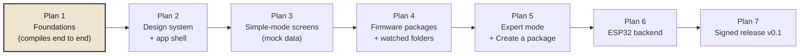

# Implementation plans

The product milestones live in [docs/roadmap.md](../../roadmap.md). This folder splits them into **executable plans**: each one ends with software that builds, runs and is tested, and is written so that an engineer or agent with no prior context can execute it task by task.

| Plan | Scope | Milestone | Status |
|---|---|---|---|
| [1 · Foundations](2026-09-26-plan-1-foundations.md) | Cargo workspace, `flashr-core` (domain types, `FlashBackend` trait, mock backend), Tauri 2 shell, Svelte 5 frontend with a demo flash screen wired end to end, CI on Windows/macOS/Linux | M1 | Done |
| [2 · Design system & app shell](2026-09-27-plan-2-design-system.md) | Local fonts, clay components (buttons, cards, pills, family selector), top bar, instructions panel layout, Simple/Expert switch, FR/EN i18n, light/dark | M1 | Done |
| 3 · Simple-mode screens | Screens 01 to 11 from [ux-design.md](../../ux-design.md), driven by the app state machine from [architecture.md](../../architecture.md#application-states), on the mock backend | M1 | To write |
| 4 · Firmware packages | `flashr-package` + `flashr-config`: watched folders, zip, `flasher_args.json`, partition tables, Arduino/PlatformIO, HEX/ELF, naming, validation, live README panel. Input: [field test](../specs/2026-10-01-esp32-field-test.md) | M2 | To write |
| 5 · Expert mode & packages | Screens 12 to 14: file table, partition map, log, Create a package, Settings | M2 | To write |
| 6 · ESP32 backend | `flashr-esp` with espflash, USB detection and driver guidance. Input: [field test](../specs/2026-10-01-esp32-field-test.md) (espflash 4.6 API, reset and erase rules) | M3 | To write |
| 7 · Signed release | Release pipeline, SignPath, portable exe, AppImage, CSP hardening | M4 | To write |

Plans are written one at a time. Each plan is detailed only once the previous one has landed, so it can build on real code instead of guesses.
