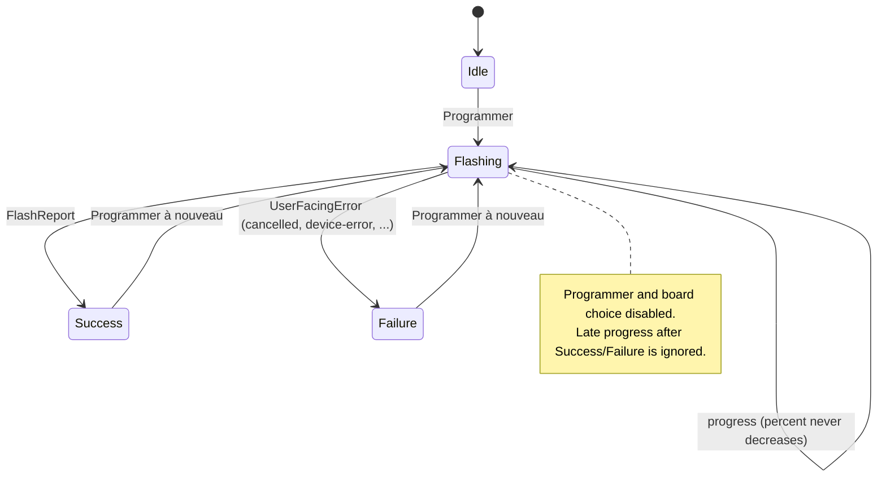

# Foundations (M1, part 1): design spec

- Date: 2026-09-26
- Implements: [roadmap M1](../../roadmap.md): "app builds and runs on Windows, macOS and Linux in CI with a mock backend simulating a flash"
- Plan: [plan 1 · foundations](../plans/2026-09-26-plan-1-foundations.md)
- Builds on: [architecture.md](../../architecture.md), ADRs [0001](../../decisions/0001-rust-and-tauri.md)–[0007](../../decisions/0007-svelte-frontend.md), [ux-design.md](../../ux-design.md)

## Goal

Prove the whole architecture end to end before any real hardware or firmware parsing: **UI → Tauri command → `FlashBackend` trait → backend → progress back to the UI**, running on a simulated board, built and tested on the three OSes.

## In scope

1. **Cargo workspace** at the repo root: `crates/flashr-core` and the Tauri app crate `app/src-tauri` (package `chip-flashr`, lib `chip_flashr_lib`).
2. **`flashr-core`**: the domain model every later backend uses.
   - `Family` (`esp32 | stm32 | nrf`), `Region`, `FlashPlan` with structural validation (empty plan, empty region, overlap, past 4 GiB).
   - `ProgressEvent` / `Phase`, `ProgressSink`, `CancelToken`, `Target`, `ChipInfo`, `FlashReport`.
   - `FlashError` → `UserFacingError { code, technical }`.
   - `trait FlashBackend { families, discover, identify, flash, erase }`.
   - `MockBackend`: one simulated board per family, configurable speed and failure. `demo_plan(family)` gives a realistic plan per family.
3. **Tauri shell**: a single `main` window, 1200 × 760 (min 960 × 640), and four commands: `app_info`, `list_targets`, `flash_demo`, `cancel_flash`.
4. **Frontend**: Svelte 5 + Vite + TypeScript in `app/` ([ADR 0007](../../decisions/0007-svelte-frontend.md)). Design tokens from ux-design (light/dark). One **demo screen**: choose a simulated board, Program, live percent and phase, Cancel, success card, failure card with "Détails techniques".
5. **CI** (GitHub Actions) on `ubuntu-22.04`, `macos-latest` and `windows-latest`: frontend check/test/build, rustfmt, clippy `-D warnings`, cargo test, release build without installer.

## Out of scope (later plans)

Real backends (espflash, probe-rs), firmware discovery and parsing, watched folders, config file and portable mode, instructions panel, local fonts and clay components, i18n, the 15 designed screens, CSP hardening, signing and installers.

## Decisions

These are new compared with the docs as of 2026-09-24. `architecture.md` is updated at the end of plan 1.

| # | Decision | Why |
|---|---|---|
| D1 | **Svelte 5 + Vite + TypeScript**, pnpm, Tauri CLI as a dev dependency (`pnpm tauri …`) | Small bundle, a component model that fits 15 screens, plain CSS for the clay look. No global tool install ([ADR 0007](../../decisions/0007-svelte-frontend.md)) |
| D2 | **Errors cross IPC as codes**: `UserFacingError { code: ErrorCode, technical: String }` with `cancelled · target-not-found · invalid-plan · family-mismatch · device-error · already-running` | The UI owns the wording (title, explanation, causes, actions) per code and per language, which prepares FR/EN. Rust never ships user-facing sentences. Replaces the richer struct sketched in architecture.md |
| D3 | **One flash job at a time**, held by a `JobSlot`, and a second request gets `already-running` | Two jobs on one USB bus is never what a user means. The slot is freed on drop, so it is also freed after a failure or a panic |
| D4 | **Progress over a Tauri `Channel`** passed to the `flash_demo` command (not global events) | Strongly typed, scoped to the call, the recommended Tauri 2 pattern for streaming |
| D5 | **Blocking backends on a worker** (`spawn_blocking`), **cooperative cancel** checked between chunks | Flashing is blocking I/O. Cancel must act within one chunk (4 KiB in the mock) |
| D6 | **Progress contract** for every backend: `Connecting` → `Erasing` → one `Writing{index,count,label,address}` per chunk with monotonic `bytesDone` → `Verifying` (if `verify`) → `Resetting` (if `reset_after`). An invalid plan emits **no** event | One predictable shape for the progress screen, whatever the chip |
| D7 | **Mock failure switch**: `CHIP_FLASHR_MOCK_FAIL_AT=<0..=100>` makes the simulated board fail at that percentage | Lets anyone see and test the failure path without hardware |
| D8 | UI copy **in French** until i18n (plan 2); **no network at runtime**; `csp: null` until plan 7 | Keeps plan 1 small without closing any door |
| D9 | Rust **edition 2024**, `rust-version = "1.88"` (let-chains), bundle id `io.github.loutrx.chipflashr` | Current stable features. The identifier matches the GitHub owner |

## Behaviour the user can see

## Acceptance

- `cargo test --workspace` and `pnpm -C app test` pass; fmt, clippy (`-D warnings`) and svelte-check (no warnings) are clean.
- `pnpm tauri dev`: three simulated boards are listed. Programmer goes from 0 to 100 % in about 5 s through all phases, then shows success. Annuler shows "Programmation annulée". With `CHIP_FLASHR_MOCK_FAIL_AT=41` the job stops near 40 % and shows "La programmation a échoué" with the technical detail.
- CI is green on the three OSes.

## Risks

| Risk | Mitigation |
|---|---|
| Linux WebKitGTK packages missing locally or in CI | Documented apt list in CI and the README Development section |
| `tauri icon` rejecting SVG input on some CLI versions | Export the SVG to a 1024 px PNG and pass that instead (noted in the plan) |
| vite / vite-plugin-svelte peer mismatch at install time | Install the vite major the plugin's `peerDependencies` names |
