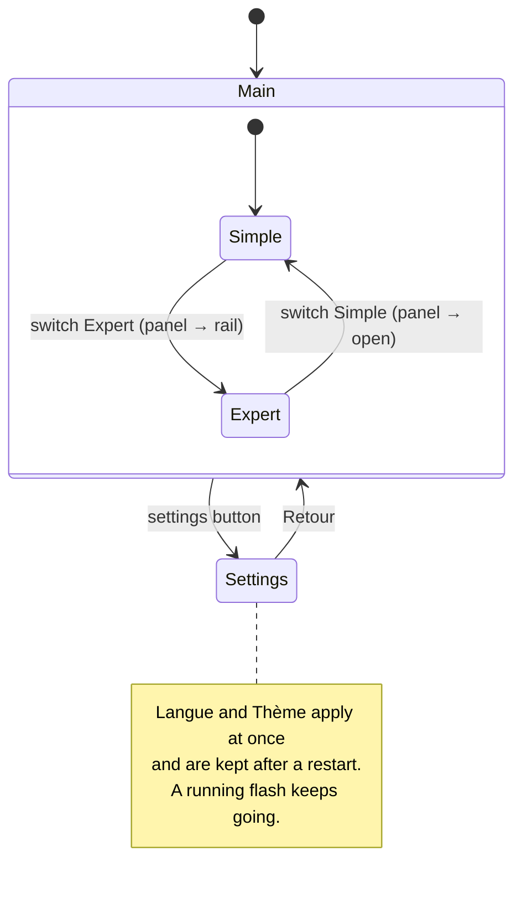

# Design system & app shell (M1, part 2): design spec

- Date: 2026-09-27
- Implements: [roadmap M1](../../roadmap.md), "UI built from the mockups" (the shell and the shared components; the screens themselves are plans 3 and 5)
- Plan: [plan 2 · design system & app shell](../plans/2026-09-27-plan-2-design-system.md)
- Builds on: [plan 1 spec](2026-09-26-foundations-design.md), [ux-design.md](../../ux-design.md), ADRs [0005](../../decisions/0005-chip-family-selector.md), [0006](../../decisions/0006-instructions-panel.md), [0007](../../decisions/0007-svelte-frontend.md)
- Design source: the "Chip Flashr — Écrans" design artifact. Pages used: `Main` (home), `Sombre` (dark), `Expert` (instructions rail), `Reglages` (settings), `Flash`, `Succes`, `Echec`. Every size, colour and shadow below was read from their inline CSS.

## Goal

The app looks like the mockups. The window has the real top bar, instructions panel and status bar, and the clay components that every later screen is built from. It works in French and English, light and dark, still on the plan-1 simulated board.

## In scope

1. **Local fonts**: Bricolage Grotesque (with its optical-size axis), Instrument Sans and JetBrains Mono from the `@fontsource-variable` packages (OFL-1.1), bundled by Vite. No request to any font server.
2. **Tokens** for light and dark: the ux-design colours plus the values measured on the artifact (raised surfaces, clay "lip", five shadows; see the table below). Theme set by a `data-theme` attribute on `<html>`.
3. **Icons**: the 29 icons drawn in the mockups, as one `Icon` component (same paths, `currentColor`).
4. **Components**: `Button` (primary, secondary, ghost; 42 px and 64 px), `IconButton`, `Card`, `Pill` (with status dot), `Tag`, `StatusDot`, `SectionLabel`, `SegmentedControl`, `FamilySelector`, `ProgressBar`, `Callout`, `Select`, `ResultHero` (the big success or failure badge with title), `Console` (the dark technical-details block).
5. **Shell**: `TopBar` (logo, board pill, Simple/Expert switch, settings button), `InstructionsPanel` (400 px open, 48 px rail closed), `StatusBar`, `SettingsView`, and an Expert placeholder.
6. **Demo flow rebuilt with the components**, in Simple mode. The family selector picks one of the three simulated boards, and a connected-board card shows it. **Programmer** then leads to a progress card (large percent, striped bar, phase, Annuler), then a success hero (size, duration, verified, "Programmer une autre carte") or a failure hero (explanation, "Détails techniques" console, "Réessayer").
7. **FR/EN**: every UI string comes from typed dictionaries. The error messages and phase labels from plan 1 move there.
8. **Minimal settings**: the settings button opens screen 14 reduced to its "Général" card (Langue, Thème) with "Retour". The choice survives a restart.
9. **Browser preview**: `pnpm dev` opened in a normal browser runs the whole UI on a TypeScript copy of the simulated board. It works in development builds only.
10. **Component tests** in jsdom with `@testing-library/svelte`.

## Out of scope (later plans)

The content of screens 01 to 14 (plans 3 and 5), the step list of screen 05 (plan 3), Markdown rendering of a real README and live reload (plan 4), watched folders in the status bar (plan 4), the config file and portable mode (plans 4–5), the other settings (plan 5), onboarding and English copy review (next design pass).

## Decisions

| # | Decision | Why |
|---|---|---|
| D1 | **Tokens are CSS custom properties** on `:root`, switched by `<html data-theme="light\|dark">`. The theme setting is `system \| light \| dark`; `system` follows `prefers-color-scheme` live | A user-selected theme needs an attribute, not only a media query. One place to read every value |
| D2 | **Dark values come from the `Sombre` page.** Two values it doesn't draw are derived: disabled primary button `#312D28` on `#A8A093`, console `#151412` | Same source of truth as light; the two derived values reuse existing dark tokens |
| D3 | **Fonts from `@fontsource-variable`**, imported in `main.ts`: `bricolage-grotesque/opsz.css`, `instrument-sans`, `jetbrains-mono`. Families `'Bricolage Grotesque Variable'`, `'Instrument Sans Variable'`, `'JetBrains Mono Variable'`, then the system fallbacks already in plan 1 | Versioned OFL files, no network (spec 1 D8), the opsz axis matches the design's optical sizes |
| D4 | **In-house `Icon` component** with the design's own SVG paths | They are custom drawings, not a library set; exact match and no dependency |
| D5 | **In-house typed i18n**: `fr.ts` is the reference; `en.ts` must have exactly the same keys (a TypeScript error otherwise). Messages with parameters are functions. The current locale is a Svelte rune | About 200 strings for the whole app; zero dependency; missing translations fail the build, not the user |
| D6 | **First launch**: French if the first system language starts with `fr`, English otherwise; theme `system` | The app ships FR and EN; users mostly French |
| D7 | **Settings are stored in the WebView's `localStorage`** under `chip-flashr.settings.v1`, behind `loadSettings()` / `saveSettings()`. Unknown or broken data falls back to the defaults. Plan 5 moves them to `chip-flashr.toml` through IPC by replacing these two functions | Keeps plan 2 small; one seam to swap later. Pre-release, so no migration of old values is needed |
| D8 | **Rust sends neutral board names.** The mock's `Target.label` becomes the chip name (`ESP32-S3`, `STM32F411`, `nRF52840`); the UI adds "Carte simulée" / "Simulated board" for `mock:` targets | Plan 1 D2 says Rust ships no user-facing sentences; the old French labels would show in English mode |
| D9 | **Browser preview only in development**: `ipc.ts` uses the TypeScript simulated board when `import.meta.env.DEV` and not `isTauri()`. It mirrors the Rust mock (same ids, plan sizes, 4 KiB chunks at 15 ms, phases, cancel) and reads `?failAt=41` from the URL | Fast UI work and automated screenshots and clicks without the desktop shell; tree-shaken out of release builds |
| D10 | **Instructions panel**: open by default in Simple, rail in Expert, like the mockups. Toggling holds until the mode changes. Its sample text lives in the dictionaries | Matches screens 01 and 12; the real README arrives in plan 4 |
| D11 | **The flash keeps running across views**: opening Réglages or switching to Expert during a flash does not stop it, and coming back shows its current state | The job lives in the app state, not in the screen; leaving a screen is not a cancel |
| D12 | **Vitest runs in jsdom** for every test file, with the `svelteTesting()` plugin and `@testing-library/jest-dom` matchers | Components need a DOM; pure-logic tests are unaffected |

### Clay tokens measured on the artifact

| Token | Light | Dark | Use |
|---|---|---|---|
| `--cf-raised` | `#FBF8F1` | `#2A2723` | Secondary buttons, unselected family cards |
| `--cf-raised-line` | `#E3DBCC` | `#3A3530` | Their border |
| `--cf-shadow-raised` | `0 10px 18px -10px rgba(70,55,35,.45), 0 3px 0 0 #D5CBB8, inset 0 2px 0 #FFF, inset 0 -3px 6px rgba(120,100,70,.13)` | `0 10px 18px -10px rgba(0,0,0,.8), 0 3px 0 0 #0E0D0C, inset 0 1px 0 rgba(255,255,255,.09), inset 0 -3px 6px rgba(0,0,0,.3)` | Secondary at rest |
| `--cf-shadow-raised-active` | `0 2px 6px -4px rgba(70,55,35,.4), 0 1px 0 0 #D5CBB8, inset 0 3px 7px rgba(120,100,70,.25)` | `0 2px 6px -4px rgba(0,0,0,.7), 0 1px 0 0 #0E0D0C, inset 0 3px 7px rgba(0,0,0,.45)` | Secondary pressed |
| `--cf-shadow-primary` | `0 12px 22px -10px rgba(27,26,24,.55), 0 4px 0 0 #0C0B0A, inset 0 2px 0 rgba(255,255,255,.16), inset 0 -4px 8px rgba(0,0,0,.38)` | `0 12px 22px -10px rgba(0,0,0,.75), 0 4px 0 0 #B3A68C, inset 0 2px 0 rgba(255,255,255,.75), inset 0 -4px 8px rgba(120,100,70,.28)` | Primary at rest |
| `--cf-shadow-primary-active` | `0 4px 10px -6px rgba(27,26,24,.5), 0 1px 0 0 #0C0B0A, inset 0 3px 7px rgba(0,0,0,.5)` | `0 4px 10px -6px rgba(0,0,0,.7), 0 1px 0 0 #B3A68C, inset 0 3px 7px rgba(120,100,70,.4)` | Primary pressed |
| `--cf-shadow-sunken` | `inset 0 3px 9px rgba(110,90,60,.28), inset 0 -1px 0 rgba(255,255,255,.8)` | `inset 0 3px 9px rgba(0,0,0,.45), inset 0 -1px 0 rgba(255,255,255,.05)` | Segmented track, selected family, progress track, select |
| `--cf-shadow-card` | `inset 0 1px 0 rgba(255,255,255,.9), 0 14px 28px -22px rgba(60,48,30,.45)` | `inset 0 1px 0 rgba(255,255,255,.04), 0 14px 28px -22px rgba(0,0,0,.8)` | Cards |
| `--cf-shadow-tile` | `inset 0 2px 0 rgba(255,255,255,.7), inset 0 -3px 6px rgba(120,100,70,.12)` | `inset 0 -3px 6px rgba(0,0,0,.3)` | Light icon tiles (ESP, STM, nRF) |
| `--cf-shadow-tile-strong` | `inset 0 2px 0 rgba(255,255,255,.14), inset 0 -3px 6px rgba(0,0,0,.3)` | same | Dark tiles (logo, selected family) |
| `--cf-disabled` / `--cf-on-disabled` | `#DAD5CB` / `#67625A` | `#312D28` / `#A8A093` | Disabled primary |
| `--cf-console` / `--cf-on-console` | `#1F1D1A` / `#E6DFD1` | `#151412` / `#E6DFD1` | Technical details block |

Motion comes from the artifact too: hover lifts clay buttons by 2 px, pressing sinks them (3 px for primary, 2 px for secondary), `cubic-bezier(.3,1.6,.5,1)` over 180 ms. The page also defines the breathing dot (2.2 s), the striped bar (0.9 s) and the pop-in (0.6 s). All of it is off under `prefers-reduced-motion`.

## Behaviour the user can see

## Acceptance

- `pnpm -C app check`, `pnpm -C app test`, `pnpm -C app build`, `cargo test --workspace`, fmt and clippy are clean; CI stays green on the three OSes.
- `pnpm dev` opened in a browser runs the demo end to end: program, cancel, `?failAt=41` failure. Switching FR/EN and light/dark from Réglages applies at once and survives a reload.
- `pnpm tauri dev` does the same on the Rust mock.
- Screenshots of the shell in light and dark match the `Main` and `Sombre` artifact pages for the top bar, family selector, primary button, instructions panel and status bar: same sizes, colours and fonts.
- The release bundle contains the `.woff2` files and no `fonts.googleapis.com` reference.
- With reduced motion on, nothing animates.

## Risks

| Risk | Mitigation |
|---|---|
| Light theme flashes before dark applies at start | Settings load synchronously and the theme is set in `main.ts` before `mount` |
| Svelte 5 components in jsdom resolve to server code | `svelteTesting()` adds the `browser` resolve condition |
| Font files make the bundle heavier | Only the subsets the CSS references are fetched at runtime; the bundle size is checked in the plan |
| `localStorage` unavailable or full | Every read and write is wrapped; the app falls back to defaults and keeps working |
