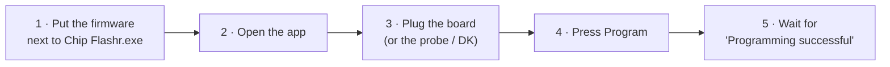
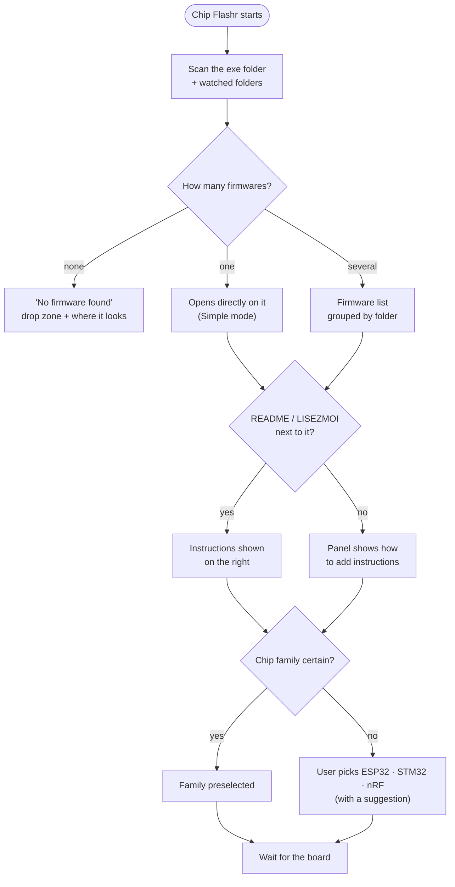
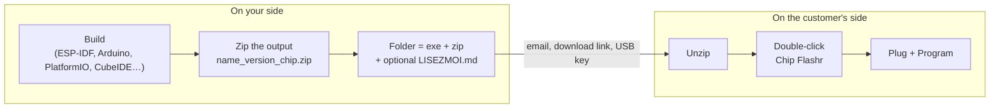

# User guide

> Status: **planned behaviour**. This is how Chip Flashr is meant to work once v0.1 ships.

## The 30-second version



That's it for most people. The rest of this page covers what happens when something is missing or ambiguous.

## What happens at start-up



## Connecting the board

| Family | What to plug in | If it isn't detected |
|---|---|---|
| **ESP32** | The board's USB port (data cable) | Check the cable carries data; hold **BOOT**, tap **RESET/EN**, release BOOT; try another port; install the USB-serial driver the app names |
| **STM32** | An ST-Link / J-Link / CMSIS-DAP probe wired to SWD, **or** the board's USB in DFU mode (BOOT0 high + reset) | Check probe wiring and target power; install the ST-Link driver if asked |
| **Nordic** | A Nordic DK over USB: it programs its own chip, or an external board wired to its *Debug out* connector | Install SEGGER J-Link software if asked; for a locked chip, install nRF Util as guided |

The pill in the top bar always says what's connected (`ESP32-S3 · COM4`, `ST-Link · STM32F411`, `Aucune carte`).

## While programming

The app shows each step (connect → erase → write each file → verify → reset) with a progress bar and remaining time. **Don't unplug the board.** If it fails, you get:

- a plain-language explanation and the likely causes;
- **Retry**. An ESP32 or STM32 interrupted mid-write is not bricked: its ROM bootloader is still there;
- **Export report**, a small file to send to whoever supplied the firmware.

## Sending a firmware to a customer



Or let the app do it: **Expert mode → Create a package** builds the delivery folder (exe + firmware zip + instructions) from your build folder.

Tips:

- **One firmware per folder** gives the simplest experience: the app opens straight on it.
- Keep the **naming convention** (`thermostat_v1.4.2_esp32s3_prod.zip`) so the customer sees a clean name and version. See [firmware packages](firmware-packages.md#name--version-shown-to-the-user).
- Ship a **`chip-flashr.toml`** next to the exe if you want preset settings (extra watched folder, language, updates off). See [distribution](distribution.md#configuration).

## Writing good instructions (`LISEZMOI.md` / `README.md`)

The file is rendered in the right-hand panel and **reloads live** when you edit it, which is handy while writing.

```markdown
# Mise à jour du thermostat

Durée : environ 2 minutes.

## Avant de commencer
- Coupez l'alimentation secteur du boîtier.
- Utilisez un câble USB-C de données.

## Étapes
1. Retirez la trappe arrière (2 vis).
2. Branchez le câble sur le connecteur `J3 · PROG`.
3. Cliquez sur **Programmer**.
4. Attendez « Programmation réussie », puis débranchez.


> Ne débranchez jamais le câble pendant la programmation.
```

- Recognised names: `LISEZMOI.md`, `README.md`, `INSTRUCTIONS.md`, and the same with `.txt`. A file **inside the firmware zip** takes precedence over one next to the exe.
- Supported: headings, lists, bold/italic, inline code, quotes (shown as a warning box), tables, **local** images.
- Not supported, on purpose: raw HTML, scripts and remote images. See [ADR 0006](decisions/0006-instructions-panel.md).

## Simple vs Expert mode

- **Simple** (default): one firmware, one button, instructions visible. Meant for customers and technicians.
- **Expert**: choose port/probe, speed and flash mode, edit addresses, add or remove files, erase the chip, back up the flash, see the partition table and the live log, create packages.

The mode is remembered. A portable config can force Simple mode for customers.
