# UX & design

> Status: **first design pass validated** (M0). Mockups are static; behaviour is described in the [user guide](user-guide.md) and [architecture](architecture.md#application-states).

## Principles

1. **One screen, one decision.** In Simple mode, the only thing to do is press **Program**, and everything else is already decided or clearly asked.
2. **Never a dead end.** Every problem screen says what happened, why, and what to do next, with the official link when something must be installed.
3. **Ask only what can't be detected.** The chip family is preselected when detection is certain. It becomes a required choice, with a suggestion, only when it's ambiguous.
4. **The customer's instructions live in the app.** A README next to the exe is rendered on the right and follows edits live.
5. **Neutral and friendly.** No vendor branding. Warm greys, black and cream, soft "clay" buttons that feel pressable, small motion that respects *reduce motion*.

## Screen map

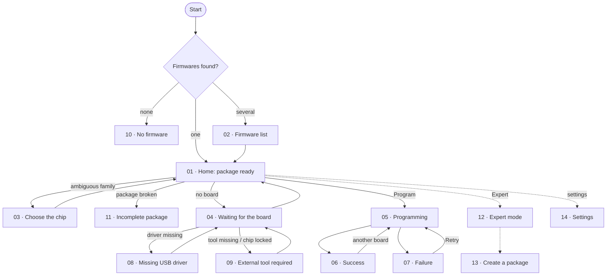

## Mockups

UI copy is in French in these mockups; the app ships in French and English.

| | |
|---|---|
|  01 · Home: package ready | 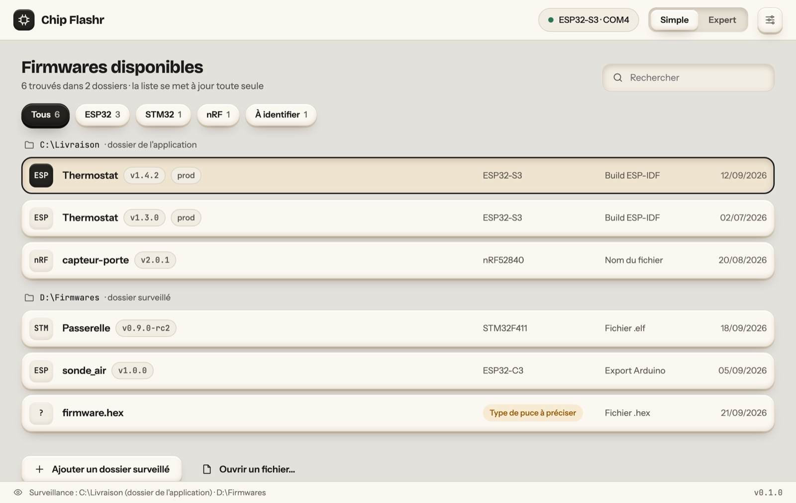 02 · Several firmwares found |
| 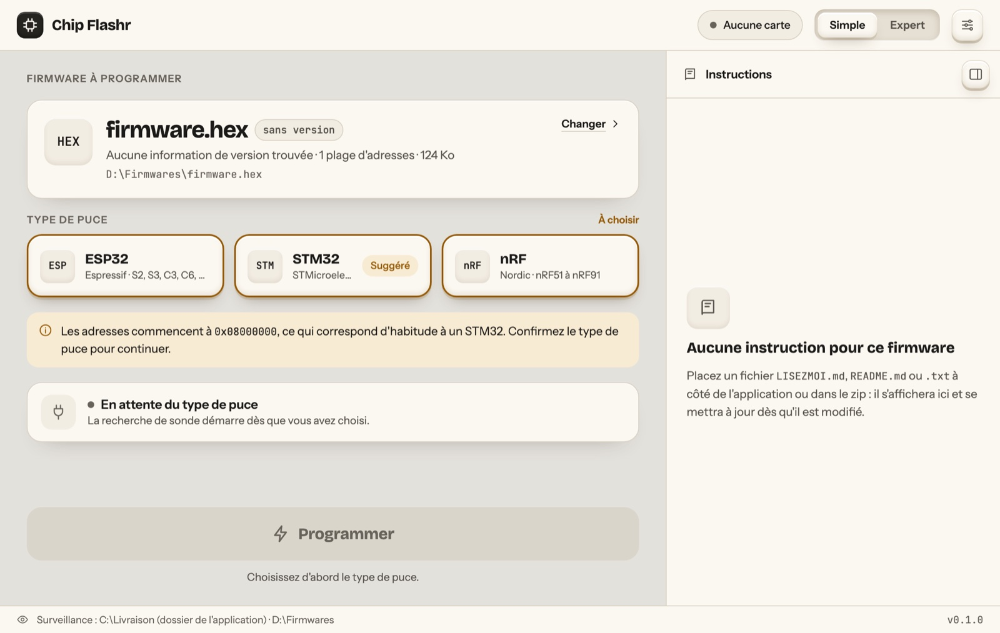 03 · Ambiguous .hex: choose the chip | 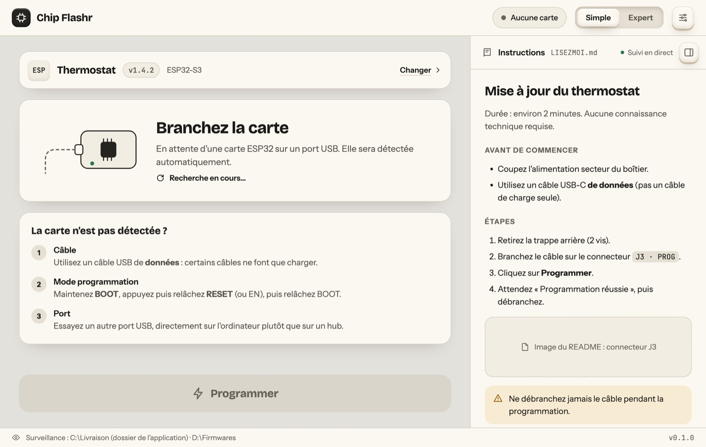 04 · Waiting for the board |
|  05 · Programming | 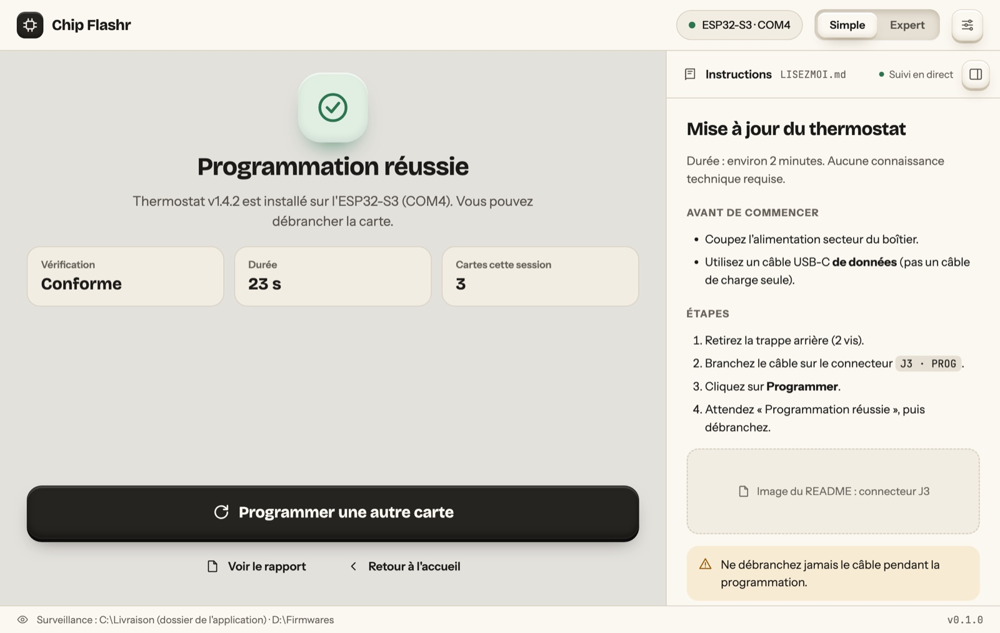 06 · Success |
| 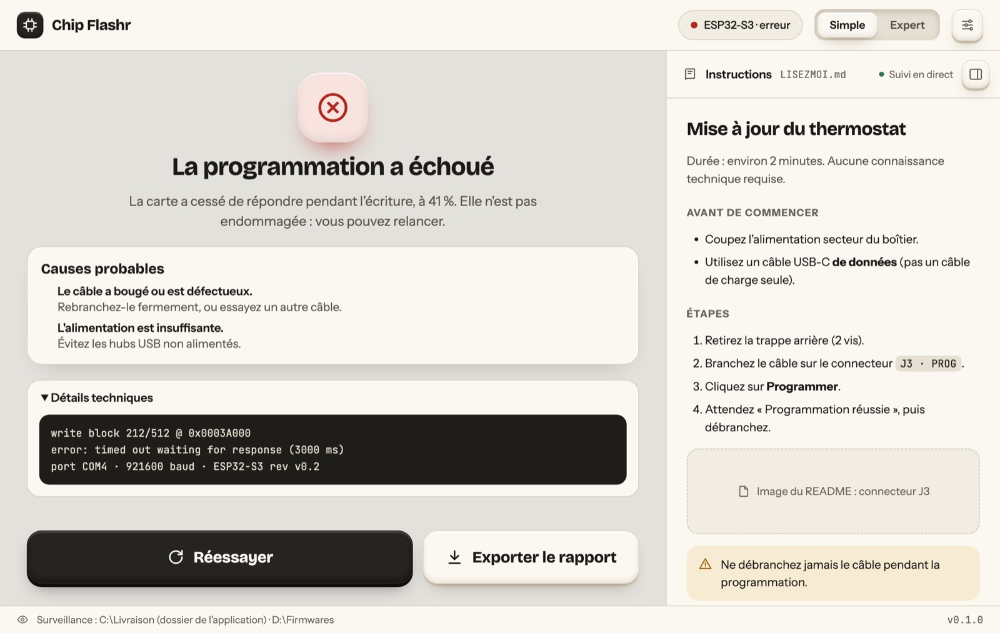 07 · Failure, causes and report |  08 · Missing USB driver |
| 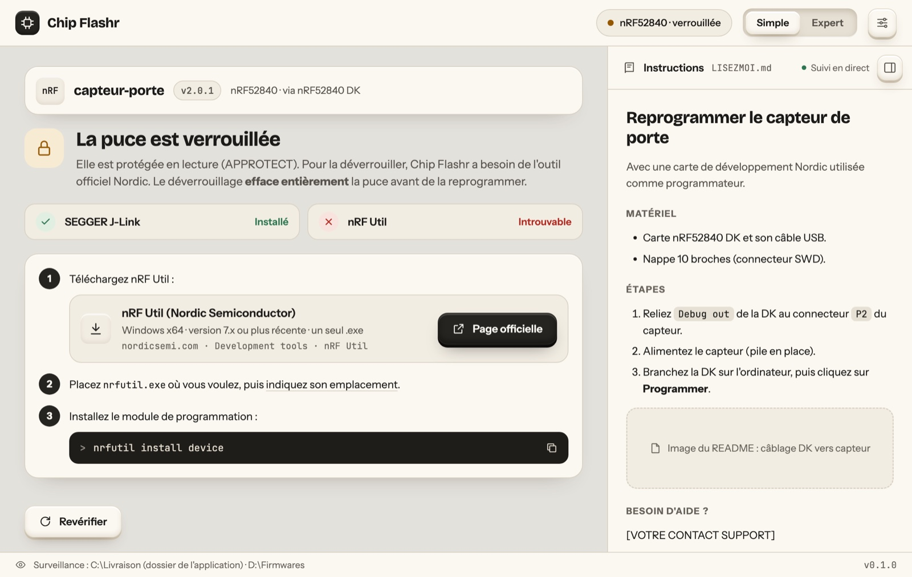 09 · Nordic: external tool required | 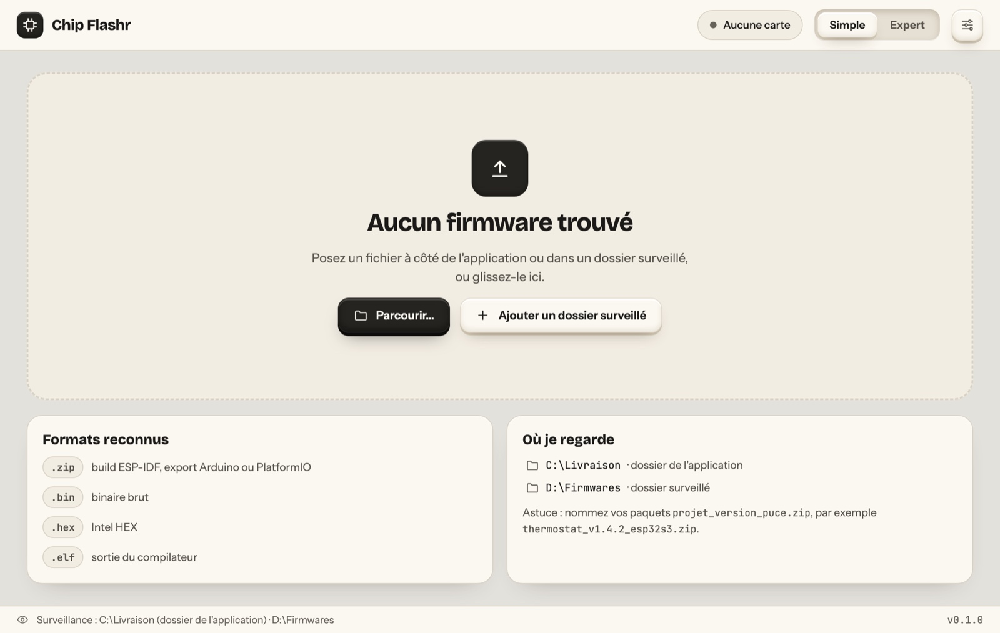 10 · No firmware found |
| 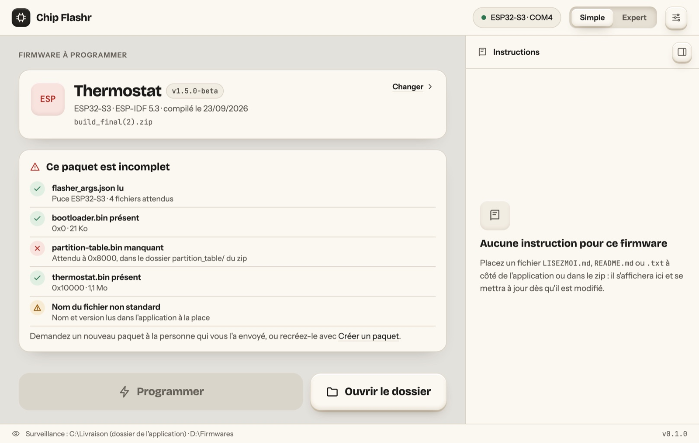 11 · Incomplete package |  12 · Expert mode |
| 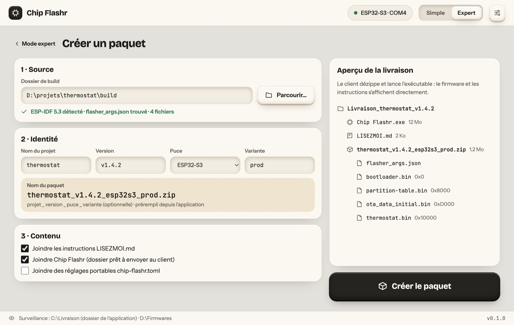 13 · Create a package | 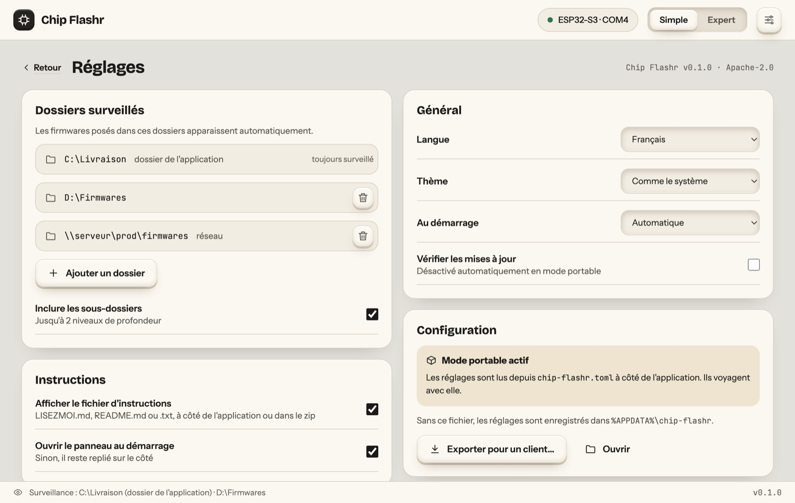 14 · Settings and watched folders |
|  15 · Dark theme (STM32) | |

## Visual language

| Token | Light | Dark | Use |
|---|---|---|---|
| Ground | `#E3E1DC` | `#151412` | Window background (warm grey) |
| Surface | `#FBF8F1` | `#1F1D1A` | Cards, panels (cream) |
| Ink | `#1B1A18` | `#F0EADD` | Text, primary button |
| Selection | `#EEE4D0` | `#3A3329` | Selected chip family, highlights |
| Success / Warning / Error | `#2C7550` · `#945800` · `#B0281F` | `#6CC794` · `#E8AD55` · `#F08A7E` | Status only, always paired with an icon and text |

- **Type:** Bricolage Grotesque (titles), Instrument Sans (UI text), JetBrains Mono (addresses, file names, logs).
- **Clay buttons:** soft outer shadow + inner highlight at rest; lift on hover, sink on press. The selected chip family looks *pressed in*.
- **Motion:** breathing status dots, striped progress bar, pop-in success check, all disabled under `prefers-reduced-motion`.
- **Accessibility:** real buttons and labels, 4.5:1 text contrast, colour never the only signal, 44 px minimum targets on primary actions.

## Next design pass (planned)

User tests with non-technical people · first-launch onboarding · choosing between several connected boards · confirmation dialogs (full erase, Nordic recover) · production mode (flash in series) · English copy lengths · app icon.
